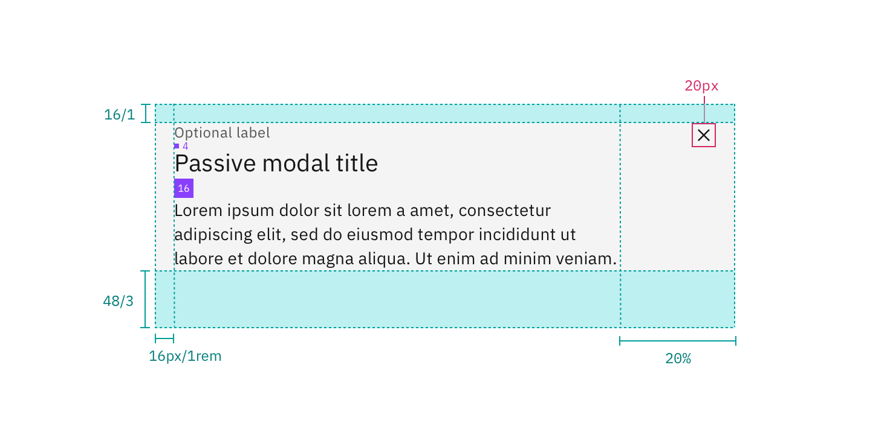
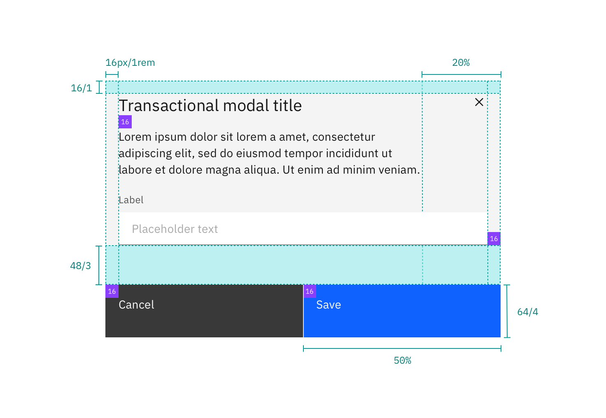
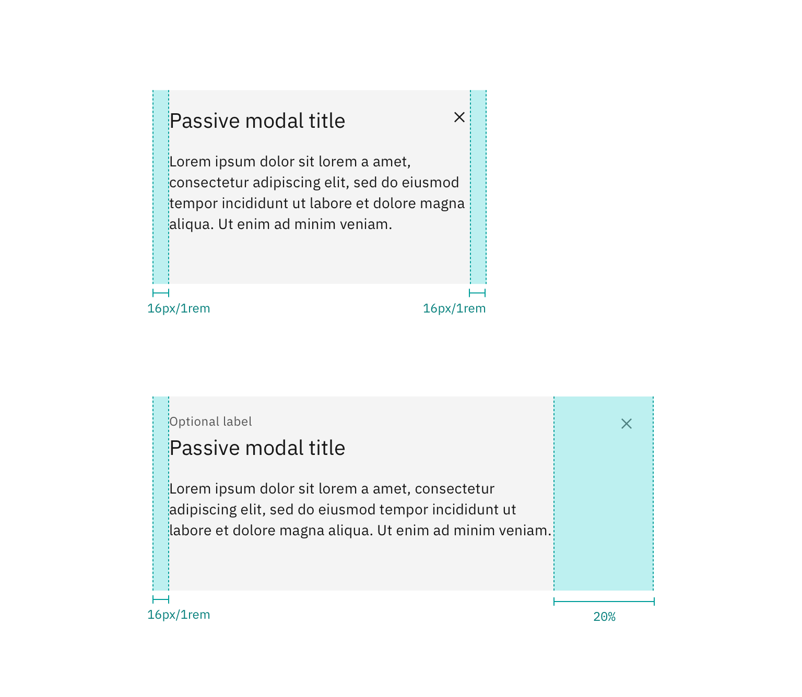
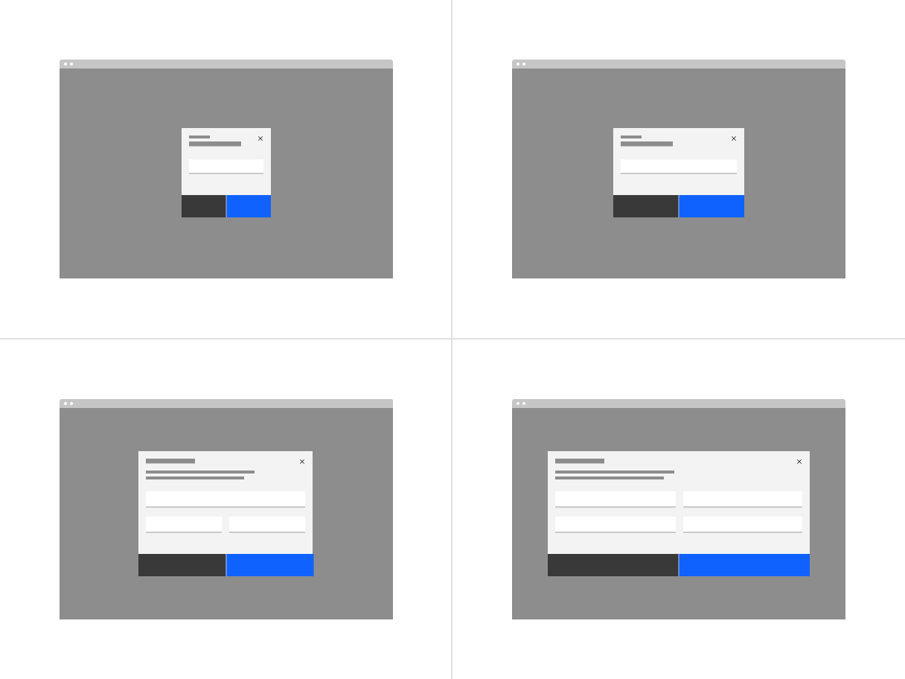
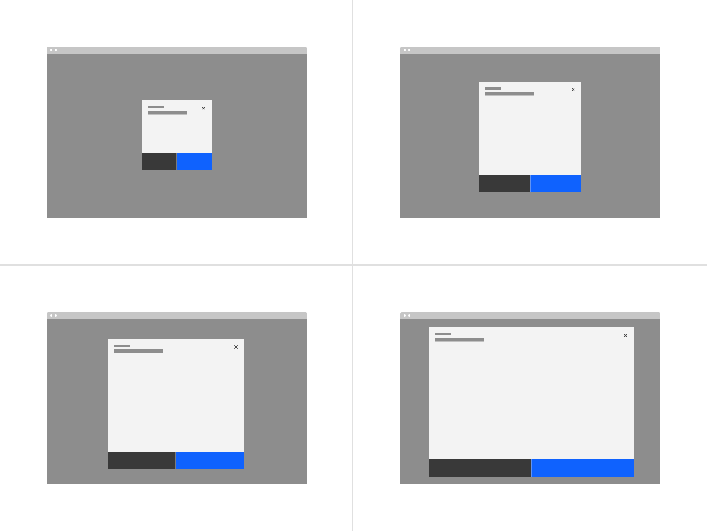
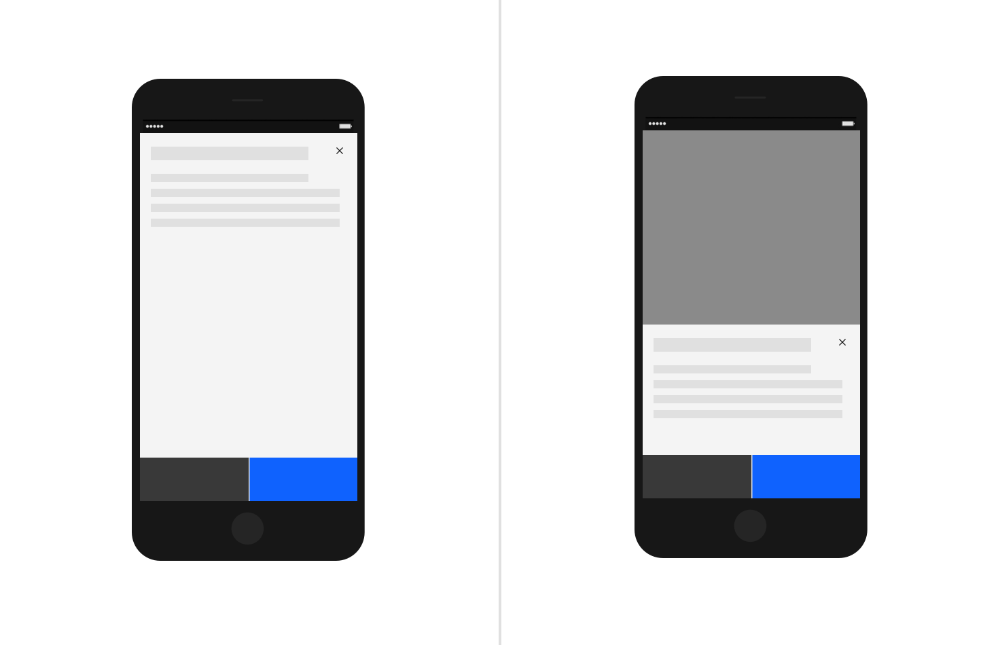

## Color

Refer to the [button](/components/button/style) for primary and secondary button
styling in the transactional modal.

| Class                        | Property         | Color token   |
| ---------------------------- | ---------------- | ------------- |
| `.bx--modal-container`       | background-color | `$ui-01`      |
| `.bx--modal-header__label`   | text color       | `$text-02`    |
| `.bx--modal-header__heading` | text color       | `$text-01`    |
| `.bx--modal-content`         | text color       | `$text-01`    |
| `.bx--modal-close__icon`     | fill             | `$icon-01`    |
| `.bx--modal-close:hover`     | background-color | `$hover-ui`   |
| Overlay                      | color            | `$overlay-01` |

## Typography

Modal titles and labels should be set in sentence case. Keep all titles and
labels concise and to the point. Modal labels are optional.

| Class                        | Font-size (px/rem) | Font-weight   | Type token      |
| ---------------------------- | ------------------ | ------------- | --------------- |
| `.bx--modal-header__label`   | 12 / 0.75          | Regular / 400 | `$label-01`     |
| `.bx--modal-header__heading` | 20 / 1.25          | Regular / 400 | `$heading-03`   |
| `.bx--modal-content`         | 14 / 0.875         | Regular / 400 | `$body-long-01` |

## Structure

| Class                      | Property                  | px / rem | Spacing token |
| -------------------------- | ------------------------- | -------- | ------------- |
| `.bx--modal-close`         | height, width             | 48 x 48  | –             |
| `.bx--modal-close__icon`   | height, width             | 16 x 16  | –             |
| `.bx--modal-header__label` | margin-bottom             | 4 / 0.25 | `$spacing-02` |
| `.bx--modal-header`        | padding top, padding left | 16 / 1   | `$spacing-05` |
| `.bx--modal-header`        | margin-bottom             | 16 / 1   | `$spacing-05` |
| `.bx--modal-content`       | padding-left              | 16 / 1   | `$spacing-05` |
| `.bx--modal-content`       | padding-right             | 20%      | –             |
| `.bx--modal-content`       | margin-bottom             | 48 / 3   | `$spacing-09` |

<Caption>
  Structure and spacing measurements for a passive modal | px / rem
</Caption>

<Caption>
  Structure and spacing measurements for a transactional modal | px / rem
</Caption>

### Margin-right

Modals that are 36% width and larger have a `margin-right: 20%` (margin
percentage is based off the width of the modal window). If the modal is smaller
than 36% then it has a fixed `margin-right: 16px/1rem`. Body copy, including
titles, in a modal alway follows the 20% margin-right rule. However, inputs and
other components may still expand to the full width of a modal window.

<Caption>
  Margin-right for modals less than 36% (left) and greater than 36% (right).
</Caption>

<!--
### Buttons widths

| Number of buttons    | Percentage of modal     | Positioning    |
| -------------------- | ----------------------- | -------------- | 
| 1                    | 50%                     | Flush right    |
| 2                    | 50% each                | Full bleed     |
| 3                    | 25% each                | Flush right    |
-->

## Sizes

There are four modal sizes: **xs, small, default, large**. Each modal size has a
responsive width that changes based on the browser size. As the browser
decreases, the modal width percentage increases thus maintaining a proper ratio
between the modal and browser. Modal widths are defined as percentages of the
browser but will still align to columns on the 2x grid.

<Row>
<Column colLg={8}>

</Column>
</Row>

### XS

| Breakpoint | Percentage width | Column span | Margin-right |
| ---------- | ---------------- | ----------- | ------------ |
| 1584       | 24%              | 4 of 16     | 16px / 1rem  |
| 1312       | 24%              | 4 of 16     | 16px / 1rem  |
| 1056       | 32%              | 5 of 16     | 16px / 1rem  |
| 672        | 48%              | 4 of 8      | 16px / 1rem  |
| 320        | 100%             | 4 of 4      | 16px / 1rem  |

### Small

| Breakpoint | Percentage width | Column span | Margin-right |
| ---------- | ---------------- | ----------- | ------------ |
| 1584       | 36%              | 6 of 16     | 20%          |
| 1312       | 36%              | 6 of 16     | 20%          |
| 1056       | 42%              | 7 of 16     | 16px / 1rem  |
| 672        | 60%              | 5 of 8      | 16px / 1rem  |
| 320        | 100%             | 4 of 4      | 16px / 1rem  |

### Default

| Breakpoint | Percentage width | Column span | Margin-right |
| ---------- | ---------------- | ----------- | ------------ |
| 1584       | 48%              | 8 of 16     | 20%          |
| 1312       | 48%              | 8 of 16     | 20%          |
| 1056       | 60%              | 10 of 16    | 20%          |
| 672        | 84%              | 7 of 8      | 20%          |
| 320        | 100%             | 4 of 4      | 16px / 1rem  |

### Large

| Breakpoint | Percentage width | Column span | Margin-right |
| ---------- | ---------------- | ----------- | ------------ |
| 1584       | 72%              | 12 of 16    | 20%          |
| 1312       | 72%              | 12 of 16    | 20%          |
| 1056       | 84%              | 14 of 16    | 20%          |
| 672        | 96%              | 8 of 8      | 20%          |
| 320        | 100%             | 4 of 4      | 16px / 1rem  |

### Max sizes

Each modal size has a max height and width in order to maintain a proper window
ratio.

| Modal size  | Max-height | Max-width |
| ----------- | ---------- | --------- |
| **XS**      | 48%        | 420px     |
| **Small**   | 72%        | 576px     |
| **Default** | 84%        | 768px     |
| **Large**   | 96%        | –         |

<Row>
<Column colLg={8}>

</Column>
</Row>

### Mobile

On mobile devices, at the smaller break points the max-height does not apply.
The height may either be 100% of the screen or maintain the height defined by
the content while sticking to the bottom of the mobile screen.

<Row>
<Column colLg={8}>

</Column>
</Row>
