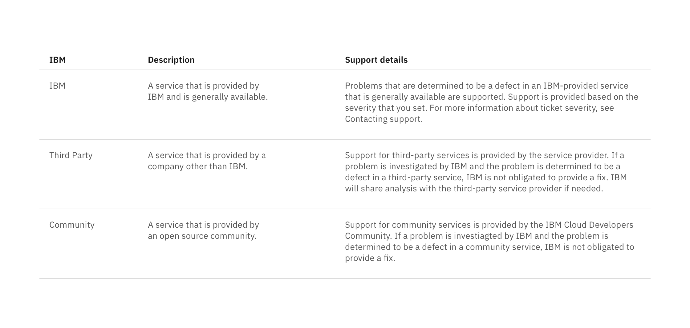

<PageDescription>

Structured lists group content that is similar or related, such as terms and
definitions.

</PageDescription>

<AnchorLinks>

<AnchorLink>Content</AnchorLink>
<AnchorLink>Interactions</AnchorLink>
<AnchorLink>Feedback</AnchorLink>

</AnchorLinks>

import { CheckmarkFilled16 } from '@carbon/icons-react';

<ComponentDemo
  components={[
    {
      id: 'default-structured-list',
      label: 'Default structured list',
    },
    {
      id: 'select-structured-list',
      label: 'Selectable structured list',
    },
  ]}
  scope={{ CheckmarkFilled16 }}>
  <ComponentVariant
    id="default-structured-list"
    links={{
      React:
        'https://react.carbondesignsystem.com/?path=/story/structuredlist--simple',
      Angular:
        'https://angular.carbondesignsystem.com/?path=/story/components-structured-list--basic',
      Vue:
        'http://vue.carbondesignsystem.com/?path=/story/components-cvstructuredlist--default',
      Vanilla: 'https://the-carbon-components.netlify.com/?nav=structured-list',
    }}>{`
    <StructuredListWrapper ariaLabel="Structured list">
      <StructuredListHead>
        <StructuredListRow
          head
          tabIndex={0}
        >
          <StructuredListCell head>
            ColumnA
          </StructuredListCell>
          <StructuredListCell head>
            ColumnB
          </StructuredListCell>
          <StructuredListCell head>
            ColumnC
          </StructuredListCell>
        </StructuredListRow>
      </StructuredListHead>
      <StructuredListBody>
        <StructuredListRow tabIndex={0}>
          <StructuredListCell>
            Row 1
          </StructuredListCell>
          <StructuredListCell>
            Row 1
          </StructuredListCell>
          <StructuredListCell>
            Lorem ipsum dolor sit amet, consectetur adipiscing elit. Nunc dui magna, finibus id tortor sed, aliquet bibendum augue. Aenean posuere sem vel euismod dignissim. Nulla ut cursus dolor. Pellentesque vulputate nisl a porttitor interdum.
          </StructuredListCell>
        </StructuredListRow>
        <StructuredListRow tabIndex={0}>
          <StructuredListCell>
            Row 2
          </StructuredListCell>
          <StructuredListCell>
            Row 2
          </StructuredListCell>
          <StructuredListCell>
            Lorem ipsum dolor sit amet, consectetur adipiscing elit. Nunc dui magna, finibus id tortor sed, aliquet bibendum augue. Aenean posuere sem vel euismod dignissim. Nulla ut cursus dolor. Pellentesque vulputate nisl a porttitor interdum.
          </StructuredListCell>
        </StructuredListRow>
      </StructuredListBody>
    </StructuredListWrapper>
  `}</ComponentVariant>
  <ComponentVariant
    id="select-structured-list"
    links={{
      React:
        'https://react.carbondesignsystem.com/?path=/story/structuredlist--selection',
      Angular:
        'https://angular.carbondesignsystem.com/?path=/story/components-structured-list--with-selection',
      Vue:
        'http://vue.carbondesignsystem.com/?path=/story/components-cvstructuredlist--selectable-with-events',
      Vanilla: 'https://the-carbon-components.netlify.com/?nav=structured-list',
    }}>{`
    <StructuredListWrapper selection ariaLabel="Structured list">
      <StructuredListHead>
        <StructuredListRow
          head
          tabIndex={0}
        >
          <StructuredListCell head>
            ColumnA
          </StructuredListCell>
          <StructuredListCell head>
            ColumnB
          </StructuredListCell>
          <StructuredListCell head>
            ColumnC
          </StructuredListCell>
          <StructuredListCell head/>
        </StructuredListRow>
      </StructuredListHead>
      <StructuredListBody>
        <StructuredListRow tabIndex={0}>
          <StructuredListCell>
            Row 1
          </StructuredListCell>
          <StructuredListCell>
            Row 1
          </StructuredListCell>
          <StructuredListCell>
            Lorem ipsum dolor sit amet, consectetur adipiscing elit. Nunc dui magna, finibus id tortor sed, aliquet bibendum augue. Aenean posuere sem vel euismod dignissim. Nulla ut cursus dolor. Pellentesque vulputate nisl a porttitor interdum.
          </StructuredListCell>
          <StructuredListInput
            id="row-1"
            value="row-1"
            title="row-1"
            name="row-1"
            defaultChecked
          />
         <StructuredListCell>
            <CheckmarkFilled16
              className="bx--structured-list-svg"
              aria-label="select an option">
              <title>select an option</title>
            </CheckmarkFilled16>
          </StructuredListCell>
        </StructuredListRow>
        <StructuredListRow tabIndex={0}>
          <StructuredListCell>
            Row 2
          </StructuredListCell>
          <StructuredListCell>
            Row 2
          </StructuredListCell>
          <StructuredListCell>
            Lorem ipsum dolor sit amet, consectetur adipiscing elit. Nunc dui magna, finibus id tortor sed, aliquet bibendum augue. Aenean posuere sem vel euismod dignissim. Nulla ut cursus dolor. Pellentesque vulputate nisl a porttitor interdum.
          </StructuredListCell>
          <StructuredListInput
            id="row-2"
            value="row-2"
            title="row-2"
            name="row-2"
          />
         <StructuredListCell>
            <CheckmarkFilled16
              className="bx--structured-list-svg"
              aria-label="select an option">
              <title>select an option</title>
            </CheckmarkFilled16>
          </StructuredListCell>
        </StructuredListRow>
        <StructuredListRow tabIndex={0}>
          <StructuredListCell>
            Row 3
          </StructuredListCell>
          <StructuredListCell>
            Row 3
          </StructuredListCell>
          <StructuredListCell>
            Lorem ipsum dolor sit amet, consectetur adipiscing elit. Nunc dui magna, finibus id tortor sed, aliquet bibendum augue. Aenean posuere sem vel euismod dignissim. Nulla ut cursus dolor. Pellentesque vulputate nisl a porttitor interdum.
          </StructuredListCell>
          <StructuredListInput
            id="row-3"
            value="row-3"
            title="row-3"
            name="row-3"
          />
         <StructuredListCell>
            <CheckmarkFilled16
              className="bx--structured-list-svg"
              aria-label="select an option">
              <title>select an option</title>
            </CheckmarkFilled16>
          </StructuredListCell>
        </StructuredListRow>
      </StructuredListBody>
    </StructuredListWrapper>
  `}</ComponentVariant>
</ComponentDemo>

## Content

- Row height varies based on content and can expand to fit multiple lines.
- In a single list, all rows do not have to be the same height.
- Column widths can either be equally proportional or proportioned based on
  content.
- If a list extends past 25 items, consider using a
  [data table](/components/data-table/usage) to present this larger set of
  content.
- A maximum of one paragraph of text is recommended per row.
- Nesting items is not recommended, as structured lists are used to present
  simple data. If you have additional content that needs to be shown, consider
  using a [data table](/components/data-table/usage), which supports nesting
  items.

<Row>
<Column colLg={8}>

</Column>
</Row>

## Interactions

Structured lists can be single-select if a user is choosing between a set of
options.

#### Guidelines:

- Only one item can be selected from the list.
- By default, one option should be selected.
- If you need to select multiple items, use a
  [data table.](/components/data-table/usage)
- When the user selects an item from the list, the selected row will appear with
  the `checkmark--filled` icon.

## Feedback

Help us improve this component by providing feedback, asking questions, and
leaving any other comments on
[GitHub](https://github.com/carbon-design-system/carbon-website/issues/new?assignees=&labels=feedback&template=feedback.md).
