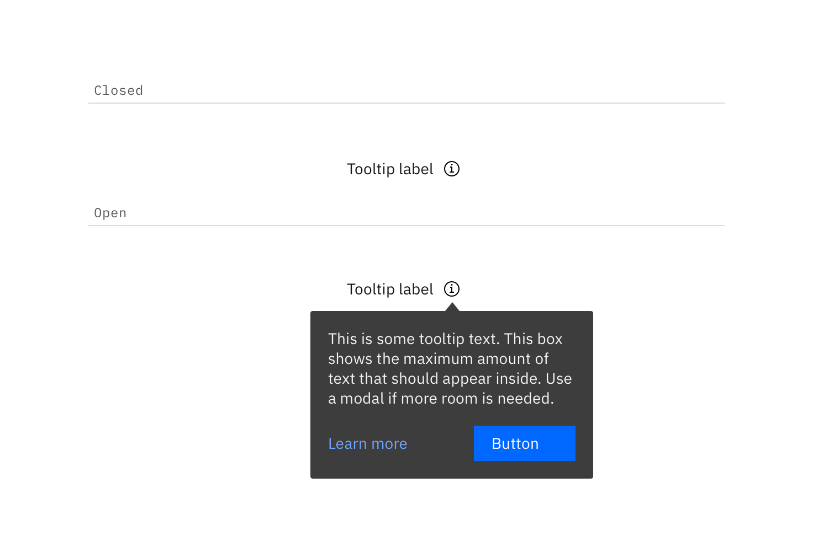
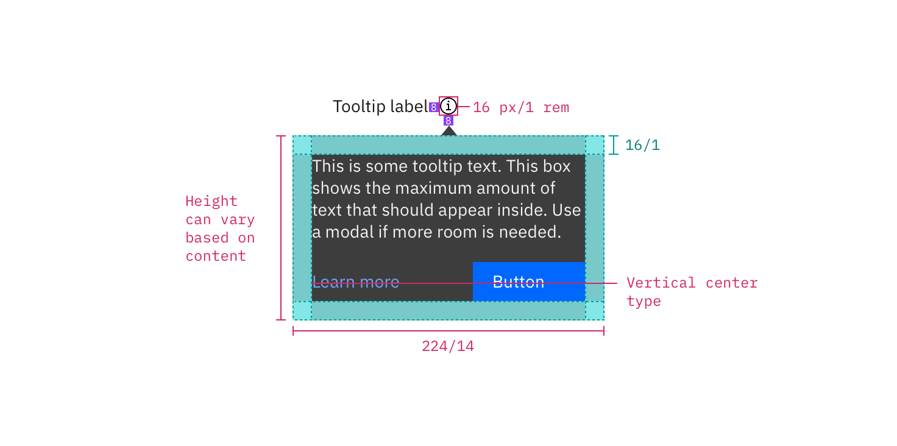
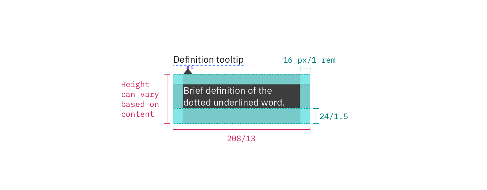
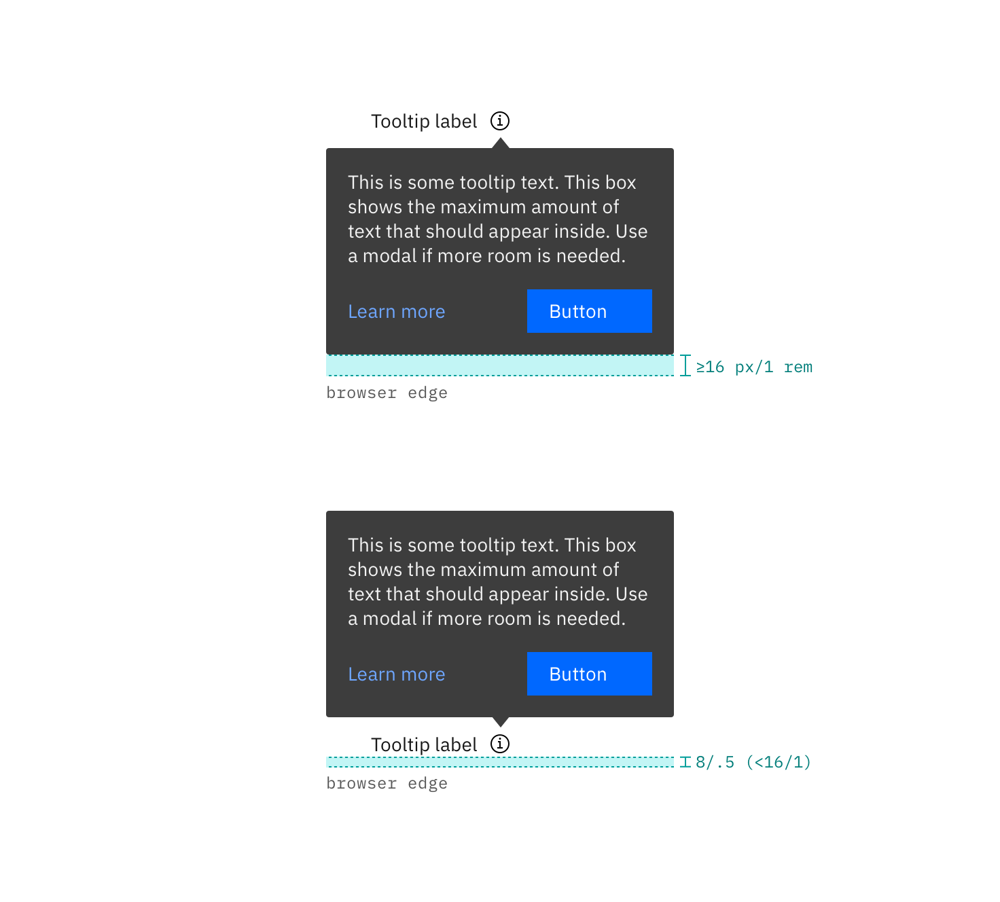

## Color

### Interactive tooltip

| Class                   | Property         | Color token   |
| ----------------------- | ---------------- | ------------- |
| `.bx--tooltip__label`   | text color       | `$text-02`    |
| `.bx--tooltip__trigger` | svg              | `$icon-01`    |
| `.bx--tooltip--shown`   | background-color | `$inverse-02` |
| `.bx--tooltip__caret`   | background-color | `$inverse-02` |
| `p`                     | text color       | `$inverse-01` |

<Caption>Example of closed and open states for a tooltip</Caption>

### Icon tooltip

| Class                       | Property         | Color token   |
| --------------------------- | ---------------- | ------------- |
| `.bx--tooltip__trigger svg` | background-color | `$inverse-02` |
| `.bx--tooltip--icon`        | background-color | `$inverse-02` |
| `p`                         | text color       | `$inverse-01` |

### Definition tooltip

| Class                      | Property         | Color token       |
| -------------------------- | ---------------- | ----------------- |
| `.bx--tooltip__label`      | text color       | `$text-02`        |
| `.bx--tooltip__trigger`    | border-bottom    | `$interactive-04` |
| `.bx--tooltip--definition` | background-color | `$inverse-02`     |
| `p`                        | text color       | `$inverse-01`     |

## Typography

Tooltip labels and text should be set in sentence case.

| Property              | Font-size (px/rem) | Font-weight   | Type token       |
| --------------------- | ------------------ | ------------- | ---------------- |
| `.bx--tooltip__label` | 12 / 0.75          | Regular / 400 | `$label-01`      |
| `p`                   | 14 / 0.875         | Regular / 400 | `$body-short-01` |

## Structure

All tooltip types have a varying height based on the amount of content they
contain.

### Interactive tooltip

| Class                       | Property      | px / rem | Spacing token |
| --------------------------- | ------------- | -------- | ------------- |
| `.bx--tooltip`              | max-width     | 240 / 15 | –             |
| `.bx--tooltip__trigger svg` | height, width | 16 / 1   | –             |
| `.bx--tooltip__trigger`     | margin-left   | 8 / 0.5  | `$spacing-03` |
| `.bx--tooltip--shown`       | padding       | 16 / 1   | `$spacing-05` |
| `.bx--tooltip`              | margin-top    | 8 / 0.5  | `$spacing-03` |

<Caption>
  Structure and spacing measurements for an interactive tooltip | px / rem
</Caption>

### Definition tooltip

| Class                                                                    | Property                    | px / rem | Spacing token |
| ------------------------------------------------------------------------ | --------------------------- | -------- | ------------- |
| `.bx--tooltip--definition__bottom`   `.bx--tooltip--definition__top` | max-width                   | 176 / 11 | –             |
| `.bx--tooltip--definition__bottom`   `.bx--tooltip--definition__top` | padding-top, padding bottom | 8 / 0.5  | `$spacing-03` |
| `.bx--tooltip--definition__bottom`   `.bx--tooltip--definition__top` | padding-left, padding-right | 16 / 1   | `$spacing-05` |
| `.bx--tooltip__trigger`                                                  | border-bottom               | 1px      | –             |
| `.bx--tooltip__caret`                                                    | margin-top                  | 4px      | `$spacing-02` |

<Caption>
  Structure and spacing measurements for a definition tooltip | px / rem
</Caption>

### Icon tooltip

| Class                                                                      | Property                    | px / rem  | Spacing token |
| -------------------------------------------------------------------------- | --------------------------- | --------- | ------------- |
| `.bx--tooltip--icon__top:before`   `.bx--tooltip--icon__bottom:before` | max-width                   | 176 / 11  | –             |
| `.bx--tooltip--icon__top:before`   `.bx--tooltip--icon__bottom:before` | padding-left, padding-right | 16 / 1    | `$spacing-05` |
| `.bx--tooltip--icon__top:before`   `.bx--tooltip--icon__bottom:before` | padding-top, padding-bottom | 2 / 0.125 | `$spacing-01` |
| `.bx--tooltip__caret`                                                      | margin-top                  | 8 / 0.5   | `$spacing-03` |

<Caption>
  Structure and spacing measurements for an icon tooltip | px / rem
</Caption>

### Placement

Tooltips should be placed below the tooltip icon unless it is within the height
of the tooltip box plus 16px / 1rem of the bottom of the page. In that instance,
the tooltip should appear above the icon or defined word. On mobile, tooltips
can only appear below the tooltip icon.

<Caption>Placement examples for a tooltip</Caption>
