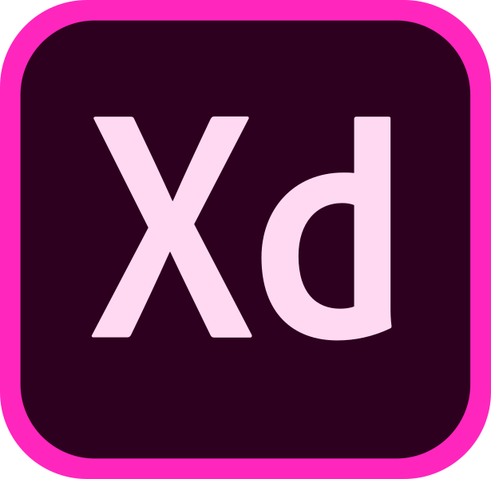

<PageDescription>

Rapidly build beautiful and accessible experiences. The Carbon kit contains all
resources you need to get started.

</PageDescription>

<InlineNotification>

The Adobe XD kit is maintained by members of the Carbon community. For support,
contact the
[kit's maintainers](https://github.com/IBM/design-kit/issues/new?assignees=&labels=kit%3A+adobe+xd&template=-adobe-xd--carbon-kit.md&title=%5Bcomponent%5D+description+of+issue).

</InlineNotification>

<AnchorLinks>

<AnchorLink>Get the kit</AnchorLink>
<AnchorLink>Support</AnchorLink>

</AnchorLinks>

## Get the kit

The Adobe XD is a work in progress and once finished it will be available as an
Adobe Creative Cloud (CC) Library. Until then download the file and use it as a
sticker sheet.

#### 1. Install Adobe XD

To design with Carbon you must have the most recent version of
[Adobe XD](https://www.adobe.com/products/xd.html) installed.

#### 2. Download the kit

The Adobe XD kit is currently only available in the White theme.

<Row>
<Column colLg={4} colMd={4} noGutterSm>
  <ResourceCard
    subTitle="Get the Adobe XD Design kit"
    href="https://github.com/IBM/design-kit/raw/master/Adobe%20XD/Carbon%20Design%20System%20-%20V10%20-%20White%20(11.01.19).xd"
    actionIcon="download">

  </ResourceCard>
</Column>
</Row>

## Support

If you’re brand new to Adobe XD, they offer some great
[tutorials](https://helpx.adobe.com/xd/tutorials.html).

### Releases

Enhancements to the kit will be rolling out in the future. When a new version of
the library is available, you will need to download the new file to replace the
old one. Releases will be posted to the
[GitHub repo](https://github.com/IBM/design-kit)

### Help

Can’t find an answer to your question? Open an issue on
[GitHub](https://github.com/IBM/design-kit/issues/new?assignees=&labels=kit%3A+adobe+xd&template=-adobe-xd--carbon-kit.md&title=%5Bcomponent%5D+description+of+issue).
