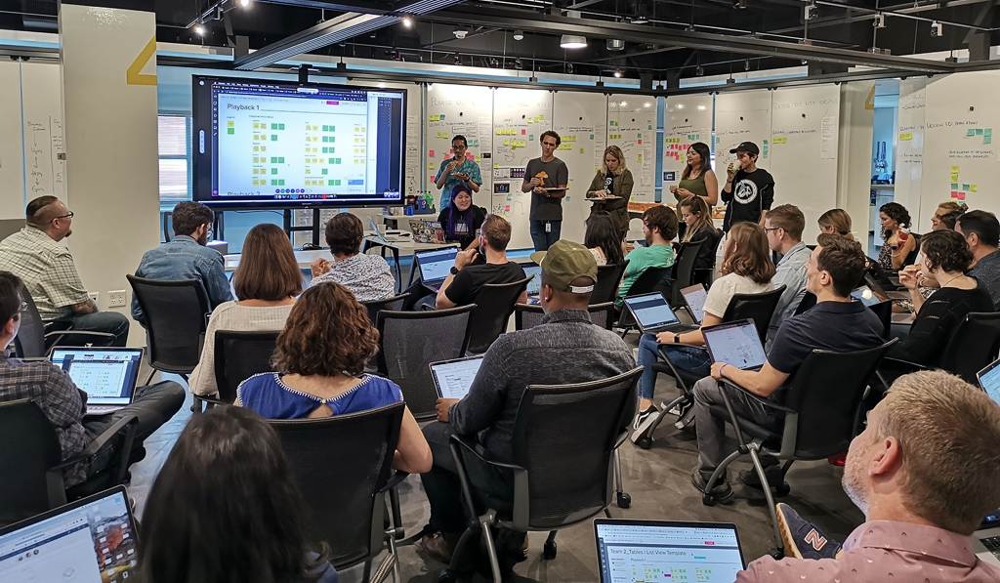
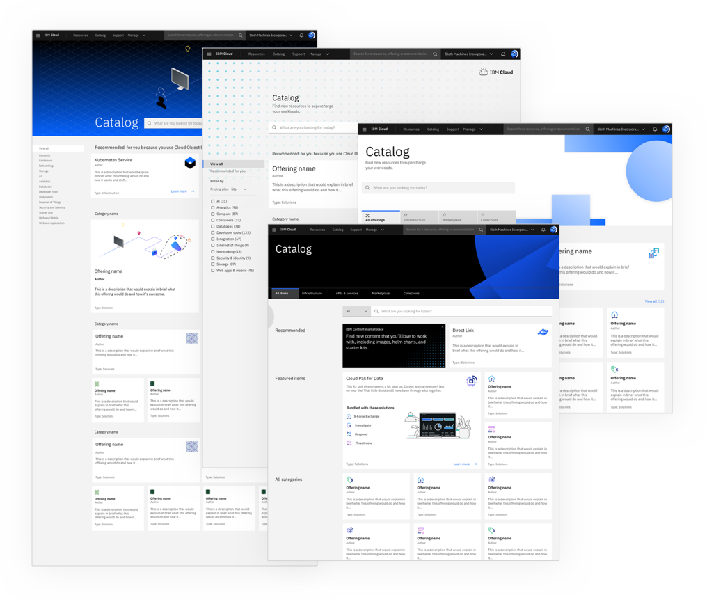

<PageDescription>

Recently, the IBM Cloud team took on the challenge to achieve visual and UX
consistency across their products by transitioning to Carbon 10. This is their
journey.

</PageDescription>

<AnchorLinks>

<AnchorLink>Overview</AnchorLink>
<AnchorLink>The challenge</AnchorLink>
<AnchorLink>The proposed solution</AnchorLink>
<AnchorLink>The approach</AnchorLink>
<AnchorLink>Positive outcomes</AnchorLink>
<AnchorLink>Next steps</AnchorLink>
<AnchorLink>Resources</AnchorLink>

</AnchorLinks>

## Overview

With support from senior leadership, the Cloud PAL team facilitated the
transition from Carbon 9 to Carbon 10 for all IBM Cloud services. While this
effort was led by the Cloud PAL team, they involved the Cloud community,
starting with a Design Jam and a visual design guild. The transition was split
into 4 phases that most Cloud services completed at the same time. This meant
that most Cloud services switched to using Carbon all at once at maintained a
smooth, unified user experience.

Using patterns created with Carbon 10, IBM Cloud was able to reduce their user
journeys by 7 steps and raise their NPS score by 57%. Since the transition, IBM
Cloud has seen increases in operational efficiency for developer and designers
now using Carbon 10. They have also found in user research that participants
prefer the new designs and the average time to provision a service has improved
by 4%.

## The challenge

In early 2019 Carbon 10 was released. The update included major visual and
structural changes to align with the revamped IBM Design Language. Part of these
updates involved a redesign of existing components and introduced the UI shell
and 2x Grid. With 100s of services at the time, IBM Cloud needed a way to manage
the transition from Carbon 9 and Carbon 10 at an organizational level.

## The proposed solution

### Cloud PAL

In order to coordinate the transition to Carbon 10, IBM Cloud leveraged their
Platform Integration Experiences Governance team to create a Pattern and Asset
Library (PAL) that was specific to Cloud services. Because they were
transitioning so many services, IBM Cloud was able to create dedicated,
cross-functional team that was solely focused on supporting the transition to
Carbon 10 and the creation of Cloud-specific assets and resources. Rather than
the project being grassroots and trying to convince every single team to
participate, the transition started from the top. The IBM Cloud VP of Design,
Arin Bhowmick, and Director of Design, Bill Grady, made the case for the effort
and mandated that Cloud teams participate.

Creating a PAL and getting the hundreds of Cloud services to adopt both Carbon
10 and Cloud PAL needed a specific dedicated team with a project plan. While the
Cloud PAL team managed the logistics of the transition, they wanted to build a
community around the effort so they brought the whole organization into the
effort, starting with a Design Jam.

## The approach

### Design Jam

In May 2019, when the effort was kicking off, the Cloud PAL team held a Design
Jam. Designers and developers across all the Cloud services came together for a
day and worked to create preliminary patterns using the Carbon 10 guidelines.
They were split into random groups and given a design pattern to create during
the workshop. Because the members of each group all had different roles and came
from different teams, they were able to share and build on different
perspectives and this led to the teams coming up with pretty solid first draft
patterns.

<Row>
<Column colLg={8}>

<Caption>Cloud Design Jam, May 2019.</Caption>

</Column>
</Row>

### Visual design guild

The patterns that came out of the Design Jam were a great starting place, but
they were simple and safe. They lacked the brand identity and excitement that
the Cloud PAL team knew was necessary for the effort to be successful.

A Cloud visual design guild came together to create explorations for the Design
Jam patterns to push them further. Each week the guild met with the Carbon team
to receive feedback and ensure the explorations were aligned with Carbon 10 and
the IBM Design Language. When the templates and patterns were locked down, they
were the best they could be and had been vetted by the Carbon team, the Brand
team, and the Cloud community.

<Row>
<Column colLg={8}>

<Caption>Iterations of the catalog page from the visual design guild.</Caption>

</Column>
</Row>

### Templates and patterns

Cloud PAL used the Carbon 10 guidance and components to create templates and
patterns for Cloud-specific use cases and flows. Cloud PAL published templates
and resources, primarily based on the design guild deliverables, that were more
specific and prescriptive for Cloud than the Carbon guidance. They not only
designed these templates and patterns, but also coded them, so that teams would
be implementing the exact same pieces. The Cloud patterns included bespoke APIs
which meant when teams used a pattern or template, they were given all the code
with the APIs and parameters baked in so that everything worked the same and
multiple teams didn't spend time implementing the same APIs over and over.

Over the course of the transition, Cloud PAL designed a total of 22 patterns
that cover 90% of Cloud UIs.

### Adoption management

#### Adoption Phases

Initially, the Cloud PAL team discussed supporting adoption in groups, so that
not every team had to transition over to using Carbon 10 at the same time.
Ultimately, they decided against this because they did not want to have to
provide dual maintenance while teams switched over. Instead, they decided to use
a phased approach with 4 phases that every team had to follow.

First, teams migrated to Carbon 10 components and patterns but used a Carbon 9
theme so the visual style still matched what they currently had. They also began
introducing some Cloud PAL components during this phase.

During the second phase, the Carbon 10 theme was toggled on and all Cloud teams
switched from using the Carbon 9 theme to using the Carbon 10 theme. This meant
that teams were prepared for the transition and all the Cloud services switched
to using the Carbon 10 visual style at the same time.

By phase 3, all the services were already using Carbon 10, and instead, phase 3
focused on the Cloud PAL patterns. During this time, teams were expected to
adopt the core Cloud PAL patterns to further unify the services.

Finally, phase 4 focused on continuous delivery. Teams continuously adopted new
patterns and components as they were released by the Cloud PAL team.

#### Governance

With the support of their design executives, a governance model was established.
During each phase, service teams had to go through a review with the Cloud PAL
team. These reviews followed well-documented rubrics and ensured that teams were
meeting the requirements for each phase. Requirements on the rubric were each
given a priority level of Priority 1, Priority 2, or Priority 3. If a team
failed a Priority 1 requirement, they could not release the update until the
requirement had been addressed. The reviews gave the Cloud PAL team insight into
how teams were applying the Carbon and Cloud PAL guidance and gave them an
opportunity to address any miscommunications or inconsistencies before the
services were released.

While most of the Cloud services were required to participate in this effort, it
did not make sense for every single service to participate. The governance model
included an exemption process for teams that did not think their services should
adopt Carbon 10 and the Cloud PAL. This process, however, was just as involved
as adoption itself, so it was not an easier route for teams to take. Teams who
wanted an exemption needed to get signoff from their executives and needed to
provide a real justification that outlined the client impact. They found that
many of the teams applying for an exemption really just needed a deferral to
push out the timeline. The Cloud PAL team also found that several of the teams
asked for exemptions because they did not have development resources for the
adoption effort, so they were able to provide extra support to those teams and
help with development.

## Positive outcomes

### End-user success

The transition resulted in positive, tangible benefits for the end user. IBM
Cloud’s NPS scoe improved by 57% in the first 3 months after the transition.
They reduced 7 steps from user journeys and improved the average time to
provision a service by 4%. End users were 210% more likely to rate services as
“powerful,” “innovative,” and “secure” than before, and 180% less likely to rate
them as “elaborate” or “corporate.” In a brand test, 88% of users preferred the
new screens. IBM Cloud also saw an 18% reduction in support tickets in areas
where teams implemented and followed Carbon 10 and Cloud PAL guidance.

### Adoption outcomes

As of January 2021, 116 of the 155 services have adopted Carbon 10. 21 of the
remaining services have approved exceptions and will never adopt. Since the
majority of teams have adopted, the Cloud PAL team has seen an increase in
operational efficiency for developers and designers.

### Internal efficiency

IBM Cloud estimates their design and development teams saved 2000 hours per
pattern, making them 80% more efficient than coding or designing screens from
scratch. Cloud PAL created "connected components" that saved teams even more
time. They removed hundreds of lines of code from each usage since these
components had APIs built-in and created both visual and data consistency across
the platform.

## Next steps

Cloud PAL is supporting adoption for the few teams that have been delayed. They
are also focusing on continuously improving and developing new components and
patterns for their services.

## Resources

<Row className="resource-card-group">
<Column colLg={4} colMd={4} noGutterSm>
  <ResourceCard
    subTitle="Cloud Pattern and Asset Library"
    href="https://pages.github.ibm.com/ibmcloud/pal/"
    >

  </ResourceCard>

</Column>
</Row>
