<PageDescription>

Learn about how the IBM.com team adopted Carbon for the design and development
of the new self-service purchase experience on IBM.com.

</PageDescription>

<AnchorLinks>

<AnchorLink>Overview</AnchorLink>
<AnchorLink>The challenge</AnchorLink>
<AnchorLink>The proposed solution</AnchorLink>
<AnchorLink>The approach</AnchorLink>
<AnchorLink>Benefits</AnchorLink>
<AnchorLink>Positive outcomes</AnchorLink>
<AnchorLink>Next steps</AnchorLink>
<AnchorLink>Resources</AnchorLink>

</AnchorLinks>

## Overview

The IBM.com Commerce Platform team spent three months transitioning their
checkout flow to implement Carbon and improve their conversion rate and overall
product experience. They took an iterative approach, starting first with small,
isolated features to get comfortable designing and developing with Carbon. Next,
they replaced existing elements with Carbon components. Once all the components
had been transitioned, the team focused on updating page structures and layouts.

Since the Carbon implementation, the team’s delivery cycle has sped up and
they spend less time on quality assurance. Their product is now aligned with the
other IBM.com experiences that use Carbon, creating a consistency of experience.
Their conversion rate increased by 5% and more than 50% of customers are
converting to purchase, which puts them on par with industry benchmarks.

## The challenge

### Project goals

The IBM.com Commerce Platform team had a mission — to improve the completion
rate for their checkout flow. They knew there were usability issues in the
checkout process but they also wanted to add new features.

By aligning their checkout flow with the Carbon Design System, they could add
new features in a consistent way and make a lot of small improvements, which
would have a large impact on the completion rate and therefore revenue.

The team aimed to do this by decreasing clicks, increasing device compatibility,
introducing high-value features, and fixing existing bugs. An additional goal
was to reduce the amount of time IBM support was spending manually identifying
and resolving order issues.

### Analytics and research

Site analytics helped identify existing issues in the checkout process. There
were key issues to address during the transition to Carbon:

- There was a lack of visual and information hierarchy on the page.
- Critical information was missing when users encountered an error, and this
  blocked them from moving forward.
- Customers felt the checkout experience was unreliable, and couldn't quickly
  find what they wanted, so they abandoned the flow.

### Competitors

The Commerce team knew their eCommerce marketplace was falling behind
competitors, in both market share and user experience. Competitors had been
moving to a more modern experience that used data given by customers to
pre-populate fields, which significantly reduced the number of clicks. The team
used this project to strategically update their product to be able to better
compete in the marketplace.

## The proposed solution

### Transitioning to Carbon

Implementing Carbon would make the interface more clear, meaning users would no
longer get lost in the flow and would be able to find what they needed. It would
also align key pages before, during, and after the checkout process, creating a
sense of continuity. The team hypothesized that as a result, users would be less
likely to defect.

The team mapped out their transition to Carbon, focusing at first on a core set
of pages. While implementing Carbon components and aligning to the IBM Design
Language, they took the opportunity to reevaluate their typography and
illustrations. By improving their type hierarchy and illustrations they hoped to
transform a somewhat dry experience to something delightful, while building more
confidence and trust in the interface itself.

<Row>
<Column colLg={6}>

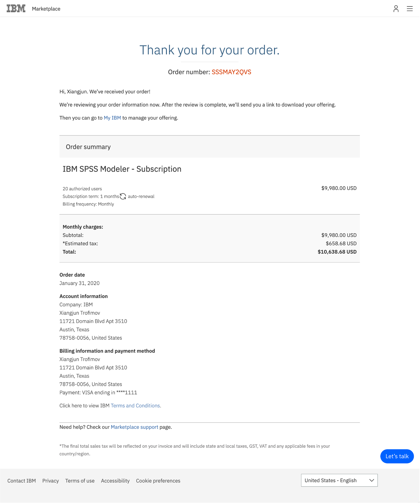

<Caption>
  Before: Order confirmation page prior
  to the redesign.
</Caption>

</Column>

<Column colLg={6}>

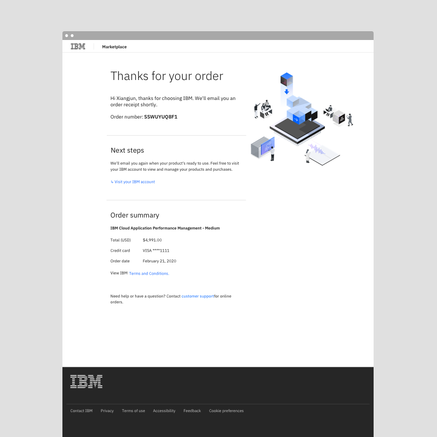

<Caption>
  After: Order confirmation page after
  the redesign.
</Caption>

</Column>
</Row>

### Identifying high value features

The second part of the solution was identifying high impact features they could
implement in tandem with the Carbon transition. Many of these features were
self-contained and so they paired well with the overall transition to Carbon, as
the team learned to design and develop with the design system.

The global address form was one of these features. The new form validated
addresses as users entered them, giving users confidence that they’d input the
correct address. Additionally, the support team no longer had to manually follow
up on invalid addresses, making the experience better for everyone.

## The approach

The transition to Carbon was an iterative process. Rather than updating the
entire interface at one time, the Commerce Platform team transitioned their
product slowly and tactically. By adopting Carbon iteratively, they were able to
see which changes made substantial impacts and use that to inform their roadmap
and subsequent changes.

### Learning the design system

Before jumping into adopting Carbon, it was important to spend time learning
about and getting comfortable with Carbon. Shixie Shi Trofimov, the design lead
of the transition project, led the developers through a crash course to align on
definitions and terminology. She wanted designers and developers to speak the
same language as they worked through a set of design specifications.

<Row>
<Column colLg={8}>

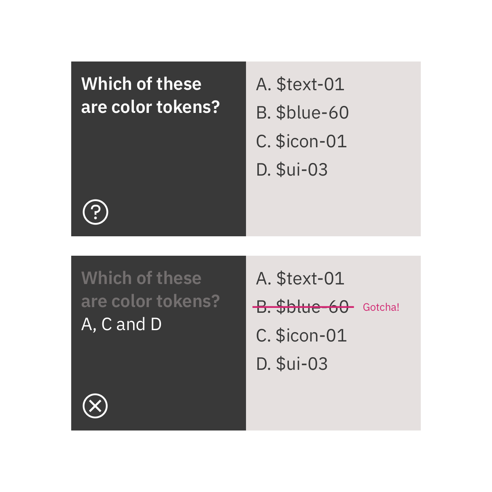

<Caption>
  A Carbon token quiz helped get developers comfortable with Carbon token naming
  conventions.
</Caption>

</Column>
</Row>

### Starting small

The adoption process started with one modal. Instead of redesigning an existing
feature, they identified a high value, self-contained, new feature to develop
from scratch. The modal solved an important usability issue by allowing users to
change their country during checkout, but it also provided the developers a
simple and non-disruptive entry point into adopting Carbon. It also meant they
didn’t have to worry about breaking existing functionality in production and had
a safe place to experiment and ship.

The process of designing to shipping the modal with Carbon took about a month
because it was the team’s first experience with using Carbon and they were
getting up to speed.

<Row>
<Column colLg={8}>

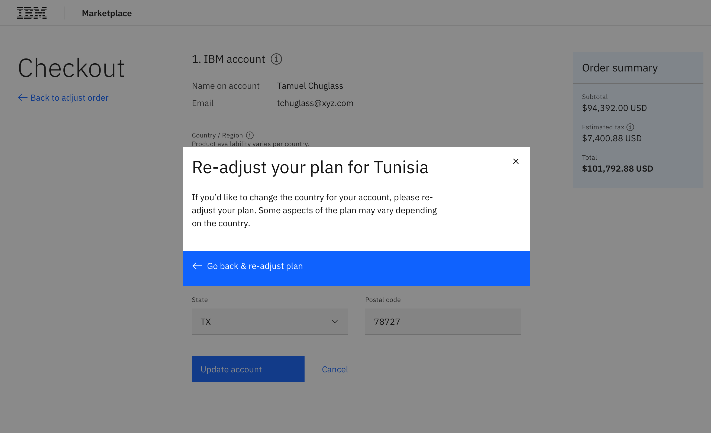

<Caption>New modal for switching countries</Caption>

</Column>
</Row>

### Mixing new with old

The first new Carbon modal was placed on an existing page. It was an easy way
for the team to get started and begin shipping new pieces. Mixing new with old
wasn’t disruptive for users. Because the changes were implemented in small
passes, users may not have even noticed that the experience had changed and
returning users did not have to relearn the interface. Also, mixing the
experiences meant that got the team to their final result faster.

<Video vimeoId="488148768" />
<Caption>New modal sitting on the original page</Caption>

### Iterating, iterating, iterating

Rather than updating all of the pages at once, the team took an iterative
approach. By starting with fresh features that integrated with the old
interface, the team could ship pieces iteratively.

The first stage involved switching individual components to their Carbon
version, starting with input fields then buttons. After transitioning the
individual components, the page structure and layout was updated.

With this approach, the Commerce team was able to refresh their product’s
experience, set the stage for larger future changes, and complete the project in
only three months.

<Row>
<Column colLg={12}>

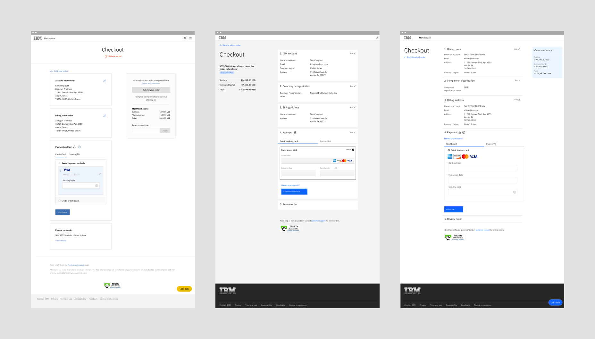

<Caption>
  From left to right: The checkout screen in January 2020 before the transition,
  in April 2020 after the transition, and the future design.
</Caption>

</Column>
</Row>

## Benefits

There have been several benefits from the transition to Carbon for both the
Commerce team's own workflow and process, and the user experience. The team
especially found value in the impact of their delivery speed and need for
quality assurance.

### Faster delivery

The entire process for implementing Carbon took only three months and since the
transition, the team’s development cycle has sped up. By using Carbon, the
developers are placing pre-built components and can therefore focus on more
important issues instead of taking the time to build out each element and
component.

<Row>
<Column colLg={6}>

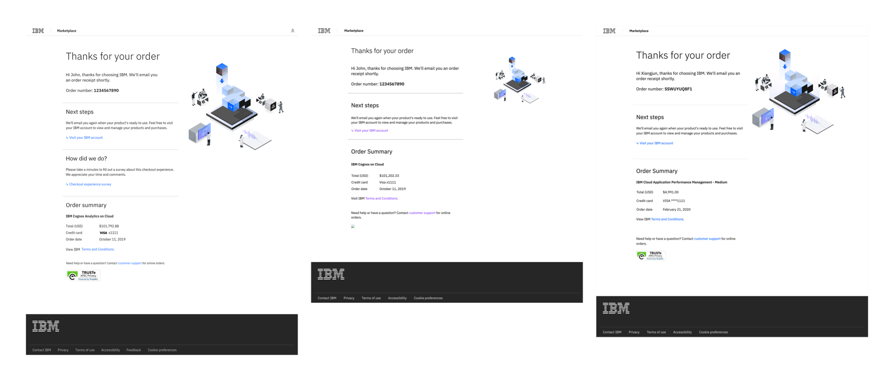

<Caption>
  Before: The order confirmation screen
  design that was handed off to developers.
</Caption>

</Column>

<Column colLg={6}>

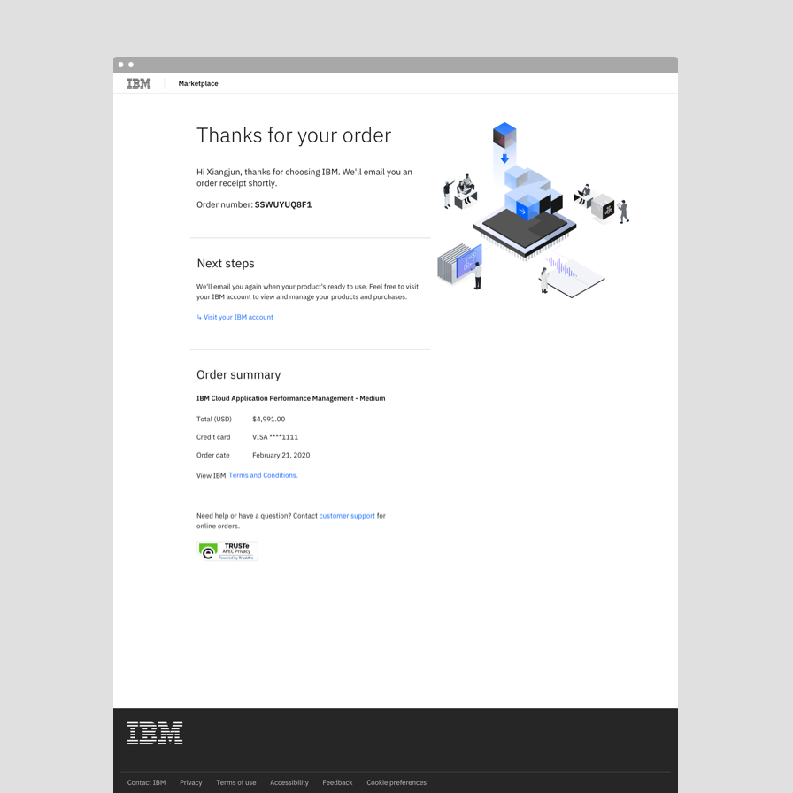

<Caption>
  After: The order confirmation screen
  in production at the end of the sprint.
</Caption>

</Column>
</Row>

### Minimal quality assurance testing

Once the team had been fully onboarded to Carbon, delivery required only minimal
quality assurance testing because they were using components straight out of the
box.

### Continuity in user experience

The project vastly improved the continuity in user experience with other IBM
touchpoints, including Support and My IBM. These experiences now feel continuous
and intuitive for users.

Within the Commerce Platform flow, pages are also unified and organized in the
same way, providing familiarity and a feeling of dependability.

<Row>
<Column colLg={8}>

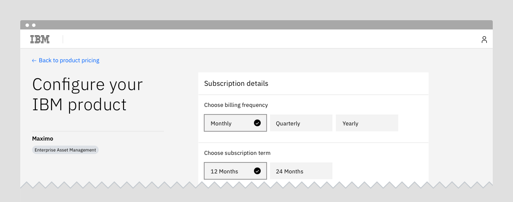

</Column>
</Row>

<Row>
<Column colLg={8}>

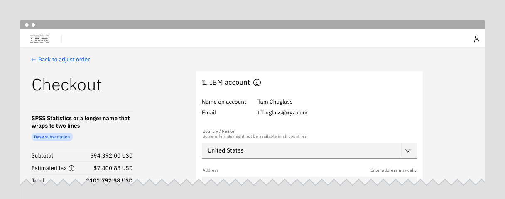

</Column>
</Row>

<Row>
<Column colLg={8}>

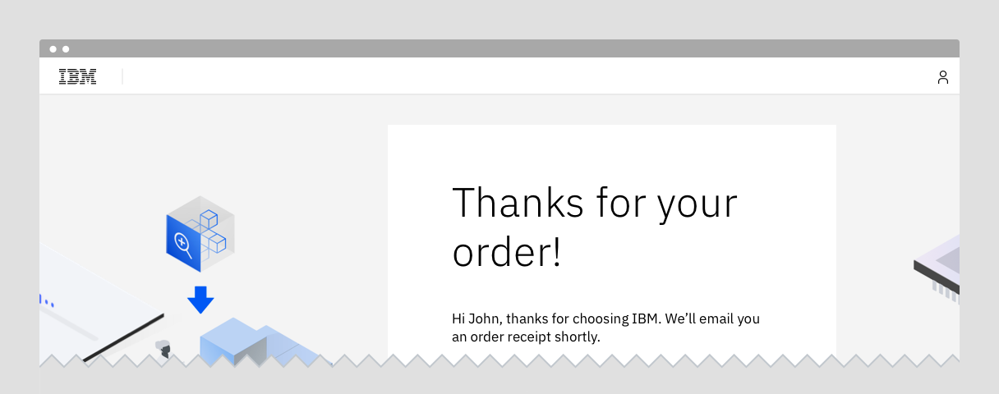

</Column>
</Row>

<Row>
<Column colLg={8}>

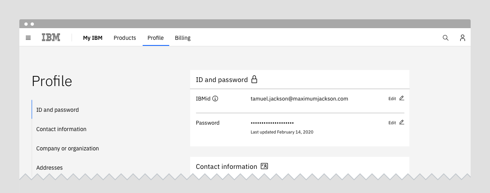

<Caption>
  From top to bottom: Product configuration, Checkout, Confirmation, and
  Profile. These pages illustrate the continuity in experience gained by using
  Carbon for IBM.com.
</Caption>

</Column>
</Row>

## Positive outcomes

After the Carbon transition, more than 50% of customers are converting to
purchase, which is on par with industry benchmarks. The conversion rate was
raised by 5% which has led to a large increase in orders and revenue.

## Next steps

The Commerce Team is currently working on improvements experience of their
configuration page. The next round of visual design improvements will focus on
better aligning their interface with the
[Carbon for IBM.com](https://www.ibm.com/standards/web/carbon-for-ibm-dotcom//)
style models.

## Resources

<Row className="resource-card-group">
<Column colLg={4} colMd={4} noGutterSm>
  <ResourceCard
    subTitle="Carbon for IBM.com"
    href="https://www.ibm.com/standards/web/carbon-for-ibm-dotcom/"
    >

  </ResourceCard>

</Column>
</Row>
