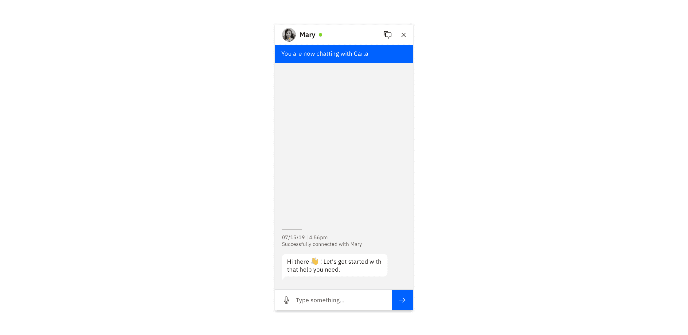
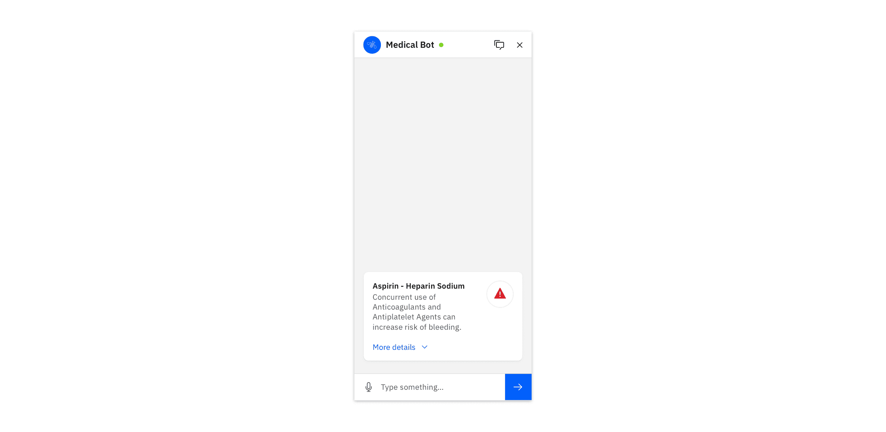
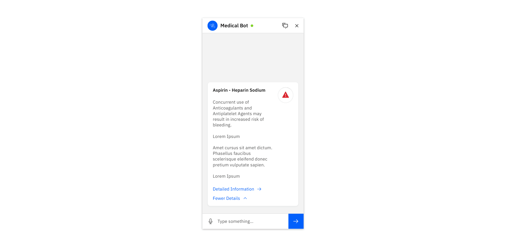

<PageDescription>

Depending on the complexity of the use case and user needs, chatbots may require
other interactions that supplement the conversational experience.

</PageDescription>

<InlineNotification>

**Note:** This page documents some common chatbot scenarios in IBM products and
their recommended best practices. Flows still under consideration are marked
with "Preview".

</InlineNotification>

<AnchorLinks>

<AnchorLink>Launching a bot</AnchorLink>
<AnchorLink>Multiple threads</AnchorLink>
<AnchorLink>Expanding cards</AnchorLink>
<AnchorLink>Error states</AnchorLink>

</AnchorLinks>

## Launching a bot

Bots should be launched from a button positioned at the bottom right of the
screen, or from a button embedded within the UI. See Carbon Chatbot Add-on
Design Kit for the appropriate variants.

## Multiple threads (Preview)

When a bot cannot complete a request, the bot detects frustration, or the user
would simply prefer interacting with a person, it becomes necessary to connect
the user to a human agent.

### User initiates change

Sometimes, a user indicates that they would like to chat with a human. Other
times, this process can be suggested if a bot is repeatedly unsuccessful in
answering a user’s question.

### Notify the user

Use a toast notification bar to indicate when the user is in a new conversation
context, or that a new user has joined the the chat. Call out any significant
changes with in-conversation status messages.

### Multiple users

Combining two or more human agents into the same thread is a common practice.
Where necessary, call out significant changes in who the user is addressing
(particularly if they have different purposes).

### Incoming messages

For new messages appearing in another thread, be sure to use dots above the
Threads icon to alert the user of new messages. Then, within the menu, indicate
the amount of new messages on the specific thread. Visually distinguish threads
with new messages.

## Expanding cards (Preview)

Where needed, use expanding cards to progressively disclose content. Use a full
page view to show a very large amount of content to the user.

### Default state

Call out critical information in the default state. Provide a trigger to expand
the card.

### Expanded state

Provide more detailed information in the expanded state. Only if absolutely
necessary, provide a way to access the full view of the content.

### Full view

The full view is a generic container that can be used to display long-form
content that would otherwise crowd a conversation thread.

## Error states (Preview)

Be sure to indicate to a user when their message has not been sent due to a
connectivity or server problem. When in a connected state, temporarily show the
success notification, and then remove it along with any message error
indicators.

