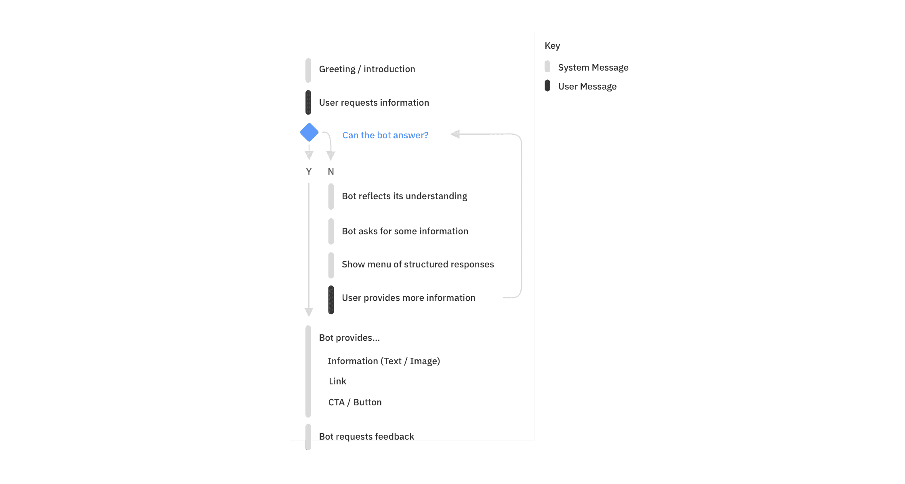
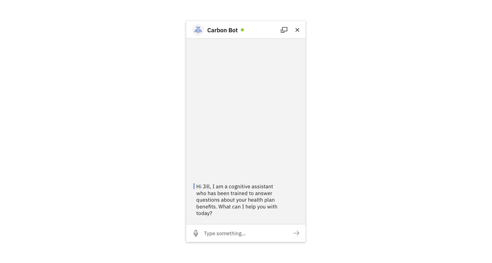
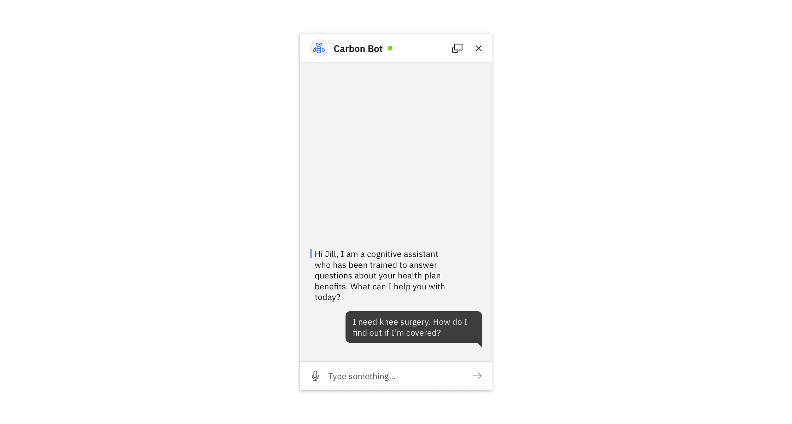
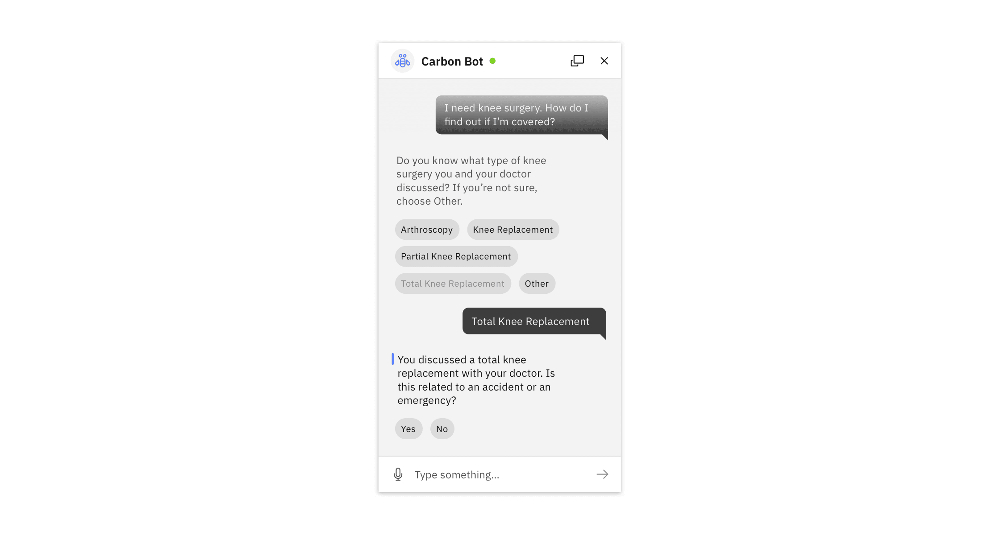
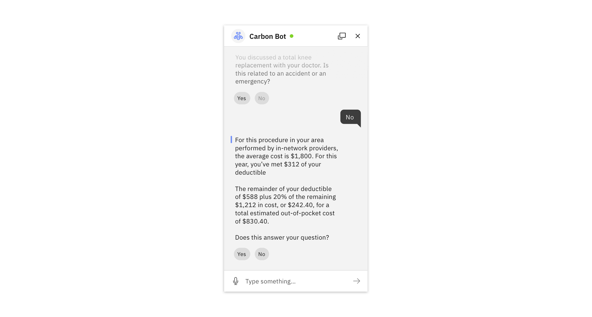

import {
  StructuredListWrapper,
  StructuredListHead,
  StructuredListRow,
  StructuredListCell,
  StructuredListBody,
  UnorderedList,
  ListItem,
} from '@carbon/react';

<AnchorLinks>

<AnchorLink> Anatomy </AnchorLink>
<AnchorLink> Requesting information </AnchorLink>
<AnchorLink> Best practices </AnchorLink>

</AnchorLinks>

## Anatomy

The following diagram outlines the primary components within the chatbot
pattern.

<Image src="/images/chatbot-4.png" />

<StructuredListWrapper>
  <StructuredListHead>
    <StructuredListRow head>
      <StructuredListCell head>Component</StructuredListCell>
      <StructuredListCell head>Usage</StructuredListCell>
      <StructuredListCell head>Variants</StructuredListCell>
    </StructuredListRow>
  </StructuredListHead>
  <StructuredListBody>
    <StructuredListRow>
      <StructuredListCell>Chatbot header</StructuredListCell>
      <StructuredListCell>
        The chatbot header contains the title of the chat and up to four action
        buttons that control the chatbot application. Typically, the “close”
        icon must always be included.
      </StructuredListCell>
      <StructuredListCell>
        <UnorderedList>
          <ListItem>Default</ListItem>
          <ListItem>With avatar</ListItem>
          <ListItem>Large</ListItem>
        </UnorderedList>
      </StructuredListCell>
    </StructuredListRow>
    <StructuredListRow>
      <StructuredListCell>System message</StructuredListCell>
      <StructuredListCell>
        System Messages represent the bot's response to the user. Past messages
        will have a faded treatment, whereas active messages have an indicator
        applied (see below)
      </StructuredListCell>
      <StructuredListCell>
        <UnorderedList>
          <ListItem>Default</ListItem>
        </UnorderedList>
      </StructuredListCell>
    </StructuredListRow>
    <StructuredListRow>
      <StructuredListCell>User message</StructuredListCell>
      <StructuredListCell>
        A user message indicates what the user has input via text input,
        structured response, or voice.
      </StructuredListCell>
      <StructuredListCell>
        <UnorderedList>
          <ListItem>Default</ListItem>
        </UnorderedList>
      </StructuredListCell>
    </StructuredListRow>
    <StructuredListRow>
      <StructuredListCell>Structured response</StructuredListCell>
      <StructuredListCell>
        Structured responses present choices to the user that are easy for the
        bot to understand. When selected, a structured response will change its
        visual appearance and a user message will appear with the same content.
      </StructuredListCell>
      <StructuredListCell>
        <UnorderedList>
          <ListItem>Default</ListItem>
        </UnorderedList>
      </StructuredListCell>
    </StructuredListRow>
    <StructuredListRow>
      <StructuredListCell>Chatbot input</StructuredListCell>
      <StructuredListCell>
        The Chatbot input is comprised of a text input field, a configurable
        button for other input (e.g., voice) and a submit button.
      </StructuredListCell>
      <StructuredListCell>
        <UnorderedList>
          <ListItem>Default</ListItem>
          <ListItem>Without action button</ListItem>
        </UnorderedList>
      </StructuredListCell>
    </StructuredListRow>
    <StructuredListRow>
      <StructuredListCell>Launch button (not shown)</StructuredListCell>
      <StructuredListCell>
        Launch buttons are the means by which a user initiates a conversation
        with your bot and are the first interaction of the bot experience.
      </StructuredListCell>
      <StructuredListCell>
        <UnorderedList>
          <ListItem>Primary</ListItem>
          <ListItem>Alternate</ListItem>
        </UnorderedList>
      </StructuredListCell>
    </StructuredListRow>
    <StructuredListRow>
      <StructuredListCell>Chatbot cards</StructuredListCell>
      <StructuredListCell>
        Cards are used to display more information (including text and images)
        about a significant action that a user can take. They can also be used
        to display text and image together for a purely informational purpose.
      </StructuredListCell>
      <StructuredListCell>
        <UnorderedList>
          <ListItem>Card with text (Hero)</ListItem>
          <ListItem>Card with text (Large)</ListItem>
          <ListItem>Card with text (Mini)</ListItem>
          <ListItem>Card with image (Avatar)</ListItem>
          <ListItem>Card with image (Large)</ListItem>
          <ListItem>Card with image (Mini)</ListItem>
          <ListItem>Card with data (Table)</ListItem>
          <ListItem>Card with data (Visualization)</ListItem>
        </UnorderedList>
      </StructuredListCell>
    </StructuredListRow>
  </StructuredListBody>
</StructuredListWrapper>

## Requesting information

The following flow shows a typical exchange between a user and a bot. This model
can be used as a baseline to start building useful conversational experiences.

## Best practices

At a minimum, use these best practices to help ensure a successful
conversational experience. For more in-depth conversational principles, see
[IBM Design for Conversational AI](https://www.ibm.com/design/ai/conversation).

#### Introduction

Ensure your users know they are talking to a bot and that the bot has stated its
purpose. Set the context for what questions users can ask about.

<Caption>chatbot greeting</Caption>

#### User intent

Typically, a user inputs an intent, which can be request for information or a
task for the bot to complete. This can take the form of a text (shown here) as
well as a structured response (see next section)

<Caption>User intent</Caption>

#### Structured responses

Prompt for additional details with a menu of structured responses. This narrows
the scope to more specific information to answer the user’s question.

<Caption>Structured responses</Caption>

#### Reflection

The bot should reflect its understanding of the query in the response (when
appropriate) to ensure understanding, or before performing a significant action.
Note: This process of slotfilling may need to be repeated until the bot has all
the information required to answer the user’s initial question.

<Caption>Reflection</Caption>

#### Provide a response and request feedback

The bot should provide a thoughtful, informative response to the user’s intent,
based on the information they have provided throughout the conversation. When
appropriate, be sure to provide an opportunity for users to give feedback.
Consider allowing the user to input a custom response. Provide an opportunity
for users to give feedback where possible. Consider allowing the user to input a
custom response.

<Caption>Provide a response and request feedback</Caption>
