#### Maintainers:

[Andrew Smith](https://w3.ibm.com/bluepages/profile.html?uid=4G8681897)

## Overview

Users often need to create different types of assets - they can have simple or
complex requirements. The Create pattern covers different complexities and
formats: Simple (single step) and Multistep options, including Modal, Sidepanel,
Tearsheet, and Full-page formats.

To create is to generate a new resource. Creating is distinct from adding, but
the two are often confused. To add a resource is to include a resource that
already exists. This pattern focuses on how to place the user in a flow when
there's a need for creating a new resource.

## Inline creation

(inline creation content to come?)

## Modal

### Single step

#### Anatomy

<Row>
<Column colLg={8}>

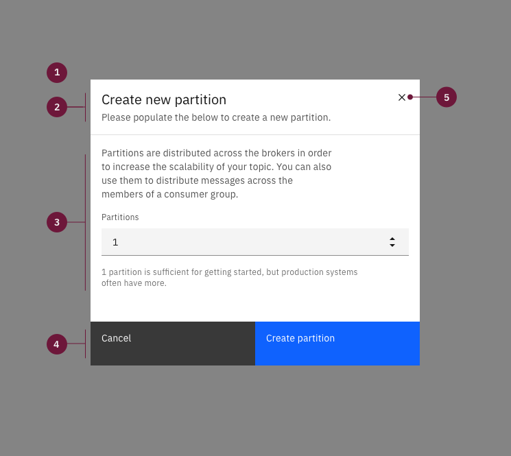

</Column>
</Row>

1. **Modal size & overlay:** Modal size "small". Screen overlay that obscures
   the on-page content.
2. **Create modal title:** Title line for the create flow with an optional
   subtitle.
3. **Body:** Contains the information and/or controls needed to populate the
   task. It can include message text and components.
4. **Buttons:** The primary and secondary buttons are "Create _asset type_" and
   "Cancel", respectively. Cancelling requires confirmation, as seen in the
   Creation section.
5. **Close button:** Closes the modal and cancels the create action after user
   confirmation.

#### Alignment

<Row>
<Column colLg={8}>

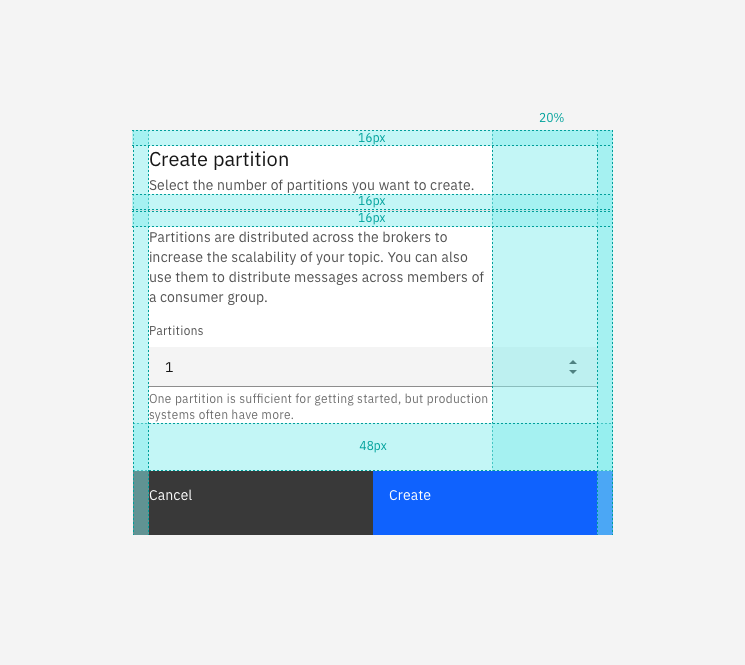

</Column>
</Row>

#### When to use

- There are only one or two form fields to be filled out during a creation

#### When not to use

- There are more than three form fields.
- The fields are unrelated and should be split into steps.
- There is scrolling inside the modal.

### Multistep

#### Anatomy

<Row>
<Column colLg={8}>

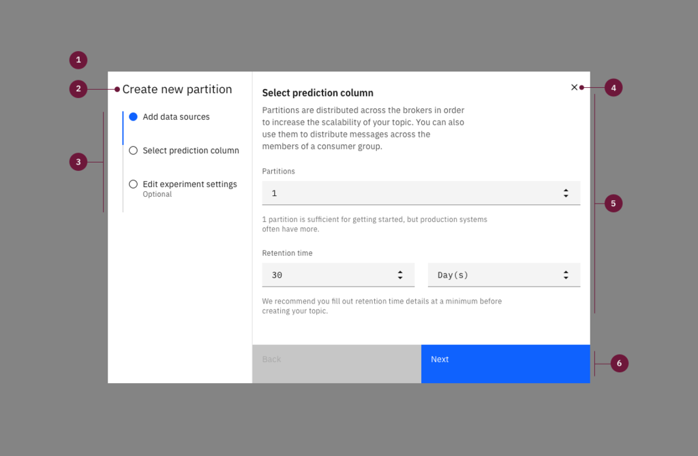

</Column>
</Row>

1. **Modal size & overlay:** Modal size "large". Screen overlay that obscures
   the on-page content.
2. **Create modal title:** Title line for the create flow. The title will
   usually be "New _asset type_".
3. **Progress indicator:** Vertical progress indicator lets the user know what
   step they are on. Limit of three steps in the modal option.
4. **Close button:** Closes the modal and cancels the create action after user
   confirmation.
5. **Body:** Contains the information and/or controls needed to populate the
   task. It can include message text and components.
6. **Buttons:** The primary and secondary buttons are "Next" and "Back",
   respectively. The "Back" button will be disabled on the first step. The
   "Next" button will change to "Create _asset type_" on the last step of
   creation.

#### Alignment

<Row>
<Column colLg={8}>

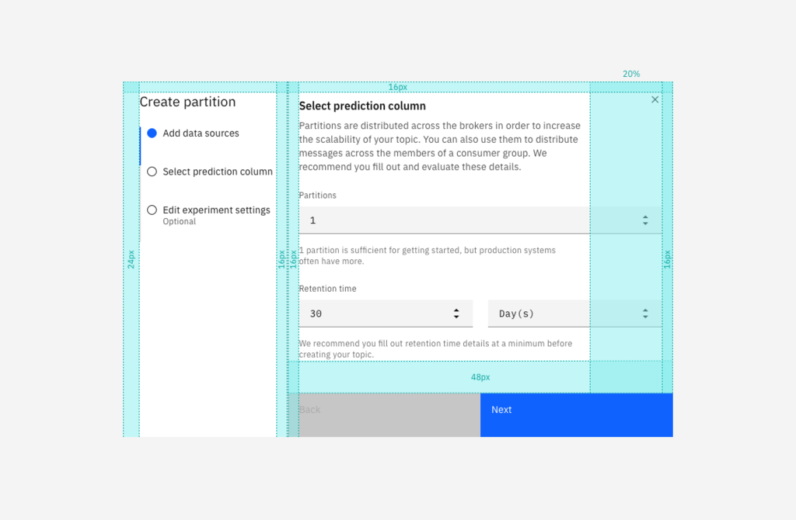

</Column>
</Row>

#### When to use

- The create flow has low complexity: simple, quick, and easy.
- There are two or three distinct steps in the flow.
- There is little or no scrolling in any of the steps content.

#### When not to use

- There are more than four or five form fields in any of the steps.
- There is more than 2x scrolling inside the modal.
- There are four or more distinct steps in the flow.

## Side-panel

### Single step

#### Example executions

<Row>
<Column colLg={8}>

<Caption>Single step side panel in non-focus state</Caption>

</Column>
</Row>

<Row>
<Column colLg={8}>

<Caption>Single step side panel in focus state</Caption>

</Column>
</Row>

#### Anatomy

<Row>
<Column colLg={8}>

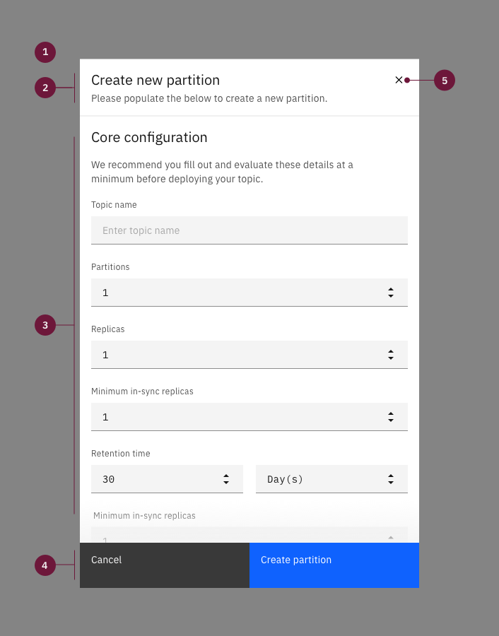

</Column>
</Row>

1. **Sidepanel size & optional overlay:** Slide-over sidepanel size option of
   320px or 480px. Optional screen overlay that obscures the on-page content.
   Either way, Create panel should always be tied to the right side of the
   screen.
2. **Create title:** Title line for the create flow with an optional subtitle.
   The title will usually be "New _asset type_".
3. **Body:** Contains the information and/or controls needed to populate the
   task. It can include message text and components.
4. **Buttons:** The primary and secondary buttons are "Create _asset type_" and
   "Cancel", respectively. Cancelling requires confirmation, as seen in the
   Creation section.
5. **Close button:** Closes the sidepanel and cancels the create action after
   user confirmation.

#### Alignment

<Row>
<Column colLg={8}>

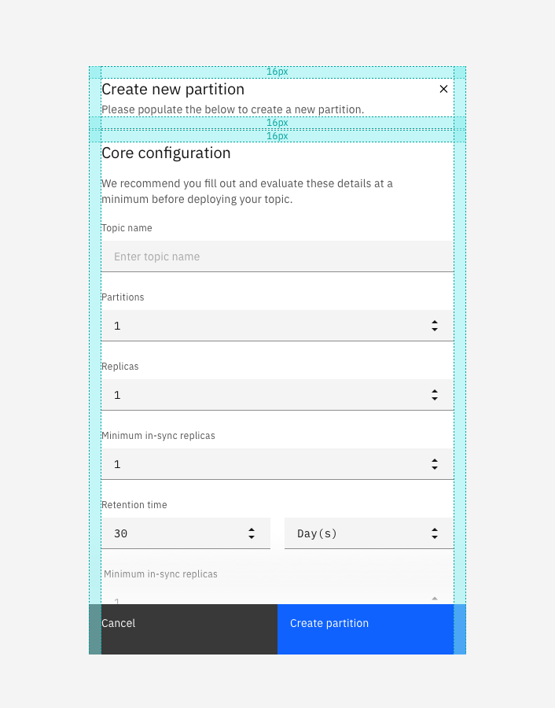

</Column>
</Row>

#### When to use

- There are more fields than can fit into a modal.
- The page gives important context that should not be hidden behind a modal.
- All fields are related and should not be broken down into steps.

#### When not to use

- The form fields are unrelated.
- The flow would benefit from having steps.

### Multistep

<Row>
<Column colLg={8}>

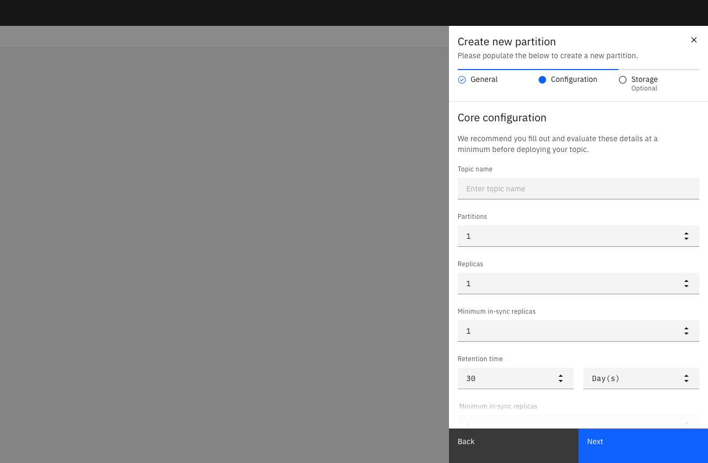

<Caption>Multistep side panel in focus mode</Caption>

</Column>
</Row>

<Row>
<Column colLg={8}>

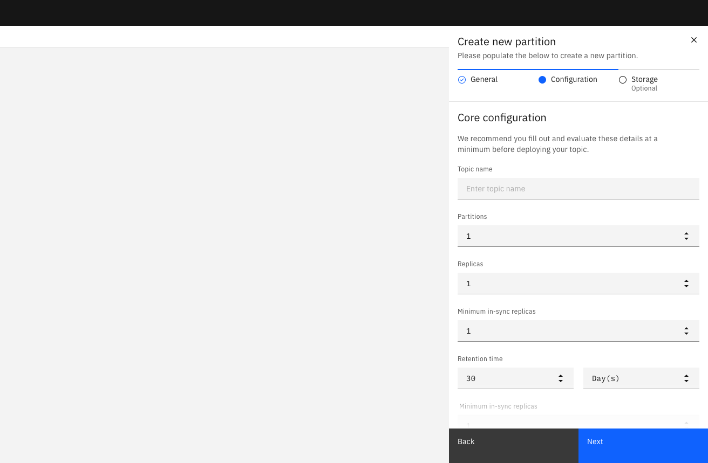

<Caption>Multistep side panel not in focus mode</Caption>

</Column>
</Row>

#### Anatomy

<Row>
<Column colLg={8}>

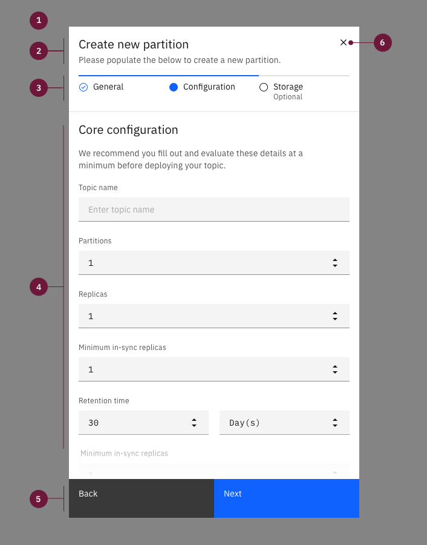

</Column>
</Row>

1. **Sidepanel size & optional overlay:** Slide-over sidepanel size option of
   320px or 480px. Optional screen overlay that obscures the on-page content.
2. **Create title:** Title line for the create flow with an optional subtitle.
   The title will usually be "New _asset type_".
3. **Progress indicator:** Horizontal progress indicator lets the user know what
   step they are on. Limit of three steps in the sidepanel option.
4. **Body:** Contains the information and/or controls needed to populate the
   task. It can include message text and components.
5. **Buttons:** The primary and secondary buttons are "Next" and "Back",
   respectively. The "Back" button will be disabled on the first step. The
   "Next" button will change to "Create _asset type_" on the last step of
   creation.
6. **Close button:** Closes the sidepanel and cancels the create action after
   user confirmation.

#### Alignment

<Row>
<Column colLg={8}>

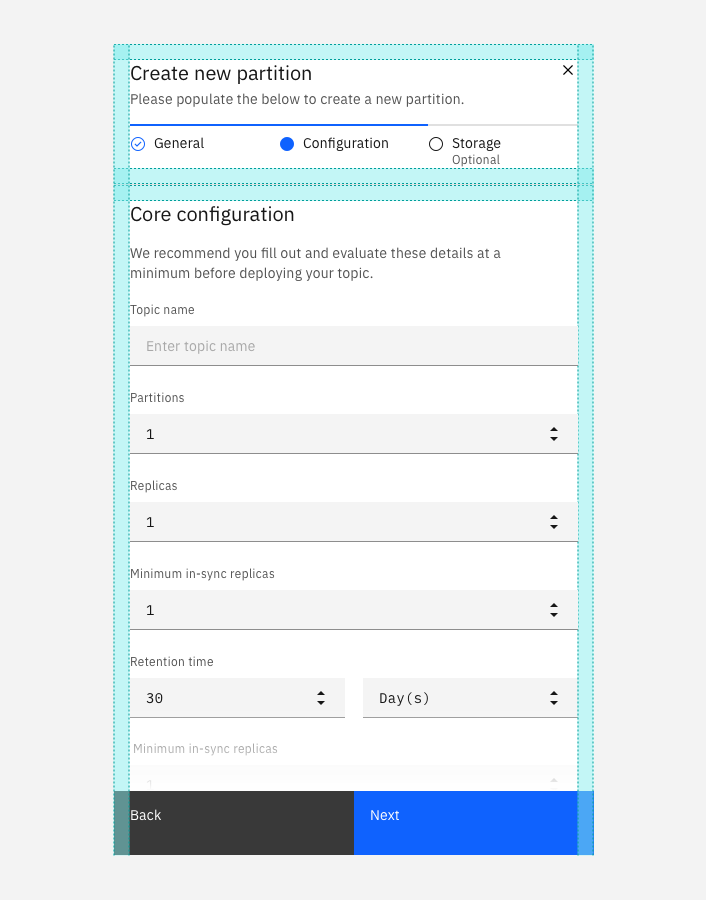

</Column>
</Row>

#### When to use

- The create flow has medium complexity, with two or three distinct steps
- The create flow benefits from keeping the page context in view
- There are no more than six fields in any of the steps

#### When not to use

- Complex create flows
- There are more than three distinct steps
- There is more than 2x scrolling in the sidepanel

#### Behaviors structure

When using the Slide-over Sidepanel, there is an option to either include or
exclude an overlay that extends over the entire left side of the screen.
Consider including the overlay when the top priority is maintaining the user's
focus on the creation. Exclude the overlay when it is helpful to the user in
completing the creation task to allow the context of the page to be visible or
partially visible.

## Tearsheet

### Anatomy

<Row>
<Column colLg={8}>

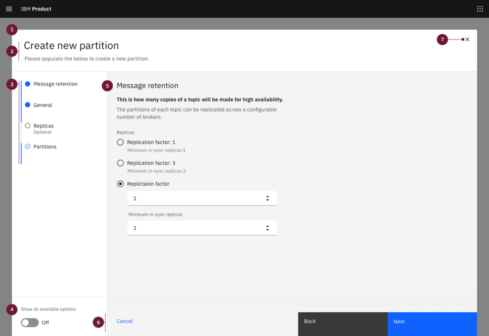

</Column>
</Row>

<Row>
<Column colLg={8}>

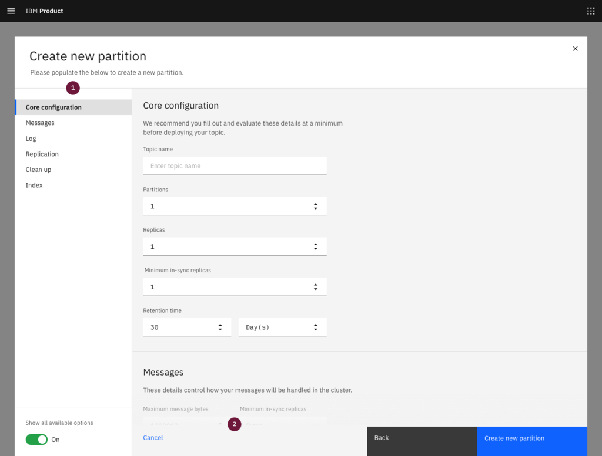

<Caption>Tearsheet anatomy with Show all available options on</Caption>

</Column>
</Row>

1. **Tearsheet & overlay:** Tearsheet component with screen overlay that
   obscures the on-page content.
2. **Create title:** Title line for the create flow with an optional subtitle.
   The title will usually be "New _asset type_".
3. **Progress indicator:** Vertical progress indicator lets the user know what
   step they are on.
4. **Toggle (Optional):** Optional toggle allows the user to view all available
   options in one scrolling page with anchor links.
5. **Body:** Contains the information and/or controls needed to populate the
   task. It can include message text and components.
6. **Buttons:** The primary, secondary, and ghost buttons are "Next", "Back" and
   "Cancel", respectively. The "Back" button will be disabled on the first step.
   The "Next" button will change to "Create _asset type_" on the last step of
   creation. "Cancel" closes the tearsheet and cancels the create action.
   Cancelling requires confirmation, as seen in the Creation section.
7. **Close button:** Closes the tearsheet and cancels the create action after
   user confirmation.

### Alignment

<Row>
<Column colLg={8}>

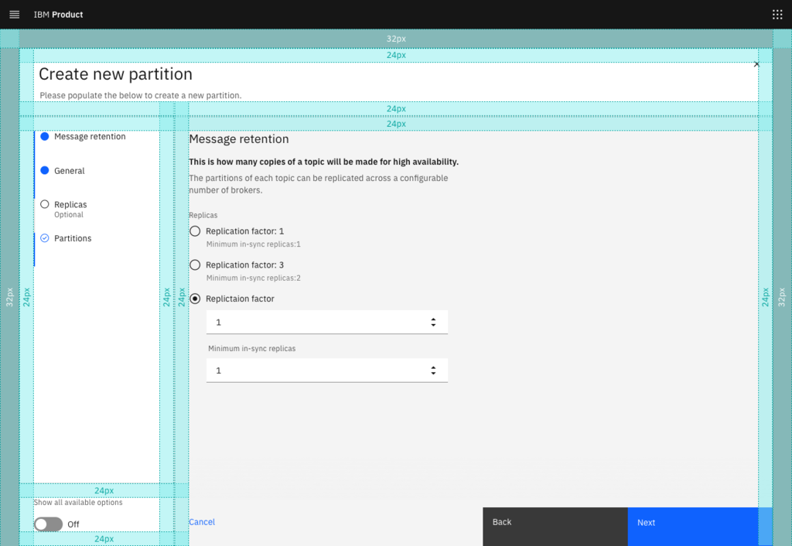

</Column>
</Row>

### When to use

- The create flow is complex, with two or more distinct steps.
- There are many form fields to be filled by the user.

### When not to use

- The create flow is low or medium complexity.
- There is only one step.

### Behaviors, structure and functionality

Tearsheet Create flows can include an optional Toggle to show all the steps on a
single scrolling page with anchor links. Toggling to "Show all available
options" will replace the progress indicator with the In-page navigation anchor
links.

<Row>
<Column colLg={8}>

<Caption>Image to come</Caption>

</Column>
</Row>

## Full page

<InlineNotification>
  The full page option is not a common use case and should not be confused with
  or used in place of the tearsheet.
</InlineNotification>

### Anatomy

<Row>
<Column colLg={8}>

<Caption>Image to come</Caption>

</Column>
</Row>

Page header

- Title: "New _object_" + optional subtitle
- Cancel button
- Next button that changes to Create button in final step
- Close (x) button
- Vertical progress indicator panel
- Toggle: Show all steps in one page (Optional)

### Alignment

<Row>
<Column colLg={8}>

<Caption>Image to come</Caption>

</Column>
</Row>

### When to use

In Cloud and Cognitive, the create flow is the process the user must complete in
order to use a product or service. In IBM Cloud public, it is the alternative to
the Provisioning flow for a non-billable service.

### When not to use

The product or service is usable before the current creation flow is initiated.

### Behaviours, structure, and functionality

Full page Create flows can include an optional Toggle to show all the steps on a
single scrolling page with anchor links. Toggling to "Show all available
options" will replace the progress indicator with the In-page navigation anchor
links.

<Row>
<Column colLg={8}>

<Caption>Image to come</Caption>

</Column>
</Row>

## Creation behaviors, structure and functionality

A create flow is usually started when the user clicks on a "New _object_"
button. The button text should typically include the type of asset. For example,
"New project" or "New user".

<Row>
<Column colLg={8}>

<Caption>Image to come</Caption>

</Column>
</Row>

The user then fills out a form, in any of the above formats, with one step or
multiple steps. With multiple steps, initially there are "Back" and "Next"
buttons, where "Back" is disabled in the first step. In the final step, the text
of the primary button changes from "Next" to "Create _object_".  Both "Next" and
"Create _object_" buttons should be disabled until the user has entered all
required fields.

<Row>
<Column colLg={8}>

<Caption>Image to come</Caption>

</Column>
</Row>

To prevent data loss, if the user cancels or closes out of the creation context,
show a cancel confirmation modal.

<Row>
<Column colLg={8}>

<Caption>Image to come</Caption>

</Column>
</Row>

When the user clicks "Create _object_" there should be an indication of loading
or submitting.

<Row>
<Column colLg={8}>

<Caption>Image to come</Caption>

</Column>
</Row>

Once the loading is complete, the user should see a success or error
notification

<Row>
<Column colLg={8}>

<Caption>Image to come</Caption>

</Column>
</Row>

## Create best practices

### Do

-
-

### Don't

-
-

## Other use cases

### Add

- While the Create and Add patterns are similar, and ideas can certainly be
  drawn from this pattern, it does not cover Add use cases.
- The Add pattern should be looked at and worked on separately.

### Edit

- Similarly, while there are similar concepts in both Create and Edit, this
  pattern does not cover Edit use cases.
- The Edit pattern should be looked at and worked on separately.

## Accessibility

Evaluate your pattern to ensure it meets
[accessibility standards](/guidelines/accessibility/overview) and guidelines,
and provide details of compliance. For example, “Users should be able to TAB
into the input field of the search box to begin typing and press ENTER to run
the search query.”

## Related

Which components did you use when building this pattern? Did you reference other
patterns? List them here. If necessary, clarify any differences between this
pattern and related patterns.

## References 

Help designers understand your process by explaining your rationale for the way
you implemented the pattern. Include any research, citations, books or articles
that you found helpful.

## Feedback 

Help us improve this pattern by providing feedback, asking questions, and
leaving any other comments on
[GitHub](https://github.com/carbon-design-system/carbon-website/issues/new?assignees=&labels=feedback&template=feedback.md).

## Sketch File

Provide a [Sketch file](https://www.sketch.com/docs/getting-started/) with any
symbols you've created in the development of this pattern.
