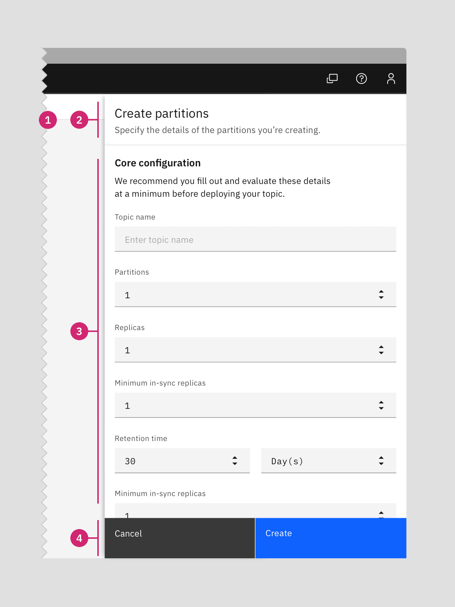
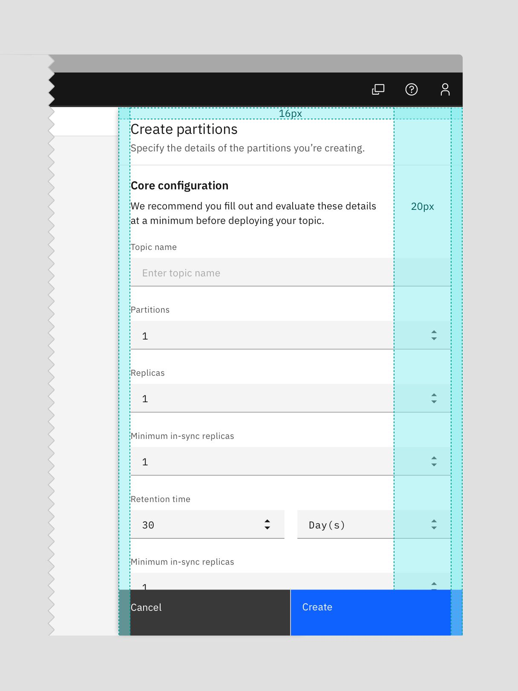
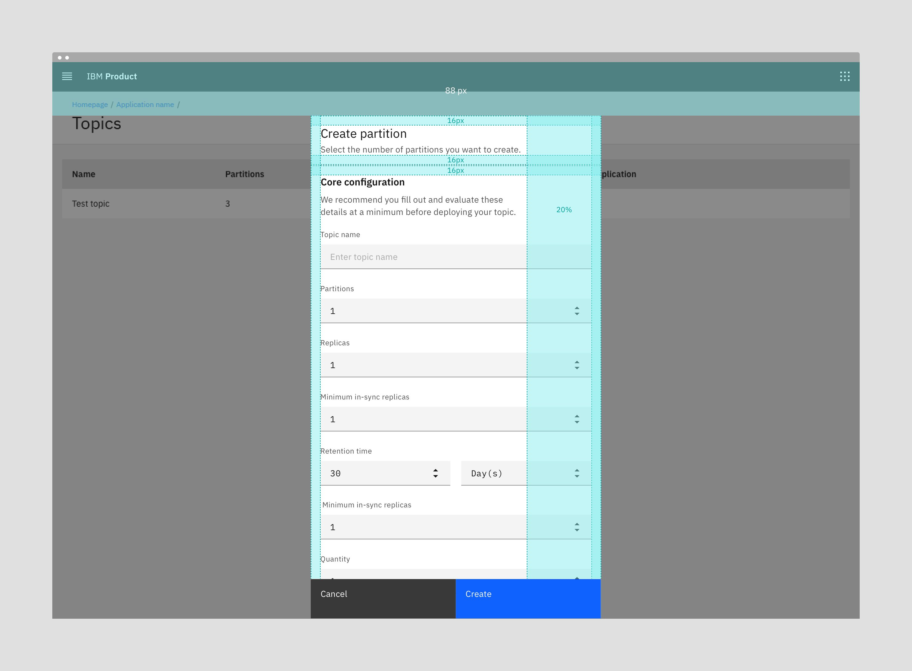
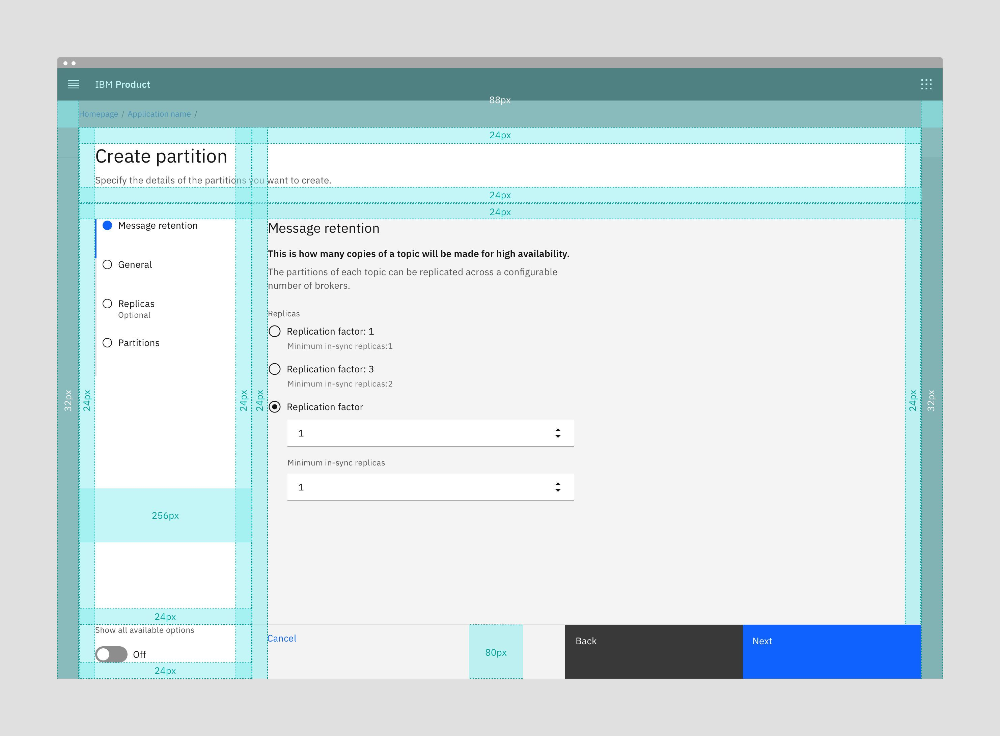

#### Maintainers:

[Andrew Smith](https://w3.ibm.com/bluepages/profile.html?uid=4G8681897),
[Andrea Garcia](https://w3.ibm.com/bluepages/profile.html?uid=4G0746897)

<PageDescription>

The Create pattern offers simple (single step) and complex (multistep)
variations in one of the following formats: Modal, Side panel, Narrow tearsheet,
Wide tearsheet, and Full page.

</PageDescription>

<AnchorLinks>
  <AnchorLink>Overview</AnchorLink>
  <AnchorLink>Inline creation</AnchorLink>
  <AnchorLink>Modal</AnchorLink>
  <AnchorLink>Side panel</AnchorLink>
  <AnchorLink>Narrow tearsheet</AnchorLink>
  <AnchorLink>Wide tearsheet</AnchorLink>
  <AnchorLink>Full page</AnchorLink>
  <AnchorLink>Designing with creation flows</AnchorLink>
  <AnchorLink>Related use cases</AnchorLink>
  <AnchorLink>Accessibility</AnchorLink>
  <AnchorLink>Related</AnchorLink>
</AnchorLinks>

## Overview

Users often need to create different types of assets, and they can have simple or
complex requirements.

To create is to generate a new resource. Creating is distinct from adding, but
the two are often confused. To add a resource is to include a resource that
already exists. Editing a resource is also different from creating a new one.
This pattern focuses on how to place the user in a flow when there's a need for
creating a new resource.

Do not use this pattern for [adding or editing a resource](#Related-use-cases).

| Type             | Usage                                                                                | Context                                          |
| ---------------- | ------------------------------------------------------------------------------------ | ------------------------------------------------ |
| Inline           | Use with quick, simple creations like that of an item.                               | On-page content can be seen and interacted with. |
| Modal            | Use with simple or transitional creations with no more than a couple of form fields. | On-page content is obscured.                     |
| Side-panel       | Use with medium complexity creations if the user needs page context.                 | On-page content can be seen and interacted with. |
| Narrow tearsheet | Use with medium complexity creations.                                                | On-page content is obscured.                     |
| Wide tearsheet   | Use with complex or interactive creations.                                           | On-page content is obscured.                     |
| Full page        | Use with creations that must be completed in order for a service to be usable.       | N/A                                              |

## Inline creation

#### When to use
With quick, simple creations like that of an item, it is usually preferred to
keep the flow inline. This is especially true when the user could benefit from
seeing context in the page while creating. The inline create pattern is under
construction, as it needs to account for many different use cases. Below is an
example of an inline creation.

#### When not to use
Another factor to consider with quick, simple creations is whether or not the
flow is transitional. Use a Modal if the user is being taken to a different page
than the one where they initiated the create. For example, if the newly created
asset is being opened or if the user is taken to a confirmation screen.

For complex creation flows, such as that of a large system object, use the
Narrow or Wide tearsheet variations for single or multistep options,
respectively.

<Row>
<Column colLg={8}>

<Caption>Example of an inline create</Caption> 
</Column>
</Row>

## Modal

#### When to use

- Use a modal for simple creations with one or two form fields to be filled out.
- Use for transitions when the user will be taken to a different page after
  creation.

#### When not to use a modal

- Don't use a modal in place of an inline create.
- Don't use a modal if there are more than four form fields or if there is
  scrolling inside the modal.

### Anatomy of a modal

<Row>
<Column colLg={8}>

</Column>
</Row>

1. **Modal size & overlay: **
   [Small Modal](https://www.carbondesignsystem.com/components/modal/style#small).
   Screen overlay that obscures the on-page content.
2. **Create title:** Title line for the create flow with an optional subtitle.
3. **Body:** Contains the information and/or controls needed to populate the
   task. It can include message text and components.
4. **Buttons:** The primary and secondary buttons are "Create" and "Cancel",
   respectively.

## Side panel

#### When to use

- Use a side panel when the user needs to have page context while populating the side panel.

#### When not to use

- Don't use when the flow has high complexity and the user would benefit from
  having a visible progress indicator.

### Anatomy of a side panel

<Row>
<Column colLg={8}>

</Column>
</Row>

1. **Panel size & non-focus state:** Side panel is 480px wide and has no
   overlay. This option supports a non-focus state execution. The user can
   create while still referencing on-page items.
2. **Create title:** Title line for the create flow with an optional subtitle.
3. **Body:** Contains the information and/or controls needed to populate the
   task. It can include message text and components.
4. **Buttons:** The primary and secondary buttons are "Create" and "Cancel",
   respectively.

### Alignment

<Row>
<Column colLg={8}>

</Column>
</Row>

## Narrow tearsheet

#### When to use

- Use a narrow tearsheet as an alternative to a modal when there is scrolling.
- Use when the form fields can be broken down into sections using section headers.

#### When not to use

- Don't use if the flow has high complexity and the user would
  benefit from having a visible progress indicator.

### Anatomy of a tearsheet

<Row>
<Column colLg={8}>

</Column>
</Row>

1. **Tearsheet & overlay**: Narrow tearsheet component with screen overlay that
   obscures the on-page content.
2. **Create title**: Title line for the create flow with an optional subtitle.
3. **Body**: Contains the information and/or controls needed to populate the
   task. It can include message text and components.
4. **Buttons**: The primary and secondary buttons are "Create" and "Cancel",
   respectively.

### Alignment

<Row>
<Column colLg={8}>

</Column>
</Row>

## Wide tearsheet

#### When to use

- Use a wide tearsheet with creations that have two or more distinct steps.
- Omit the progress indicator to use with single step creations that require
  more space, such as those with interactive selections, diagrams, or tables.

#### When not to use

- Don't use the wide tearsheet for low complexity create flows with only one
  step.

### Anatomy of a wide tearsheet

<Row>
<Column colLg={8}>

</Column>
</Row>

1. **Tearsheet & overlay**: Wide tearsheet component with screen overlay that
   obscures the on-page content.
2. **Create title**: Title line for the create flow with an optional subtitle.
3. **Progress indicator**: Vertical progress indicator lets the user know what
   step they are on. The default left panel width is 256px. An option of 320px
   wide is available for use cases where step labels are very long.
4. **Toggle (Optional)**: Optional toggle allows the user to view all available
   options in one scrolling page with anchor links.
5. **Body**: Contains the information and/or controls needed to populate the
   task. It can include message text and components.
6. **Buttons**: The primary, secondary, and ghost buttons are "Next", "Back" and
   "Cancel", respectively. The "Back" button will be disabled on the first step.
   The "Next" button will change to "Create" on the last step of creation.
   "Cancel" closes the tearsheet and cancels the create action.

### Alignment

<Row>
<Column colLg={8}>

</Column>
</Row>

<InlineNotification>
  Coming soon from Carbon, 80px tall fluid buttons will be the new standard
  replacing the 64px fluid buttons in the bottom sticky footer. Image reference
  below.
</InlineNotification>

<Row>
<Column colLg={8}>

<Caption>Upcoming 80px fluid button height in the wide tearsheet</Caption>
</Column>
</Row>

<Row>
<Column colLg={8}>

<Caption>Alternative left panel width of 320px</Caption>

</Column>
</Row>

### Behaviors

<Row>
<Column colLg={8}>

<Caption>Animated illustration of the Create flow in a Wide tearsheet</Caption> 
</Column>
</Row>

Wide tearsheet create flows can include an optional toggle to show all the steps
on a single scrolling page with anchor links. Toggling to "Show all available
options" will replace the progress indicator with the In-page navigation anchor
links. Depending on your use case, you may choose to persist the toggle to show
all options for a particular Create flow if it will enhance the user experience.

<Row>
<Column colLg={8}>

<Caption>Toggle view - show all available options</Caption>

</Column>
</Row>

1. **In-page navigation**: Side panel switches from progress indicator steps to
   In-page navigation anchor links that scroll the form content to the
   corresponding section.
2. **Toggle**: The toggle switches to the "On" position when the user clicks on
   it.
3. **Footer & scrolling**: The button footer is sticky and has a dividing line
   on top. The form content appears from underneath the sticky footer. There is
   no gradient.

<Row>
<Column colLg={8}>

<Caption>Animated illustration of the "Show all available options" toggle behavior</Caption>
</Column>
</Row>

If the user toggles off the advanced options and there could be destructive
consequences, show a modal alerting them that the changes won't be saved.

<Row>
<Column colLg={8}>

<Caption>Toggle view - hide all available options warning modal (when needed)</Caption>
</Column>
</Row>

## Full page

<InlineNotification>
  The full page option is not a common use case and should not be confused with
  or used in place of the Wide tearsheet.
</InlineNotification>

#### When to use

- In Cloud and Cognitive, the Full page create flow is the process the user must
  complete in order to use a product or service.
- In IBM Cloud public, it is the alternative to the Provisioning flow for a
  non-billable service.

#### When not to use

- Don't use the Full page option when the product or service is usable before
  the current creation flow is initiated.
- For IBM Public Cloud, do not use this when provisioning a service directly
  from the Catalog, or when creating a non-billable resource that could happen
  in a side panel/in context.

### Anatomy of a full page

<Row>
<Column colLg={8}>

</Column>
</Row>

1. **Breadcrumbs (optional)**: Use location-based breadcrumbs when appropriate.
2. **Page title**: The page title will not necessarily be "Create `asset type`".
3. **Create title**: This title will usually be "Create `asset type`".
4. **Progress indicator**: Vertical progress indicator lets the user know what
   step they are on. The default left panel width is 256px. An option of 320px
   wide is available for use cases where step labels are very long.
5. **Body**: Contains the information and/or controls needed to populate the
   task. It can include message text and components.
6. **Toggle (optional)**: Optional toggle allows the user to view all available
   options in one scrolling page with anchor links.
7. **Buttons**: The primary, secondary, and ghost buttons are 64px tall fluid
   buttons. They are "Next", "Back", and "Cancel", respectively. The "Back"
   button will be disabled on the first step. The "Next" button will change to
   "Create" on the last step of creation. "Cancel" takes the user to the
   previous page and cancels the create action.

### Alignment

<Row>
<Column colLg={8}>

</Column>
</Row>

<InlineNotification>
  Coming soon from Carbon, 80px tall fluid buttons will be the new standard
  replacing the 64px fluid buttons in the bottom sticky footer. Image reference
  below.
</InlineNotification>

<Row>
<Column colLg={8}>

<Caption>Upcoming 80px fluid button height in the Full page flow</Caption>
</Column>
</Row>

### Optional toggle

Full page create flows can include an optional toggle to show all the steps on a
single scrolling page with anchor links. Toggling to "Show all available
options" will replace the progress indicator with the In-page navigation anchor
links.

### Leaving the Create flow

Full page create flows can be exited not only by clicking on "Cancel", but also
by navigating away by clicking on breadcrumbs or other page navigation. When the
user tries to exit the Create flow by any means other than explicitly clicking on
the word "Cancel", we must show a confirmation modal.

<Row>
<Column colLg={8}>

<Caption>With Full page flows, show a confirmation modal when the user navigates away.</Caption>
</Column>
</Row>

## Designing with creation flows

### Behaviors

#### Triggers

A create flow is usually started when the user clicks on a "New `asset type`"
button. The button text should include the type of asset and a plus icon. For
example, "New project" or "New user". In many cases the button will be primary.
However, there should be only one primary button in any page section. When there
is already a primary button, a tertiary or ghost button should be used. Today,
guidance around button types does not specify when to use tertiary versus ghost
buttons. This guideline will be updated as we get more clarity.

After clicking on the new button, the user then fills out a form in one of the
above formats with one step or multiple steps. With multiple steps, the "Back"
button is disabled in the first step. In the last step, the text of the primary
button changes from "Next" to "Create". The "Next" and "Create" buttons should
be disabled until the user has entered all required fields.

#### Dismissing flows

The Modal, Side panel, Narrow tearsheet and Wide tearsheet components in a
create flow will not have a close icon in the top right. This is to enforce the
user's decision to exit the create flow by clicking on the word "Cancel".

#### Flow completion & loading

When the user clicks "Create" there should be an indication of loading or
submitting. See Carbon's
[Loading](https://www.carbondesignsystem.com/patterns/loading-pattern#loading-indicators)
pattern. Also, see specific guidance for
[loading in the Modal component](https://www.carbondesignsystem.com/components/modal/usage#loading).
Once the loading is complete, the user should see a success or error
notification. For success, one option is to open the newly created asset or the
asset's details page. When the user stays on the same page, show a success
banner notification. For errors, you must show an
[error notification](https://www.carbondesignsystem.com/components/notification/usage/).

## Related use cases

### Add

- While the Create and Add patterns are similar, and ideas can certainly be
  drawn from this pattern, it does not cover Add use cases.
- The Add pattern should be looked at and worked on separately.

### Edit

- Similarly, while there are similar concepts in both Create and Edit, this
  pattern does not cover Edit use cases.
- The Edit pattern should be looked at and worked on separately.

## Accessibility

Follows accessibility guidelines for
[Modal](https://www.carbondesignsystem.com/components/modal/accessibility), Side
panel, Narrow tearsheet, Wide tearsheet,
[Forms](https://www.carbondesignsystem.com/patterns/forms-pattern#accessibility),
and
[Progress indicator](https://www.carbondesignsystem.com/components/progress-indicator/accessibility).

## Related

- [Modal](https://www.carbondesignsystem.com/components/modal/usage/)
- [Tearsheet](https://pages.github.ibm.com/cdai-design/pal/components/tearsheet/usage/)
- [Form](https://www.carbondesignsystem.com/patterns/forms-pattern/)
- [Toggle](https://www.carbondesignsystem.com/components/toggle/usage)
- [Page header](https://pages.github.ibm.com/cdai-design/pal/components/page-header/usage)
- [Progress indicator](https://www.carbondesignsystem.com/components/progress-indicator/usage)

## Feedback 

Help us improve this pattern by providing feedback, asking questions, and
leaving any other comments on
[GitHub](https://github.com/carbon-design-system/carbon-website/issues/new?assignees=&labels=feedback&template=feedback.md).
