#### Maintainers:

Carbon for Cloud & Cognitive Design system adoption guild -
[#ccs-pal](https://ibm-casdesign.slack.com/archives/CQGR0HC05) on Slack

## Overview

To edit is to change values or data. Users often need to edit different types of
assets, and they can have simple or complex requirements. This pattern focuses
on how to place the user in a flow when there's a need for editing an existing
asset.

<Row className="image-card-group">

<Column colMd={3} colLg={3} noGutterSm>

<ImageCard 
sub-title="Inline edit"
sub-titleColor="dark"
aspectRatio="4:3"
hoverColor="dark"
href="#inline-edit">

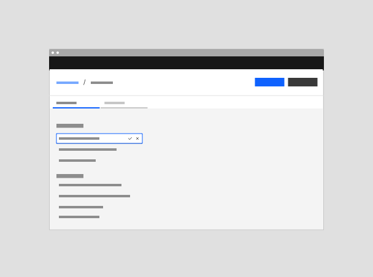

</ImageCard>

<ImageCard
sub-title="Narrow tearsheet edit"
sub-titleColor="dark"
aspectRatio="4:3"
hoverColor="dark"
href="#narrow-tearsheet">

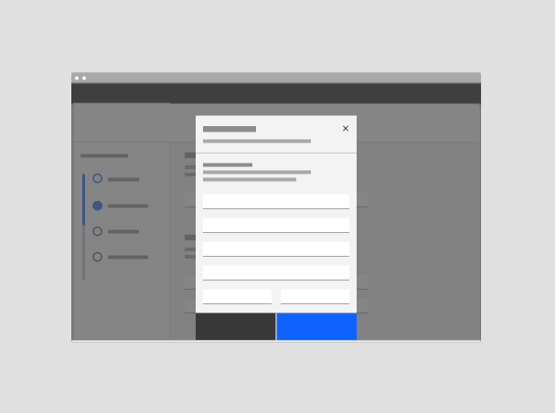

</ImageCard>

</Column>

<Column colMd={3} colLg={3} noGutterSm>

<ImageCard 
sub-title="Modal edit"
sub-titleColor="dark"
aspectRatio="4:3"
hoverColor="dark"
href="#modal-edit">

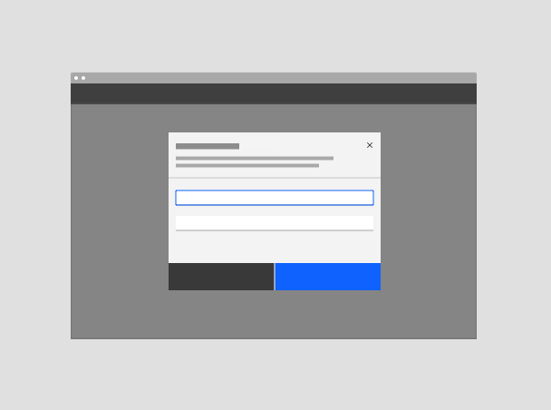

</ImageCard>

<ImageCard
sub-title="Wide tearsheet edit"
sub-titleColor="dark"
aspectRatio="4:3"
hoverColor="dark"
href="#wide-tearsheet-edit">

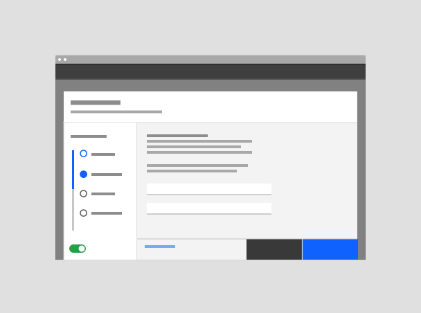

</ImageCard>

</Column>

<Column colMd={3} colLg={3} noGutterSm>

<ImageCard
sub-title="Side panel edit"
sub-titleColor="dark"
aspectRatio="4:3"
hoverColor="dark"
href="#side-panel-edit">

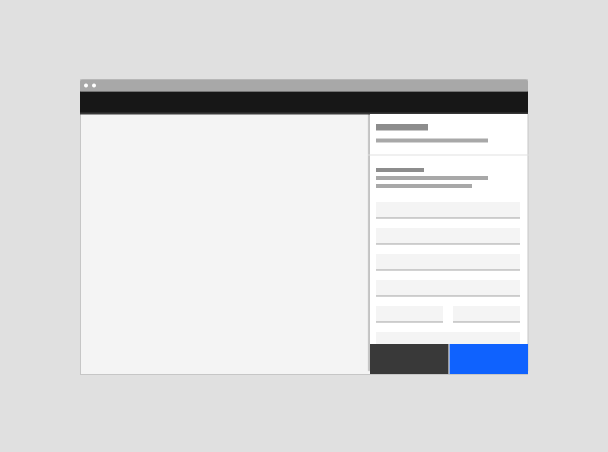

</ImageCard>

<ImageCard
sub-title="Full page edit"
sub-titleColor="dark"
aspectRatio="4:3"
hoverColor="dark"
href="#full-page-edit">

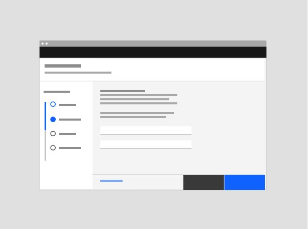

</ImageCard>

</Column>

</Row>

#### Deciding what to use

Choose the flow depending on the number, impact and intent of edits made.  
Refer to [Behaviors](#behaviors) and [Best practices](#best-practices).

| Type                                           | Usage                                                                                                                             | Context                                          |
| ---------------------------------------------- | --------------------------------------------------------------------------------------------------------------------------------- | ------------------------------------------------ |
| [Inline edit](#inline-edit)                    | Use with quick, simple edits of individual fields.                                                                                | On-page content can be seen and interacted with. |
| [Modal edit](#modal-edit)                      | Use with simple or transitional edits of no more than a couple of form fields.                                                    | On-page content is obscured.                     |
| [Edit in side panel](#side-panel-edit)         | Use with medium complexity edits if the user needs page context.                                                                  | On-page content can be seen.                     |
| [Edit in tearsheets](#tearsheet-edit)          | Use with medium to complex edits.                                                                                                 | On-page content is obscured.                     |
| [Full-page or takeover edits](#full-page-edit) | Use with edits to a usable service.                                                                                               | N/A                                              |
| [Other edit behaviors](#other-edit-behaviours) | UI components with their own edit interaction patterns such as cards, dashboards, data tables, text editors and property editors. | N/A                                              |

## Inline edit

### When to use

Use this pattern when:

- The user needs to make quick, simple edits of disparate fields

### When not to use

Do not use when:

- The user will likely make many changes at a time (instead, use a pattern that
  enables them to make several edits before committing the changes as a group)
- The change will affect another setting

## Modal edit

### When to use

- Use a modal for simple edits with one or two form fields to be filled out.

- For example, use this pattern when: Summary in panel (read only) clicking edit
  opens edit modal (only for edits with 1-2 form fields).

### When not to use

- Don’t use a modal in place of an inline editing.
- Don’t use a modal if the content is being "edited" frequently
- Don’t use a modal if there are more than three form fields or if there is
  scrolling inside the modal.

## Side panel edit

### When to use

### When not to use

## Tearsheet edit

### Narrow tearsheet

1. Header - can include title, description, labels, and tabs.
2. Main content area
3. Navigation buttons
4. Background overlay (same as modals)

Always use "Edit" in the title.

#### When to use

- The original create flow was in a narrow tear sheet
- There are enough edits to require scrolling
- The content is more complex than what is allowed in a modal

#### When not to use

- The task is too small to warrant the tear sheet - i.e., only one field needs
  to be edited - consider using an inline edit
- The user needs to interact with, compare, or have full view of the rest of the
  screen's content - use a side panel instead
- Input is required before a user can proceed - use a modal instead
- If there is a large amount of editable content or complex/multi -step
  interactions needed, use a large tear sheet or side panel instead

### Wide tearsheet edit

1. Header - can include title, description, labels, and tabs.
2. Main content area
3. Navigation buttons - up to 4 may be used - 1 primary, 2 secondary, 1 tertiary
4. Influencer (optional) - a left or right side panel that can be used, for
   example,  as a menu, progress indicator, or filter. QUESTION FROM SHELLEY: I
   thought we landed on no steps in the side panel (or steps only as an
   exception if the resource requires it)...instead it would be tertiary nav so
   we don't force the user through steps if what they want to edit is on step 3,
   for example. Might be helpful to show the example of the tearsheet with
   tertiary nav.
5. Background overlay (same as modals)

Use "Edit" in title...

#### When to use

- When the create flow happened in a tear sheet
- When a subset of the related item will be edited
- You want to keep the user in context instead of taking the user to a new page
- The amount of content is too much for a modal or narrow tear sheet
- the content is too complex for a modal or narrow tear sheet
- if the space to edit in the original location is too restricted (i.e. in a
  narrow side panel), a tear sheet can provide more area to work

#### When not to use

- The edit actions are few/ simple: consider using a Modal instead

## Full page edit

### When to use

- If created in full page, use wide tearsheet for editing (since the resource
  exists and it will look closer to the create flow?)
- Not prescriptive - just another option regardless of create flow when you want
  to submit multiple changes at once. If a full static page needs to toggle into
  edit mode. (only edit tearsheet if don't show all details)
- The main value of the object is its settings and it needs a "home" (i.e. its
  own page), but having an extra view of all the settings in a static/uneditable
  view is overkill. In this case, the page always shows the settings in editable
  mode, and the save/cancel buttons are shown in a disabled state until a change
  is detected.
- Editing is done using the draft flow. Need to add a link/reference to the
  draft flow documentation

### When not to use

Do not use this pattern when:

- Users will want to be able to skim the settings of an object (seeing it in a
  static view is important)
- Create flow used a side panel or modal.

## Other edit behaviors

Some components have their own distinct edit behaviors.

<Row className="image-card-group">

<Column colMd={3} colLg={3} noGutterSm>

<ImageCard 
sub-title="Component: Dashboard edit"
sub-titleColor="dark"
aspectRatio="4:3"
hoverColor="dark"
href="#dashboards">

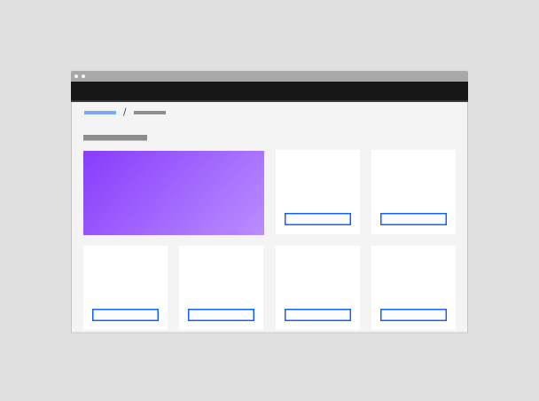

</ImageCard>

<ImageCard
sub-title="Component: Text editor"
sub-titleColor="dark"
aspectRatio="4:3"
hoverColor="dark"
href="#text-editors">

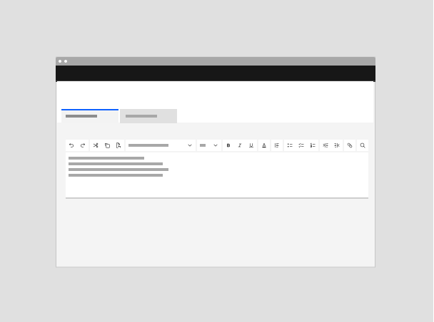

</ImageCard>

</Column>

<Column colMd={3} colLg={3} noGutterSm>

<ImageCard 
sub-title="Component: Card edit"
sub-titleColor="dark"
aspectRatio="4:3"
hoverColor="dark"
href="#cards">

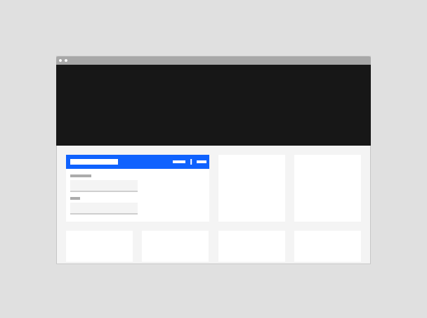

</ImageCard>

<ImageCard
sub-title="Component: Property editor"
sub-titleColor="dark"
aspectRatio="4:3"
hoverColor="dark"
href="#property-editors">

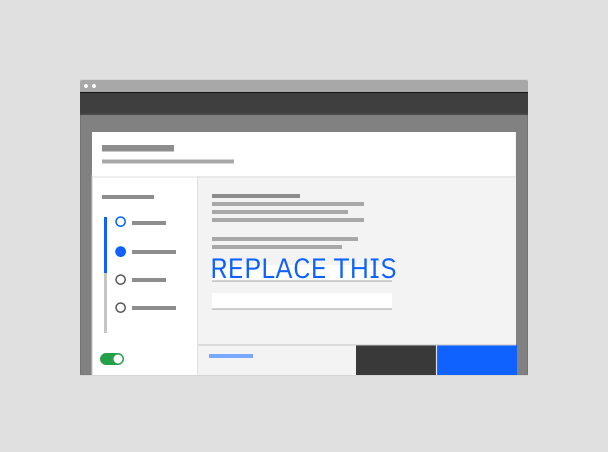

</ImageCard>

</Column>

<Column colMd={3} colLg={3} noGutterSm>

<ImageCard
sub-title="Component: Data table edit"
sub-titleColor="dark"
aspectRatio="4:3"
hoverColor="dark"
href="#data-tables">

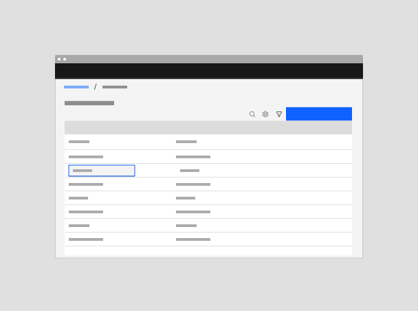

</ImageCard>

</Column>

</Row>

### Dashboards

### Cards

Editable cards allow a user to view, modify, and save the content contained
within the card. These cards are generally used in instances where a user needs
to make changes to a resource instances (ex. configuration details), account
plan, etc. Editable cards allow a user to edit something within context.

#### Cards - simple edits

For simple edits such as changing the name of a object, editable cards can be
used. Edit mode is triggered by clicking on the edit button (left card,
top-right). When in edit mode (right card) highlight what is editable with
active inline inputs and disable what is not. Note: Your card height might vary
if you don’t use inline inputs when the user toggles the edit mode on/off.

#### Cards - complex edits

In instances where a user needs to make multiple edits and the changes made to a
card can’t be contained in place and/or have high-impact (ex: dependencies or
plan/cost change) use the side panel to display all fields that can be edited
and needed information.

### Data tables

### Text editors

### Property editors

## Optional extras

<Row className="image-card-group">

<Column colMd={3} colLg={3} noGutterSm>

<ImageCard 
sub-title="Summary of changes"
sub-titleColor="dark"
aspectRatio="4:3"
hoverColor="dark"
href="#summary-of-changes">

</ImageCard>

<ImageCard
sub-title="Undo"
sub-titleColor="dark"
aspectRatio="4:3"
hoverColor="dark"
href="#undo">

</ImageCard>

</Column>

<Column colMd={3} colLg={3} noGutterSm>

<ImageCard
sub-title="Preview of changes"
sub-titleColor="dark"
aspectRatio="4:3"
hoverColor="dark"
href="#preview-of-changes">

</ImageCard>

<ImageCard
sub-title="Success messages"
sub-titleColor="dark"
aspectRatio="4:3"
hoverColor="dark"
href="#success-messages">

</ImageCard>

</Column>

<Column colMd={3} colLg={3} noGutterSm>

<ImageCard 
sub-title="Warnings"
sub-titleColor="dark"
aspectRatio="4:3"
hoverColor="dark"
href="#warnings">

</ImageCard>

<ImageCard
sub-title="Errors"
sub-titleColor="dark"
aspectRatio="4:3"
hoverColor="dark"
href="#errors">

</ImageCard>

</Column>

</Row>

### Summary of changes

Consider adding a summary of the changes for users to review before saving if
there is a chance a user could lose track of the edits they made, for example in
long forms . The summary can be used to: provide an overview of all the changes
made  explain to the user what they should expect as consequence of their edit 
Notify and warn users of high severity edits (link to Warnings section)

The summary of changes can be presented as  A) A modal or tearsheet. This is
best used for explaining the consequences of the edits to the users as well as
high severity edit warnings. Consider including an explanation of the edits  B)
A right side panel listing the changes that the user is making. This is best
used with full screen or tearsheet editing.

### Preview of changes

A preview of the effect of the changes  would be helpful if the changes  done
are going to be applied to something else. (e.g a dashboard, widget or different
component) and they cannot be applied real-time.  The preview step could include
a summary of changes as well. (link to changes summary)

### Warnings

Notify and warn users if saving the edits made will have an impact in other
areas or will make changes elsewhere.  Inform the user if their changes or edits
cannot be undone. (link to undo section) Consider the level of severity of the
edits to make sure the users are warned and aware of the consequence of the
changes they made:

Low severity edits:  Changes that are only to a non-functional values and that
don't have impacts on other areas are considered low severity edits.  For low
severity edits, the "always editable" or "batch edit"  patterns can be used
(link to the patterns) Don't show a warning model for low severity edits

High severity edits If behaviors, assets, components, workflows of the editor,
or other people in the organization or the customer experience, will need to
change because of the edits it is considered high severity edits. Changes that
might trigger needing to edit something else are also considered high severity
edits.  High severity edit confirmation buttons should use the danger button.

#### Low severity edits

#### High severity edits

### Undo

Consider how the edits fits in the undo stack. Reverting changes should make
sense with the editing mode and variation (link to edit modes section) if fields
are always editable, users should be able to undo each step or element If there
is an "edit mode", consider allowing the user to undo specific element changes
in addition to the an overall undo after the user saves changes that would
revert all of the changes made.  For edit mode interactions consider providing 
the option to clear all change made which would revert the changes back to when
they first initiated edit mode.

### Success messages

An optional success notification can be used to confirm that the user’s changes
have been saved. Consider confirmation notifications especially if users will be
leaving the edit mode, or exiting an edit modal, tearsheet or view  would be
losing the view of the changes they made. For inline edits or automatic saving a
notification is not recommended to avoid excessive notifications noise, as long
as there is obvious visual feedback that the changes have been applied.
Additionally make sure to notify users if the "save changes" operation fails
(link to the errors)

If saving the changes is an operation that will take time to process consider
including the confirmation notification in the notification centre. For
confirmation notifications follow Carbon's notifications guidelines as well as
the notifications pattern

### Errors

As the users are making edits, show immediate feedback about their changes as
much as possible. Show inline errors when applicable, following validation and
error pattern guidance.  Try to highlight errors that have dependents as early
as possible.

In the case that the "save changes" operation fails:

- Bring users back to the "edit" page (This could potentially be through an
  "error saving" notification)
- Try to retain users' work and changes as much as possible. Consider auto
  saving as draft especially if there are a lot of changes made. (link to
  versioning/drafts section)

## Designing with edit flows

### Behaviors

#### Edit mode

If the user intent includes viewing without editing, provide a read-only state
and reveal editable fields when users click an "edit" button.

| Type               | Interaction                                                                 | When to use                                                                                                                    |
| ------------------ | --------------------------------------------------------------------------- | ------------------------------------------------------------------------------------------------------------------------------ |
| Active "edit mode" | Editable fields become available only after a user clicks an "edit" button. | Use when users' intent may be to review rather than change data or values. Use when editing will disrupt user or system tasks. |
| Always editable    | Fields that can be changed always appear editable.                          | Use when users main goal is to change data rather than review data.                                                            |

<Row>
  <Column colMd={4} colLg={4}>

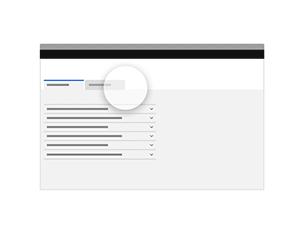

<Caption>
  {' '}
  With an "edit mode", editable fields become available after the user clicks an
  "edit" button.
</Caption>

  </Column>
    <Column colMd={4} colLg={4}>

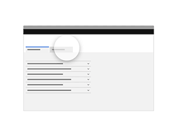

<Caption>
  {' '}
  Without an edit mode, fields that can be changed always appear in the editable
  state.{' '}
</Caption>

  </Column>
</Row>

#### Save mode

Review the guidance in the
[saving pattern](https://pages.github.ibm.com/cdai-design/pal/patterns/saving/usage).

| Type                          | Interaction                                                                                                | When to use                                                                                                                                                                             |
| ----------------------------- | ---------------------------------------------------------------------------------------------------------- | --------------------------------------------------------------------------------------------------------------------------------------------------------------------------------------- |
| Active save                   | User clicks a "save" button to confirm the edits they have made to data or values.                         | Use when edits will disrupt user or system tasks. Use when batch edits to multiple values are made.                                                                                     |
| Auto save by interval         | System saves changes periodically without user action. Visual cues inform the user that changes are saved. | Use to prevent loss in case of error. Use when users are likely to remain in an "edit" flow for prolonged periods of time. Use when application of changes does not disrupt the system. |
| Auto save on leaving a field  | System saves the changes to each field after the user makes an edit.                                       | Use when the intent is to edit one or very few fields.                                                                                                                                  |

#### Severity

Edits that have a wider impact on the system or user experience should use
[warnings](#warnings) to inform the user of the consequence of their edits.

### Best practices

**Do: Title pages with "Edit (object)" so that users know what their actions
are.**  
Explicit IA lets us use succinct button terms such as "Save" or "Cancel".

**Do: Use the same behavior as when the resource is created.**  
Where the number of editable values is significantly smaller or larger than
during creation, or the context of current settings is required, use a different
behavior to when the resource is created.

**Do: Use a variation that is best for the number of editable (or likely to be
edited) values.**  
Some variations (modal, inline editing) are best used when few values are
editable. Consider how many values a user is likely to edit in each interaction.

**Do: Provide the data in a read-only format if the user's intent is often to
view rather than edit.**  
Consider using an "edit" button to reveal the edit form. See
[edit mode](#edit-mode).

**Do: Provide users feedback**  
Alert users when saving changes fails. If possible retain their work and allow
the user to try saving again.

**Do: Provide any context needed for a user to make edits to a value.** 
Consider side panel or inline editing so that the user can continue to see the
page context.

**Do: Inform users of the consequence of their edits, whether to other editable
values or to the system as a whole.**  
Use steps, validation and progressive disclosure to help users avoid error. When
editing a resource affects system availability, use warnings, messages and
notifications if necessary to inform the user.

**Do: Default users to the non-stepped view of a multiple-step flow when they
edit unless edits can only be made sequentially.**

## Related use cases

See Add  
See Create  
Versioning doesn't exist yet, but probably should.

## Terminology

Refer to the
[Cloud & Cognitive glossary of terms](https://pages.github.ibm.com/cdai-design/pal/content/terminology/approved-terms).

**Edit:** Allows data or values to be changed.  
_Avoid "Configure", "Change" etc._

**Create new version:** Allows a new object to be created from the configuration
of an existing object. The user can edit the configuration before the object is
created.  
_If changes are applied to the creation of a new object (not the current object)
avoid using "edit" terminology. Instead, use "Create new version" or "Duplicate"
followed by "Edit".  Avoid "Save as"._

**Save:** Saves pending changes to a file, document or UI component.  
_Avoid "Apply changes" and "Finish".  Do not use "Done", "Commit", "OK", or
"Update"._

**Cancel:** Stops the current action and closes the dialog.  
_Avoid "Discard", "Clear", "Remove", "Reset", "Revert". Title pages/dialogs
"Edit (object) (object name)" so that "the object "changes" does not need to be
combined with the action "Cancel changes"._

**Undo:** Reverts to the state before the most recent changes made by the
user.  
_Avoid "Restore", "Revert"._

## Accessibility

## Related
