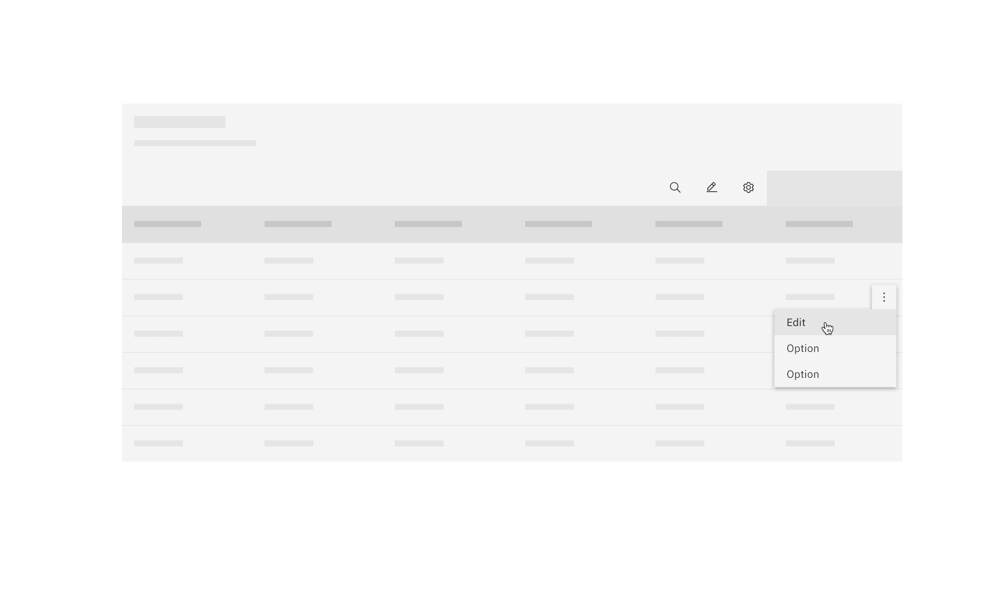
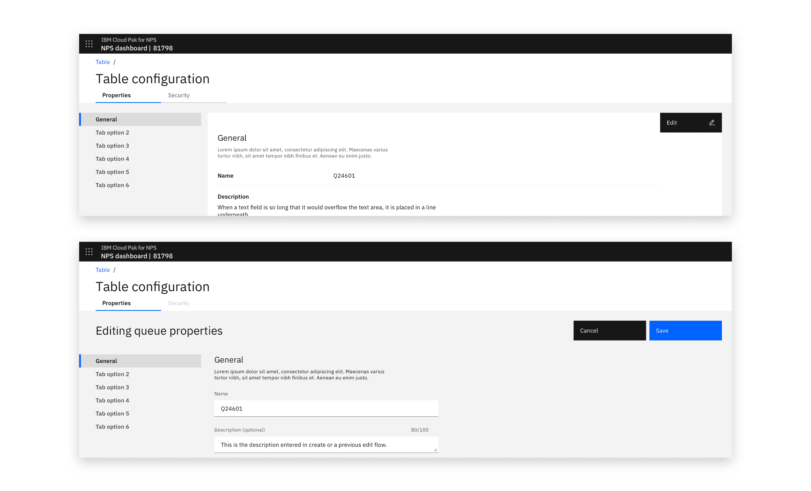
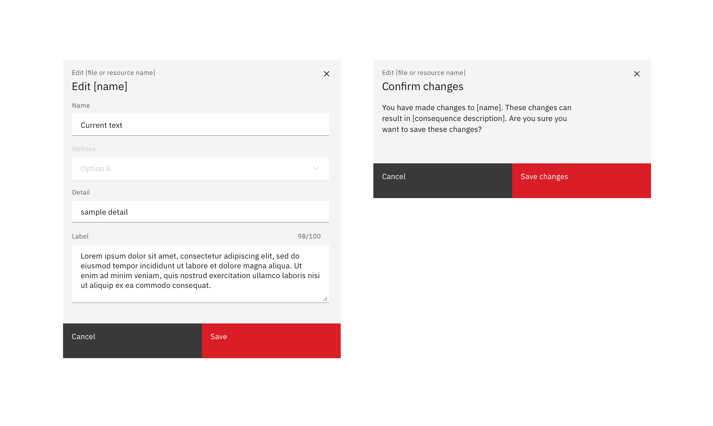
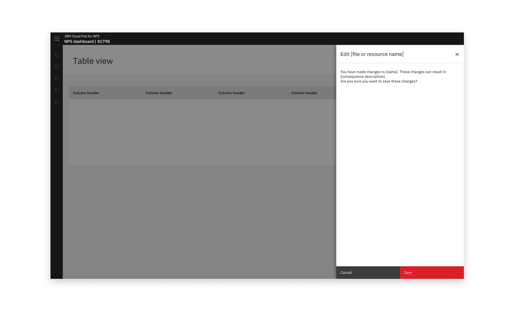
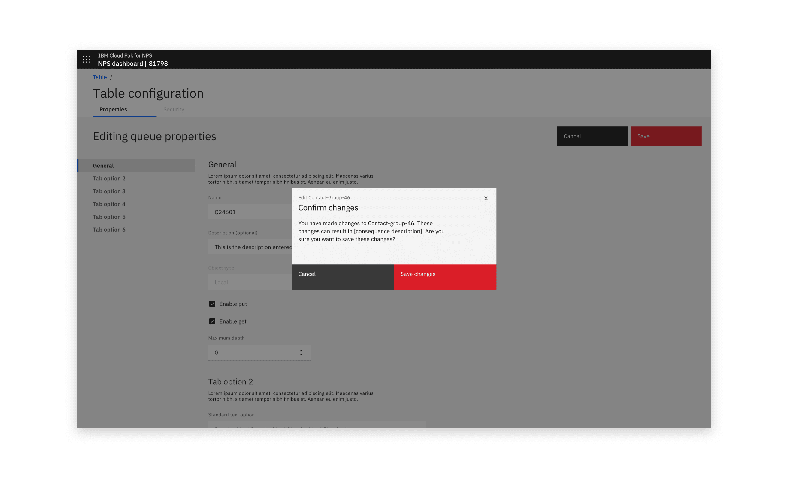
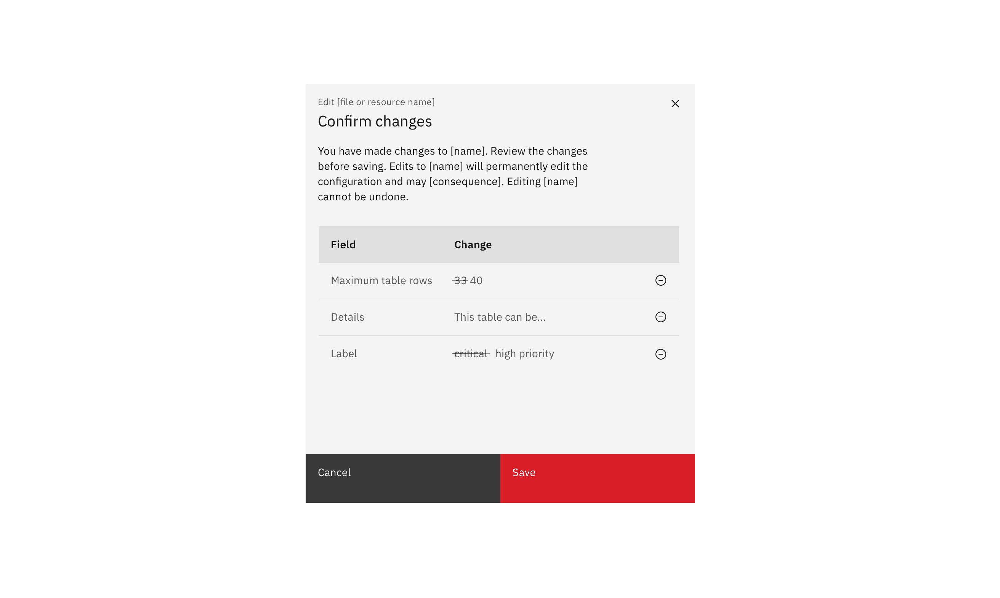
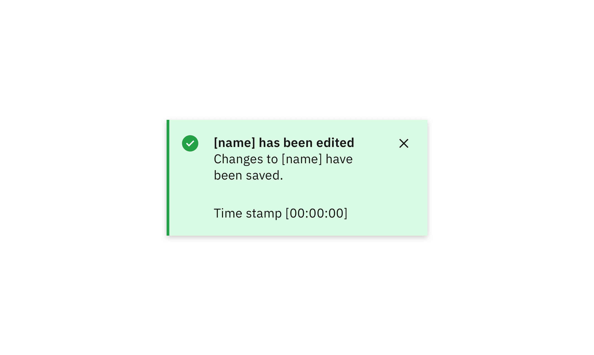

#### Maintainers:

[Vikki Paterson](https://github.com/vikkipaterson),
[Chloe Poulter](https://github.com/chloepoulterdesign)

<PageDescription>

Editing is making changes to a resource that already exists in the system.
Updating and editing should use the same behavior as when the resource is
created. This should only vary in situations where the number of editable fields
is significantly smaller or larger than during creation, or the context of
current settings is required.

</PageDescription>

<AnchorLinks>
  <AnchorLink>Low-impact edit</AnchorLink>
  <AnchorLink>High-impact edit</AnchorLink>
  <AnchorLink>Optional extras</AnchorLink>
</AnchorLinks>

<Caption>Example of an edit modal in context</Caption>

## Low-impact edit

For low-impact edits, allow editing with no warning. This approach is typically
used when editing doesn’t have a wider impact.

<Row>
<Column colLg={8}>

<Caption>Example of an edit button in a table</Caption>

</Column>
</Row>

### Modal

If an object was created in a modal, its editable fields can be made available
in a modal. A modal can also be used where a small subset of fields are
editable. If enough fields are editable to require scrolling, use a side-panel
or full-page edit dialog instead.

<Row>
<Column colLg={8}>

<Caption>Example of a low consequence edit action in a modal</Caption>

</Column>
</Row>

### Side-panel

If an object was created in a side panel, its editable fields can be made
available in a side panel. A side panel can also be used where context in the
main view of the screen is useful in the editing flow.

<Row>
<Column colLg={8}>

<Caption>Example of a low impact edit action in a side panel</Caption>

</Column>
</Row>

### Full page

When an object is created in a full-page flow and the majority of fields become
editable, a full-page edit flow should be used. This is made possible by
including a configuration/properties view.

<Row>
<Column colLg={8}>

<Caption>
  Example of a properties view in reading (top) and editing (bottom) views
</Caption>

</Column>
</Row>

## High-impact edit

Warn the user of the consequences of editing. This pattern is typically used
when editing has a wider impact. Inform users of the likely consequences of the
edit to their system, and inform them that editing cannot be undone. Include a
warning stage.

### Modal

A high-impact edit action of only a few fields can use a danger modal. A second
confirm edit modal should also be inserted before the changes are saved. If
desired, the confirmation modal can include a
[summary of changes](#summary-of-changes).

<Row>
<Column colLg={8}>

<Caption>
  Example of a high-impact editing modal and consequent warning modal
</Caption>

</Column>
</Row>

### Side-panel

If an object was created in a side panel, or there are too many editable fields
for a modal, a slide-over panel can be used.

<Row>
<Column colLg={8}>

<Caption>Example of a high-impact edit action in a side panel</Caption>

</Column>
</Row>

High-impact side panel edits should also warn the user of destructive edits with
a warning before changes are saved.

<Row>
<Column colLg={8}>

<Caption>
  Example of a warning screen in a side panel before a user saves changes
</Caption>

</Column>
</Row>

### Full page

When an object was created in a full-page flow, or the volume of editable fields
is high, use a full-page edit dialog.

<Row>
<Column colLg={8}>

<Caption>Example of a full-page edit view</Caption>

</Column>
</Row>

<Row>
<Column colLg={8}>

<Caption>
  Example of a modal warning users of the consequences of saving after a
  full-page edit
</Caption>

</Column>
</Row>

## Optional extras

### Summary of changes

Adding a summary of changes to the warning stage of a high-impact flow can help
the user manage and understand all of the changes they have made.

<Row>
<Column colLg={8}>

<Caption>Example of a summary of changes in a modal</Caption>

</Column>
</Row>

### Non-editable fields

When a small number of fields are not editable, display their set value in a
disabled field.

<Row>
<Column colLg={8}>

<Caption>Example of a single non-editable field</Caption>

</Column>
</Row>

Where a majority of variables are not editable, consider using an option that
will display only editable fields. In a small number of cases, make individual
variables editable in modals.

### Success notifications

An optional success notification can be used to confirm that the user's changes
have been saved.

<Row>
<Column colLg={8}>

<Caption>Example of a successful editing toast notification</Caption>

</Column>
</Row>
