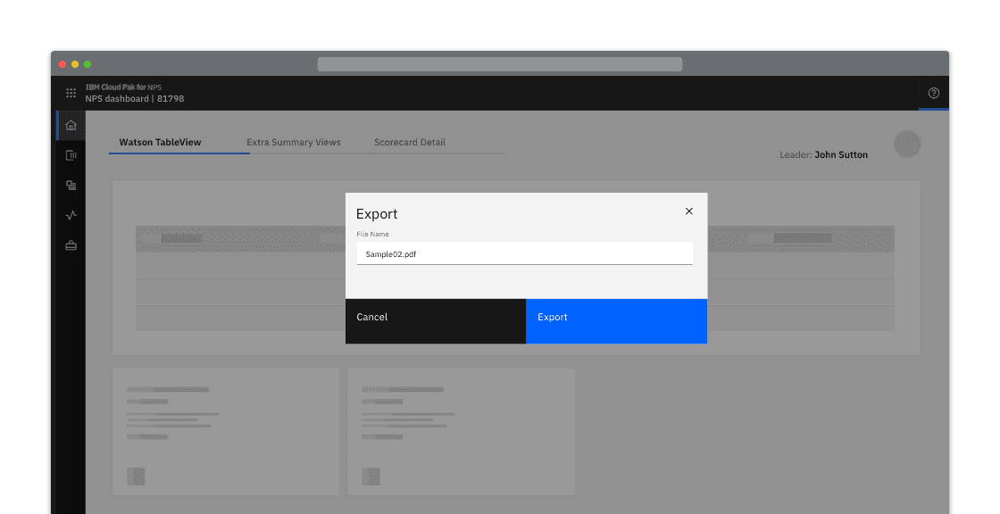
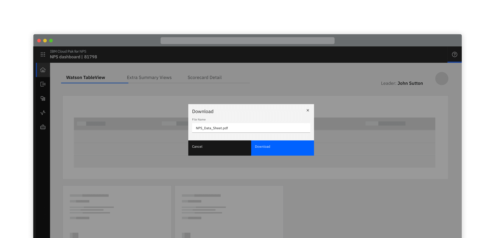
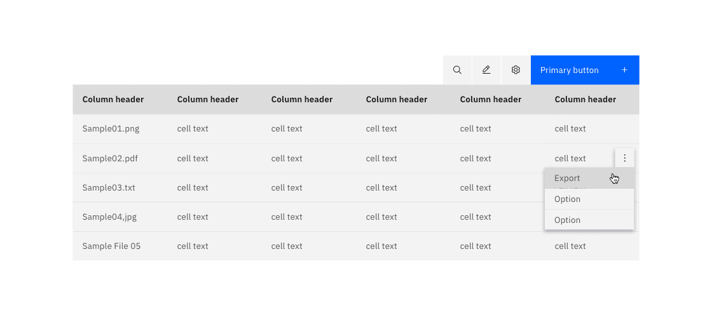
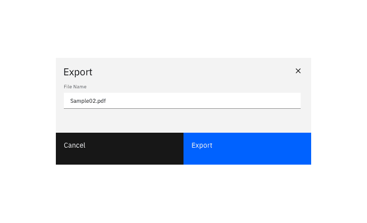
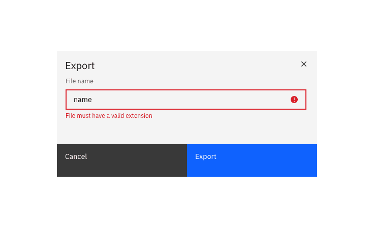
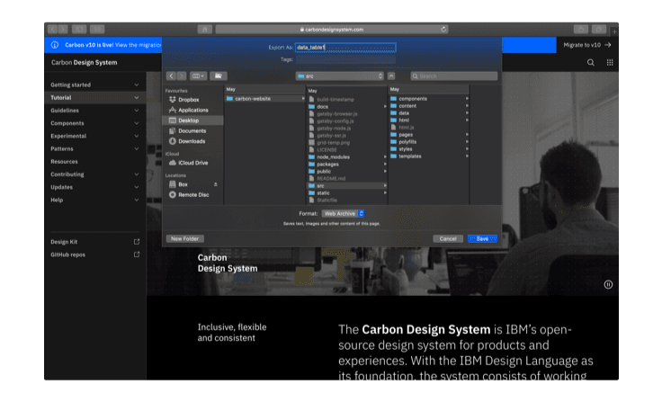
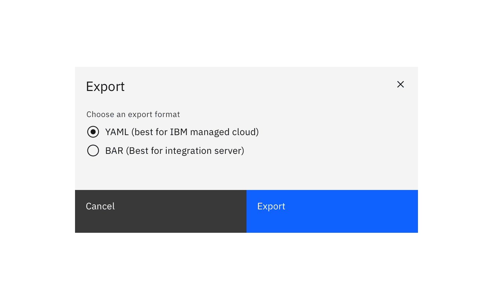
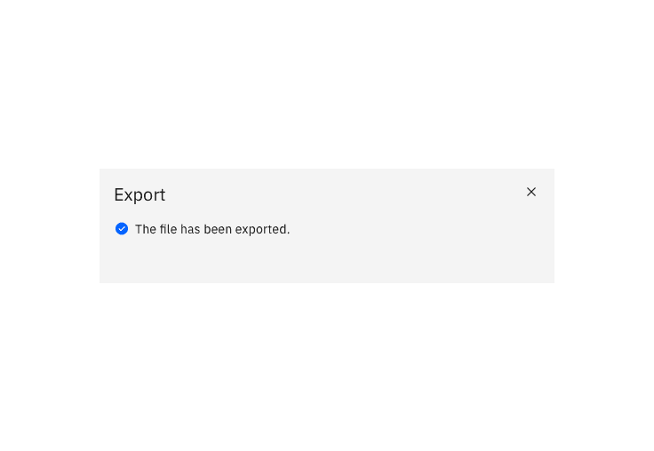
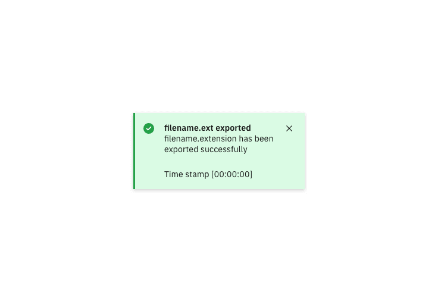

#### Maintainers:

[Vikki Paterson](https://github.com/vikkipaterson), [Chloe Poulter](https://github.com/chloepoulterdesign)

<PageDescription>

When **exporting** something you have the ability to change the format of the object or resource you are exporting out external to the system.

**Downloading** transfers a resource from a remote system to a local system without changing its format.

Most of this pattern is applicable to both exporting and downloading.

</PageDescription>

<Caption>Example of an export modal</Caption>

<Caption>Example of a download modal in the context of a product</Caption>

<AnchorLinks>

<AnchorLink>Intuitive default name</AnchorLink>
<AnchorLink>Editable name</AnchorLink>
<AnchorLink small>Optional extras</AnchorLink>

</AnchorLinks>

## Intuitive default name

When a resource is given an intuitive name by default and there is no choice of an export or download location, the export occurs on the click of the Export button and nothing additional is displayed.

<Row>
<Column colLg={8}>

</Column>
</Row>

<Row>
 <Column colLg={8}>

<Caption>Example of a download button</Caption>

 </Column>
</Row>

## Editable name

When a file's name can be edited before exporting or downloading, a dialog containing an editable textbox should be presented to the user. The textbox should be pre-populated with the file's default name.

When downloading, the file extension is not displayed.

<Row>
<Column colLg={8}>

<Caption>Validate the edited name's extension.</Caption>

<Caption>Example of an export modal in its "Exporting" state</Caption>

</Column>
</Row>

## Optional extras

### Specify the export or download location

When specifying the download location of a resource, clicking the primary “download” button activates the browser's default location panel. The file is downloaded once a location is selected and the user clicks Save.

<Row>
<Column colLg={8}>

</Column>
</Row>

### Choosing export format

When a file can be exported in 2-5 different formats, these can be presented in a radio-button selection.
Where possible, provide guidance about which format a user might want to choose, and pre-select a sensible default.

<Row>
<Column colLg={8}>

</Column>
</Row>

### Passive success modal

You can choose to show a passive modal when an export has succeeded.

<Row>
<Column colLg={8}>

</Column>
</Row>

### Errors and failures

In the event of an error, display the error in the modal.

<Row>
<Column colLg={8}>

</Column>
</Row>

### Success notification

A notification can be used to alert the user that an export has been successful.

<Row>
<Column colLg={8}>

</Column>
</Row>
