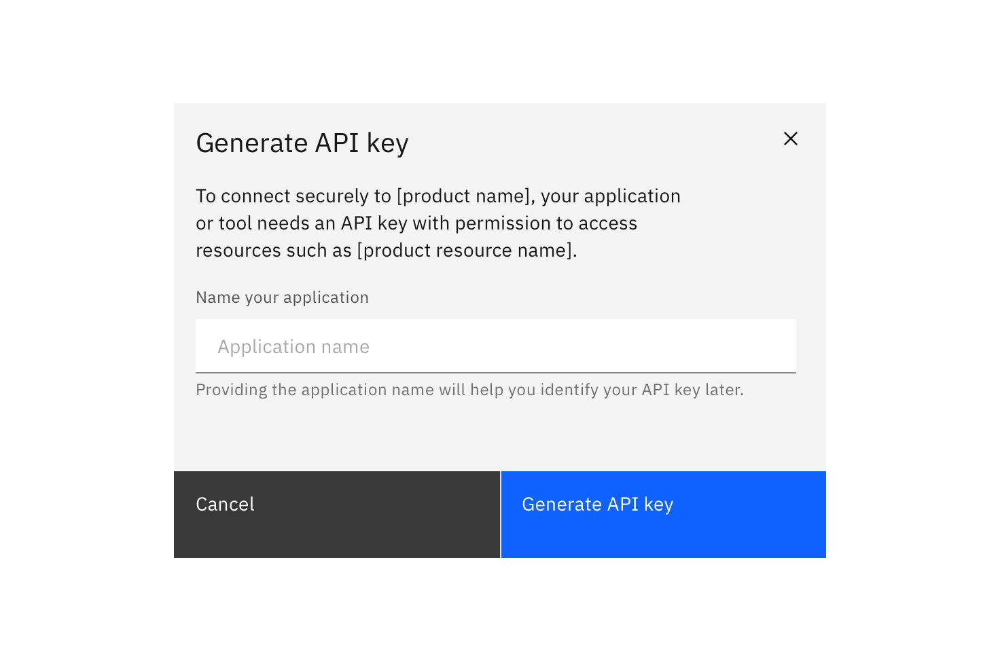
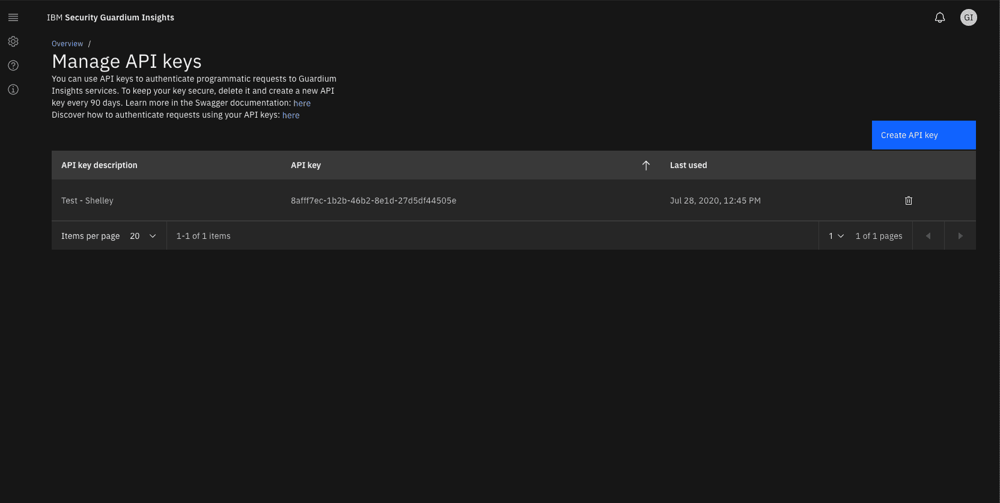

#### Maintainers:

[Vikki Paterson](https://github.com/vikkipaterson),
[Chloe Poulter](https://github.com/chloepoulterdesign)

<PageDescription>

When designing for the generation of API keys, ensure users know what the key is
created for, the security implications, and the end destination of the key.

</PageDescription>

<InlineNotification>

The reusable code component can be found in
[this React storybook](https://pages.github.ibm.com/cloud-integration-design/ide-components/?path=/story/production-ready-ide-api-key-generation-component--with-core-configuration).

</InlineNotification>

<AnchorLinks>
  <AnchorLink>General access keys</AnchorLink>
  <AnchorLink>Restricted access keys</AnchorLink>
  <AnchorLink>Show the API key in context (optional)</AnchorLink>
  <AnchorLink>API key management page (optional)</AnchorLink>
  <AnchorLink>Edit an API key (optional)</AnchorLink>
</AnchorLinks>

<Caption>
  An example of API key generation with restricted access options
</Caption>

## General access keys

### Instant generation

Users click a primary **Generate** button. Consider displaying a
**Generating...** state if the API key takes time to generate.

<Row>
<Column colLg={6}>

</Column>
</Row>

Once the API key is generated it displays in a modal. Include a **Copy** button.

<Row>
<Column colLg={6}>

</Column>
</Row>

#### Optionally:

- Display two parts to the API key where required
- Display an encoded version of the key
- Provide information text about the API key
- Allow users to toggle the visibility of the key
- Provide a secondary link to download the key

<Row>
<Column colLg={6}>

<Caption>Example of a hidden API key</Caption>

</Column>
</Row>

<Row>
<Column colLg={6}>

<Caption>Example of a revealed API key</Caption>

</Column>
</Row>

### Name the API key

You can ask a user to provide a descriptive name before the key is generated.
This is particularly useful in instances where a user may have keys for several
applications stored in the same location.

<Row>
<Column colLg={6}>

</Column>
</Row>

When the user names the API key or provides other information before clicking
generate, the API key is presented **after** the user clicks generate, in a
**new** modal view.

### Retrieval warnings

Some API keys cannot be retrieved after creation. Include an appropriate warning
to the user for the retrieval use case. All of these use cases can be combined
with a **download** link (for example as a .txt or JSON file).

#### API key can be retrieved in the product

If a user can retrieve the API key at a later date, within the product (i.e. an
API key management page), inform the user that this is the case.  
Consider including a link to the retrieval location.

<Row>
<Column colLg={6}>

<Caption>
  If a key is recoverable in the UI, inform the user and provide a link.
</Caption>

</Column>
</Row>

#### API key can be retrieved via another platform (i.e. OpenShift, IBM Cloud)

If a user can retrieve the API key at a later date, by accessing a separate
interface, such as OpenShift, you should inform them here and provide a link to
instructions for doing so.

<Row>
<Column colLg={6}>

<Caption>
  If a key is recoverable in another UI or platform, inform the user and link to
  instructions for recovering the key.
</Caption>

</Column>
</Row>

#### API key cannot be retrieved at a later date

If a user cannot retrieve the API key in the future, warn them in the modal.
Provide the user the option to download the key as JSON.

<Row>
<Column colLg={6}>

<Caption>
  If a key is non-recoverable, inform the user and provide a download option.
</Caption>

</Column>
</Row>

## Restricted access keys

A user may want to limit the access an application or service is granted.
Restricted access allows a user to assign specific access control and
permissions before the API key is generated.

Restricted access options vary widely and are not specified in this pattern.
Options should be provided in the modal **before** the user clicks generate. To
avoid scrolling in the modal, a multi-step modal can be used, with a progress
indicator.

<Row>
<Column colLg={6}>

<Caption>
  Many components can be implemented in the modal content space.
</Caption>

</Column>
</Row>

<Row>
<Column colLg={6}>

<Caption>
  Some examples of restricted API key generation. Where the user names the API
  key, this should be the first available field.
</Caption>

</Column>
</Row>

### Ordering restricted access options

Try to present restricted access options in the following order. Not all options
will be required in each case.

1. (Optional) **Name the API key or application.** Allow the user to specify a
   recognizable name for the API key, or the application, so that they can
   recognize it later.
2. (Optional) **Choose the actions the API key permits.** Common options are
   "Read and write", "Write only" and "Read only".
3. (Optional) **Allow the user to specify which resources the key can access.**
   This may be by naming or selecting resources.

## Show the API key in context (optional)

In some use cases, it can be helpful to also show the user the API key in
context, after the modal is closed. In this situation, the key should be
displayed near the "Generate" button.

The user may also need the option to generate a new API key.

<Row>
<Column colLg={6}>

<Caption>
  One way to display an API key in context, after the modal is closed.
</Caption>

</Column>
</Row>

## API key management page (optional)

Some products and platforms may include an API key management page. This is a
central location where API keys can be created, reviewed, or edited.

The location of the API key management page will vary according to the product
information hierarchy. Consider where users would expect to administrate access
to the product, for example within a "settings", "access" or similar navigation
item.

In the management page, keys are typically listed in a data table, using a
recognizable name or the name of the application which the user specified.

<Row>
<Column colLg={8}>

<Caption>An example of an API key management page</Caption>

</Column>
</Row>

## Edit an API key (optional)

After an API key has been generated, some products may enable a user to edit the
options associated with it. This may include the name of the connected
application, the name of the API key, and restricted access options.  
Editing an API key does not allow the user to change the key contents.

The edit action may be accessible in the context of creation, or from an API key
management page.  
The change to the API key is then "saved".

<Row>
<Column colLg={6}>

<Caption>
  An example of Edit an API key workflow, which ends with a "save" action.
</Caption>

</Column>
</Row>
