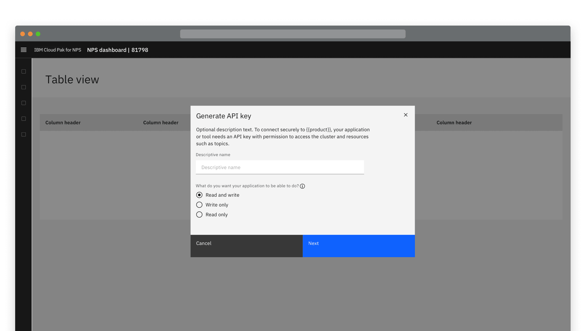
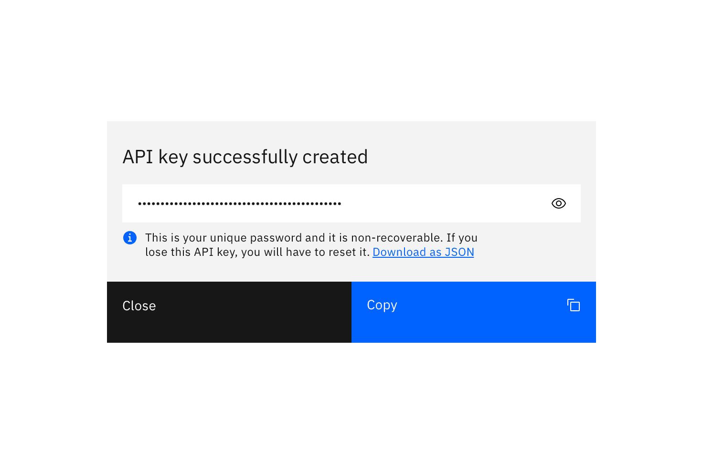

#### Maintainers:

[Vikki Paterson](https://github.com/vikkipaterson), [Chloe Poulter](https://github.com/chloepoulterdesign)

<PageDescription>

When designing for the generation of API keys, ensure users know what the key is created for, the security implications, and the end destination of the key.

</PageDescription>

<InlineNotification>

The reusable code component can be found in [this React
storybook](https://pages.github.ibm.com/cloud-integration-design/ide-components/?path=/story/production-ready-ide-api-key-generation-component--with-core-configuration).

</InlineNotification>

<AnchorLinks>
  <AnchorLink>General access keys</AnchorLink>
  <AnchorLink>Restricted access keys</AnchorLink>
  <AnchorLink>Show the API key in context (optional)</AnchorLink>
</AnchorLinks>{" "}

<Caption>
  An example of API key generation with restricted access options
</Caption>

## General access keys

### Instant generation

Users click a primary **Generate** button. Consider displaying a **Generating...** state if the API key takes time to generate.

<Row>
<Column colLg={8}>

</Column>
</Row>

Once the API key is generated it displays in a modal. Include a **Copy** button.

<Row>
<Column colLg={8}>

</Column>
</Row>

#### Optionally:

- Display two parts to the API key where required
- Provide information text about the API key
- Allow users to toggle the visibility of the key
- Provide a secondary link to download the key

<Row>
<Column colLg={8}>

<Caption>Example of a hidden API key</Caption>

</Column>
</Row>

<Row>
<Column colLg={8}>

<Caption>Example of a revealed API key</Caption>

</Column>
</Row>

### Name the API key

You can ask a user to provide a descriptive name before the key is generated. This is particularly useful in instances where a user may have keys for several applications stored in the same location.

<Row>
<Column colLg={8}>

</Column>
</Row>

<Row>
<Column colLg={8}>

<Caption>Example of an API key destination selector</Caption>

</Column>
</Row>

## Restricted access keys

A user may want to limit the access an application or service is granted. Restricted access allows a user to assign specific access control and permissions before the API key is generated.

<Row>
<Column colLg={8}>

<Caption>
  Many components can be implemented in the modal content space.
</Caption>

</Column>
</Row>

<Row>
<Column colLg={8}>

<Caption> Some examples of restricted API key generation</Caption>

</Column>
</Row>

## Show the API key in context (optional)

In some use cases, it can be helpful to also show the user the API key in context, after the modal is closed. In this situation, the key should be displayed near the "Generate" button.

The user may also need the option to generate a new API key.

<Row>
<Column colLg={8}>

<Caption>
  One way to display an API key in context, after the modal is closed.
</Caption>

</Column>
</Row>
