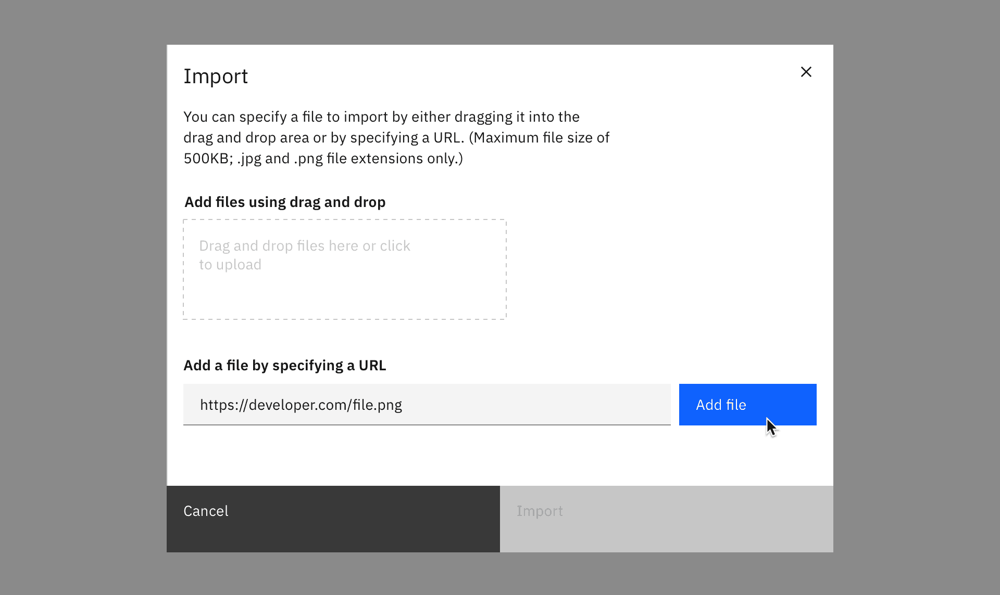

#### Maintainers:

[Vikki Paterson](https://github.com/vikkipaterson), [Chloe Poulter](https://github.com/chloepoulterdesign)

<PageDescription>

The import action transfers data or objects from an external source into a system.

</PageDescription>

This pattern uses Carbon's [File uploader](https://www.carbondesignsystem.com/components/file-uploader/usage/) (drag & drop) component.

<Caption>Example of an import modal</Caption>

## Choose a file (modal)

Where a single file is imported, import can take place in a modal.

When importing, users should have the option of uploading a local file using the file upload component, offering file drag and drop and the ability to browse locally to select a file. Additionally, provide the ability to add a file from an external resource.

If additional actions (e.g. adding metadata) are required to be performed on the file(s), consider whether it would be more appropriate to use a side panel or full page instead of a modal.

<Row>
<Column colLg={8}>

<Caption>Example of an import modal</Caption>

</Column>
</Row>

<Row>
<Column colLg={8}>

<Caption>Example of drag and drop file import</Caption>

</Column>
</Row>

<Row>
<Column colLg={8}>

<Caption>Example of a loaded file in the import modal</Caption>

</Column>
</Row>

### Import from a URL (modal)

If your product supports importing from a URL, use this method.

<Row>
<Column colLg={8}>

<Caption>Example of importing with a URL</Caption>

</Column>
</Row>
<Row>
<Column colLg={8}>

<Caption>Example of a file imported by URL</Caption>

</Column>
</Row>

## Choose a file (full page or side-panel)

Use the drag and drop file upload component and offer the option to browse locally to select a file. Note that file selection should be restricted to allowed file types.

If additional actions (e.g. adding metadata) are required to be performed on the file(s) they should be done separately to the file upload, prior to the import action being completed. This could be in a subsequent step or if there is sufficient space include those actions in a single step.

<Row>
<Column colLg={8}>

<Caption>Example of an import dialog in a full page view</Caption>

</Column>
</Row>

<Row>
<Column colLg={8}>

<Caption>Example of drag and drop file import in a Slide over panel</Caption>

</Column>
</Row>

<Row>
<Column colLg={8}>

<Caption>Example of files loading into the import dialog</Caption>

</Column>
</Row>
<Row>
<Column colLg={8}>

<Caption>Example of files loaded in the import dialog</Caption>

</Column>
</Row>

### Import from a URL (full page or side-panel)

If your product supports importing from a URL, use this method.

<Row>
<Column colLg={8}>

<Caption>Example of importing with a URL</Caption>

</Column>
</Row>

<Row>
<Column colLg={8}>

<Caption>Example of importing with a URL</Caption>

</Column>
</Row>

## Future considerations

We understand that some content in this pattern duplicates Carbon's File uploader component.
