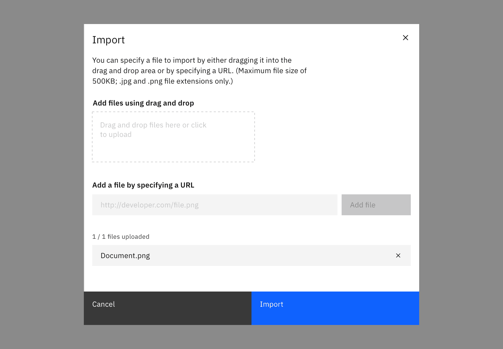
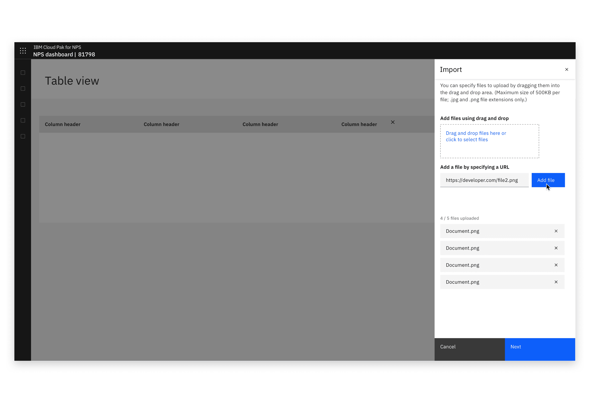
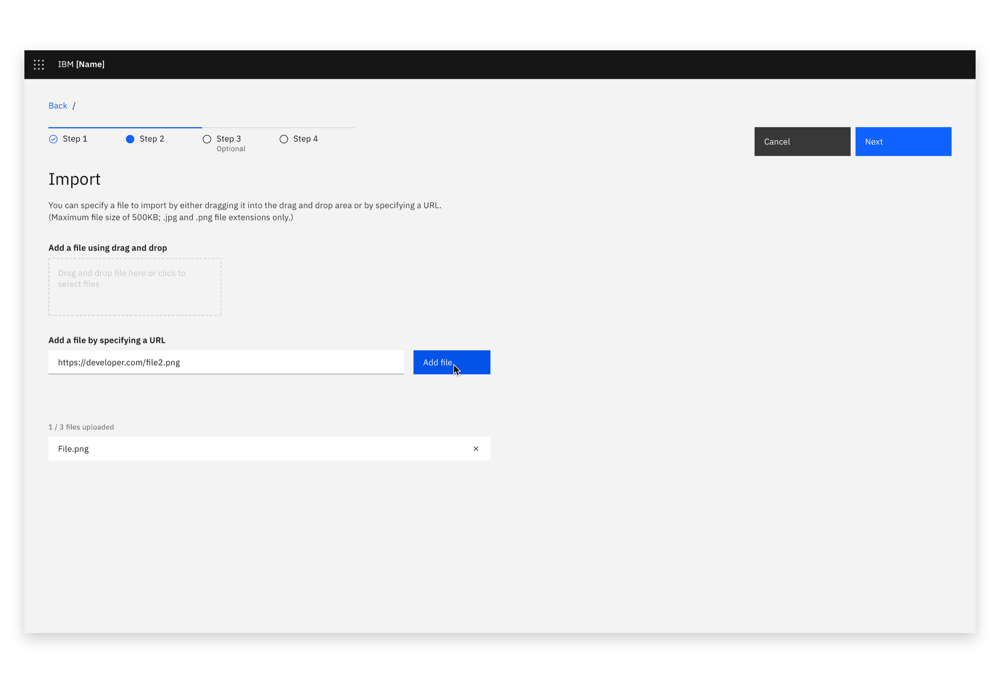

#### Maintainers:

[Vikki Paterson](https://github.com/vikkipaterson),
[Chloe Poulter](https://github.com/chloepoulterdesign)

<PageDescription>

The import action transfers data or objects from an external source into a
system.

</PageDescription>

<InlineNotification>

This pattern uses Carbon's
[File uploader](https://www.carbondesignsystem.com/components/file-uploader/usage/)
(drag & drop) component.

</InlineNotification>

<AnchorLinks>
  <AnchorLink>Choose a file (modal)</AnchorLink>
  <AnchorLink>Choose a file (full page or side-panel)</AnchorLink>
  <AnchorLink>Accessibility</AnchorLink>
</AnchorLinks>

<Caption>Example of an import modal</Caption>

## Choose a file (modal)

Where a single file is imported, import can take place in a modal.

When importing, users should have the option of uploading a local file using the
file upload component, offering file drag and drop and the ability to browse
locally to select a file. Additionally, provide the ability to add a file from
an external resource.

If additional actions (e.g. adding metadata) are required to be performed on the
file(s), consider whether it would be more appropriate to use a side panel or
full page instead of a modal.

<Row>
<Column colLg={8}>

<Caption>Example of an import modal</Caption>

</Column>
</Row>

<Row>
<Column colLg={8}>

<Caption>Example of drag and drop file import</Caption>

</Column>
</Row>

<Row>
<Column colLg={8}>

<Caption>Example of a loaded file in the import modal</Caption>

</Column>
</Row>

### Import from a URL (modal)

If your product supports importing from a URL, use this method.

<Row>
<Column colLg={8}>

<Caption>Example of importing with a URL</Caption>

</Column>
</Row>
<Row>
<Column colLg={8}>

<Caption>Example of a file imported by URL</Caption>

</Column>
</Row>

## Choose a file (full page or side-panel)

Use the drag and drop file upload component and offer the option to browse
locally to select a file. Note that file selection should be restricted to
allowed file types.

If additional actions (e.g. adding metadata) are required to be performed on the
file(s) they should be done separately to the file upload, prior to the import
action being completed. This could be in a subsequent step or if there is
sufficient space include those actions in a single step.

<Row>
<Column colLg={8}>

<Caption>Example of an import dialog in a full page view</Caption>

</Column>
</Row>

<Row>
<Column colLg={8}>

<Caption>Example of drag and drop file import in a Slide over panel</Caption>

</Column>
</Row>

<Row>
<Column colLg={8}>

<Caption>Example of files loading into the import dialog</Caption>

</Column>
</Row>
<Row>
<Column colLg={8}>

<Caption>Example of files loaded in the import dialog</Caption>

</Column>
</Row>

### Import from a URL (full page or side-panel)

If your product supports importing from a URL, use this method.

<Row>
<Column colLg={8}>

<Caption>Example of importing with a URL</Caption>

</Column>
</Row>

<Row>
<Column colLg={8}>

<Caption>Example of importing with a URL</Caption>

</Column>
</Row>

## Accessibility

Refer to accessibility guidance for the components implemented:
[Modal](https://www.carbondesignsystem.com/components/modal/usage#behaviors),
[File uploader](https://www.carbondesignsystem.com/components/file-uploader/usage#interactions).

The keyboard behavior of an upload or import interaction depends on how many
files are imported or uploaded.

### Single file uploads and imports

Single file uploads and imports often happen in a modal, however this guidance
is applicable to any single file upload or import interaction.

#### Trigger

Often, the upload or import modal (page, or panel) is launched by a button
press.

1. The user navigates to the Import button using the `Tab` key. If Import is
   launched from an overflow menu, the user may navigate to Import within the
   overflow menu using the `Up` and `Down` arrow keys.
2. The focus state is applied to the button/menu item.
3. The user presses `Enter` to launch the Import modal.

#### Focus

1. On opening the modal (page, or panel), the focus is applied to the first
   field that accepts user input. In the case of Import modals, this is the drag
   & drop area.
2. On `Tab`, focus is applied to the second field that accepts user input. If
   the URL field option is present, focus is applied to this.
3. If enabled, on `Tab`, focus is applied to the primary button (for example Save or
   Next). An Import button should not be enabled until a file is selected.
4. On `Tab`, focus is applied to the Cancel button.

The user cycles input methods using `Tab` and hits `Return` to activate their
chosen option (file uploader or URL).

_Using the file uploader_  
If the user chooses the file uploader, they select files using the
browser-native file browser and click the call to action. This returns them to
the modal with an optional file loading state.

_Using the URL field_  
If the user chooses the URL field, the field gains focus and the user inputs
their URL.  
On `Tab`, focus is applied to the Add file button.  
On `Return` the file is uploaded with an optional loading state. The user can
also key `Return` while focus is applied to the URL field to trigger the Add
file button.

#### Once the file is selected

1. Focus is applied to the remove icon on the added file. The user hits `Return`
   to remove the chosen file and return to the original state of the modal.
2. On `Tab`, focus is applied to the Import button
3. On `Tab`, focus is applied to the Cancel button

### Multiple file uploads and imports

When multiple files may be selected a modal is not used.

#### Focus

1. On entering an Import section or page, focus on the first `Tab` keystroke is
   applied to the first field accepting user input. In most cases this is the
   file uploader.
2. On `Tab`, focus is applied to the the URL field.
3. The user keys `Return` to choose between the file uploader and URL field.

_Using the file uploader_  
If the user chooses the file uploader, they select files using the
browser-native file selector and click the call to action. This returns them to
the page with an optional file loading state.

_Using the URL field_  
If the user chooses the URL field, the field gains focus and the user inputs
their URL.  
On `Tab`, focus is applied to the Add file button.  
On `Return` the file is uploaded with an optional loading state. The user can
also key `Return` while focus is applied to the URL field to trigger the Add
file button.

#### When (some) files are selected

When some of the allowed number of files are selected, focus cycles through
adding more files and removing the selected files.

- Focus returns to the just-used file selection method. For example, if the file
  added so far was added by URL, return focus to the URL field to allow the user
  to add another.
- If the method used was the file uploader, on `Tab`, apply focus to the URL
  field.
- On `Tab`, apply focus to the remove icon on the added file(s), moving
  through each using `Tab`.

#### On reaching the maximum number of added files

In some use cases, there are a maximum number of allowed files. In this situation,
the file selection methods are in disabled state. Focus cycles between the
selected files remove actions, and moving to the next section of the page.

1. On returning to the page/panel from the final file uploader/add file
   interaction, (after any optional loading state) focus is applied to the
   remove icon on the uploaded files.
2. On keying `Tab`, focus moves through the remove icon of each uploaded file.
3. On continued use of `Tab`, focus is applied to the next section or
   interaction in the page.

## Feedback

Please help us improve by raising an issue on Carbon.
