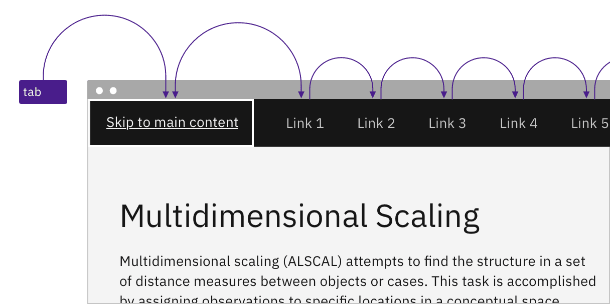
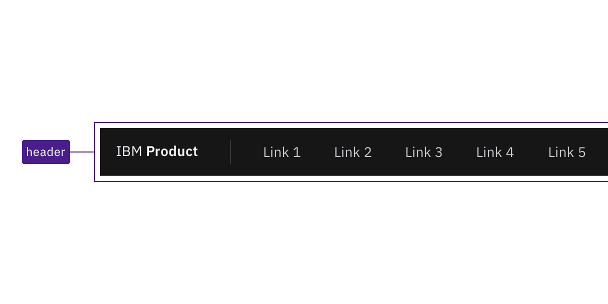
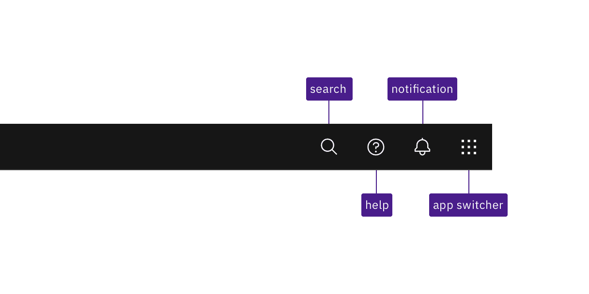
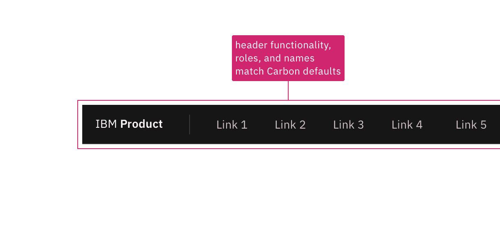

import {
  StructuredListWrapper,
  StructuredListHead,
  StructuredListBody,
  StructuredListRow,
  StructuredListInput,
  StructuredListCell,
  OrderedList,
  ListItem,
} from '@carbon/react';

<PageDescription>

Design annotations are needed for specific instances shown below, but for the
standard UI shell header component, Carbon already incorporates accessibility.

</PageDescription>

<AnchorLinks>

<AnchorLink>What Carbon provides</AnchorLink>
<AnchorLink>Design recommendations</AnchorLink>
<AnchorLink>Development considerations</AnchorLink>

</AnchorLinks>

## What Carbon provides

The Carbon UI shell bakes in keyboard interaction, including a skip-to-main-content
mechanism. Carbon also supports assistive technologies such as screen readers by setting labeling and page structure.

### Keyboard interaction

Each header element can be reached by `Tab` key. A "Skip to main content" link appears when a
keyboard user first tabs into the page. Links and icons are activated by `Enter`. Icons can also be
activated by `Space`.

<Row>
<Column colLg={8}>

<Caption>
  Pressing the Tab key reveals a 'Skip to main' link and then moves between UI shell header elements.
</Caption>

</Column>
</Row>

### Regions

<Row>
<Column colLg={8}>

<Caption>
  Carbon applies a header region around the whole header UI shell.
</Caption>

</Column>
</Row>

### Labeling

Icon-only buttons in the header are revealled on hover and focus. Carbon provides default names for each. Interactions are covered under some other component topics: [search](/components/search/usage), [notifications](/components/notifications/usage), [switcher](components/UI-shell-right-panel/usage/#switcherswitcher).  
<Row>
<Column colLg={8}>

<Caption>
  Carbon provides default names for its icon-only components, and reveals them on hover or focus.
</Caption>

</Column>
</Row>

## Design recommendations

For every product, there should be a one-time design exercise to annotate the UI shell keyboard interaction.
Where the product does not deviate from the standard Carbon implementation, it can merely be annotated that the behaviour matches what is in the 'How Carbon works' section.

Once a product-specific UI shell annotation exists, individual product pages only need to annotate the shell if something differs.

Where UI Shell functionality deviates from the behavior described above, it should be annotated. Such annotations could call out different labels for icons, snf indicate interaction changes, where they exist. For example, some products may alter the keyboard interaction of some UI Shell header components like menus or side panels.

<Row>
<Column colLg={8}>

<Caption>Annotate if your design modifes the keyboard interaction, for insance by grouping components to reduce keyboard tabbing.</Caption>

</Column>
</Row>

## Development considerations

Keep these considerations in mind if you are modifying Carbon or creating a
custom component.

- Carbon uses the HTML 5 `header` component instead of an ARIA landmark to set the region.
- Carbon includes the Skip to main content link as the first item on the page with a `tabindex="0"`, but hides it through CSS until it receives focus.