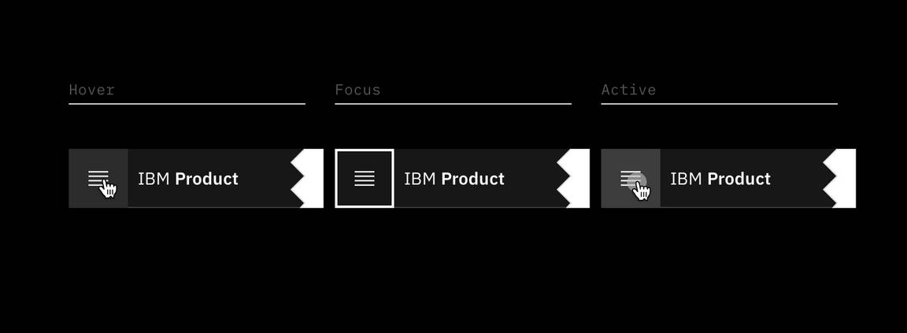
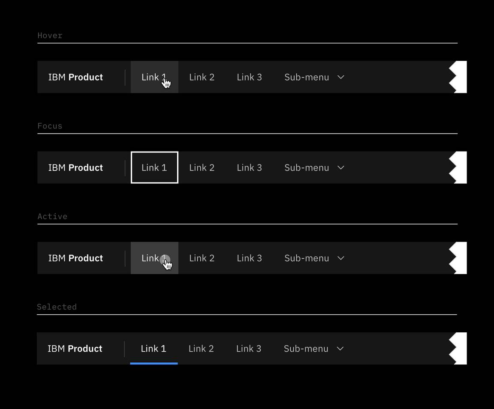
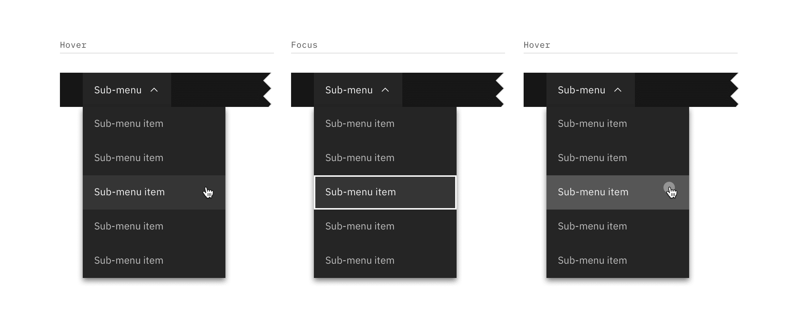
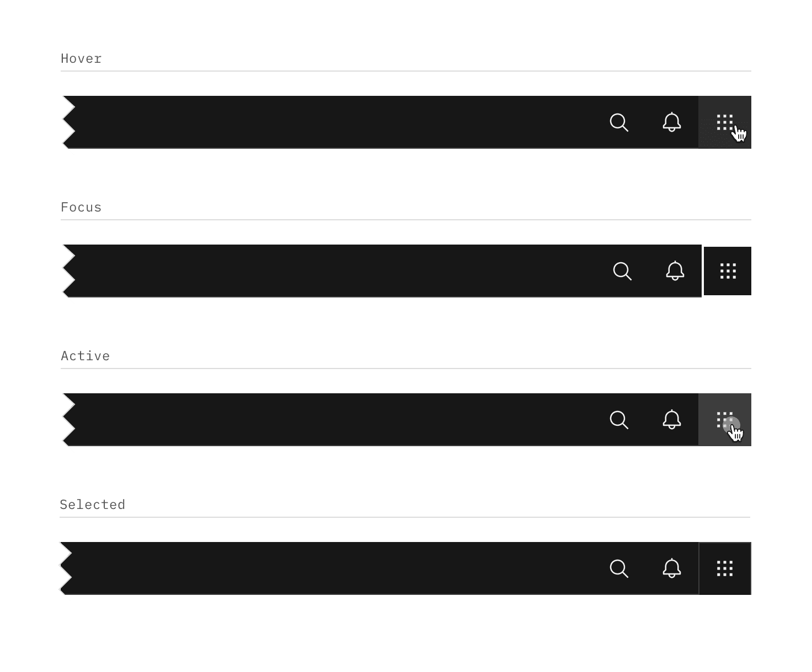
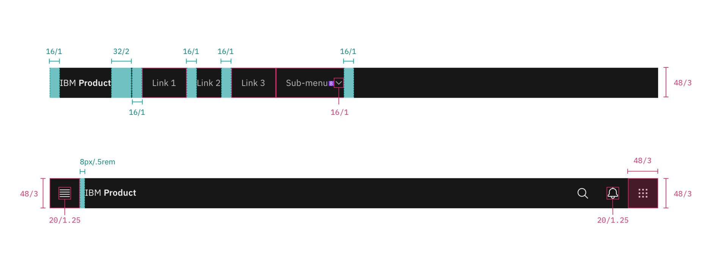
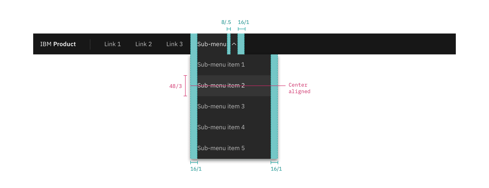
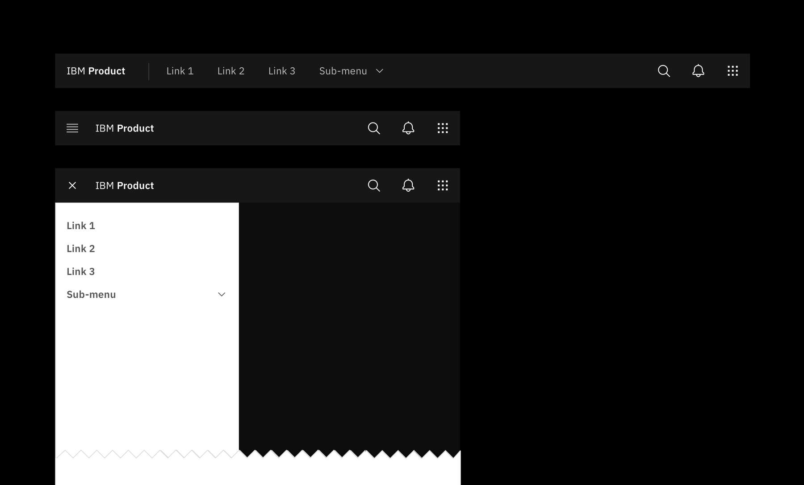

## Color

_Note: The UI Shell does not currently use the Carbon theme tokens; theming
options for the shell will be available in the future. All color used in the UI
Shell is from the
[IBM Design Language palette](https://www.ibm.com/design/language/elements/color#specifications)._

| Class                       | Property         | Color value |
| --------------------------- | ---------------- | ----------- |
| `.bx--header`               | background color | Gray 100    |
| `.bx--header`               | border-bottom    | Gray 80     |
| `.bx--header__name`         | text color       | Gray 10     |
| `.bx--header__menu-trigger` | fill             | Gray 10     |
| `.bx--header__nav::before`  | border           | Gray 80     |

### Menu-trigger

| Class                              | Property         | Color value    |
| ---------------------------------- | ---------------- | -------------- |
| `.bx--header__menu-trigger`        | fill             | Gray 10        |
| `.bx--header__menu-trigger:hover`  | background color | Gray 100-hover |
| `.bx--header__menu-trigger:focus`  | border           | White          |
| `.bx--header__menu-trigger:active` | background color | Gray 80        |

<Row>
<Column colLg={8}>

<Caption>Menu-trigger interactive states</Caption>

</Column>
</Row>

### Menu-item

| Class                           | Property         | Color value    |
| ------------------------------- | ---------------- | -------------- |
| `.bx--header__menu-item`        | text color       | Gray 30        |
| `.bx--header__menu-item`        | svg              | Gray 30        |
| `.bx--header__menu-item:hover`  | background color | Gray 100-hover |
| `.bx--header__menu-item:hover`  | text color       | Gray 10        |
| `.bx--header__menu-item:hover`  | svg              | Gray 10        |
| `.bx--header__menu-item:focus`  | border           | White          |
| `.bx--header__menu-item:active` | background color | Gray 80        |
| `.bx--header__menu-item:active` | text color       | Gray 10        |
| `.bx--header__menu-item:active` | svg              | Gray 10        |

<Row>
<Column colLg={8}>

<Caption>Sub-menu interactive states</Caption>

</Column>
</Row>

### Sub-menu

| Class                         | Property         | Color value   |
| ----------------------------- | ---------------- | ------------- |
| `.bx--header__submenu`        | background color | Gray 90       |
| `.bx--header__submenu`        | text color       | Gray 30       |
| `.bx--header__submenu:hover`  | background color | Gray 90-hover |
| `.bx--header__submenu:hover`  | text color       | Gray 10       |
| `.bx--header__submenu:focus`  | border           | White         |
| `.bx--header__submenu:active` | background color | Gray 70       |
| `.bx--header__submenu:active` | text color       | Gray 10       |

<Caption></Caption>

### Action

| Class                        | Property         | Color value    |
| ---------------------------- | ---------------- | -------------- |
| `.bx--header__action`        | fill             | Gray 30        |
| `.bx--header__action:hover`  | background color | Gray 100-hover |
| `.bx--header__action:hover`  | fill             | Gray 10        |
| `.bx--header__action:focus`  | border           | White          |
| `.bx--header__action:active` | background color | Gray 80        |
| `.bx--header__action:active` | fill             | Gray 10        |

<Row>
<Column colLg={8}>

<Caption>Header action interactive states</Caption>

</Column>
</Row>

## Typography

Menu labels and text should be set in sentence case.

| Class                       | Font-size (px/rem) | Font-weight    | Type token       |
| --------------------------- | ------------------ | -------------- | ---------------- |
| `.bx--header__name`         | 14 / 0.875         | SemiBold / 600 | `$heading-01`    |
| `.bx--header__name--prefix` | 14 / 0.875         | Regular / 400  | `$body-short-01` |
| `.bx--header__menu-item`    | 14 / 0.875         | Regular / 400  | `$body-short-01` |

## Structure

The header should span the full width of the browser window. The header can
either stay sticky to the top of the browser or scroll away.

| Class                       | Property                    | px/rem  | Spacing token |
| --------------------------- | --------------------------- | ------- | ------------- |
| `.bx--header`               | height                      | 48 / 3  | –             |
| `.bx--header__menu-trigger` | height, width               | 48 / 3  | –             |
| `.bx--header__name`         | padding-left                | 16 / 1  | `$spacing-05` |
| `.bx--header__name`         | padding-right               | 32 / 2  | `$spacing-07` |
| `.bx--header__nav`          | padding-left                | 16 / 1  | `$spacing-05` |
| `.bx--header__menu-item`    | padding-left, padding right | 16 / 1  | `$spacing-05` |
| `.bx--header__menu-arrow`   | padding-left                | 8 / 0.5 | `$spacing-03` |
| `.bx--header__submenu`      | padding-left, padding right | 16 / 1  | `$spacing-05` |
| `.bx--header__action`       | height, width               | 48 / 3  | –             |

<Caption>
  Structure and spacing measurements for UI shell header | px | rem
</Caption>

<Caption>
  Structure and spacing measurements for header submenu | px | rem
</Caption>

### Responsive behavior

In smaller broswer windows, `menu items` in the header should collapse into the
left side nav menu. Items that were once in the header should stack at the top
of the side nav panel if other items were already present in the panel.

<Caption>Responsive behavior for UI shell header</Caption>
