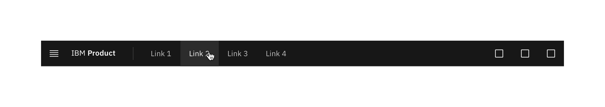
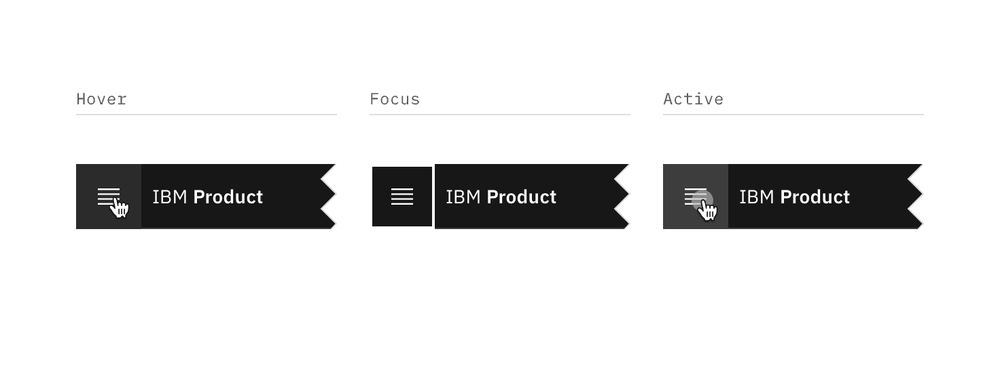
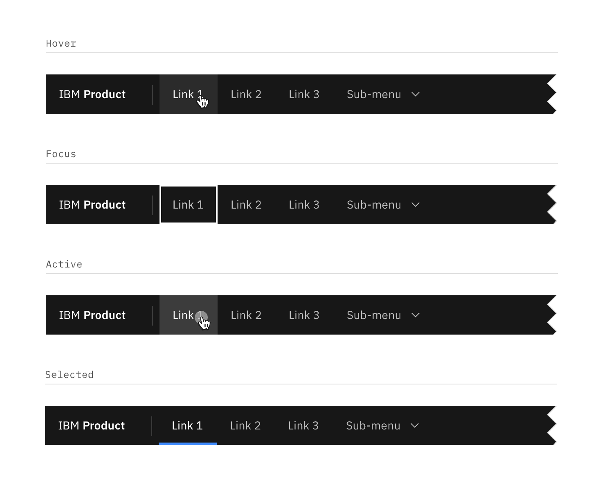
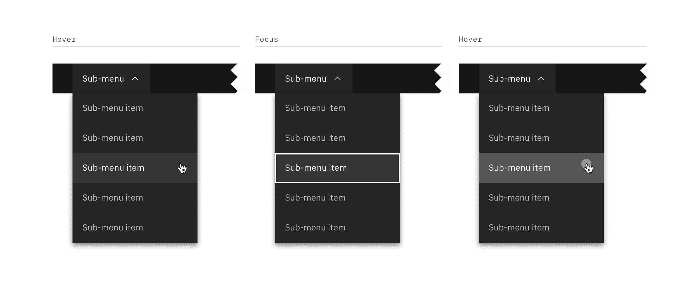
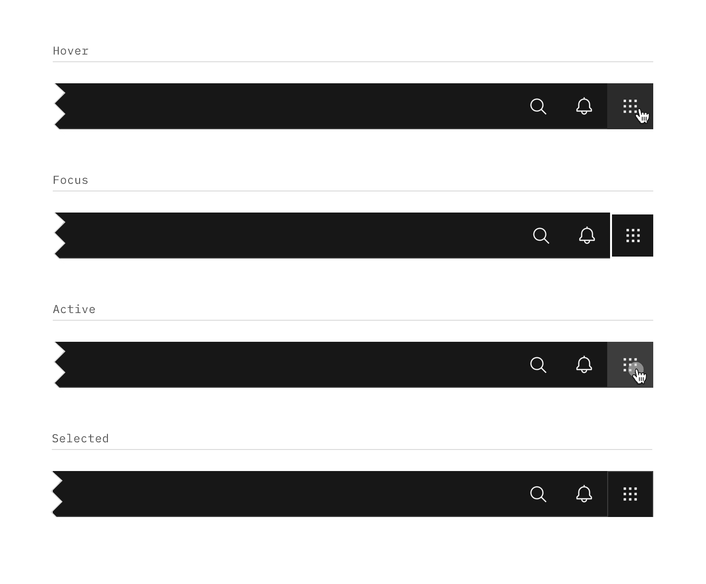
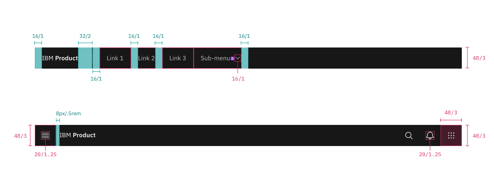
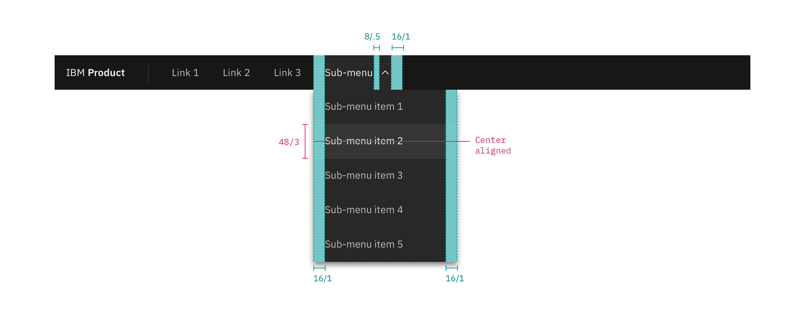
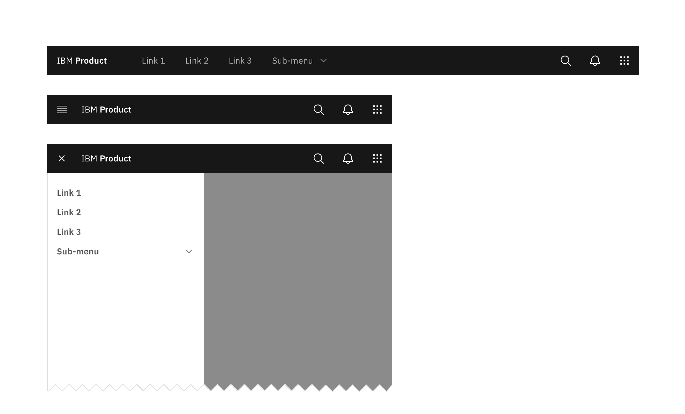

## Color

_Note: The UI Shell does not currently use the Carbon theme tokens; theming
options for the shell will be available in the future. All color used in the UI
Shell is from the
[IBM Design Language palette](https://www.ibm.com/design/language/elements/color#specifications)._

| Element      | Property         | Color token      |
| ------------ | ---------------- | ---------------- |
| Header       | background color | `$background`    |
|              | border-bottom    | `$border-subtle` |
| Product name | text color       | `$text-primary ` |

### Menu

| Element | State   | Property         | Color token          |
| ------- | ------- | ---------------- | -------------------- |
| Menu    | Enabled | svg              | `$icon-primary`      |
|         | Hover   | background color | `$background-hover`  |
|         |         | svg              | `$icon-primary`      |
|         | Focus   | border           | `$focus`             |
|         | Active  | background color | `$background-active` |
|         |         | svg              | `$icon-primary`      |

<Row>
<Column colLg={8}>

<Caption>Menu-trigger interactive states</Caption>

</Column>
</Row>

### Header link

| Element | State   | Property         | Color token          |
| ------- | ------- | ---------------- | -------------------- |
| Link    | Enabled | text color       | `$text-secondary`    |
|         | Hover   | background color | `$background-hover`  |
|         |         | text color       | `$text-primary`      |
|         | Focus   | border           | `$focus`             |
|         | Active  | background color | `$background-active` |
|         |         | text color       | `$text-primary`      |

<Row>
<Column colLg={8}>

<Caption>Sub-menu interactive states</Caption>

</Column>
</Row>

### Sub-menu

| Element  | State    | Property         | Color token          |
| -------- | -------- | ---------------- | -------------------- |
| Sub-menu | Enabled  | background color | `$background`        |
|          |          | text color       | `$text-secondary`    |
|          |          | svg              | `$icon-secondary`    |
|          | Hover    | background color | `$background-hover`  |
|          |          | text color       | `$text-primary`      |
|          |          | svg              | `$icon-primary`      |
|          | Focus    | border           | `$focus`             |
|          | Active   | background color | `$background-active` |
|          |          | text color       | `$text-primary`      |
|          |          | svg              | `$icon-primary`      |
|          | Selected | background color | `$layer`             |
|          |          | text color       | `$text-primary`      |
|          |          | svg              | `$icon-primary`      |
| Item     | Enabled  | background color | `$layer`             |
|          |          | text color       | `$text-secondary`    |
|          |          | svg              | `$icon-secondary`    |
|          | Hover    | background color | `$layer-hover`       |
|          |          | text color       | `$text-primary`      |
|          |          | svg              | `$icon-primary`      |
|          | Focus    | border           | `$focus`             |
|          | Active   | background color | `$layer-active`      |
|          |          | text color       | `$text-primary`      |
|          |          | svg              | `$icon-primary`      |

<Caption></Caption>

### Header actions

| Element | State    | Property         | Color token          |
| ------- | -------- | ---------------- | -------------------- |
| Action  | Enabled  | svg              | `$icon-secondary`    |
|         | Hover    | background color | `$background-hover`  |
|         |          | svg              | `$icon-primary`      |
|         | Focus    | border           | `$focus`             |
|         | Active   | background color | `$background-active` |
|         |          | svg              | `$icon-primary`      |
|         | Selected | background color | `$layer`             |
|         |          | border           | `$border-subtle`     |
|         |          | svg              | `$icon-primary`      |

<Row>
<Column colLg={8}>

<Caption>Header action interactive states</Caption>

</Column>
</Row>

## Typography

Menu labels and text should be set in sentence case.

| Element        | Font-size (px/rem) | Font-weight    | Type token       |
| -------------- | ------------------ | -------------- | ---------------- |
| Product name   | 14 / 0.875         | SemiBold / 600 | `$heading-01`    |
| Company prefix | 14 / 0.875         | Regular / 400  | `$body-short-01` |
| Header link    | 14 / 0.875         | Regular / 400  | `$body-short-01` |
| Sub-menu       | 14 / 0.875         | Regular / 400  | `$body-short-01` |

## Structure

The header should span the full width of the browser window. The header can
either stay sticky to the top of the browser or scroll away.

| Element       | Property                    | px/rem  | Spacing token |
| ------------- | --------------------------- | ------- | ------------- |
| Header        | height                      | 48 / 3  | –             |
| Menu          | height, width               | 48 / 3  | –             |
| Product name  | padding-left                | 16 / 1  | `$spacing-05` |
|               | padding-right               | 32 / 2  | `$spacing-07` |
| Link          | padding-left, padding right | 16 / 1  | `$spacing-05` |
| Sub-menu      | padding-left, padding right | 16 / 1  | `$spacing-05` |
| Chevron       | padding-left                | 8 / 0.5 | `$spacing-03` |
| Sub-menu item | padding-left, padding right | 16 / 1  | `$spacing-05` |
| Header action | height, width               | 48 / 3  | –             |

<Caption>
  Structure and spacing measurements for UI shell header | px | rem
</Caption>

<Caption>
  Structure and spacing measurements for header submenu | px | rem
</Caption>

### Responsive behavior

In smaller browser windows, `menu items` in the header should collapse into the
left side nav menu. Items that were once in the header should stack at the top
of the side nav panel if other items were already present in the panel.

<Caption>Responsive behavior for UI shell header</Caption>
