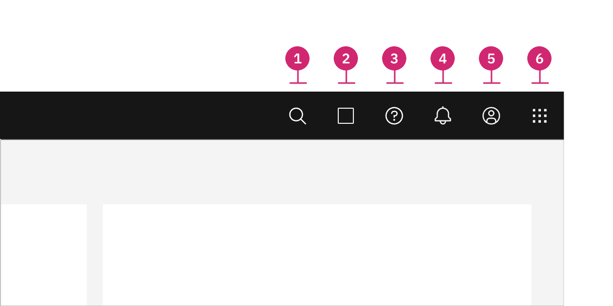

<PageDescription>

This header is part of the Carbon UI shell. A shell is a collection of
components shared by all products within a platform. It provides a common set of
interaction patterns that persist between and across products.

</PageDescription>

<AnchorLinks>

<AnchorLink>Overview</AnchorLink>
<AnchorLink>Live demo</AnchorLink>
<AnchorLink>Formatting</AnchorLink>
<AnchorLink>Content</AnchorLink>
<AnchorLink>Behaviors</AnchorLink>
<AnchorLink>Related</AnchorLink>
<AnchorLink>References</AnchorLink>
<AnchorLink>Feedback</AnchorLink>

</AnchorLinks>

## Overview

The UI shell header is the foundation for navigating and orienting your user to
your UI. The UI shell header can be used by itself or combined with the UI shell
left and right panels for more complex UI navigation.

The UI shell is made up of three components: The header, the
[left panel](/components/UI-shell-left-panel/usage), and the
[right panel](/components/UI-shell-right-panel/usage). All three can be used
independently, but the components were designed to work together.

| Shell UI component |                                                                                                                                         |
| ------------------ | --------------------------------------------------------------------------------------------------------------------------------------- |
| Header             | The highest level of navigation. The header can be used on its own for simple products or be used to trigger the left and right panels. |
| Left panel         | An optional panel that is used for a product's navigation.                                                                              |
| Right panel        | An optional panel that shows additional system level actions or content associated with a system icon in the header.                    |

### When to use

The UI shell header is a globally persistent element in your UI that can be used
to identify the UI by name and can include navigational links and other
utilities.

## Live demo

<Row>
  <Column>
    <iframe
      loading="lazy"
      src="https://codesandbox.io/embed/header-with-actions-and-nav-m0lo2?fontsize=14&hidenavigation=1&view=preview"
      title="header-with-actions-and-nav"
      allow="geolocation; microphone; camera; midi; vr; accelerometer; gyroscope; payment; ambient-light-sensor; encrypted-media"
      style="width:100%; height:500px; border:0; border-radius: 4px; overflow:hidden;"
      sandbox="allow-modals allow-forms allow-popups allow-scripts allow-same-origin"
    />
  </Column>
</Row>

## Formatting

### Anatomy

The header spans the full width of the viewport and is the topmost element in
the browser window. Header elements are persistent throughout the product
experience.

<Row>
<Column colLg={12}>

</Column>
</Row>

For each UI shell component, left-to-right translates to product-to-global. The
left side of the header contains items relevant at the product level. Moving to
the right along the header, the functions become more global. Elements in the
middle of the header should represent system-level controls. Elements on the
right side of the header, such as the switcher, are the most global in their
scope and span multiple products.

1. **Hamburger menu**: The hamburger icon is used to open product navigation
   such as the [left panel.](/components/UI-shell-left-panel/usage) The
   hamburger menu is only needed when there is a collapsable left navigation.

2. **Header name**: For IBM products, the header name is always preceded by
   “IBM.”

3. **Header links**: Links in the header are supported as product navigation, if
   required. These links move to the side menu in narrow screen widths.

4. **Sub-menu**: Sub-menus are supported as product navigation, if required.
   Include the down-pointing chevron after the link label. Sub-menus open on
   click and are closed by either selecting an item in the menu, clicking
   outside the menu area, or clicking on the menu label. When open, the chevron
   should point up. Sub-menu labels serve only to open the dropdown; they cannot
   link to another page in the product.

5. **Header utilities**: These utilities are reserved for universal,
   system-level functions such as profile, search, notifications, and similar
   functions. Not every product on a system is required to show the same
   utilities, but it is recommended for a better cross-product user experience.

6. **Switcher**: The switcher provides a way for the user to easily navigate
   _between_ products and systems. Recommended uses for this component include
   recently used apps, frequently used apps, or all apps attached to the user’s
   account. If the list is a manageable size, include all apps or products
   available on the system.

### Placement

Icons are not a required element of the header and a product may choose to use
any set of icons for their UI. Icons should always be aligned to the right of
the header with no gaps between icons.

<DoDontRow>
  <DoDont caption="Header utilities are right aligned with no gaps">

  </DoDont>
  <DoDont type="dont" caption="Header utilities with a gap between the account and help icons.">

  </DoDont>
</DoDontRow>

### Example placement

The example below shows a header with a switcher, three core icons, a product
icon, and search.

<Row>
<Column colLg={8}>

</Column>
</Row>

| Icon          | Position                               |                                                                                                                                                                                                              |
| ------------- | -------------------------------------- | ------------------------------------------------------------------------------------------------------------------------------------------------------------------------------------------------------------ |
| Search        | Left                                   | Search should always be positioned as the furthest left icon. This is to allow for a expanding search field that does not disrupt other icon positions.                                                      |
| Other         | Right of Search and left of core icons | The number of header icons a product uses may vary. This placement will help avoid disrupting the position of the core icons and inconsistencies as your user navigates between other product shell headers. |
| Help          | 4th from the right                     |                                                                                                                                                                                                              |
| Notifications | 3rd from the right                     |                                                                                                                                                                                                              |
| Account       | 2nd from the right                     |                                                                                                                                                                                                              |
| Switcher      | Right                                  | The switcher should always be positioned as the furthest right icon. This ensures the icon does not shift when navigating across systems.                                                                    |

## Content

### Main elements

### Overflow content

## Behaviors

As a header scales down to fit smaller screen sizes, header links and menus
should collapse into a left-panel hamburger menu. See the examples below to
better understand the header's responsive behavior.

If your UI includes a left panel, the header links should be added above the
left panel items, pushing them down accordingly.

<Row>
<Column colLg={12}>

</Column>
<Row>

### States

### Interactions

### Validation

### Responsive behavior

### Default selection

### Clickable areas

### Loading

## Modifiers

## Related

## References

- Susan Farrell,
  [Utility Navigation: What It Is and How to Design It](https://www.nngroup.com/articles/utility-navigation/)
  (Nielsen Norman Group, 2015)
