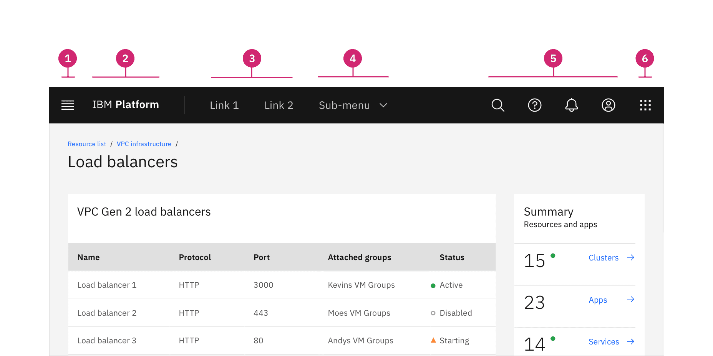
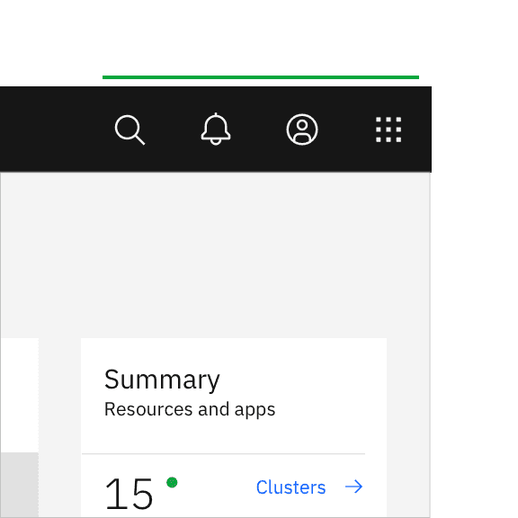
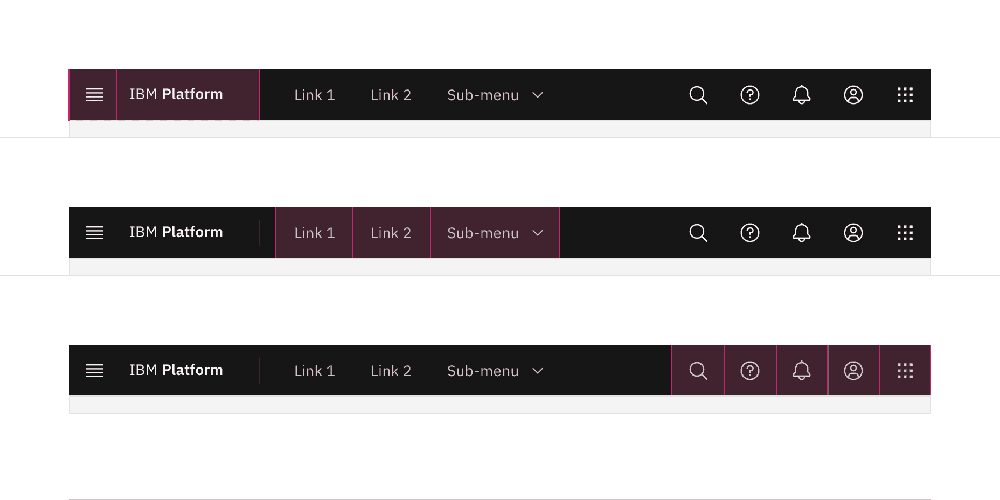
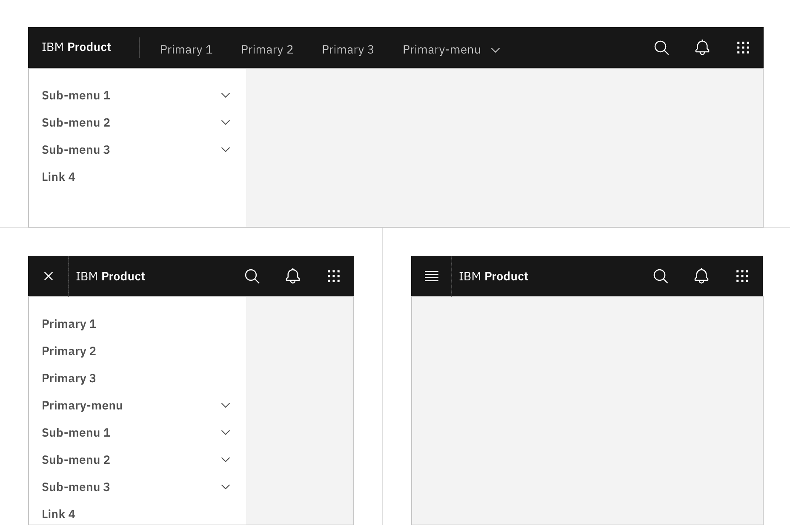

import A11yStatus from 'components/A11yStatus';

<PageDescription>

This header is part of the Carbon UI shell. A shell is a collection of
components shared by all products within a platform. It provides a common set of
interaction patterns that persist between and across products.

</PageDescription>

<AnchorLinks>

<AnchorLink>Live demo</AnchorLink>
<AnchorLink>Overview</AnchorLink>
<AnchorLink>Formatting</AnchorLink>
<AnchorLink>Content</AnchorLink>
<AnchorLink>Behaviors</AnchorLink>
<AnchorLink>Related</AnchorLink>
<AnchorLink>References</AnchorLink>
<AnchorLink>Feedback</AnchorLink>

</AnchorLinks>

## Live demo

<StorybookDemo
  themeSelector
  tall
  wide
  url="https://react.carbondesignsystem.com"
  variants={[
    {
      label: 'Header w/ sideNav',
      variant: 'components-ui-shell-header--header-w-side-nav',
    },
    {
      label: 'Header w/ actions and right panel',
      variant: 'components-ui-shell-header--header-w-actions-and-right-panel',
    },
    {
      label: 'Header w/ actions and switcher',
      variant: 'components-ui-shell-header--header-w-actions-and-switcher',
    },
    {
      label: 'Header w/ navigation',
      variant: 'components-ui-shell-header--header-w-navigation',
    },
    {
      label: 'Header w/ navigation and actions',
      variant: 'components-ui-shell-header--header-w-navigation-and-actions',
    },
    {
      label: 'Header w/ navigation, actions and sideNav',
      variant:
        'components-ui-shell-header--header-w-navigation-actions-and-side-nav',
    },
  ]}
/>

<A11yStatus layout="cards" components="UI shell" />

## Overview

The UI shell header is the foundation for navigating and orienting your user to
the UI. The UI shell header can be used by itself or combined with the UI shell
left and right panels for more complex UI navigation.

The UI shell is made up of three components—the header, the
[left panel](/components/UI-shell-left-panel/usage), and the
[right panel](/components/UI-shell-right-panel/usage). All three can be used
independently, but the components were designed to work together.

| Shell UI component |                                                                                                                                         |
| ------------------ | --------------------------------------------------------------------------------------------------------------------------------------- |
| Header             | The highest level of navigation. The header can be used on its own for simple products or be used to trigger the left and right panels. |
| Left panel         | An optional panel that is used for a product's navigation.                                                                              |
| Right panel        | An optional panel that shows additional system-level actions or content associated with a system icon in the header.                    |

### When to use

- Identify the UI by name.
- Globally persistent location for navigational links and utilities.

### Types

| Type                   | Purpose                                                                                                                                       |
| ---------------------- | --------------------------------------------------------------------------------------------------------------------------------------------- |
| Header base            | Has a persistent site title that can be used to identify a single page UI.                                                                    |
| Header with navigation | Includes links and dropdowns for a simple navigation.                                                                                         |
| Header with actions    | Actions or utilities appear in the header as icon buttons to give users quick access to common utilities.                                     |
| Header with sidenav    | The header can be paired with the [UI shell left panel](/components/UI-shell-left-panel/usage) to offer a deeper level of navigation in a UI. |

## Formatting

### Anatomy

The header spans the full width of the viewport and is the topmost element in
the browser window. The header is persistent throughout the product experience.

For each UI shell component, left-to-right translates to product-to-global. The
left side of the header contains items relevant at the product level. Moving to
the right along the header, the functions become more global. Elements in the
middle of the header should represent system-level controls. Elements on the
right side of the header, such as the switcher, are the most global in their
scope and span multiple products.

<Row>
<Column colLg={12}>

</Column>
</Row>

1. **Hamburger menu**: The hamburger icon is used to open product navigation
   such as the [left panel.](/components/UI-shell-left-panel/usage) The
   hamburger menu is only needed when there is a collapsable left navigation.

2. **Header name**: For IBM products, the header name is always preceded by
   “IBM.”

3. **Header links**: Links in the header are supported as product navigation, if
   required. These links move to the side menu in narrow screen widths.

4. **Sub-menu**: Sub-menus are supported as product navigation, if required.
   Include the down-pointing chevron after the link label. Sub-menus open on
   click and are closed by either selecting an item in the menu, clicking
   outside the menu area, or clicking on the menu label. When open, the chevron
   should point up. Sub-menu labels serve only to open the dropdown; they cannot
   link to another page in the product.

5. **Header utilities**: These utilities are reserved for universal,
   system-level functions such as profile, search, notifications, and similar
   functions. Not every product on a system is required to show the same
   utilities, but it is recommended for a better cross-product user experience.

6. **Switcher**: The switcher provides a way for the user to easily navigate
   _between_ products and systems. Recommended uses for this component include
   recently used apps, frequently used apps, or all apps attached to the user’s
   account. If the list is a manageable size, include all apps or products
   available on the system.

### Placement

Icons are not a required element of the header and a product may choose to use
any set of icons for their UI. Icons should always be aligned to the right of
the header with no gaps between icons.

<DoDontRow>
  <DoDont type="do" caption="Header utilities are right aligned with no gaps">

  </DoDont>
  <DoDont type="dont" caption="Header utilities with a gap between the account and help icons.">

  </DoDont>
</DoDontRow>

### Example placement

The example below shows a header with a switcher, typical platform utility
icons, and search.

<Row>
<Column colLg={8}>

</Column>
</Row>

| Icon             | Placement                                                                                                                                                                                                    |
| ---------------- | ------------------------------------------------------------------------------------------------------------------------------------------------------------------------------------------------------------ |
| 1. Search        | Search should always be positioned as the furthest left icon. This is to allow for an expanding search field that does not disrupt other icon positions.                                                     |
| 2. Other         | The number of header icons a product uses may vary. This placement will help avoid disrupting the position of the core icons and inconsistencies as your user navigates between other product shell headers. |
| 3. Help          | Help is positioned 4th from the right.                                                                                                                                                                       |
| 4. Notifications | Notifications should be 3rd from the right when paired with the account and switcher icon.                                                                                                                   |
| 5. Account       | The account should be the 2nd from the right. This global link gives a user quick access to their account from anywhere in the product UI.                                                                   |
| 6. Switcher      | The switcher should always be positioned as the furthest right icon. This ensures the icon does not shift when navigating across systems.                                                                    |

## Content

### Main Elements

#### Header name

The header name should be the name of the parent domain and be as brief as
possible while giving the user a sense of place. The header name is always
preceded by “IBM" for IBM products.

#### Header links

Header links should be unique and clearly describe the content and location that
it will link to. Avoid using verbs as header links which could imply that an
action will be taken when clicking a header link.

## Behaviors

### Interactions

#### Mouse

The header element target areas span the full height of the header. See the
Style tab for detailed visual information about the various states.

<Row>
<Column colLg={12}>

</Column>
</Row>

#### Keyboard

Some users may use a keyboard to navigate your site. Starting focus in the main
navigation lets them quickly navigate to other areas in your UI, but could block
them from the main content if there is a large number of navigation items to tab
through first.

[Success Criterion 2.4.1 (Bypass Blocks)](https://www.w3.org/TR/2016/NOTE-WCAG20-TECHS-20161007/G1)
suggest bypassing these blocks by providing a "Skip to main" link at the start
of the navigation’s focusable controls. This lets users easily skip the
navigation region and begin interacting with the page’s main content area.

<Row>

<Column colLg={8}>
<GifPlayer color='light'>

</GifPlayer>

<Caption>
  The "Skip to main content link" is the first focusable element on the Carbon
  website.
</Caption>
</Column>

</Row>

#### Screen readers

VoiceOver: Users can trigger a state change by pressing `Control-Option-Space`
or `Space` while the header area has screen reader focus.

JAWS: Users can trigger a state change by pressing `Enter` or `Space` while the
header area has screen reader focus.

NVDA: Users can trigger a state change by pressing `Enter` or `Space` while the
header area has screen reader focus.

### Responsive behavior

As a header scales down to fit smaller screen sizes, header links and menus
should collapse into a left-panel hamburger menu. See the examples below to
better understand the header's responsive behavior.

If your UI includes a left panel, the header links should be added above the
left panel items, pushing them down accordingly.

<Row>
<Column colLg={12}>

</Column>
</Row>

## Related

The following components are additional ways to organize and navigate data.

- [UI Shell left panel](/components/UI-shell-left-panel/usage/)

- [UI shell right panel](/components/UI-shell-right-panel/usage/)

## References

- Susan Farrell,
  [Utility Navigation: What It Is and How to Design It](https://www.nngroup.com/articles/utility-navigation/)
  (Nielsen Norman Group, 2015)
- WebAIM, [_"Skip Navigation" Links_](https://webaim.org/techniques/skipnav/)
  (2013)
- [Web Content Accessibility Guidelines](https://www.w3.org/WAI/standards-guidelines/wcag/)
  (W3C, 2018)

## Feedback

Help us improve this component by providing feedback, asking questions, and
leaving any other comments on
[GitHub](https://github.com/carbon-design-system/carbon-website/issues/new?assignees=&labels=feedback&template=feedback.md).
