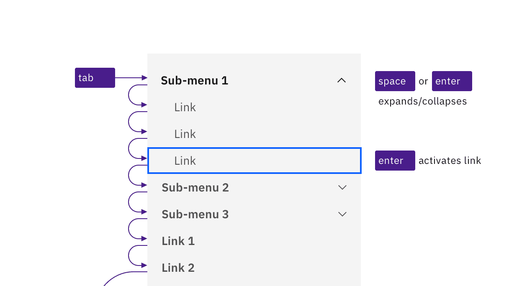
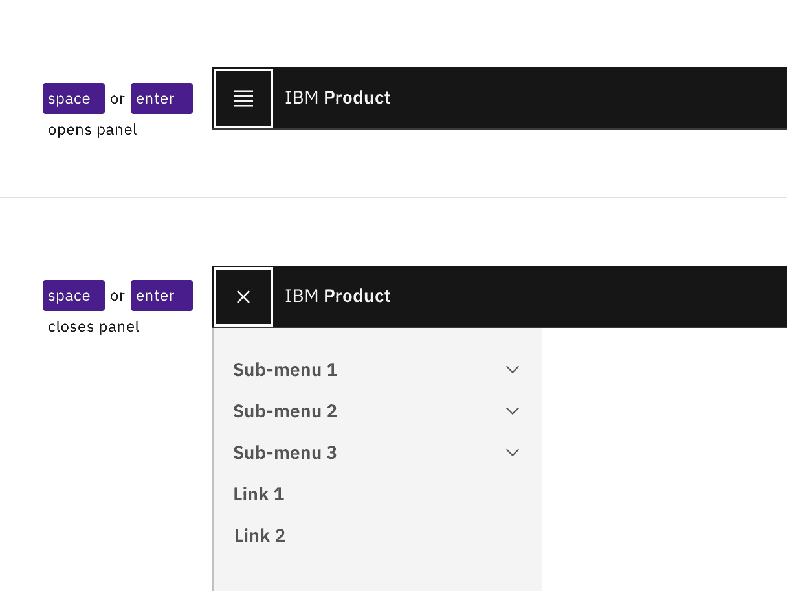
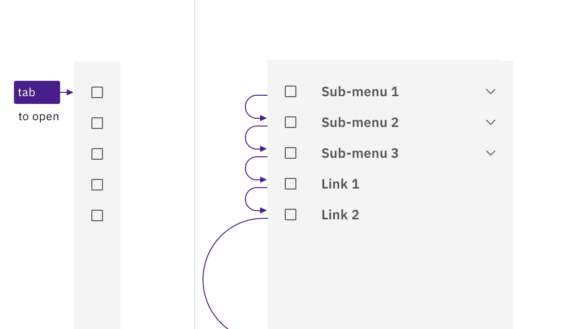

import A11yStatus from 'components/A11yStatus';

import {
  StructuredListWrapper,
  StructuredListHead,
  StructuredListBody,
  StructuredListRow,
  StructuredListInput,
  StructuredListCell,
  OrderedList,
  ListItem,
} from '@carbon/react';

<PageDescription>

No accessibility annotations are needed for UI shell left panels, but keep these
considerations in mind if you are modifying Carbon or creating a custom
component.

</PageDescription>

<AnchorLinks>

<AnchorLink>What Carbon provides</AnchorLink>
<AnchorLink>Development considerations</AnchorLink>

</AnchorLinks>

<A11yStatus layout="table" components="UI shell" />

## What Carbon provides

Carbon bakes keyboard operation into its components, improving the experience of
blind users and others who operate via the keyboard. Carbon incorporates many
other accessibility considerations, some of which are described below.

### Keyboard interaction

The left panel is comprised of both expandable sections (often called
"sub-menus") and links to content. All items can be reached by `Tab`. Toggling a
collapsed section with `Space` or `Enter` expands it, which reveals additional
links. Activating any of the links (with `Enter`) updates the main content area
and puts focus back at the top of the page. The link becomes bold to show it is
the current page. (It remains in the tab order, but can no longer be activated.)

<Row>
<Column colLg={8}>

<Caption>
  Sub-menus and links are reached by Tab. Space and Enter keys expand/collapse
  sub-menus, and the Enter key is used to activate links.
</Caption>

</Column>
</Row>

### Non-persistent left panel

On smaller screens, or if content is zoomed up to approximately 175%
magnification, Carbon responsively hides the left panel behind a 'hamburger'
button, which appears at the start of the UI shell header. Activating the button
(with `Space` or `Enter`) causes the left panel to appear. It overlays the main
content area, which often becomes dimmed. The hamburger button's icon becomes an
X, and must be activated to close the left panel.

<Row>
<Column colLg={8}>

<Caption>The hamburger button expands and collapses the left panel.</Caption>

</Column>
</Row>

The left panel can also be implemented as a "Side rail" variant, which slides
into view from the left side when reached by keyboard or hovered by mouse.
Keyboard interaction within the revealed left panel does not change. When users
tab out of the left panel, the side rail slides out of view.

<Row>
<Column colLg={8}>

<Caption>
  The side rail expands on hover or focus, and collapses when not hovered or
  focused.
</Caption>

</Column>
</Row>

## Development considerations

Keep these considerations in mind if you are modifying Carbon or creating a
custom component.

- The left panel is in a `<nav>` section with `aria-label="Side navigation"`.
- All items in the left panel are in a nested `<ul>` structure, which provides
  additional information to assistive technologies.
- Each 'sub-menu' is implemented as a `<button>` with `aria-expanded`.
- Activated links receive an `aria-current="page"` attribute.
