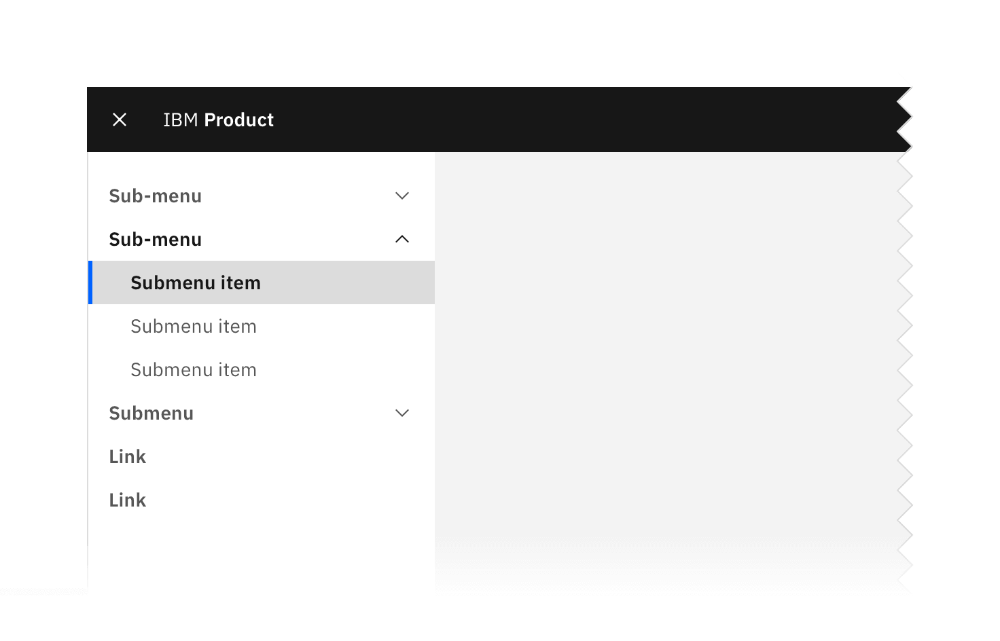
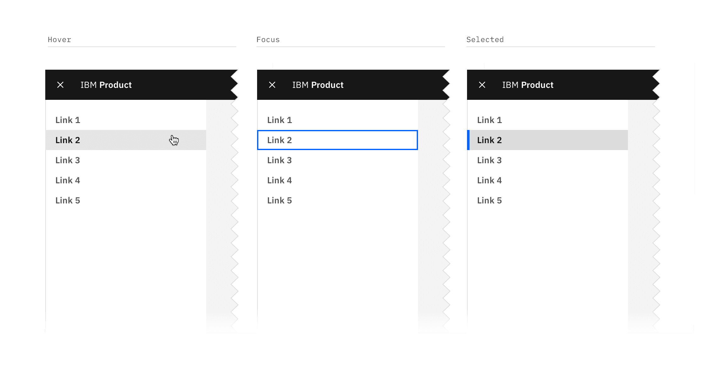
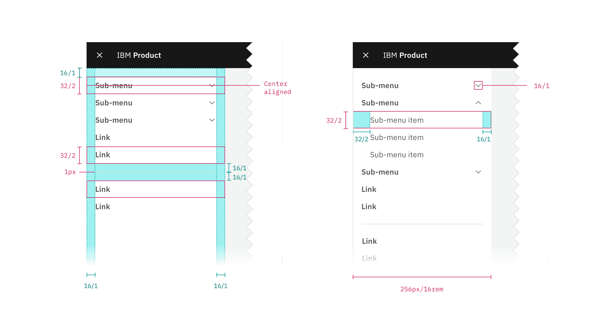
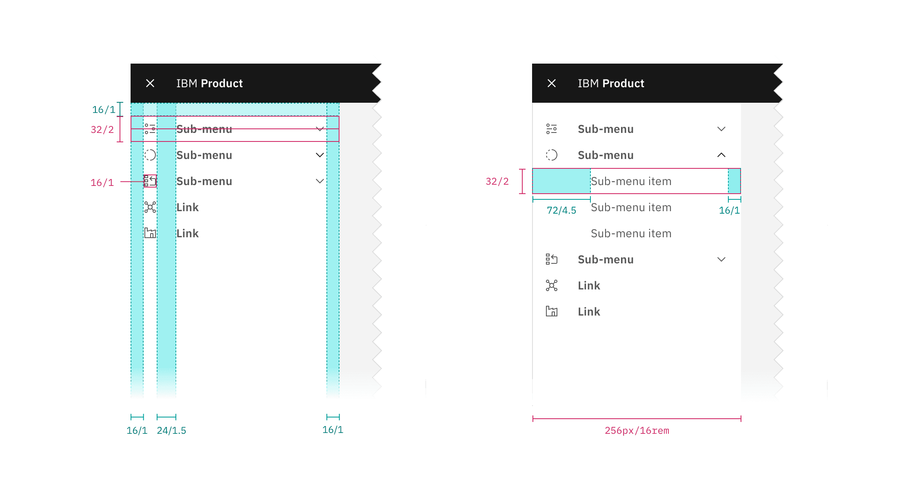

## Color

The UI Shell can be customized to use any of the four IBM themes by applying an
inline theme to the shell zone.

| Element | Property         | Color token   |
| ------- | ---------------- | ------------- |
| Panel   | background color | `$background` |

<Row>
<Column colLg={8}>

<Caption>UI shell side-nav example.</Caption>

</Column>
</Row>

### Link

| State    | Property         | Color token            |
| -------- | ---------------- | ---------------------- |
| Enabled  | text color       | `$text-secondary`      |
|          | icon color       | `$icon-secondary`      |
| Hover    | background color | `$background-hover`    |
|          | text color       | `$text-primary`        |
|          | icon color       | `$icon-primary`        |
| Focus    | border           | `$focus`               |
| Active   | background color | `$background-active`   |
|          | text color       | `$text-primary`        |
|          | icon color       | `$icon-primary`        |
| Selected | background color | `$background-selected` |
|          | text color       | `$text-primary`        |
|          | icon color       | `$icon-primary`        |
|          | border           | `$border-interactive`  |

<Caption>Link states</Caption>

### Sub-menu

| Element       | State    | Property         | Color token            |
| ------------- | -------- | ---------------- | ---------------------- |
| Sub-menu      | Enabled  | text color       | `$text-secondary`      |
|               |          | svg              | `$icon-secondary`      |
|               | Hover    | background color | `$background-hover`    |
|               |          | text color       | `$text-primary`        |
|               |          | svg              | `$icon-primary`        |
|               | Focus    | border           | `$focus`               |
|               | Active   | background color | `$background-active`   |
|               |          | text color       | `$text-primary`        |
|               |          | svg              | `$icon-primary`        |
| Sub-menu item | Enabled  | text color       | `$text-secondary`      |
|               | Hover    | background color | `$background-hover`    |
|               |          | text color       | `$text-primary`        |
|               | Focus    | border           | `$focus`               |
|               | Active   | background color | `$background-active`   |
|               |          | text color       | `$text-primary`        |
|               | Selected | background color | `$background-selected` |
|               |          | text color       | `$text-primary`        |
|               |          | border           | `$border-interactive`  |

<Caption>Sub-menu states</Caption>

### Icon

| State    | Property | Color token       |
| -------- | -------- | ----------------- |
| Enabled  | svg      | `$icon-secondary` |
| Hover    | svg      | `$icon-primary`   |
| Active   | svg      | `$icon-primary`   |
| Selected | svg      | `$icon-primary`   |

## Typography

Menu labels and text should be set in sentence case.

| Element       | Font-size (px/rem) | Font-weight    | Type token            |
| ------------- | ------------------ | -------------- | --------------------- |
| Link          | 14 / 0.875         | SemiBold / 600 | `$heading-compact-01` |
| Sub-menu      | 14 / 0.875         | SemiBold / 600 | `$heading-compact-01` |
| Sub-menu item | 14 / 0.875         | Regular / 400  | `$body-compact-01`    |

## Structure

The panel spans the full height of the browser and is fixed to the left edge of
the window.

| Element         | Property                    | px/rem   | Spacing token |
| --------------- | --------------------------- | -------- | ------------- |
| Panel           | width                       | 256 / 16 | –             |
| Link            | height                      | 32 / 2   | –             |
|                 | padding left, padding right | 16 / 1   | `$spacing-05` |
| Sub-menu        | height                      | 32 / 2   | –             |
|                 | padding left, padding right | 16 / 1   | `$spacing-05` |
| Sub-menu item   | height                      | 32 / 2   | –             |
|                 | padding left                | 32 / 2   | `$spacing-07` |
|                 | padding right               | 16 / 1   | `$spacing-05` |
| Selected border | width                       | 4 / 0.25 | –             |
| Icon            | size                        | 16 / 1   | –             |

<Caption fullwidth>
  Structure and spacing measurements for the side-nav | px | rem.
</Caption>

<Caption fullwidth>
  Structure and spacing measurements for side-nav with icons | px | rem.
</Caption>
