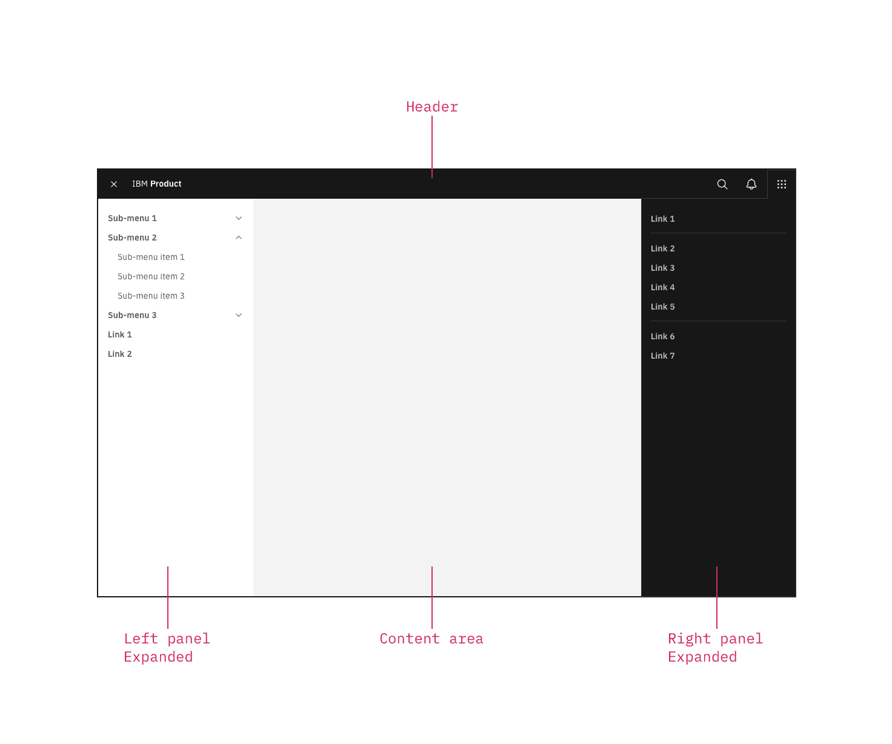
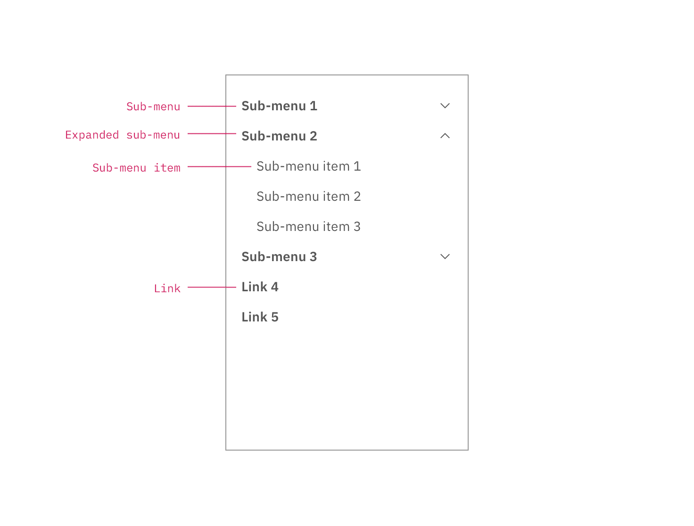

import A11yStatus from 'components/A11yStatus';

<PageDescription>

This left panel is part of the Carbon UI shell. A shell is a collection of
components shared by all products within a platform. It provides a common set of
interaction patterns that persist between and across products.

</PageDescription>

<AnchorLinks>

<AnchorLink>Live demo</AnchorLink>
<AnchorLink>General guidance</AnchorLink>
<AnchorLink>Anatomy</AnchorLink>
<AnchorLink>Behavior</AnchorLink>

</AnchorLinks>

## Live demo

<StorybookDemo
  themeSelector
  tall
  wide
  url="https://react.carbondesignsystem.com"
  variants={[
    {
      label: 'Header w/ sideNav',
      variant: 'components-ui-shell-header--header-w-side-nav',
    },
    {
      label: 'Header w/ actions and right panel',
      variant: 'components-ui-shell-header--header-w-actions-and-right-panel',
    },
    {
      label: 'Header w/ actions and switcher',
      variant: 'components-ui-shell-header--header-w-actions-and-switcher',
    },
    {
      label: 'Header w/ navigation',
      variant: 'components-ui-shell-header--header-w-navigation',
    },
    {
      label: 'Header w/ navigation and actions',
      variant: 'components-ui-shell-header--header-w-navigation-and-actions',
    },
    {
      label: 'Header w/ navigation, actions and sideNav',
      variant:
        'components-ui-shell-header--header-w-navigation-actions-and-side-nav',
    },
  ]}
/>

<A11yStatus layout="cards" components="UI shell" />

## Resources

<Row className="resource-card-group">
  <Column colLg={4} colMd={4} noGutterSm>
    <ResourceCard
      subTitle="UI Shell template"
      href="https://sketch.cloud/s/6a8e1d7b-f00a-4d8d-9d83-79ecf4dc12a0">
      <MdxIcon name="sketch" />
    </ResourceCard>
  </Column>
</Row>

## General guidance

The UI shell is made up of three components: The
[header](/components/UI-shell-header/usage), the left panel, and the
[right panel](/components/UI-shell-right-panel/usage). All three can be used
independently, but the components were designed to work together.

| Shell UI component |                                                                                                                                         |
| ------------------ | --------------------------------------------------------------------------------------------------------------------------------------- |
| Header             | The highest level of navigation. The header can be used on its own for simple products or be used to trigger the left and right panels. |
| Left panel         | An optional panel that is used for a product's navigation.                                                                              |
| Right panel        | An optional panel that shows additional system level actions or content associated with a system icon in the header.                    |

<Row>
<Column colLg={8}>

<Caption>UI shell components</Caption>

</Column>
</Row>

## Anatomy

The left panel contains secondary navigation and is positioned below the header
and fixed to the left. Both links and sub-menus can be used in the side-nav and
may be mixed together.

<Row>
<Column colLg={8}>

<Caption>Left panel with nested sub-menus.</Caption>

</Column>
</Row>

## Behavior

Use the left panel if there are more than five secondary navigation items, or if
you expect a user to switch between secondary items frequently. Sub-menus are
denoted with a chevron and expand when clicked, pushing the other items down in
the panel. To collapse the sub-menu, the user must again click the menu header
in the left panel.

The left panel does not support three tiers of navigation. If you have
additional content to display beneath a sub-menu, use tabs within the page.
