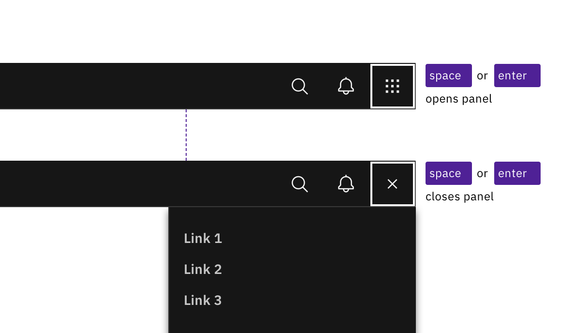
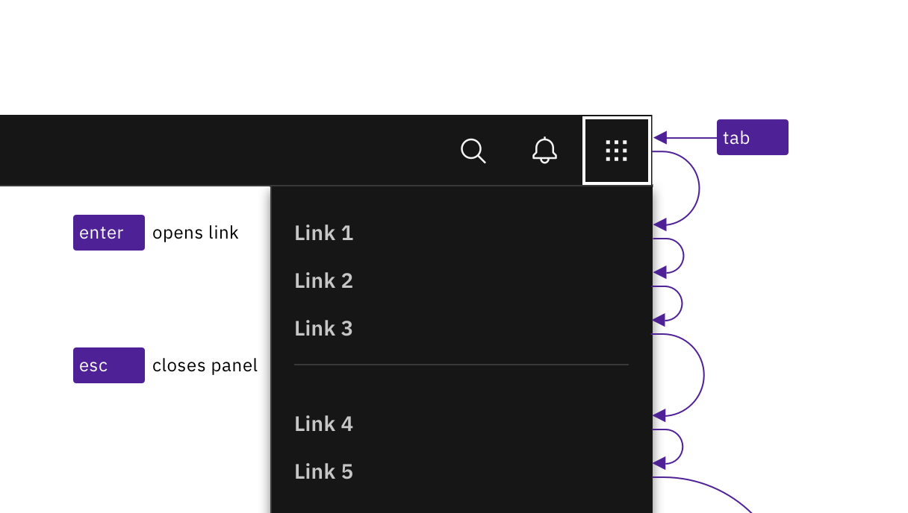
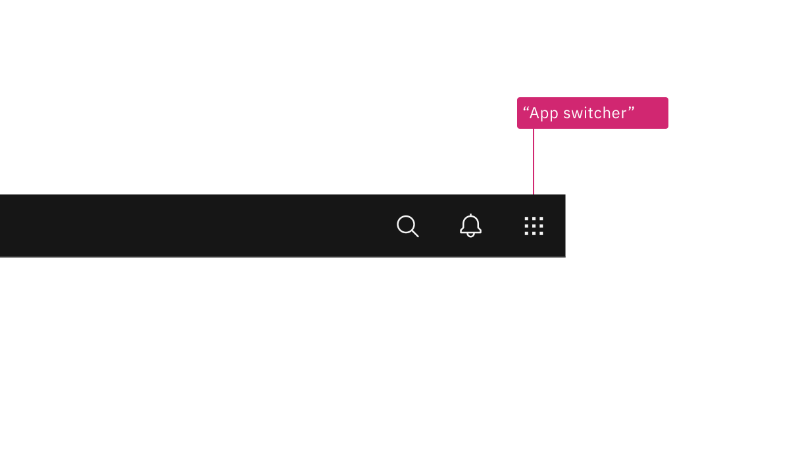

import {
  StructuredListWrapper,
  StructuredListHead,
  StructuredListBody,
  StructuredListRow,
  StructuredListInput,
  StructuredListCell,
  OrderedList,
  ListItem,
} from '@carbon/react';

<PageDescription>

No accessibility annotations are needed for the UI shell right panel, but keep
these considerations in mind if you are modifying Carbon or creating a custom
component.

</PageDescription>

<AnchorLinks>

<AnchorLink>What Carbon provides</AnchorLink>
<AnchorLink>Design recommendations</AnchorLink>
<AnchorLink>Development considerations</AnchorLink>

</AnchorLinks>

## What Carbon provides

Carbon bakes keyboard operation into its components, improving the experience of
blind users and others who operate via the keyboard. Carbon incorporates many
other accessibility considerations, some of which are described below.

### Keyboard interaction

The switcher button is the last item in the UI shell header. Activating the
button (with `Space` or `Enter`) opens the right panel over the main content
area. All actionable links in the panel can be reached by `Tab`. Activating any
of the links (with `Enter`) loads new content and closes the right panel. The
panel can also be closed by pressing `Esc` or by re-activating the switcher
button (which receives an X icon on activation).

<Row>
<Column colLg={8}>

<Caption>
  Activating the switch button with Enter or Space toggles the display of the
  right panel.
</Caption>

</Column>
</Row>

<Row>
<Column colLg={8}>

<Caption>
  Links are reached by Tab and activated by Enter key. Activating links or
  pressing Esc key closes panel.
</Caption>

</Column>
</Row>

## Design recommendations

### Annotating the switcher button name

When necessary, designers may need to change the icon-only switcher button's
name to match the right panel's scope. Depending on the context of the design,
common button names include "Switch site" or "App switcher".

<Row>
<Column colLg={8}>

<Caption>
  Annotate a name change to the switcher button if needed in your design.
</Caption>

</Column>
</Row>

## Development considerations

Keep these considerations in mind if you are modifying Carbon or creating a
custom component.

- The right panel is in a `<nav>` section.
- All links in the right panel are in a `<ul>` structure, which provides
  additional information to assistive technologies.
