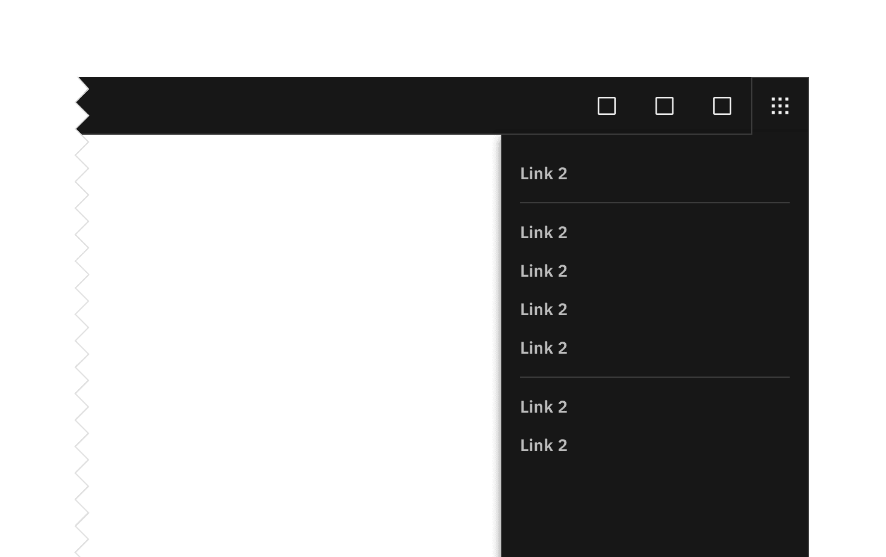
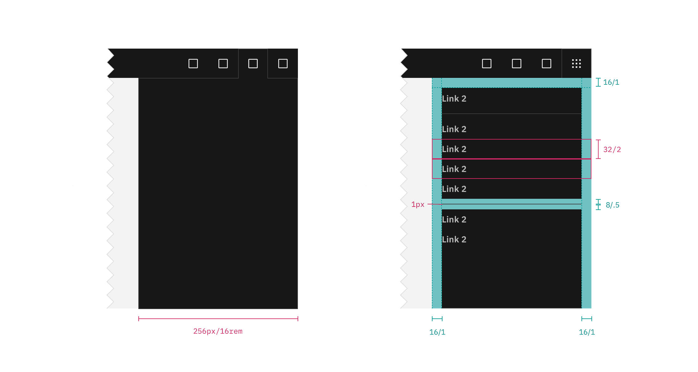

## Color

The UI Shell can be customized to use any of the four IBM themes by applying an
inline theme to the shell zone.

| Element       | Property                  | Color token      |
| ------------- | ------------------------- | ---------------- |
| Panel         | background color          | `$layer`         |
|               | border-left               | `$border-subtle` |
| Header action | border-left, border-right | `$border-subtle` |

<Row>
<Column colLg={8}>

<Caption>UI shell switcher example</Caption>

</Column>
</Row>

### Item

| State    | Property         | Color token       |
| -------- | ---------------- | ----------------- |
| Enabled  | text color       | `$text-secondary` |
| Hover    | background color | `$layer-hover`    |
|          | text color       | `$text-primary`   |
| Focus    | border           | `$focus`          |
| Active   | background color | `$layer-active`   |
|          | text color       | `$text-primary`   |
| Selected | background color | `$layer-selected` |
|          | text color       | `$text-primary`   |
| Disabled | text color       | `$text-disabled`  |

## Typography

| Element | Font-size (px/rem) | Font-weight    | Type token            |
| ------- | ------------------ | -------------- | --------------------- |
| Item    | 14 / 0.875         | SemiBold / 600 | `$heading-compact-01` |

## Structure

The panel spans the full height of the browser and is fixed to the right edge of
the window.

| Element       | Property                    | px/rem    | Spacing token |
| ------------- | --------------------------- | --------- | ------------- |
| Panel         | width                       | 256 / 16  | –             |
| Item          | height                      | 32 / 2    | –             |
|               | padding left, padding right | 16 / 1    | `$spacing-05` |
| Header action | height, width               | 48 / 8    | –             |
|               | svg                         | 20 / 1.25 | –             |

<Caption fullwidth>
  Structure and spacing measurements for right panel | px | rem.
</Caption>
