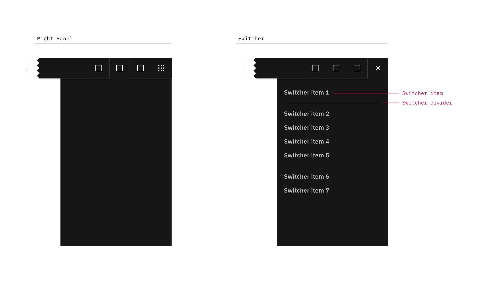
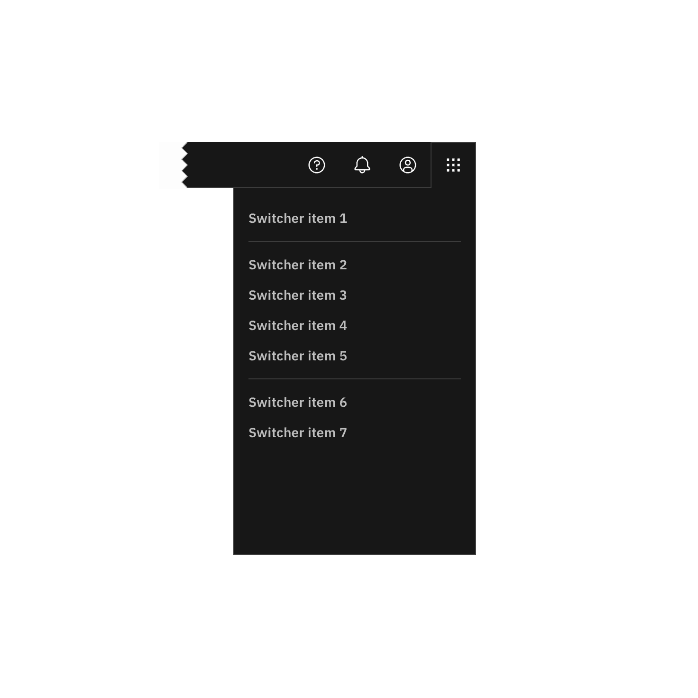
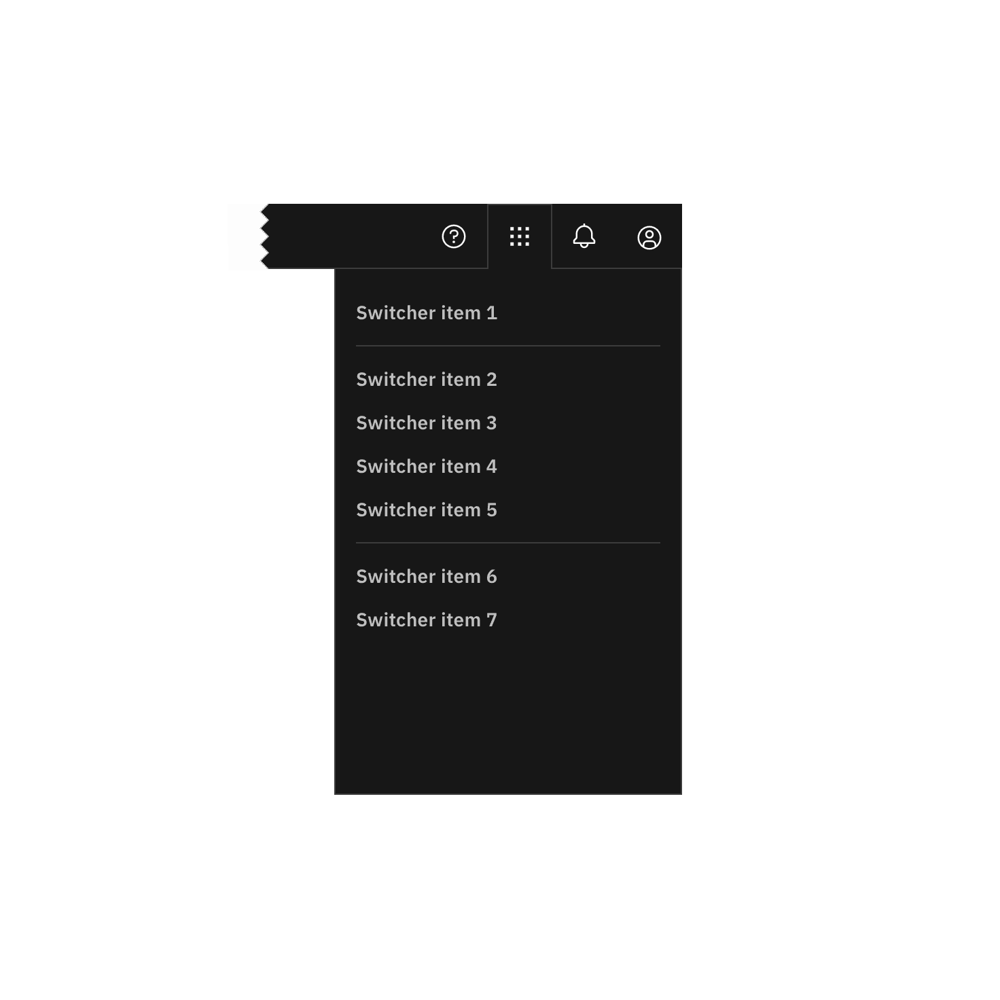

import A11yStatus from 'components/A11yStatus';

<PageDescription>

The right panel is part of the Carbon UI shell. A shell is a collection of
components shared by all products within a platform. It provides a common set of
interaction patterns that persist between and across products.

</PageDescription>

<AnchorLinks>

<AnchorLink>Live demo</AnchorLink>
<AnchorLink>General guidance</AnchorLink>
<AnchorLink>Anatomy</AnchorLink>
<AnchorLink>Behavior</AnchorLink>

</AnchorLinks>

## Live demo

<StorybookDemo
  themeSelector
  tall
  wide
  url="https://react.carbondesignsystem.com"
  variants={[
    {
      label: 'Header w/ sideNav',
      variant: 'components-ui-shell-header--header-w-side-nav',
    },
    {
      label: 'Header w/ actions and right panel',
      variant: 'components-ui-shell-header--header-w-actions-and-right-panel',
    },
    {
      label: 'Header w/ actions and switcher',
      variant: 'components-ui-shell-header--header-w-actions-and-switcher',
    },
    {
      label: 'Header w/ navigation',
      variant: 'components-ui-shell-header--header-w-navigation',
    },
    {
      label: 'Header w/ navigation and actions',
      variant: 'components-ui-shell-header--header-w-navigation-and-actions',
    },
    {
      label: 'Header w/ navigation, actions and sideNav',
      variant:
        'components-ui-shell-header--header-w-navigation-actions-and-side-nav',
    },
  ]}
/>

<A11yStatus layout="cards" components="UI shell" />

## Resources

<Row className="resource-card-group">
  <Column colLg={4} colMd={4} noGutterSm>
    <ResourceCard
      subTitle="UI Shell template"
      href="https://sketch.cloud/s/6a8e1d7b-f00a-4d8d-9d83-79ecf4dc12a0">
      <MdxIcon name="sketch" />
    </ResourceCard>
  </Column>
</Row>

## General guidance

The UI shell is made up of three components: The
[header](/components/UI-shell-header/usage), the
[left panel](/components/UI-shell-right-panel/usage), and the right panel. All
three can be used independently, but the components were designed to work
together.

| Shell UI component |                                                                                                                                         |
| ------------------ | --------------------------------------------------------------------------------------------------------------------------------------- |
| Header             | The highest level of navigation. The header can be used on its own for simple products or be used to trigger the left and right panels. |
| Left panel         | An optional panel that is used for a product's navigation.                                                                              |
| Right panel        | An optional panel that shows additional system level actions or content associated with a system icon in the header.                    |

<Row>
<Column colLg={8}>

<Caption>UI shell components</Caption>

</Column>
</Row>

## Anatomy

The right panel is invoked by icons on the right side of the header, and remains
anchored to that icon. Right panels have a consistent width, span the full
height of the viewport, and are flush to the right edge of the viewport.

Note that the switcher also lives in a right panel.

<Caption>
  The right panel configured as an empty header panel (left) and a switcher
  (right).
</Caption>

#### Switcher item

A switcher item is anything that changes what product, offering, or property
occupies the UI shell. Consider moments in a product when you switch from a
calendar to a mailbox, from Kubernetes to Catalog. These items belong in the
switcher.

#### Switcher divider

A switcher divider groups similar switcher items. You can use a divider to set
apart a parent domain, group child domains similar in hierarchy to the parent,
and set apart additional resources. The divider should not be used to separate
every switcher item.

### Switcher

The far right header icon is reserved for the switcher icon. The switcher icon
and the switcher panel should only be used together.

<DoDontRow>
  <DoDont type="do" colLg={6} caption="Positioned the switcher to the far right.">

  </DoDont>
  <DoDont type="dont" colLg={6}  caption="Do not position other icons to the right of the switcher.">

  </DoDont>
</DoDontRow>

<DoDontRow>
  <DoDont type="dont" colLg={6}  caption="Do not use another icon for the switcher.">

  </DoDont>
</DoDontRow>

## Behavior

#### Expansion

Right panels always float over page content, and always remain anchored to their
associated icon. You can have multiple right panels, but only one can be
expanded at any time.

#### Dismissal

Once expanded, the panel's associated icon is outlined, with its bottom border
flowing into the panel. To dismiss the panel, a user must select an item, or
click or tap the header icon.

#### Selected state

There is no selected state for right panel items. Even if a user is currently
within one of the panel items, the item remains unselected.
