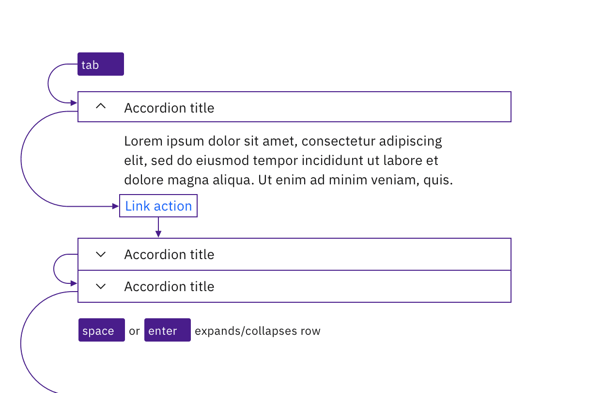
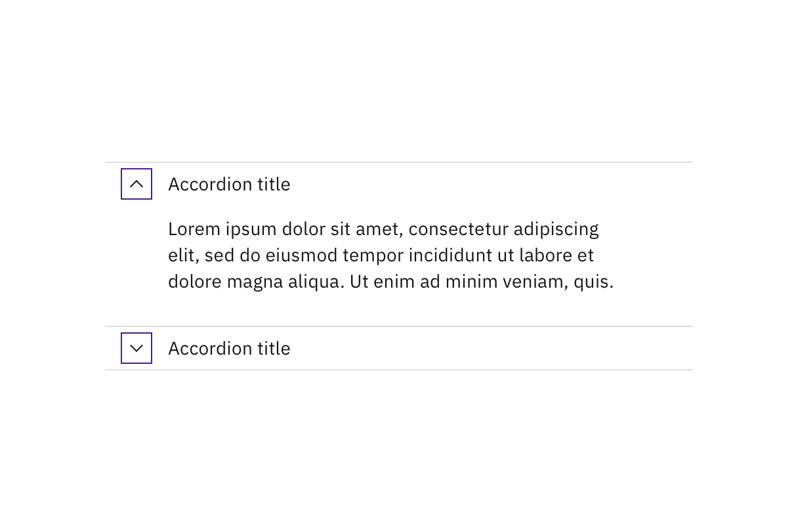
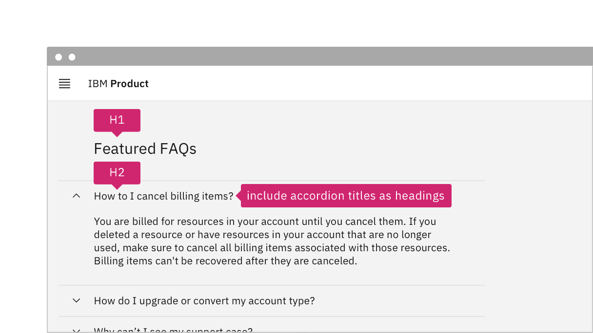

import {
  StructuredListWrapper,
  StructuredListHead,
  StructuredListBody,
  StructuredListRow,
  StructuredListInput,
  StructuredListCell,
  OrderedList,
  ListItem,
} from '@carbon/react';

<AnchorLinks>
  <AnchorLink>What Carbon provides</AnchorLink>
  <AnchorLink>Design recommendations</AnchorLink>
  <AnchorLink>Development considerations</AnchorLink>
</AnchorLinks>

## How it works

The accordion Carbon component provides a vertically stacked layout for web
content, commonly used to reduce scrolling. The accordion header is a button
that is used to expand and collapse each accordion panel. Buttons are used so
that the accordions are tab-able by keyboard users and accessible to screen
readers. `Tab` and `Shift-Tab` are used to navigate through each accordion
header and all focusable elements in the accordion should be included in the
page `Tab` sequence. `Enter` or `Space` expand and collapse each accordion
panel.

When an accordion panel is collapsed the content is hidden, therefore the ARIA
state `aria-expanded="false"` advises users of assistive technologies that the
accordion panel is not visible. When the accordion header is expanded the ARIA
state changes to `aria-expanded="true"` and the accordion panel content is
displayed. Each accordion header contains an ARIA label, and the header buttons
have an ARIA-control property set that points to the unique id of the panel it
controls. When focus is on the accordion header there is a prominent style
change to the border as well as background of the accordion header.

## Accessibility considerations

This component has been validated to meet the
[WCAG 2.0 AA](https://www.w3.org/TR/WCAG20/) and
[Section 508](http://www.section508.gov/) accessibility guidelines, however
changes made by the content owner can affect accessibility compliance. Be sure
to review and follow the guidance in this section when updating or adding new
content to this component.

1. Each accordion header must have a unique title (implemented via the label for
   the button) that clearly describes the accordion panel content. This is
   particularly helpful for users of assistive technologies so they have the
   necessary information to efficiently navigate the content without having to
   expand every section.
1. Carbon components should be used to create the content that displays within
   each accordion panel.
1. Avoid keyboard traps when adding components to the accordion panel. For
   example, the user expands an accordion, but is unable to tab to the next
   focusable element.
1. Although the accordion component passes accessibility testing, content
   authors need to ensure the content that is added to the accordion is
   accessible. For example, if you add an image to the accordion header or panel
   you need to include alternative text to pass accessibility testing.

## Resources

- [W3C WAI-ARIA Authoring Practices Accordion Design Pattern](https://www.w3.org/TR/wai-aria-practices/#accordion)
  covers the usage of ARIA names, state and roles, as well as the expected
  keyboard interactions.
- [IBM Accessibility Requirements:](https://www.ibm.com/able/requirements/requirements/)
  - [1.3.1 Info and Relationships](https://www.ibm.com/able/requirements/requirements/#1_3_1)
    (WCAG Success Criteria
    [1.3.1](https://www.w3.org/WAI/WCAG21/Understanding/info-and-relationships))
  - [1.3.2 Meaningful Sequence](https://www.ibm.com/able/requirements/requirements/#1_3_2)
    (WCAG Success Criteria
    [1.3.2](https://www.w3.org/WAI/WCAG21/Understanding/meaningful-sequence))
  - [2.1.1 Keyboard](https://www.ibm.com/able/requirements/requirements/#2_1_1)
    (WCAG Success Criteria
    [2.1.1](https://www.w3.org/WAI/WCAG21/Understanding/keyboard))
  - [2.1.2 No Keyboard Trap](https://www.ibm.com/able/requirements/requirements/#2_1_2)
    (WCAG Success Criteria
    [2.1.2](https://www.w3.org/WAI/WCAG21/Understanding/no-keyboard-trap))
  - [2.4.3 Focus Order](https://www.ibm.com/able/requirements/requirements/#2_4_3)
    (WCAG Success Criteria
    [2.4.3](https://www.w3.org/WAI/WCAG21/Understanding/focus-order))
  - [2.4.6 Headings and Labels](https://www.ibm.com/able/requirements/requirements/#2_4_6)
    (WCAG Success Criteria
    [2.4.6](https://www.w3.org/WAI/WCAG21/Understanding/headings-and-labels))
  - [2.4.7 Focus Visible](https://www.ibm.com/able/requirements/requirements/#2_4_7)
    (WCAG Success Criteria
    [2.4.7](https://www.w3.org/WAI/WCAG21/Understanding/focus-visible))
  - [4.1.2 Name, Role, Value](https://www.ibm.com/able/requirements/requirements/#4_1_2)
    (WCAG Success Criteria
    [4.1.2](https://www.w3.org/TR/UNDERSTANDING-WCAG20/ensure-compat-rsv.html))

## Accessibility testing

Accessibility issues are tracked in the
[Carbon Component GitHub repository](https://github.com/carbon-design-system/carbon/issues?q=is%3Aopen+label%3A%22type%3A+a11y+%E2%99%BF%22+label%3A%22component%3A+accordion%22+).

### Automated test

Carbon bakes keyboard operation into its components, improving the experience of
blind users and others who operate via the keyboard. Carbon incorporates many
other accessibility considerations, some of which are described below.

### Keyboard interactions

Each accordion is a tab stop. `Space` or `Enter` keys expand or collapse
accordions, which are collapsed by default. Interactive elements within expanded
accordions integrate into the tab order automatically.

<Row>
<Column colLg={8}>

<Caption>
  Accordions and interactive elements in the expanded content are in the tab
  order and keyboard operable.
</Caption>

</Column>
</Row>

### Labeling and states

The collapsed or expanded state of the accordions is
[programmatically set](https://www.ibm.com/able/requirements/requirements/#4_1_2)
by default, eliminating the need for designers to provide
[text equivalents](https://www.ibm.com/able/toolkit/design/content/text-equivalents/)
for the chevron icons.

<Row>
<Column colLg={8}>

<Caption>Carbon handles the accessibility of the chevron indicators.</Caption>

</Column>
</Row>

## Design recommendations

Design annotations are needed for the following instances.

### Headings

Carbon accordions are not set as headings by default. For improved
accessibility, annotate accordions as headings on the first occurrence in a
product. Annotate the heading level of accordions as needed. See
[Indicate heading levels](https://www.ibm.com/able/toolkit/design/content/text-meaning/#heading-levels).

<Row>
<Column colLg={8}>

<Caption>
  If accordion titles act as headings, annotate for development.
</Caption>

</Column>
</Row>

### Alignment

Carbon chevrons are right-aligned by default, but left-aligned chevrons are more
accessible for users with low vision, as the expanded/collapsed indicator is
closer to the accordion title.

<Row>
<Column colLg={8}>

<Caption>Annotate if the accordion chevrons should be left-aligned.</Caption>

</Column>
</Row>

## Development considerations

Keep these considerations in mind if you are modifying Carbon or creating a
custom component:

- The accordion header has a role of `<button>`, with an `aria-expanded`
  attribute set to `"true"` or `"false"`.
- The button has an `aria-controls` property set to the unique id of the panel
  it controls.
- Since accordions are typically grouped together, Carbon puts each button
  inside a list item in an unordered list, which provides additional context to
  screen reader users; where only one accordion is used, it should not be put in
  a list.
- When accordion titles are used as headings, the buttons are also wrapped in an
  element with an appropriate heading level; ARIA can be used to set both the
  heading role and the level (via `aria-level`).
- See the
  [ARIA authoring practices](https://www.w3.org/TR/wai-aria-practices-1.2/#accordion)
  for more guidance.
