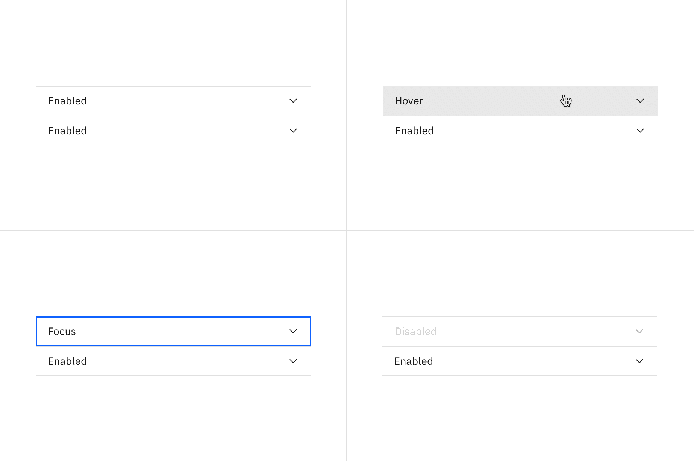
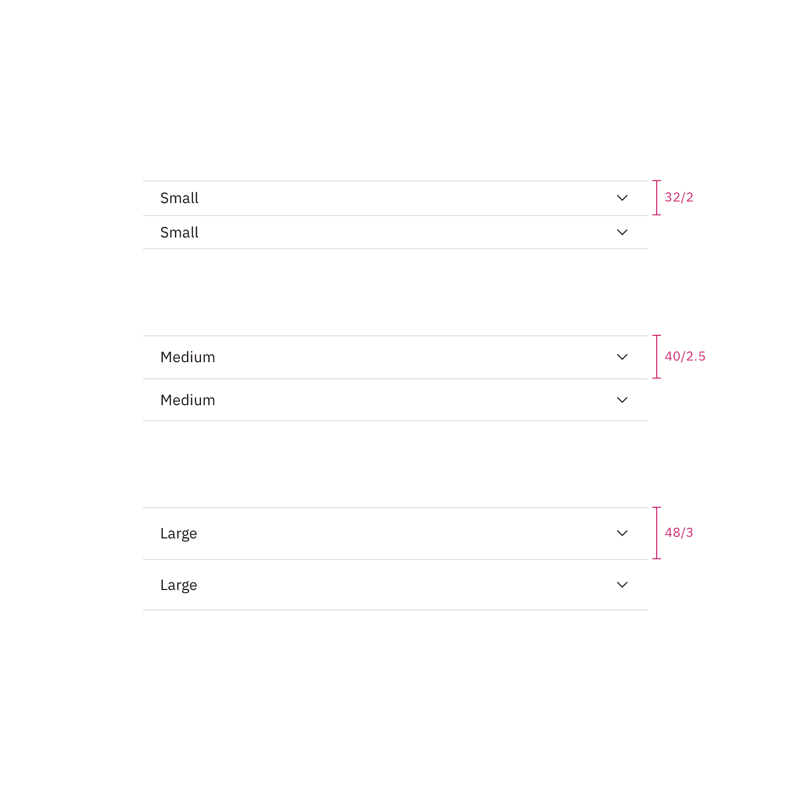

<AnchorLinks>

<AnchorLink>Color</AnchorLink>
<AnchorLink>Typography</AnchorLink>
<AnchorLink>Structure</AnchorLink>
<AnchorLink>Sizes</AnchorLink>

</AnchorLinks>

## Color

| Element | Property   | Color token      |
| ------- | ---------- | ---------------- |
| Title   | color      | `$text-primary`  |
| Content | color      | `$text-primary`  |
| Icon    | fill       | `$icon-primary`  |
| Item    | border-top | `$border-subtle` |

### Interactive states

| Element | State    | Property   | Color token         |
| ------- | -------- | ---------- | ------------------- |
| Header  | Hover    | background | `$background-hover` |
|         | Focus    | border     | `$focus`            |
| Title   | Disabled | background | `$text-disabled`    |
| Icon    | Disabled | fill       | `$icon-disabled`    |
| Item    | Disabled | border-top | `$border-disabled`  |

<Row>
<Column colLg={12}>

</Column>
</Row>

<Caption>Examples of enabled, hover, focus, and disabled states</Caption>

## Typography

All accordion titles are set in sentence case. See the accordion
[content guidelines](/components/accordion/usage#content) for more details.

| Element | Font-size (px/rem) | Font-weight   | Type token |
| ------- | ------------------ | ------------- | ---------- |
| Title   | 14 / 0.875         | Regular / 400 | `$body-01` |
| Content | 14 / 0.875         | Regular / 400 | `$body-01` |

## Structure

There is no max-height for an open panel but an accordion may
[scroll](/components/accordion/usage#scrolling-content) if constrained by
vertical space. The width of an accordion varies based on the content, layout,
and page design. The icon used in the header is a `chevron`.

| Element | Property       | px/rem   | Spacing token |
| ------- | -------------- | -------- | ------------- |
| Header  | height         | 40 / 2.5 | –             |
| Item    | border-top     | 1        | –             |
| Icon    | size           | 16 / 1   | –             |
|         | padding-right  | 16 / 1   | `$spacing-05` |
| Title   | margin-left    | 16 / 1   | `$spacing-05` |
| Panel   | padding-right  | 25%      | –             |
|         | padding-top    | 8 / 0.5  | `$spacing-03` |
|         | padding-left   | 16 / 1   | `$spacing-05` |
|         | padding-bottom | 24 / 1.5 | `$spacing-06` |

<Caption>Structure and spacing measurements for accordion | px / rem</Caption>

### Margin right

Accordions have a variable right margin that changes based on its width.
Accordions that are 640px and wider have a `margin-right: 25%` with the
percentage being based off the width of the container it is placed in. At
smaller widths, the `margin-right` is a fixed size.

Body copy, including titles, in an accordion always follows the margin-right
rules. However, inputs and other components may still expand to the full width
of the accordion panel.

| Accordion width | Margin-right | Spacing token |
| --------------- | ------------ | ------------- |
| > 640           | 25%          | –             |
| 420-640px       | 64px / 4rem  | `$spacing-10` |
| < 420           | 16px / 1rem  | `$spacing-05` |

## Sizes

| Element | Size        | Height (px/rem) |
| ------- | ----------- | --------------- |
| Header  | Small (sm)  | 32 / 2          |
|         | Medium (md) | 40 / 2.5        |
|         | Large (lg)  | 48 / 3          |

