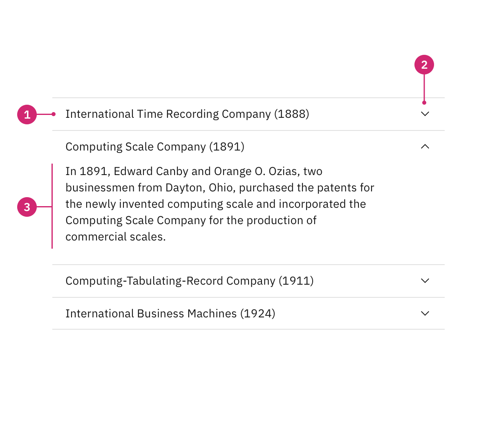
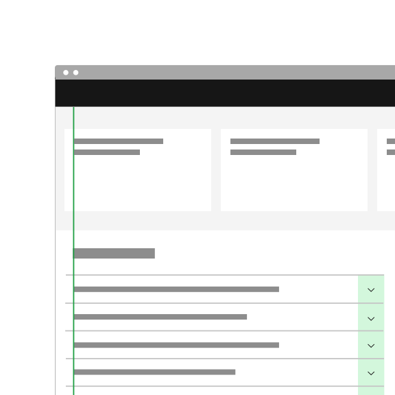
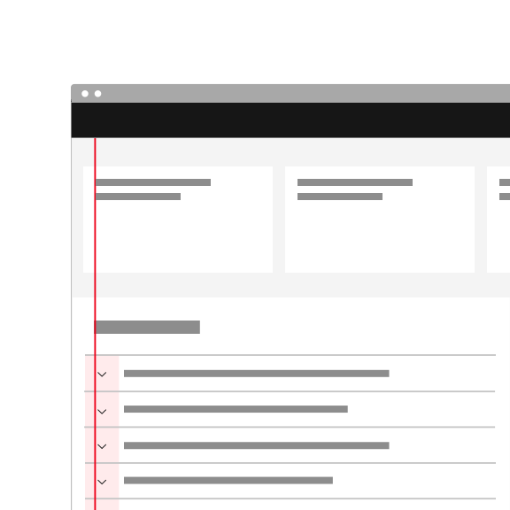
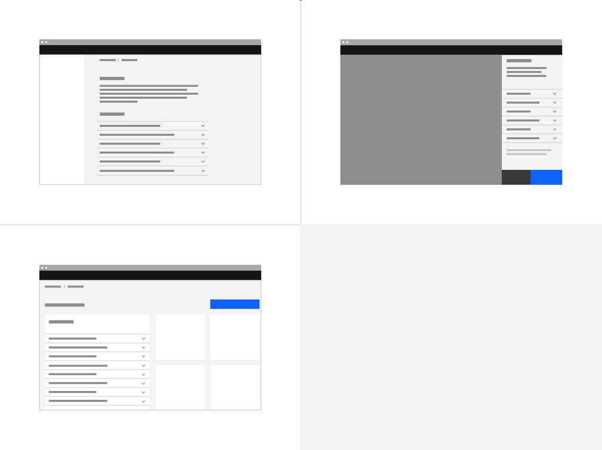
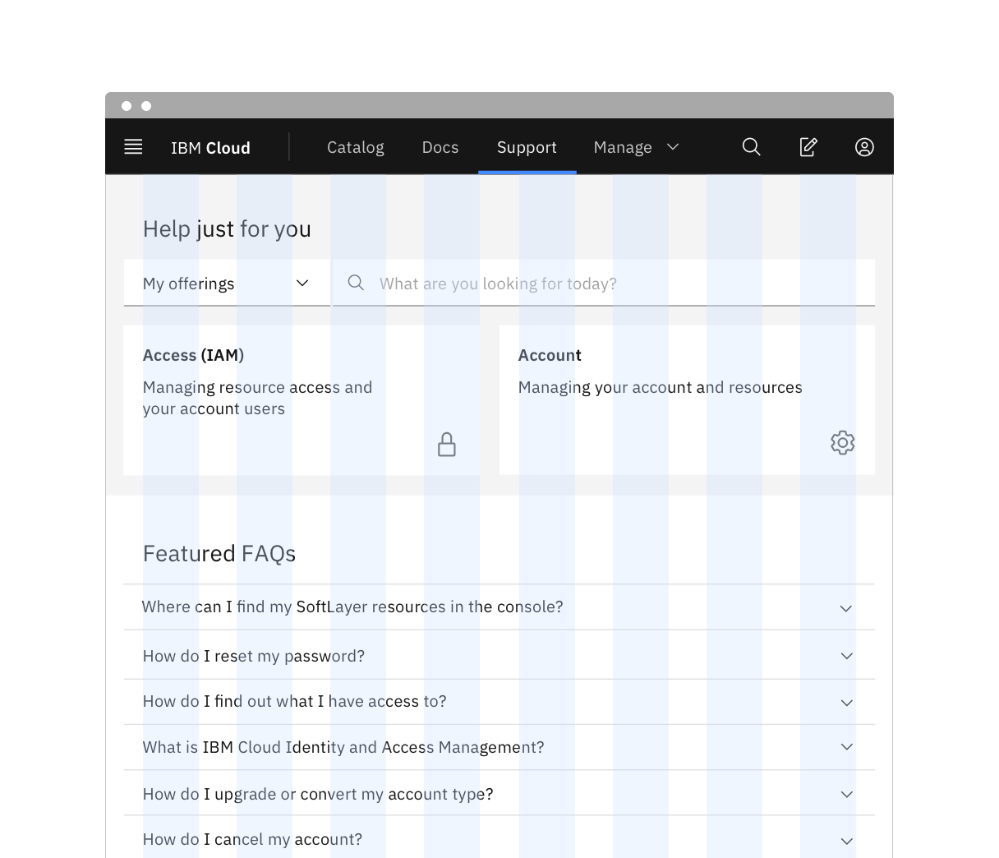
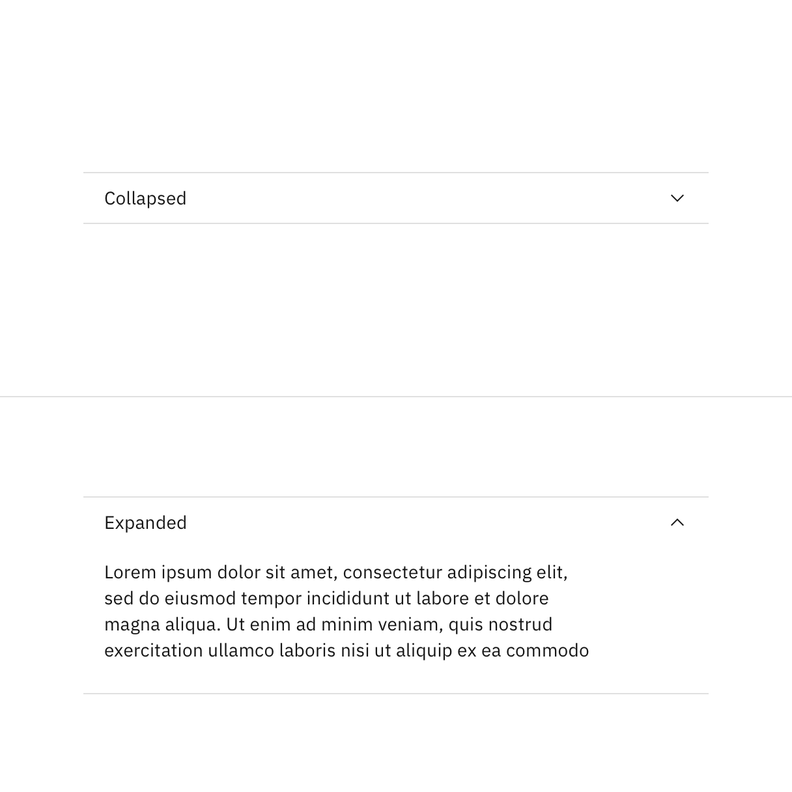
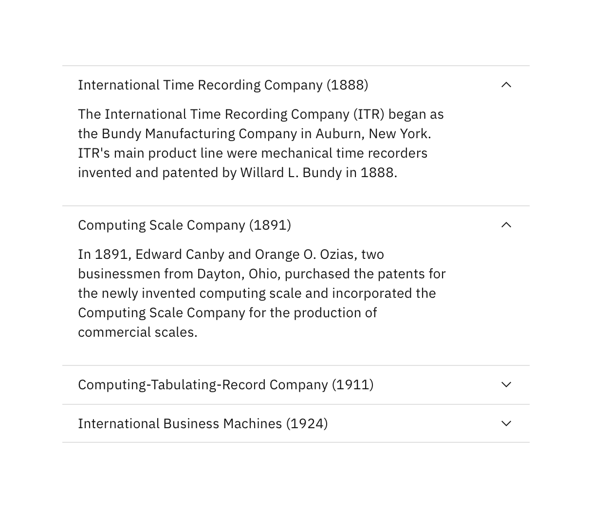
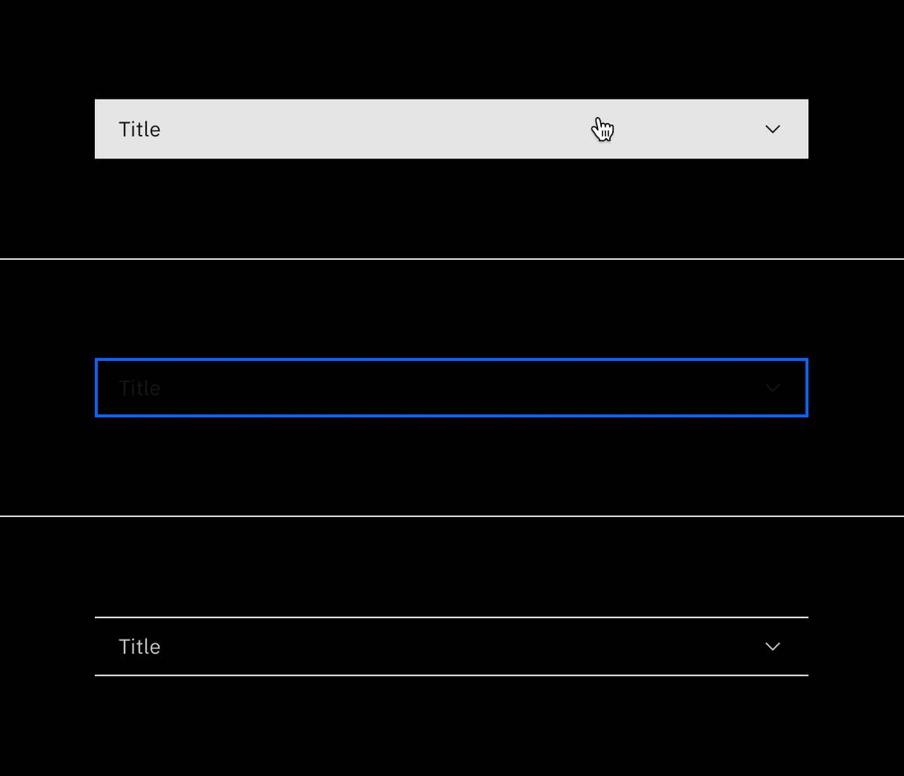
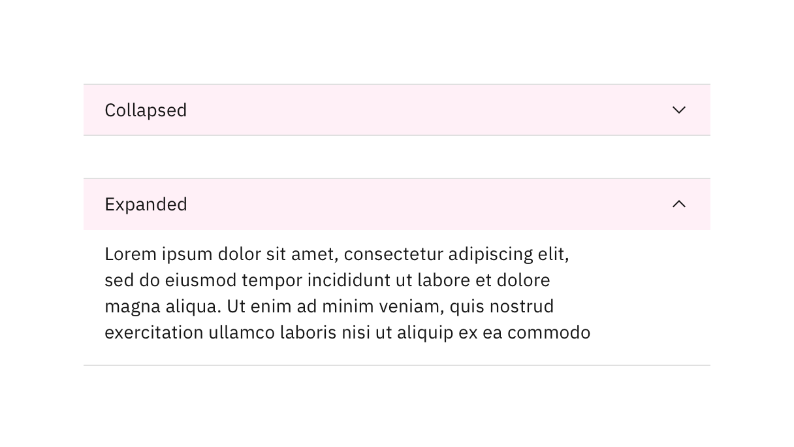

<PageDescription>

An accordion is a vertically stacked list of headers that reveal or hide
associated sections of content.

</PageDescription>

<AnchorLinks>

<AnchorLink>Overview</AnchorLink>
<AnchorLink>Live demo</AnchorLink>
<AnchorLink>Formatting</AnchorLink>
<AnchorLink>Content</AnchorLink>
<AnchorLink>Behaviors</AnchorLink>
<AnchorLink>Related</AnchorLink>
<AnchorLink>References</AnchorLink>
<AnchorLink>Feedback</AnchorLink>

</AnchorLinks>

## Overview

The accordion component delivers large amounts of content in a small space
through progressive disclosure. The header title give the user a high level
overview of the content allowing the user to decide which sections to read.

Accordions can make information processing and discovering more effective.
However, it does hide content from users and it's important to account for a
user not noticing or reading all of the included content. If a user is likely to
read all of the content then don't use an accordion as it adds the burden of an
extra click; instead use a full scrolling page with normal headers.

### When to use:

- To organize related information.
- To shorten pages and reduce scrolling when content is not crucial to read in
  full.
- When space is at a premium and long content cannot be displayed all at once,
  like on a mobile interface or in a side panel.

## Live demo

<ComponentDemo
  components={[
    {
      id: 'accordion',
      label: 'Accordion',
    },
  ]}>
  <ComponentVariant
    id="accordion"
    knobs={{
      Accordion: ['align', 'disabled'],
      AccordionItem: ['open', 'disabled'],
    }}
    links={{
      React:
        'http://react.carbondesignsystem.com/?path=/story/accordion--default',
      Angular:
        'https://angular.carbondesignsystem.com/?path=/story/components-accordion--basic',
      Vue:
        'http://vue.carbondesignsystem.com/?path=/story/components-cvaccordion--default',
      Vanilla: 'https://the-carbon-components.netlify.com/?nav=accordion',
    }}>
    {`
  <Accordion>
    <AccordionItem title="Title 1">
The accordion component delivers large amounts of content in a small space through progressive disclosure. The user gets key details about the underlying content and can choose to expand that content within the constraints of the accordion. Accordions work especially well on mobile interfaces or whenever vertical space is at a premium.
</AccordionItem>
    <AccordionItem title="Title 2">
The accordion component delivers large amounts of content in a small space through progressive disclosure. The user gets key details about the underlying content and can choose to expand that content within the constraints of the accordion. Accordions work especially well on mobile interfaces or whenever vertical space is at a premium.
</AccordionItem>
    <AccordionItem title="Title 3">
The accordion component delivers large amounts of content in a small space through progressive disclosure. The user gets key details about the underlying content and can choose to expand that content within the constraints of the accordion. Accordions work especially well on mobile interfaces or whenever vertical space is at a premium.
</AccordionItem>
  </Accordion>
  `}
  </ComponentVariant>
</ComponentDemo>

## Formatting

### Anatomy

<Row>
<Column colLg={8}>

</Column>
</Row>

1. **Header**: contains the section title and is control for revealing the
   panel.
2. **Icon**: indicates if the panel is open or closed.
3. **Panel**: the section of content associated with an accordion header.

### Alignment

By default the chevron icon is placed on the `end` side of the header. This
allows for the title on the `start` side to align with other type elements in
the layout.

<DoDontRow>
<DoDont
colMd={4} colLg={4}
caption="Do use the default icon alignment to keep accordion text aligned with other content on the page.">

</DoDont>
<DoDont
colMd={4} colLg={4}
type="dont"
caption="Don’t place icons on the left and create misalignment with the other text on the page.">

</DoDont>
</DoDontRow>

#### Modifier

In rare scenarios, the accordion can be modified to place the icon in front of
the title to function more like a tree. However, most instances should use the
default alignment and for any pure content or documentation purposes, the
default alignment is required. Icon placement should be consistent throughout
your experience.

### Placement

Accordions can be placed with main page content or placed inside of a container
such as a side panel or tile.

<Row>
<Column  colLg={12} colMd={12} colSm={4}>
<ArtDirection>

</ArtDirection>
</Column>
</Row>

#### Grid placement

When placing an accordion on the 2x Grid the indented title aligns to the grid
columns and the top and bottom borders hang in the gutter.

<Row>
<Column colLg={8}>

</Column>
</Row>

## Content

### Main elements

#### Title

- The title should be as brief as possible while still being clear and
  descriptive.
- Each title should be wrapped in a
  [role heading](https://www.w3.org/TR/wai-aria-practices-1.1/#wai-aria-roles-states-and-properties)
  (h1-h6) that is appropriate for the information architecture of the page.

#### Body copy

- Content inside of a section may be split into paragraphs and include
  sub-headers if needed.

### Scrolling content

When the accordion content is longer than the viewport the whole accordion
should vertically scroll. Content should not scroll inside of an individual
panel. Content should never scroll horizontally in an accordion.

## Behaviors

### States

The accordion component has two main states: **collapsed** and **expanded**. The
chevron icon at the end of the accordion indicates which state the accordion is
in. The chevron points down to indicate collapsed and up to indicate expanded.

Accordions begin by default in the collapsed state with all content panels
closed. Starting in a collapsed state gives the user a high level overview of
the available information.

<Row>
<Column colLg={8}>

</Column>
</Row>

A user can then independently expand each section of the accordion allowing for
multiple sections to be open at once.

<Row>
<Column colLg={8}>

</Column>
</Row>

In addition to the collapsed and expanded states, accordions also have
interactive states for focus, hover, and disabled. See the
[style tab](/components/accordion/style) for more details.

<Row>
<Column colLg={8}>

</Column>
</Row>

### Interactions

#### Mouse

Users can trigger a state change by clicking on the chevron or clicking anywhere
in the header area.

<Row>
<Column colLg={8}>

</Column>
</Row>

#### Keyboard

Users can trigger a state change by pressing `Enter` or `Space` while the header
area has focus. For additional keyboard interactions, see the
[accessibility tab](/components/accordion/accessibility#how-it-works).

Users can navigate between accordion headers by pressing `Tab` or `Shift-Tab`.

#### Screen readers

VoiceOver: Users can trigger a state change by pressing `Control-Option-Space`
or `Space` while the header area has screen reader focus.

JAWS: Users can trigger a state change by pressing `Enter` or `Space` while the
header area has screen reader focus.

NVDA: Users can trigger a state change by pressing `Enter` or `Space` while the
header area has screen reader focus.

For additional information, see
[screen reader tests](https://www.carbondesignsystem.com/components/accordion/accessibility#macos-screen-reader-tests).

## Related

The following components are additional ways to organize content. Consider the
type and length of content you are working with when choosing a content
container. Longer form content may benefit from tabs or a content switcher while
very short content might do better in a structured list.

- [Content switcher](/components/content-switcher/usage)
- [Progress indicator](/components/progress-indicator/usage)
- [Structured list](/components/structured-list/usage)
- [Tabs](/components/tabs/usage)
- Tree view

## References

- Hoa Loranger,
  [Accordions Are Not Always the Answer for Complex Content on Desktops](https://www.nngroup.com/articles/accordions-complex-content/)
  (Nielsen Norman Group, 2014)

## Feedback

Help us improve this component by providing feedback, asking questions, and
leaving any other comments on
[GitHub](https://github.com/carbon-design-system/carbon-website/issues/new?assignees=&labels=feedback&template=feedback.md).
