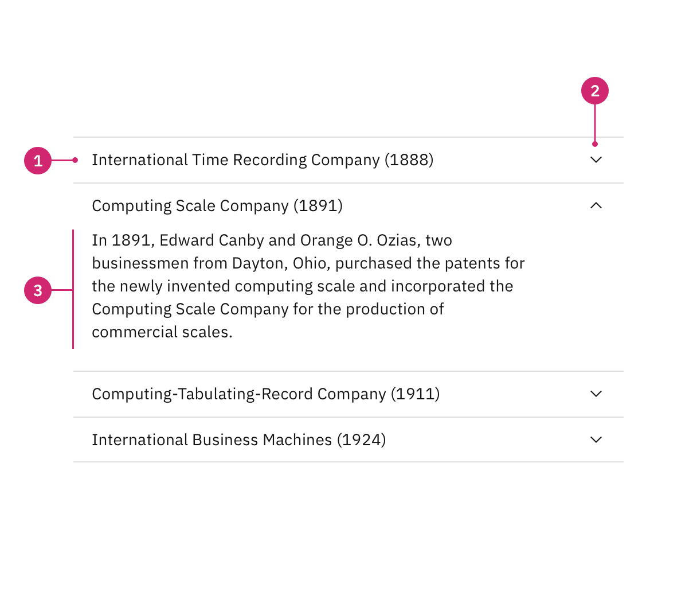
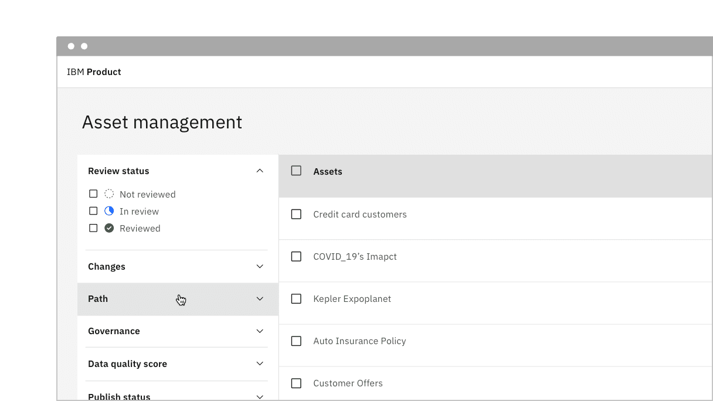
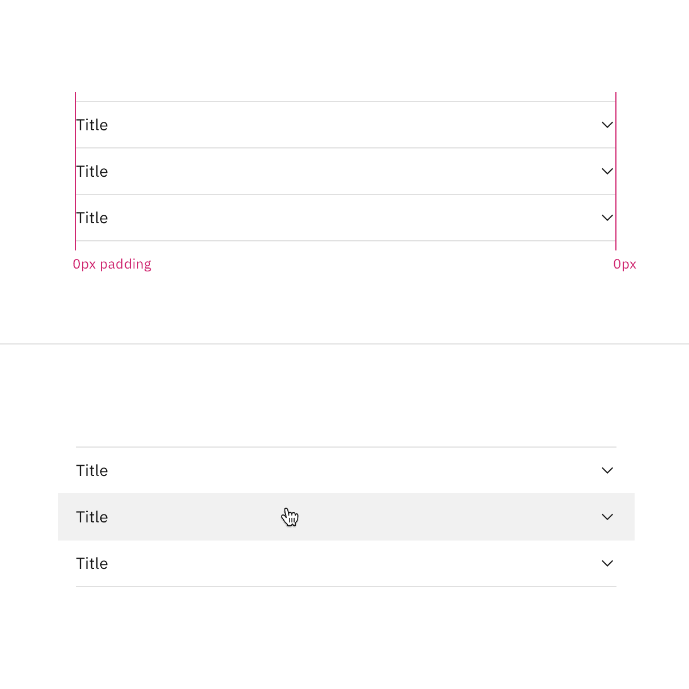
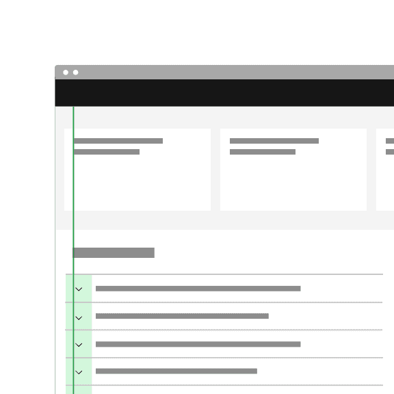
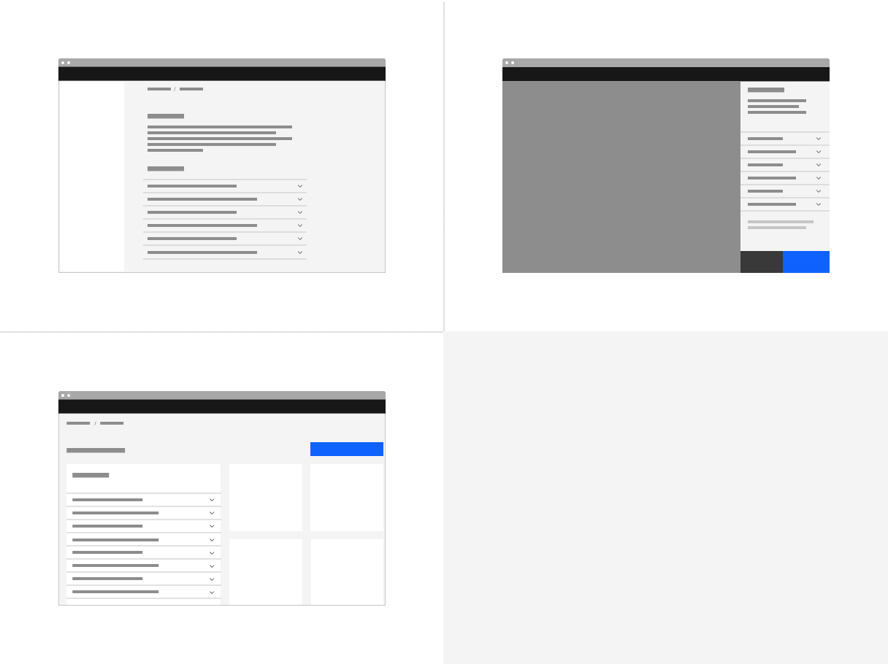
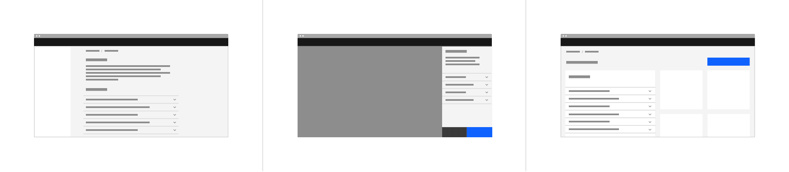
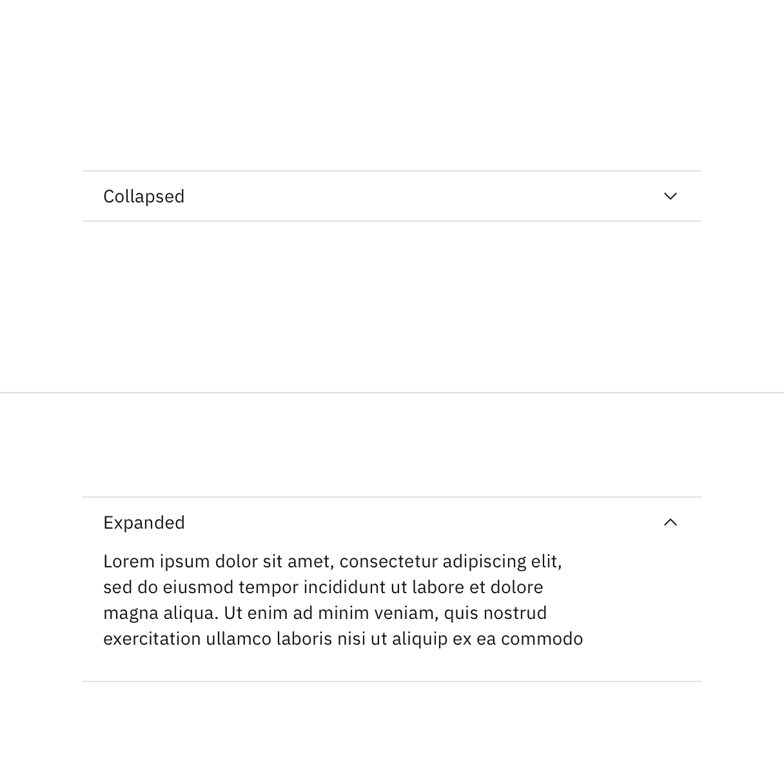
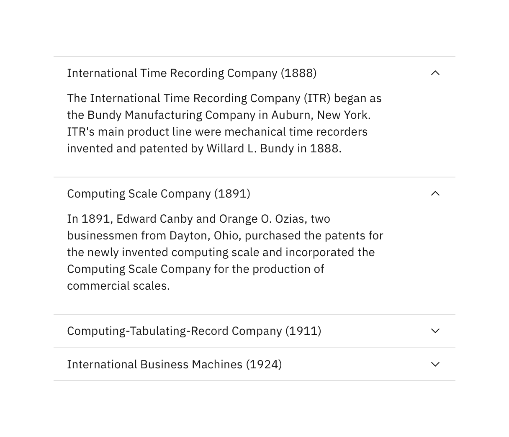
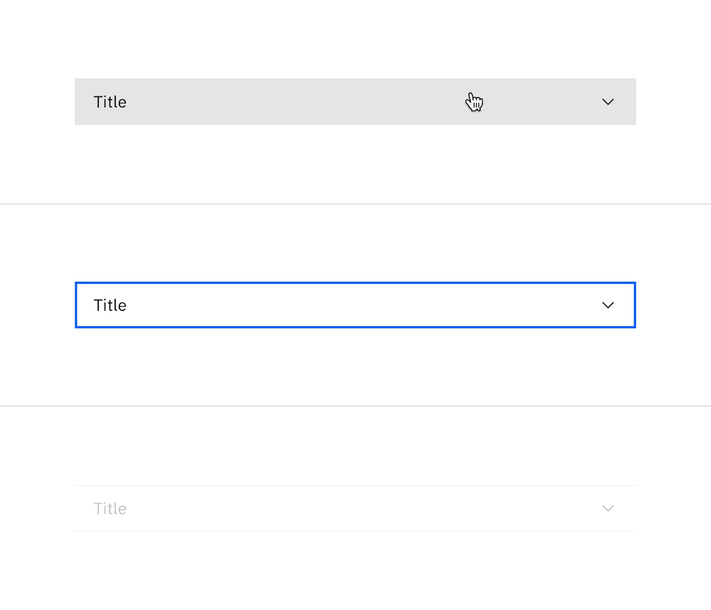
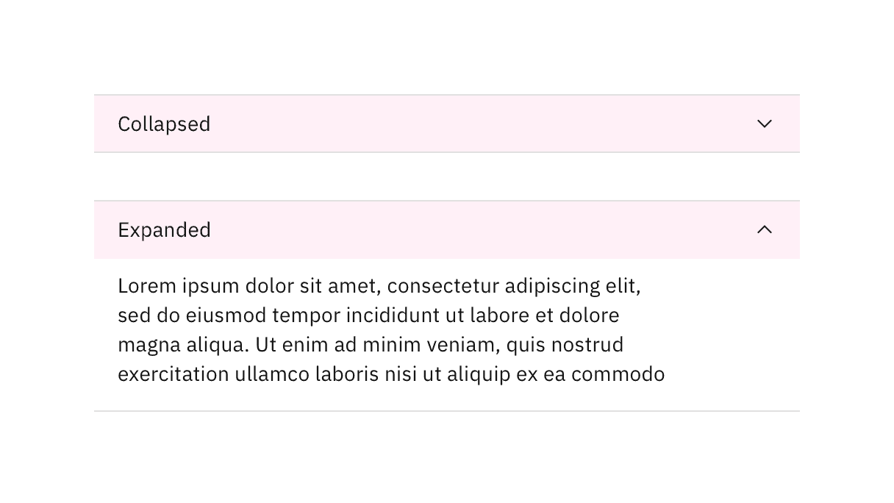

import A11yStatus from 'components/A11yStatus';

<PageDescription>

An accordion is a vertically stacked list of headers that reveal or hide
associated sections of content.

</PageDescription>

<AnchorLinks>

<AnchorLink>Live demo</AnchorLink>
<AnchorLink>Overview</AnchorLink>
<AnchorLink>Formatting</AnchorLink>
<AnchorLink>Content</AnchorLink>
<AnchorLink>Behaviors</AnchorLink>
<AnchorLink>Related</AnchorLink>
<AnchorLink>References</AnchorLink>
<AnchorLink>Feedback</AnchorLink>

</AnchorLinks>

## Live demo

<StorybookDemo
  themeSelector
  url="https://react.carbondesignsystem.com"
  variants={[
    {
      label: 'Default',
      variant: 'components-accordion--default',
    },
  ]}
/>

<A11yStatus layout="cards" components="Accordion" />

## Overview

The accordion component delivers large amounts of content in a small space
through progressive disclosure. The header title gives the user a high level
overview of the content allowing the user to decide which sections to read.

Accordions can make information processing and discovering more effective.
However, it does hide content from users and it's important to account for a
user not noticing or reading all of the included content.

### When to use

- To organize related information.
- To shorten pages and reduce scrolling when content is not crucial to read in
  full.
- When space is at a premium and long content cannot be displayed all at once,
  like on a mobile interface or in a side panel.

### When not to use

- When organizing large amounts of information that can be nested, consider
  using [tree view](/components/tree-view/usage) instead.
- If a user is likely to read all of the content, then don't use an accordion as
  it adds the burden of an extra click; instead use a full scrolling page with
  normal headers.

## Formatting

### Anatomy

<Row>
<Column colLg={8}>

</Column>
</Row>

1. **Header**: contains the section title and is control for revealing the
   panel.
2. **Icon**: indicates if the panel is open or closed.
3. **Panel**: the section of content associated with an accordion header.

### Alignment

#### Flush alignment

Test TEst test 

<Row>
<Column colLg={8}>

</Column>
</Row>

Flush alignment places the row title and chevron icons with 0px padding, keeping
them flush to the rule dividers. For hover and focus interactive states, the
left and right padding receives an additional 16px padding.

<Row>
<Column colLg={8}>

</Column>
</Row>

#### Icon alignment

By default the chevron icon is placed on the `end` side of the header. This
allows for the title on the `start` side to align with other type elements in
the layout, which is the preferred alignment scenario.

However, in some rare scenarios, the accordion may be modified to place the icon
in `start` front of the title to function more like a tree. Most instances
should use the default `end` alignment, especially for any pure content or
documentation purposes. Icon placement in accordions should be consistent
throughout your page and should not alternate.

<DoDontRow>
<DoDont
type="do"
colMd={4} colLg={4}
caption="In most cases, use the default end icon alignment to keep accordion text aligned with other content on the page.">

</DoDont>
<DoDont
type="do"
colMd={4} colLg={4}
caption="In rare cases, you can place icons on the start side for tree like functionality.">

</DoDont>
</DoDontRow>

### Placement

Accordions can be placed with main page content or placed inside of a container
such as a side panel or tile.

<Row>
<Column colLg={12} colMd={12} colSm={4}>
<ArtDirection>

</ArtDirection>
</Column>
</Row>

#### Grid placement

When placing an accordion on the 2x Grid with its default alignment, the
indented title and content align to the grid columns, and the top and bottom
borders hang into the gutter. However, the accordion can be modified to have a
[flush alignment](/components/accordion/usage#alignment) where the titles and
content are instead flush aligned with the top and bottom borders having 0px
padding.

<Row>
<Column colLg={8}>

</Column>
</Row>

## Content

### Main elements

#### Title

- The title should be as brief as possible while still being clear and
  descriptive.
- Each title should be wrapped in a
  [role heading](https://www.w3.org/TR/wai-aria-practices-1.1/#wai-aria-roles-states-and-properties)
  (h1-h6) that is appropriate for the information architecture of the page.

#### Body copy

- Content inside of a section may be split into paragraphs and include
  sub-headers if needed.

### Scrolling content

When the accordion content is longer than the viewport the whole accordion
should vertically scroll. Content should not scroll inside of an individual
panel. Content should never scroll horizontally in an accordion.

### Further guidance

For further content guidance, see Carbon's
[content guidelines](<[https://www.carbondesignsystem.com/guidelines/content/general](https://www.carbondesignsystem.com/guidelines/content/general)>).

## Behaviors

### States

The accordion component has two main states: **collapsed** and **expanded**. The
chevron icon at the end of the accordion indicates which state the accordion is
in. The chevron points down to indicate collapsed and up to indicate expanded.

Accordions begin by default in the collapsed state with all content panels
closed. Starting in a collapsed state gives the user a high level overview of
the available information.

<Row>
<Column colLg={8}>

</Column>
</Row>

A user can then independently expand each section of the accordion allowing for
multiple sections to be open at once.

<Row>
<Column colLg={8}>

</Column>
</Row>

In addition to the collapsed and expanded states, accordions also have
interactive states for focus, hover, and disabled. See the
[style tab](/components/accordion/style) for more details.

<Row>
<Column colLg={8}>

</Column>
</Row>

### Interactions

#### Mouse

Users can trigger a state change by clicking on the chevron or clicking anywhere
in the header area.

<Row>
<Column colLg={8}>

</Column>
</Row>

#### Keyboard

Users can navigate between accordion headers by pressing `Tab` or `Shift-Tab`.
Users can trigger a state change by pressing `Enter` or `Space` while the header
area has focus. For additional keyboard interactions, see the
[accessibility tab](/components/accordion/accessibility#keyboard-interactions).

## Related

The following components are additional ways to organize content. Consider the
type and length of content you are working with when choosing a content
container. Longer form content may benefit from tabs or a content switcher while
very short content might do better in a structured list.

- [Content switchers](/components/content-switcher/usage) allow users to toggle
  between two or more content sections within the same space on the screen.
- [Progress indicators](/components/progress-indicator/usage) guide users
  through any linear, multistep task by showing the user their completed,
  current, and future steps.
- [Structured lists](/components/structured-list/usage) group content that is
  similar or related, such as terms and definitions.
- [Tabs](/components/tabs/usage) organize related content by allowing the user
  to navigate between groups of information that appear within the same context.
- [Tree view](/components/tree-view/usage) is a hierarchical structure that
  provides nested levels of navigation.

## References

- Hoa Loranger,
  [Accordions Are Not Always the Answer for Complex Content on Desktops](https://www.nngroup.com/articles/accordions-complex-content/)
  (Nielsen Norman Group, 2014)

## Feedback

Help us improve this component by providing feedback, asking questions, and
leaving any other comments on
[GitHub](https://github.com/carbon-design-system/carbon-website/issues/new?assignees=&labels=feedback&template=feedback.md).
