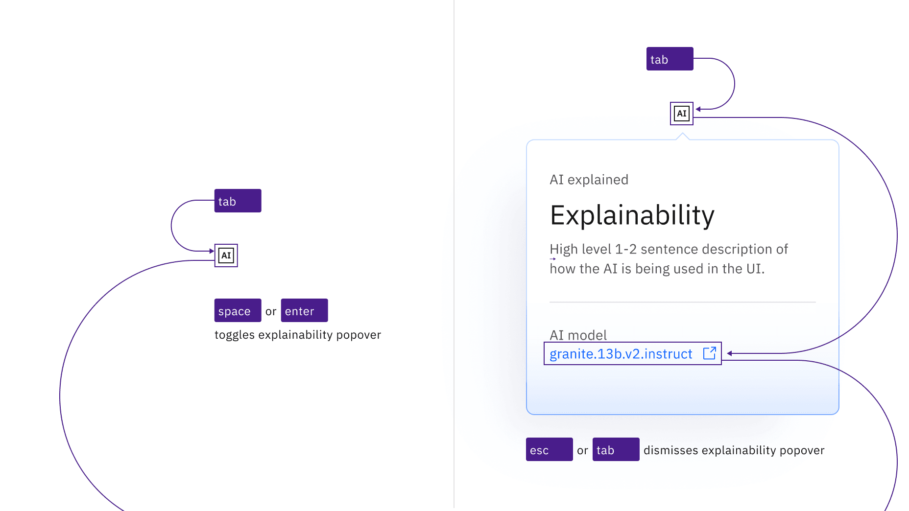

<PageDescription>

The AI label display and hide explainability information upon the click of the
UI trigger element and can contain interactive elements.

</PageDescription>

<AnchorLinks>

<AnchorLink>What Carbon provides</AnchorLink>
<AnchorLink>Development considerations</AnchorLink>

</AnchorLinks>

## What Carbon provides

Carbon already incorporates accessibility into the AI label component.

### Keyboard interactions

AI labels use the AI icon for the trigger button. These buttons are in the tab
order and are activated by pressing `Enter` or `Space`. The activation toggles
the popover open and closed, and focus remains on the trigger.

When the popover contains interactive elements, pressing `Tab` will move focus
to the first component in the popover. When the popover only has non-interactive
text, or when the focus is on the last component in the popover, pressing `Tab`
will close the popover and move focus to the next tab stop on the page. Pressing
`Esc` also closes an open popover and returns focus to the trigger if the focus
is inside the popover.

<Row>
<Column colLg={12}>

<Caption>
  The AI label icon button that triggers the popover is in the page tab order,
  as are interactive elements inside an open popover.
</Caption>

</Column>
</Row>

<Row>
<Column colLg={12}>

<Caption>
  AI explainability popovers appear when the AI label icon button is activated
  and disappears by activating the icon again, pressing Esc, or tabbing away
  from the popover.
</Caption>

</Column>
</Row>

## Development considerations

Keep these considerations in mind if you are modifying Carbon or creating a
custom component.

- The icon button has `aria-label="AI - Show information"`.
- The button uses `aria-expanded` to set toggletip visibility and
  `aria-controls` to handle navigation to the content.
