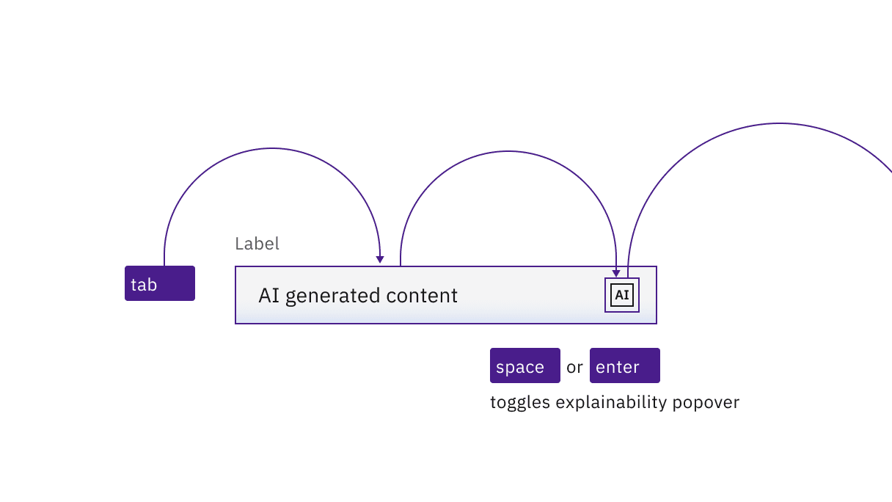
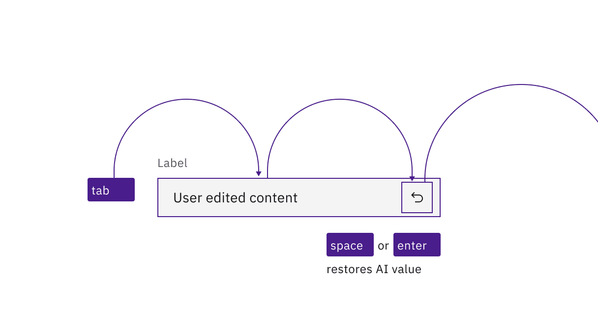

import A11yStatus from 'components/A11yStatus';

<PageDescription>

No accessibility annotations are needed for AI labels, but keep these
considerations in mind if you are modifying Carbon or creating a custom
component.

</PageDescription>

<AnchorLinks>

<AnchorLink>What Carbon provides</AnchorLink>
<AnchorLink>Development considerations</AnchorLink>

</AnchorLinks>

## What Carbon provides

### Keyboard interactions

The AI labels is the trigger button. The AI label is in the tab order and is
activated by pressing `Enter` or `Space`. The activation toggles the
explainability popover open and closed, and focus remains on the trigger.

When the popover contains interactive elements, pressing `Tab` will move focus
to the first component in the popover. When the popover only has non-interactive
text, or when the focus is on the last component in the popover, pressing `Tab`
will close the popover and move focus to the next tab stop on the page. Pressing
`Esc` in an open popover closes it and returns focus to the trigger.

<Row>
<Column colLg={12}>

</Column>
</Row>

<Caption>
  The AI label icon button that triggers the popover is in the page tab order,
  as are interactive elements inside an open popover.
</Caption>

#### Input interactions

The AI label can appear inside user inputs, where it adds an additional tab
stop. For example, a text input will take focus as normal (the existing value
will be selected), and then the AI label will take a second tab stop. If the
user clears the existing AI-supplied value, (with the `Delete` key), then the AI
label becomes a `revert` icon, which on activation will restore the AI-supplied
value in the input.

<Row>
<Column colLg={8}>

<Caption>
  The AI label button is a second tab stop after the initial tab stop for the
  input.
</Caption>

</Column>
</Row>

<Row>
<Column colLg={8}>

</Column>
</Row>

<Caption>
  The AI label changes to a "revert" symbol if a user modifies the input value.
  Activating "revert" restores the prior AI value.
</Caption>

## Development considerations

Keep these considerations in mind if you are modifying Carbon or creating a
custom component.

- The icon button has `aria-label="AI - Show information"`.
- The button uses `aria-expanded` to set toggletip visibility and
  `aria-controls` to handle navigation to the content.

<A11yStatus layout="table" components="AI label" />
