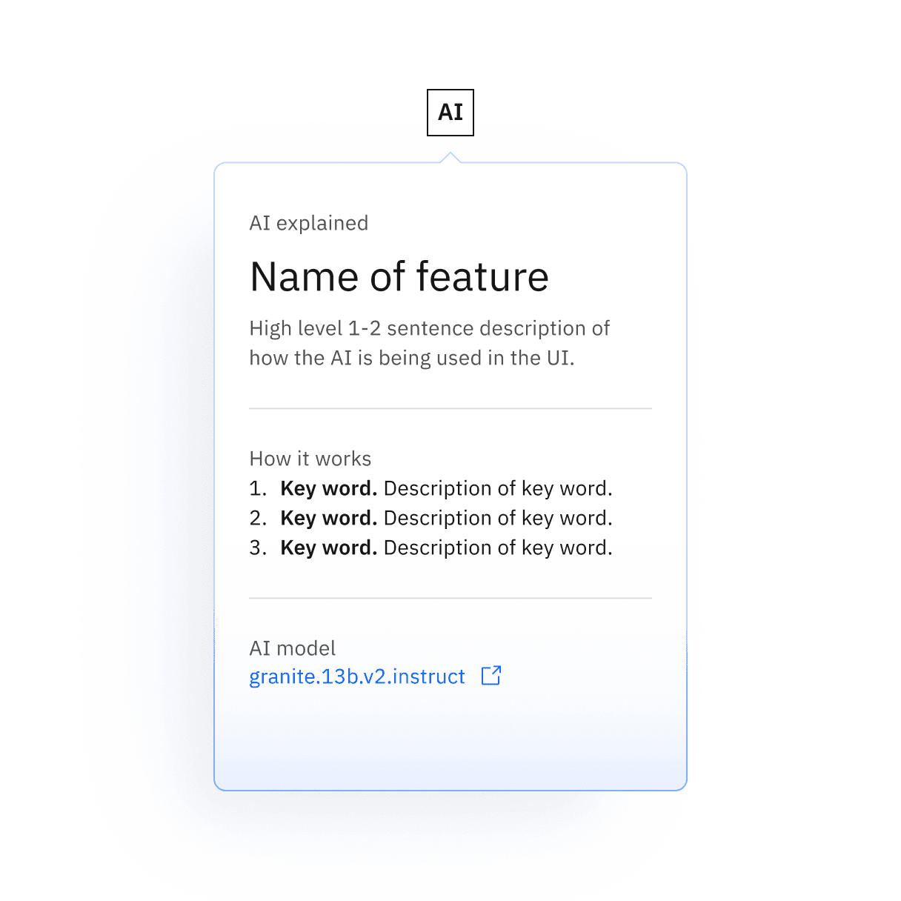
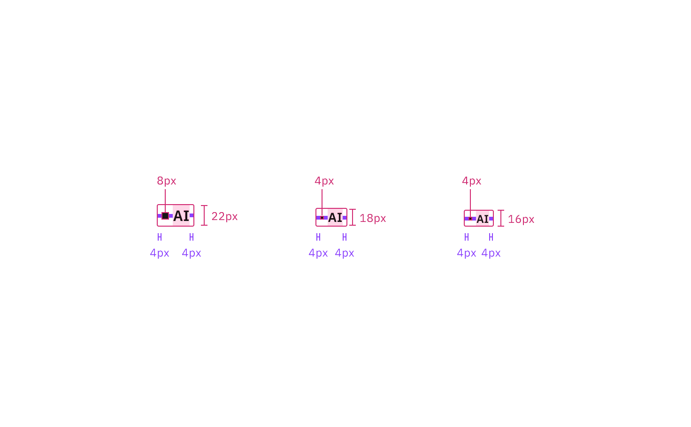

<PageDescription>

The following page documents visual specifications such as color, typography,
structure, and sizes.

</PageDescription>

<AnchorLinks>

<AnchorLink>Color</AnchorLink>
<AnchorLink>Typography</AnchorLink>
<AnchorLink>Structure</AnchorLink>
<AnchorLink>Sizes</AnchorLink>

</AnchorLinks>

## Color

### Default color

| State   | Element | Property   | Color token           |
| ------- | ------- | ---------- | --------------------- |
| Enabled | Text    | text color | `$text-primary`       |
|         | Button  | border     | `$border-inverse`     |
|         |         | background | `transparent`         |
| Hover   | Text    | text color | `$text-inverse`       |
|         | Button  | border     | `$border-inverse`     |
|         |         | background | `$background-inverse` |
| Focus   | Button  | border     | `$focus`              |

<Row>
<Column colLg={8}>

</Column>
</Row>

### Inline color

| State   | Element | Property   | Color token       |
| ------- | ------- | ---------- | ----------------- |
| Enabled | Text    | text color | `$text-primary`   |
|         | Dot     | fill       | `$icon-primary`   |
|         | Button  | background | `transparent`     |
| Hover   | Text    | text color | `$text-secondary` |
|         | Button  | border     | `$border-inverse` |
|         |         | background | `transparent`     |
| Focus   | Button  | border     | `$focus`          |

<Row>
<Column colLg={8}>

</Column>
</Row>

### Explainability popover color

| Element            | Property               | Color token              |
| ------------------ | ---------------------- | ------------------------ |
| Popover background | background             | `$ai-popover-background` |
|                    | linear-gradient: start | `$ai-aura-start`         |
|                    | linear-gradient: end   | `$ai-aura-end`           |
| Popover border     | linear-gradient: start | `$ai-border-start`       |
|                    | linear-gradient: end   | `$ai-border-end`         |

<Row>
<Column colLg={8}>

</Column>
</Row>

## Typography

### Default type

| Element       | Font-size (px/rem) | Font-weight    | Type token    |
| ------------- | ------------------ | -------------- | ------------- |
| Text (xl)     | 20 / 1.25          | SemiBold / 600 | `$heading-03` |
| Text (sm–lg)  | 16 / 1             | SemiBold / 600 | `$heading-02` |
| Text (2xs–xs) | 12 / 0.75          | SemiBold / 600 | –             |
| Text (mini)   | 9 / 0.5625         | SemiBold / 600 | –             |

### Inline type

| Element   | Font-size (px/rem) | Font-weight    | Type token    |
| --------- | ------------------ | -------------- | ------------- |
| Text (lg) | 16 / 1             | SemiBold / 600 | `$heading-02` |
| Text (md) | 14 / 0.875         | SemiBold / 600 | `$heading-01` |
| Text (sm) | 12 / 0.75          | SemiBold / 600 | –             |

### Explainability popover type

| Element | Font-size (px/rem) | Font-weight   | Type token    |
| ------- | ------------------ | ------------- | ------------- |
| Text    | 14 / 0.875         | Regular / 400 | `$label-02`   |
| Title   | 28 / 1.75          | Regular / 400 | `$heading-04` |
| Body    | 14 / 0.875         | Regular / 400 | `$body-01`    |

## Structure

### Default structure

| Element | Property | Value                                                 | Spacing token |
| ------- | -------- | ----------------------------------------------------- | ------------- |
| Button  | border   | 1px                                                   | –             |
|         | height   | See [sizes](/components/ai-label/style#default-sizes) | –             |
| Text    | padding  | centered                                              | –             |

<Caption>
  Recommended structure and spacing measurements for default AI label | px / rem
</Caption>

### Inline structure

| Element     | Property                    | px/rem                                               | Spacing token |
| ----------- | --------------------------- | ---------------------------------------------------- | ------------- |
| Text        | padding-left                | 4px                                                  | `$spacing-02` |
| Button      | border                      | 1px                                                  | –             |
|             | padding-left, padding-right | 4px                                                  | `$spacing-02` |
|             | height                      | See [sizes](/components/ai-label/style#inline-sizes) | –             |
| Dot (sm-md) | height, width               | 4px                                                  | –             |
| Dot (lg)    | height, width               | 8px                                                  | –             |

<Caption>
  Recommended structure and spacing measurements for inline AI label | px / rem
</Caption>

### Explainability popover structure

| Element   | Property | px/rem | Spacing token |
| --------- | -------- | ------ | ------------- |
| Container | padding  | 24px   | `$spacing-06` |
| Footer    | height   | 48px   | –             |

<Caption>
  Recommended structure and spacing measurements for the explainability popover
  | px / rem
</Caption>

## Sizes

### Default sizes

| Default size     | Height (px/rem) |
| ---------------- | --------------- |
| Mini             | 16 / 1          |
| 2x small (2xs)   | 20 / 1.25       |
| Extra small (xs) | 24 / 1.5        |
| Small (sm)       | 32 / 2          |
| Medium (md)      | 40 / 2.5        |
| Large (lg)       | 48 / 3          |
| Extra large (xl) | 64 / 4          |

### Inline sizes

| Inline size | Height (px/rem) |
| ----------- | --------------- |
| Small (sm)  | 16 / 1          |
| Medium (md) | 18 / 1.125      |
| Large (lg)  | 22 / 1.375      |
