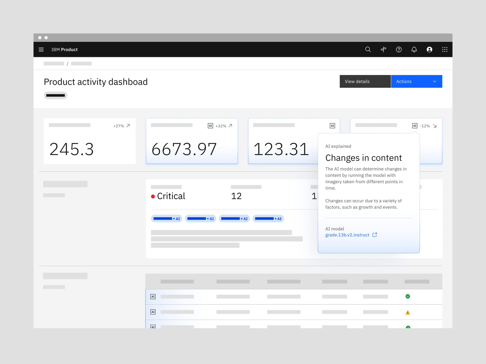
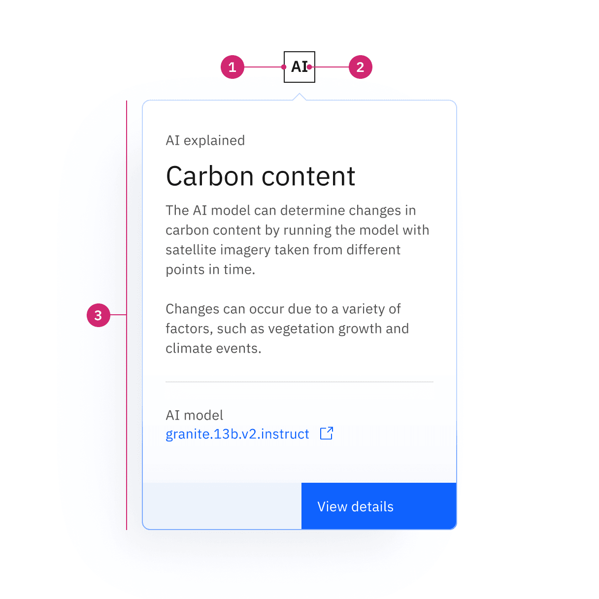
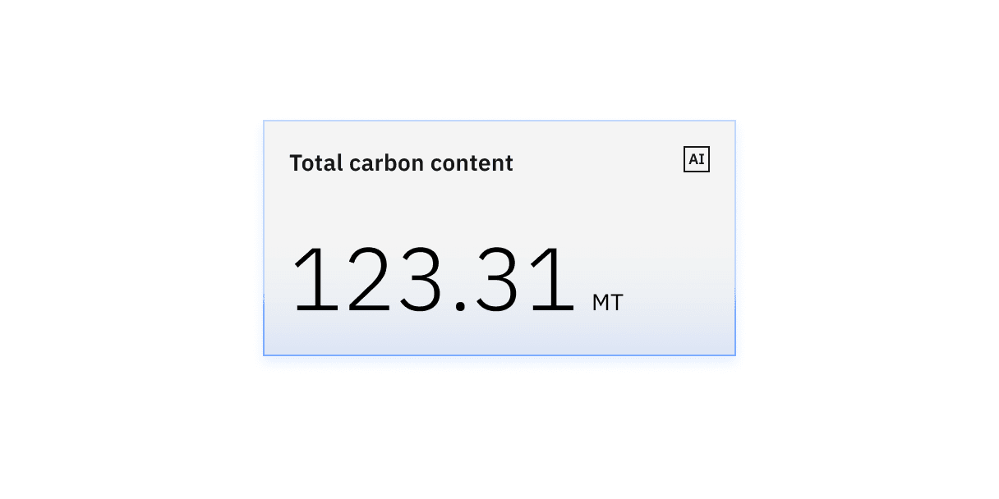
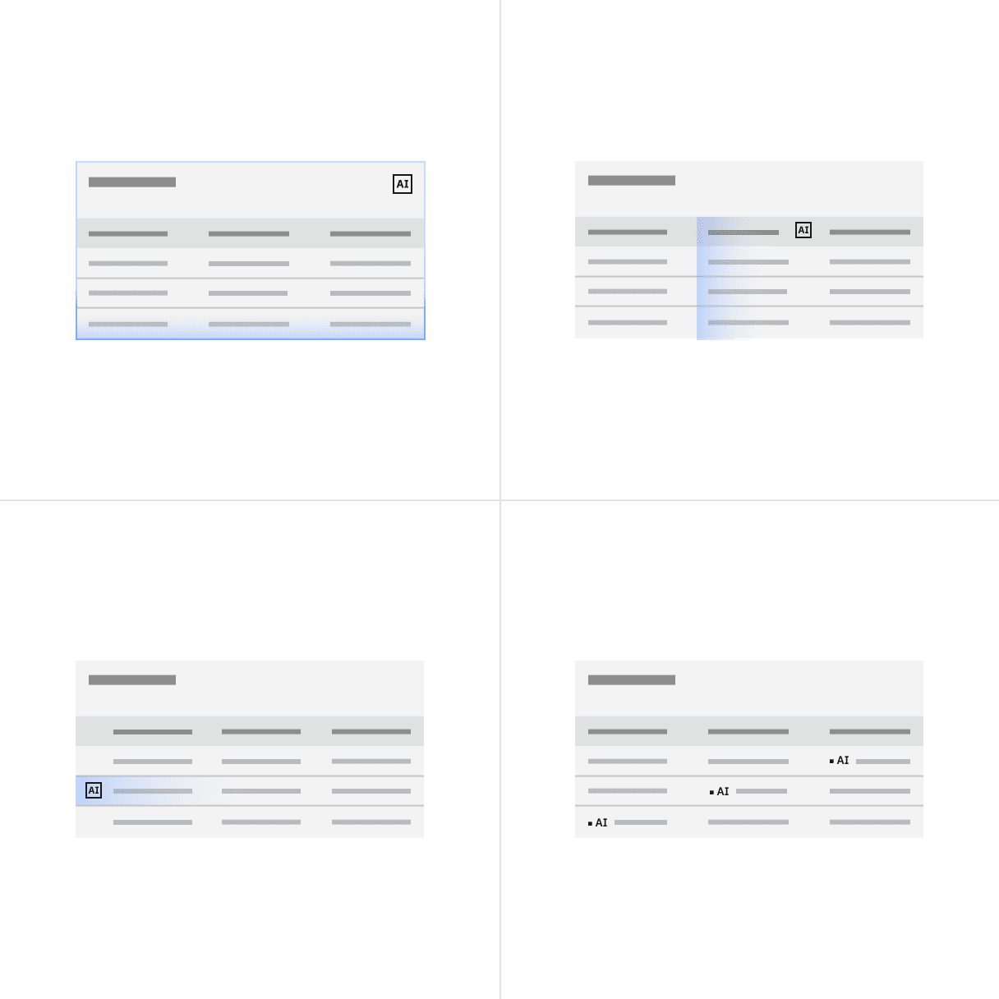
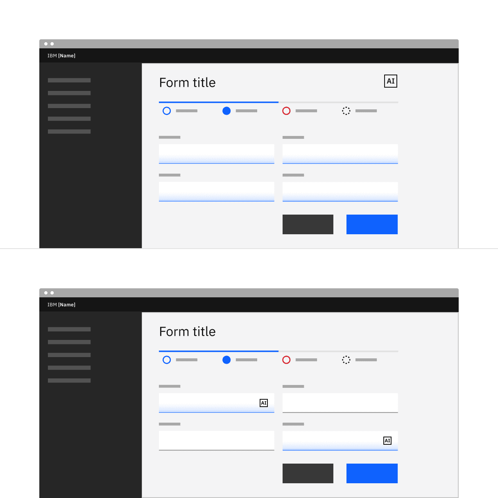

import A11yStatus from 'components/A11yStatus';

<PageDescription>

The AI label indicates an instance of AI in the UI. It enables AI transparency
through the visual recognition the AI icon and is the key pathway to AI
explainability by acting as the trigger for the explainability popover.

</PageDescription>

<InlineNotification>

**New!**
[AI label](https://react.carbondesignsystem.com/?path=/docs/experimental-unstable-slug--overview)
is now available as experimental. The AI label was previously called "AI Slug"
but has been changed to better reflect its usage. This name change will be
reflected in code once it moves to stable.

</InlineNotification>

<AnchorLinks>

<AnchorLink>Live demo</AnchorLink>
<AnchorLink>Overview</AnchorLink>
<AnchorLink>Formatting</AnchorLink>
<AnchorLink>Content</AnchorLink>
<AnchorLink>Behaviors</AnchorLink>
<AnchorLink>Related</AnchorLink>
<AnchorLink>References</AnchorLink>
<AnchorLink>Feedback</AnchorLink>

</AnchorLinks>

## Live demo

<InlineNotification>

The live demo and accessibility testing status for AI label will be added soon.
Check back later for updates.

</InlineNotification>

<StorybookDemo
  themeSelector
  url="https://react.carbondesignsystem.com"
  variants={[
    {
      label: 'Default',
      variant: 'components-accordion--default',
    },
  ]}
/>

<A11yStatus layout="cards" components="Accordion" />

## Overview

The AI label is more than just an indicator of AI instances in the UI. It’s also
a consistent pathway to AI explainability. Its behavior is flexible enough to
cooperate with the behaviors and interactions within existing products.

The AI label is intended for any scenario where something is being generated by
(or with) AI to reinforce AI transparency, accountability, and explainability at
any interface level. This also enables more effective recognition and recall of
AI instances in a way that is identifiable across any IBM product.

<Row>
<Column colLg={12}>

</Column>
</Row>

### Variants

| Variant | Purpose                                                                                                                            |
| ------- | ---------------------------------------------------------------------------------------------------------------------------------- |
| Default | The default AI label used in most components and container type use cases. It can be used for both broad and focused AI instances. |
| Inline  | A specific type of AI label used only in small focused AI instances and often paired inline with text content.                     |

### When to use

#### Mark AI-generated content

AI transparency is key, and the AI label is an accessible, interactive element
that marks any AI instance presented in the interface.

#### Provides a consistent visual reference point for AI

For recognition and recall, users need a consistent, identifiable visual
reference to look to when they need to understand more details about how the AI
was built.

#### A pathway to explainability

Users must clearly understand how to access more details about how an AI was
built. By providing a bridge to explainability from the AI label, users are
given a recognizable location to learn more about the AI model.

### When not to use

#### Don’t use the AI label as decoration

These are strictly intended to indicate any time a modality or component is
using AI.

#### Don’t modify AI label behaviors

The AI label is intended as a pathway to explainability. Any additional
behaviors can set unclear and inconsistent expectations.

#### Don’t use the AI label as a trigger for AI actions

The AI label is not a UI icon and should not be used with buttons or other
call-to-actions to trigger an AI action like “regenerate.” Those type of AI
actions will have their own UI icons.

## Formatting

### Anatomy

<Row>
<Column colLg={12}>

</Column>
</Row>

<Caption>A: Default AI label, B: Inline AI label</Caption>

1. **Icon**: indicates AI is present and the button trigger for the
   explainability popover.
2. **Text label**: the text abbreviation for artificial intelligence which can
   be translated as needed.
3. **Explainability popover**: Area that contains explainability content and
   interactive elements.

### Sizing

#### Default sizes

The default AI label spans the range of UI icons and pictogram sizes. Which size
to use is determined by the prominence and hierarchy of the area it is in or by
its neighboring content like other buttons. When placed next to other ghost icon
buttons we typically recommend going down one size from the button size so they
are optically weighted the same.

| Default size     | Height (px/rem) |
| ---------------- | --------------- |
| Mini             | 16 / 1          |
| 2x small (2xs)   | 20 / 1.25       |
| Extra small (xs) | 24 / 1.5        |
| Small (sm)       | 32 / 2          |
| Medium (md)      | 40 / 2.5        |
| Large (lg)       | 48 / 3          |
| Extra large (xl) | 64 / 4          |

<Row>
<Column colLg={8}>

</Column>
</Row>

#### Inline sizes

placed inline with. For example, when inserting the inline AI label into a table
row with 14px font size, you match it with the medium-size inline AI label that
also has a 14px font.

| Inline size | Height (px/rem) | Use case              |
| ----------- | --------------- | --------------------- |
| Small (sm)  | 12 / 0.75       | Paired with 12px type |
| Medium (md) | 14 / 0.875      | Paired with 14px type |
| Large (lg)  | 16 / 1          | Paired with 16px type |

<Row>
<Column colLg={8}>

</Column>
</Row>

### Placement

The AI label should be placed in consistent locations (based on modality) to
help users identify AI presence in the interface. Consistent placement
reinforces recognition and recall for users. The instructions for these
placements assume a left-to-right reading order. If right-to-left then these
instructions should be reversed.

#### In containers

The AI label should be placed in the upper right of the container with
appropriate margin. Never place the AI label flush to the edges of a container.

<Row>
<Column colLg={8}>

</Column>
</Row>

#### In inputs

Place AI labels on the right side and in the middle of any form inputs
(dropdowns, text or number input, etc.).

<Row>
<Column colLg={8}>

</Column>
</Row>

#### With other icons

If other icons are present along side the AI label, then the AI label should be
placed in the far left position of the icon group.

<Row>
<Column colLg={8}>

</Column>
</Row>

The exception is when the icon has an interaction state that alters its size or
position, like an expandable search or toggle-able sort. In these instances, the
AI label is placed to the right of these exceptions but still to the left of
other icon types.

<Row>
<Column colLg={8}>

</Column>
</Row>

#### In data tables

Where the AI label goes inside of a data table depends on which parts of the
data are AI generated.

- If the whole table has an AI presence, then place the AI label in the top
  right of the table header.
- If a whole column has an AI presence, then place the AI label in the far right
  of the column header. The sort icon of the table column will now appear to the
  left of the AI label.
- If a whole row has an AI presence, then place the AI label to the far left of
  the row and to the left of any selection or expansion controls.
- If a single cell has an AI presence, then place the AI label inline and left
  to the cell text.

<Row>
<Column colLg={8}>

</Column>
</Row>

#### In forms

Where the AI label is placed in a form can vary depending on if the AI presence
is across the whole form or just in certain parts of the form.

- If the entire form has an AI presence, then place the AI label in top right of
  the form header.
- If only some parts of the form have an AI presence then the AI label should be
  embedded in the components or sections that are AI-generated.

<Row>
<Column colLg={8}>

</Column>
</Row>

### Levels of visibility

The AI label might appear at multiple levels of a page, or it might appear only
once. The content in the AI explainability popover might be focused on a single
AI instance or broadly address multiple instances. All scenarios are acceptable
and possible, but the level of visibility depends on the need for explainability
and/or the need to distinguish AI content from human content. Use this guide to
determine what works best for your use case.

#### Use a focused AI label:

- For individual occurrences of AI within a section
- When the user needs to have an individual AI instance explained
- When the user needs to distinguish between AI and non-AI content

<Row>
<Column colLg={8}>

</Column>
</Row>

<Caption>
  An example of focused AI labeling inside of single cells in a data table.
</Caption>

#### Use a broad AI label:

- For summarization of AI usage across a section of a page
- When users don’t need specific explanations of AI on a per-instance level
- When the user doesn’t need to act on AI at an instance level

<Row>
<Column colLg={8}>

</Column>
</Row>

<Caption>
  An example of broad AI labeling with a whole tab section and data table being
  AI generated.
</Caption>

## Content

### Localization

The abbreviation `AI` in the AI label stands for the English term
`artificial intelligence`. The abbreviation can be localized for other
languages. Here are some examples of abbreviations in other languages.

- `AI` in Chinese, Indonesia, Italian, Japanese, Korean, Spanish LA
- `IA` in European Spanish, Brazilian Portuguese, France French
- `KI` in German
- `ИИ` in Russian, Bulgarian

<Row>
<Column colLg={8}>

</Column>
</Row>
