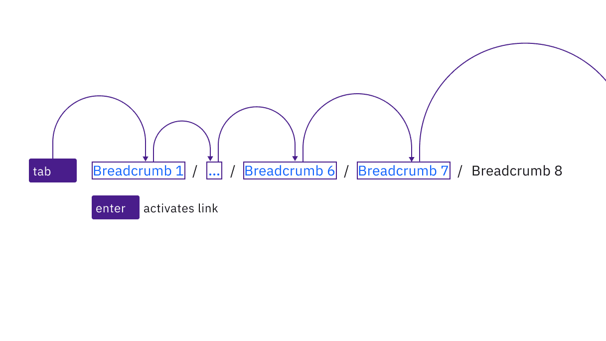

<PageDescription>

No accessibility annotations are needed for breadcrumbs, but keep these considerations in mind if you’re modifying Carbon or creating a custom component.

</PageDescription>

<AnchorLinks>
  <AnchorLink>What Carbon provides</AnchorLink>
  <AnchorLink>Developer considerations</AnchorLink>
</AnchorLinks>

## What Carbon provides

Carbon bakes keyboard operation into its components, which improves the experiences of blind users and others who need to operate via the keyboard API. Carbon also incorporates many other accessibility considerations.

### Keyboard interactions

Each page link in the breadcrumb is reached by `Tab` and activated by `Enter`. The current page, if listed in the breadcrumb, is not a link. If the breadcrumb is truncated, the ellipsis button for the overflow menu is in the tab order. See [overflow menu](https://carbondesignsystem.com/components/overflow-menu/usage/) for details on its keyboard operation.

<Row>
<Column colLg={8}>

</Column>
</Row>

The breadcrumb's links are reached by `Tab` and activated by `Enter`.

### Labelling and regions

Carbon implements each page link as a list item inside a navigation region named “breadcrumb.” The ellipsis symbol is a button called “more breadcrumbs” which opens the [overflow menu](https://carbondesignsystem.com/components/overflow-menu/usage/).

<Row>
<Column colLg={8}>

</Column>
</Row>

Carbon provides the accessibility information about the breadcrumb's structure.

## Developer considerations

Keep these considerations in mind if you’re modifying Carbon or creating a custom component:

* The Carbon implementation uses an html5 `<nav>` element; this could also be achieved with a “navigation” landmark on a `
`.
* Each link in the breadcrumb is implemented as an unordered list item so that screen readers provide more context.
* The visual / separators do not need to be text (Carbon uses CSS) and are not intended to be navigable.