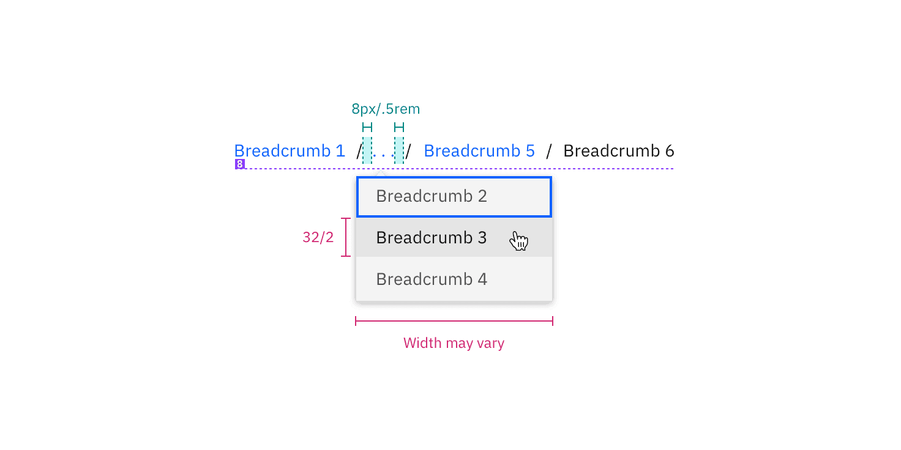

## Color

| Class                                     | Property | Color token           |
| ----------------------------------------- | -------- | --------------------- |
| `.bx--link`                               | color    | `$link-01`            |
| `.bx--link:hover`                         | color    | `$hover-primary-text` |
| `.bx--link:active`                        | color    | `$text-01`            |
| `.bx--link:focus`                         | outline  | `$focus`              |
| `.bx--breadcrumb-item::after`             | color    | `$text-01`            |
| `.bx--breadcrumb-item--current .bx--link` | color    | `$text-01`            |

<Row>
<Column colLg={8}>

</Column>
</Row>

## Typography

When a user hovers overs a breadcrumb, the breadcrumb title should be
underlined.

| Class       | Font-size (px/rem) | Font-weight   | Type token       |
| ----------- | ------------------ | ------------- | ---------------- |
| `.bx--link` | 14 / 0.875         | Regular / 400 | `$body-short-01` |

## Structure

The on-click dropdown should follow the
[overflow menu](/components/overflow-menu/usage) specs for sizing, padding, and
interaction.

| Class                  | Property    | px/rem  | Spacing token |
| ---------------------- | ----------- | ------- | ------------- |
| `.bx--breadcrumb-item` | margin-left | 8 / 0.5 | `$spacing-03` |

<Caption>Structure and spacing measurements for breadcrumb | px / rem</Caption>

## Truncated breadcrumbs

Truncated breadcrumbs are not currently built into the breadcrumb component. The
following colors from the [overflow menu](/components/overflow-menu/style) are
recommended for the overflow breadcrumb list.

<h3
  class="AutolinkHeader-module--header--1G1tm Markdown-module--h3--Gwbvh"
  id="truncated breadcrumbs color">
  Color
  <a
    class="AutolinkHeader-module--anchor--36UpA AutolinkHeader-module--left-anchor--1SDoO"
    href="#color"
    aria-label="Color permalink">
    <svg
      focusable="false"
      preserveAspectRatio="xMidYMid meet"
      xmlns="http://www.w3.org/2000/svg"
      fill="currentColor"
      width="20"
      height="20"
      viewBox="0 0 32 32"
      aria-hidden="true">
      <path d="M29.25,6.76a6,6,0,0,0-8.5,0l1.42,1.42a4,4,0,1,1,5.67,5.67l-8,8a4,4,0,1,1-5.67-5.66l1.41-1.42-1.41-1.42-1.42,1.42a6,6,0,0,0,0,8.5A6,6,0,0,0,17,25a6,6,0,0,0,4.27-1.76l8-8A6,6,0,0,0,29.25,6.76Z"></path>
      <path d="M4.19,24.82a4,4,0,0,1,0-5.67l8-8a4,4,0,0,1,5.67,0A3.94,3.94,0,0,1,19,14a4,4,0,0,1-1.17,2.85L15.71,19l1.42,1.42,2.12-2.12a6,6,0,0,0-8.51-8.51l-8,8a6,6,0,0,0,0,8.51A6,6,0,0,0,7,28a6.07,6.07,0,0,0,4.28-1.76L9.86,24.82A4,4,0,0,1,4.19,24.82Z"></path>
    </svg>
  </a>
</h3>

| Class                                      | Property         | Color token |
| ------------------------------------------ | ---------------- | ----------- |
| `.bx--overflow-menu-options__btn`          | color            | `$icon-01`  |
| `.bx--overflow-menu-options__option:hover` | background-color | `$hover-ui` |

<h3
  class="AutolinkHeader-module--header--1G1tm Markdown-module--h3--Gwbvh"
  id="truncated breadcrumbs typography">
  Typography
  <a
    class="AutolinkHeader-module--anchor--36UpA AutolinkHeader-module--left-anchor--1SDoO"
    href="#typography"
    aria-label="Typography permalink">
    <svg
      focusable="false"
      preserveAspectRatio="xMidYMid meet"
      xmlns="http://www.w3.org/2000/svg"
      fill="currentColor"
      width="20"
      height="20"
      viewBox="0 0 32 32"
      aria-hidden="true">
      <path d="M29.25,6.76a6,6,0,0,0-8.5,0l1.42,1.42a4,4,0,1,1,5.67,5.67l-8,8a4,4,0,1,1-5.67-5.66l1.41-1.42-1.41-1.42-1.42,1.42a6,6,0,0,0,0,8.5A6,6,0,0,0,17,25a6,6,0,0,0,4.27-1.76l8-8A6,6,0,0,0,29.25,6.76Z"></path>
      <path d="M4.19,24.82a4,4,0,0,1,0-5.67l8-8a4,4,0,0,1,5.67,0A3.94,3.94,0,0,1,19,14a4,4,0,0,1-1.17,2.85L15.71,19l1.42,1.42,2.12-2.12a6,6,0,0,0-8.51-8.51l-8,8a6,6,0,0,0,0,8.51A6,6,0,0,0,7,28a6.07,6.07,0,0,0,4.28-1.76L9.86,24.82A4,4,0,0,1,4.19,24.82Z"></path>
    </svg>
  </a>
</h3>

| Class                             | Font-size (px/rem) | Font-weight   | Type token       |
| --------------------------------- | ------------------ | ------------- | ---------------- |
| `.bx--overflow-menu-options__btn` | 14 / 0.875         | Regular / 400 | `$body-short-01` |

<h3
  class="AutolinkHeader-module--header--1G1tm Markdown-module--h3--Gwbvh"
  id="truncated breadcrumbs structure">
  Structure
  <a
    class="AutolinkHeader-module--anchor--36UpA AutolinkHeader-module--left-anchor--1SDoO"
    href="#structure"
    aria-label="Structure permalink">
    <svg
      focusable="false"
      preserveAspectRatio="xMidYMid meet"
      xmlns="http://www.w3.org/2000/svg"
      fill="currentColor"
      width="20"
      height="20"
      viewBox="0 0 32 32"
      aria-hidden="true">
      <path d="M29.25,6.76a6,6,0,0,0-8.5,0l1.42,1.42a4,4,0,1,1,5.67,5.67l-8,8a4,4,0,1,1-5.67-5.66l1.41-1.42-1.41-1.42-1.42,1.42a6,6,0,0,0,0,8.5A6,6,0,0,0,17,25a6,6,0,0,0,4.27-1.76l8-8A6,6,0,0,0,29.25,6.76Z"></path>
      <path d="M4.19,24.82a4,4,0,0,1,0-5.67l8-8a4,4,0,0,1,5.67,0A3.94,3.94,0,0,1,19,14a4,4,0,0,1-1.17,2.85L15.71,19l1.42,1.42,2.12-2.12a6,6,0,0,0-8.51-8.51l-8,8a6,6,0,0,0,0,8.51A6,6,0,0,0,7,28a6.07,6.07,0,0,0,4.28-1.76L9.86,24.82A4,4,0,0,1,4.19,24.82Z"></path>
    </svg>
  </a>
</h3>

| Class                        | Property | px / rem | Spacing token |
| ---------------------------- | -------- | -------- | ------------- |
| `.bx--overflow-menu-options` | height   | 32 / 2   | –             |

<Caption>
  Recommended structure and spacing measurements for breadcrumb | px / rem
</Caption>
