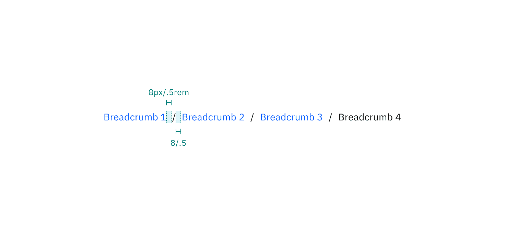

<PageDescription>

The following page documents visual specifications such as color, typography,
structure, and size.

</PageDescription>

<AnchorLinks>

<AnchorLink>Color</AnchorLink>
<AnchorLink>Typography</AnchorLink>
<AnchorLink>Structure</AnchorLink>
<AnchorLink>Size</AnchorLink>
<AnchorLink>Feedback</AnchorLink>

</AnchorLinks>

## Color

| Element        | Property   | Color token           |
| ------------   | --------   | --------------------- |
| Text: enabled  | text-color | `$link-primary`       |
| Text: current  | text-color | `$text-primary`       |
| Slash          | text-color | `$text-primary`       |
| Overflow: icon | svg        | `$link-primary`       |

<Row>
<Column colLg={8}>

<Caption>Breadcrumb color and overflow color</Caption>

</Column>
</Row>

### Breadcrumb interactive state color

| State      | Element            | Property      | Color token          |
| -------    | ------------------ | ------------- | ------------------   |
| Hover      | Text               | text-color    | `$link-primary-hover`|
| Focus      | Text               | text-color    | `$link-primary`      |
|            | Border             | border        | `$focus`             |
| Active     | Text               | text-color    | `$text-primary`      |
|            | Border             | border        | `$focus`             |
| Current    | Text               | text-color    | `$text-primary`      |

<Row>
<Column colLg={8}>

<Caption>Breadcrumb interactive state color</Caption>

</Column>
</Row>

### Breadcrumb overflow interactive state color

A group of breadcrumbs with overflow content uses the overflow menu component to disclose additional breadcrumbs in a menu view. A tooltip component appears in the hover, focus, and active states. Use the menu [menu](/components/menu/style) and tooltip [tooltip](/components/tooltip/style) colors for these instances.

| State      | Element            | Property      | Color token          |
| -------    | ------------------ | ------------- | ------------------   |
| Hover      | Icon               | svg           | `$link-primary-hover`|
| Focus      | Icon               | svg           | `$link-primary`      |
|            | Border             | border        | `$focus`             |
| Active     | Icon               | svg           | `$text-primary`      |
|            | Border             | border        | `$focus`             |

<Row>
<Column colLg={8}>

<Caption>Breadcrumb overflow interactive state color</Caption>

</Column>
</Row>

## Typography

There are two sizes of breadcrumbs: small and medium.  Each breadcrumb size uses a different type token. Breadcrumbs receive an underline in the hover, focus, and active states.

| Element                | Font-size (px/rem) | Font-weight   | Type token         |
| -------                | ------------------ | ------------- | ------------------ |
| Text: small            | 12 / 0.75          | Regular / 400 | `$label-01` |
| Text: medium           | 14 / 0.875         | Regular / 400 | `$body-compact-01` |
| Text: overflow menu    | 14 / 0.875         | Regular / 400 | `$body-compact-01` |

## Structure

When an overflow menu is present to disclose overflow breadcrumbs, use the [menu](/components/menu/style/#structure) component structure.

### Small breadcrumb structure

| Element                | Property                   | px/rem        | Spacing token         |
| -------                | ------------------         | ------------- | ------------------    |
| Link                   | margin-left, margin-right  | 4 / 0.25      | `$spacing-02`         |
| Link: overflow icon    | margin-left, margin-right  | 4 / 0.25      | `$spacing-02`         |
| Link: overflow menu    | height                     | 40 / 2.5      | `$spacing-08`         |

<Row>
<Column colLg={8}>

<Caption>Structure and spacing measurements for small breadcrumb | px / rem</Caption>

</Column>
</Row>

<Row>
<Column colLg={8}>

<Caption>Structure and spacing measurements for small breadcrumb overflow | px / rem</Caption>

</Column>
</Row>

### Medium breadcrumb structure

| Element                | Property                   | px/rem        | Spacing token         |
| -------                | ------------------         | ------------- | ------------------    |
| Link                   | margin-left, margin-right  | 8 / 0.5       | `$spacing-03`         |
| Link: overflow icon    | margin-left, margin-right  | 8 / 0.5       | `$spacing-03`         |
| Link: overflow menu    | height                     | 40 / 2.5      | `$spacing-08`         |

<Row>
<Column colLg={8}>

<Caption>Structure and spacing measurements for medium breadcrumb | px / rem</Caption>

</Column>
</Row>

<Row>
<Column colLg={8}>

<Caption>Structure and spacing measurements for medium breadcrumb overflow | px / rem</Caption>

</Column>
</Row>

### Size

| Element        | Size        | Height (px/rem)           |
| ------------   | --------    | ---------------------     |
| Breadcrumb     | Small (sm)  | 16 / 1                    |
|                | Medium (md) | 18 / 1.125                |

<Row>
<Column colLg={8}>

<Caption>Size measurements for small and medium breadcrumb | px / rem</Caption>

</Column>
</Row>

## Feedback

Help us improve this component by providing feedback, asking questions, and
leaving any other comments on
[GitHub](https://github.com/carbon-design-system/carbon-website/issues/new?assignees=&labels=feedback&template=feedback.md).

