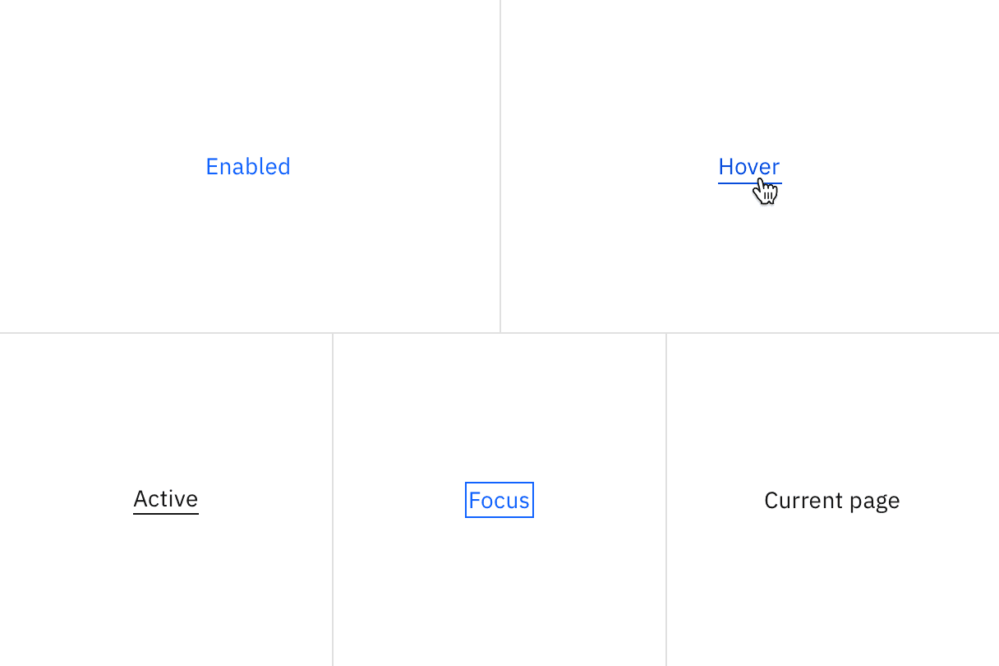

<PageDescription>

The following page documents visual specifications such as color, typography,
structure, and size.

</PageDescription>

<AnchorLinks>

<AnchorLink>Color</AnchorLink>
<AnchorLink>Typography</AnchorLink>
<AnchorLink>Structure</AnchorLink>
<AnchorLink>Size</AnchorLink>
<AnchorLink>Feedback</AnchorLink>

</AnchorLinks>

## Color

| Element      | Property | Color token           |
| ------------ | -------- | --------------------- |
| Link         | color    | `$link-primary`       |
| Link:hover   | color    | `$link-primary-hover` |
| Link:active  | color    | `$text-primary`       |
| Link:focus   | outline  | `$focus`              |
| Slash        | color    | `$text-primary`       |
| Current page | color    | `$text-primary`       |

<Row>
<Column colLg={8}>

</Column>
</Row>

## Typography

When a user hovers overs a breadcrumb, the breadcrumb link should be underlined.

| Element | Font-size (px/rem) | Font-weight   | Type token         |
| ------- | ------------------ | ------------- | ------------------ |
| Link    | 14 / 0.875         | Regular / 400 | `$body-compact-01` |

## Structure

When an overflow menu is present to disclose overflow breadcrumbs, use the menu component structure.

### Small breadcrumb structure

The on-click dropdown should follow the
[overflow menu](/components/overflow-menu/usage) specs for sizing, padding, and
interaction.

| Element    | Property    | px/rem  | Spacing token |
| ---------- | ----------- | ------- | ------------- |
| Breadcrumb | margin-left | 8 / 0.5 | `$spacing-03` |

<Caption>Structure and spacing measurements for breadcrumb | px / rem</Caption>

## Truncated breadcrumbs

Truncated breadcrumbs are not currently built into the breadcrumb component. The
following colors from the [overflow menu](/components/overflow-menu/style) are
recommended for the overflow breadcrumb list.

### Color

| Element                  | Property         | Color token         |
| ------------------------ | ---------------- | ------------------- |
| Overflow menu item       | color            | `$icon-primary`     |
| Overflow menu item:hover | background-color | `$background-hover` |

### Typography

| Element            | Font-size (px/rem) | Font-weight   | Type token       |
| ------------------ | ------------------ | ------------- | ---------------- |
| Overflow menu item | 14 / 0.875         | Regular / 400 | `$body-short-01` |

### Structure

| Element            | Property | px / rem | Spacing token |
| ------------------ | -------- | -------- | ------------- |
| Overflow menu item | height   | 32 / 2   | –             |

<Caption>
  Recommended structure and spacing measurements for breadcrumb | px / rem
</Caption>
