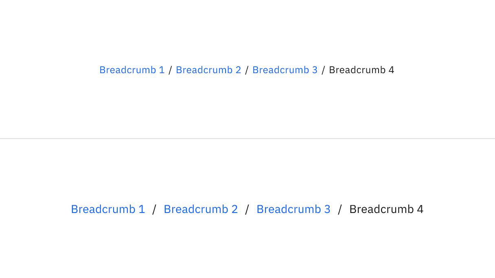

import A11yStatus from 'components/A11yStatus';

<PageDescription>

The breadcrumb is a secondary navigation pattern that helps a user understand
the hierarchy among levels and navigate back through them.

</PageDescription>

<AnchorLinks>

<AnchorLink>Live demo</AnchorLink>
<AnchorLink>Overview</AnchorLink>
<AnchorLink>Formatting</AnchorLink>
<AnchorLink>Content</AnchorLink>
<AnchorLink>Behaviors</AnchorLink>
<AnchorLink>Modifiers</AnchorLink>
<AnchorLink>Related</AnchorLink>
<AnchorLink>Feedback</AnchorLink>

</AnchorLinks>

## Live demo

<StorybookDemo
  themeSelector
  url="https://react.carbondesignsystem.com"
  variants={[
    {
      label: 'Default',
      variant: 'components-breadcrumb--default',
    },
    {
      label: 'Breadcrumb with Overflow Menu',
      variant: 'components-breadcrumb--breadcrumb-with-overflow-menu',
    },
  ]}
/>

<A11yStatus layout="cards" components="Breadcrumb" />

## Overview

Breadcrumbs show users their current location relative to the information
architecture and enable them to quickly move up to a parent level or previous
step.

### When to use

Breadcrumbs are effective in products and experiences that have a large amount
of content organized in a hierarchy of more than two levels. They take up little
space but still provide context for the user's place in the navigation
hierarchy.

### When not to use

Breadcrumbs are always treated as secondary and should never entirely replace
the primary navigation. They shouldn't be used for products that have single
level navigation because they create unnecessary clutter.

If you are taking users through a multistep process use a
[progress indicator](/components/progress-indicator/usage/) instead.

### Types

Carbon supports two types of breadcrumbs. Both types are styled the same, but
the methods for populating the breadcrumb trail are different. The breadcrumb
type used should be consistent across a product.

| Breadcrumb type  | Purpose                                                                                                                                                                                    |
| ---------------- | ------------------------------------------------------------------------------------------------------------------------------------------------------------------------------------------ |
| _Location-based_ | These illustrate the site’s hierarchy and show the user where they are within that hierarchy.                                                                                              |
| _Path-based_     | These show the actual steps the user took to get to the current page, rather than reflecting the site’s information architecture. Path-based breadcrumbs are always dynamically generated. |

## Formatting

### Anatomy

<Row>
<Column colLg={8}>

</Column>
</Row>

1. **Page link:** Directs users to the parent-level page.
2. **Separator:** Clearly distinguishes between each page.

### Sizing

There are two different sizes of breadcrumbs: **small** and **medium**. The small 
breadcrumb uses the `$label-01` type token, while the medium breadcrumb uses the 
`$body-compact-01` type token.

<Row>
<Column colLg={8}>

<Caption>Small and medium sizes of breadcrumb.</Caption>

</Column>
</Row>

### Placement

Breadcrumbs are placed in the top left portion of the page. They sit underneath
the header and navigation, but above the page title.

<Row>
<Column colLg={8}>

</Column>
</Row>

## Content

### Main elements

#### Page link

- Each page link should be short and clearly reflect the location or entity it
  links to.
- Start with the highest level parent page and move deeper into the information
  architecture as the breadcrumb trail progresses.
- By default, the current page is not listed in the breadcrumb trail.

### Overflow content

When space becomes limited, use an
[overflow menu](/components/overflow-menu/usage) to truncate the breadcrumbs.
The first and last two page links should be shown, but the remaining breadcrumbs
in between are condensed into an overflow menu. Breadcrumbs should never wrap
onto a second line.

<Row>
<Column colLg={8}>

</Column>
</Row>

### Further guidance

For further content guidance, see Carbon's
[content guidelines](/guidelines/content/overview).

## Behaviors

### Interactions

All the pages in the breadcrumb component should be interactive (except the
current page) and link to their respective pages.

#### Mouse

Users can trigger an item by clicking on a breadcrumb page link. The separators
between page links are not interactive.

#### Keyboard

Users can navigate between breadcrumb links by pressing `Tab` and `Shift-Tab`.
Users can trigger a breadcrumb link by pressing `Enter` while the link has
focus. For additional keyboard interactions, see
the [accessibility tab](https://www.carbondesignsystem.com/components/breadcrumb/accessibility).

## Modifiers

By default, Carbon breadcrumb trails should not include the current page. If a
page doesn't have a title or the current page is not clear, it can be included
in the breadcrumb trail. If the current page is included in a breadcrumb trail,
it is always the last text listed and is not an interactive link.

<Row>
<Column colLg={8}>

</Column>
</Row>

## Related

- [Global header](/patterns/global-header)
- [Progress indicator](/components/progress-indicator/usage/)
- [UI shell header](/components/UI-shell-header/usage)
- [Overflow menu](/components/overflow-menu/usage/)

## Feedback

Help us improve this component by providing feedback, asking questions, and
leaving any other comments on
[GitHub](https://github.com/carbon-design-system/carbon-website/issues/new?assignees=&labels=feedback&template=feedback.md).
