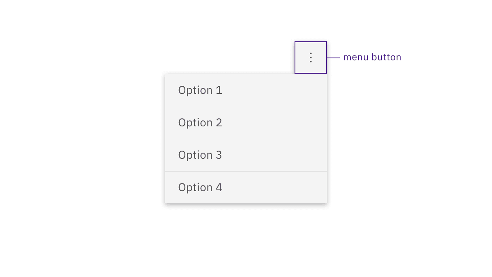

import A11yStatus from 'components/A11yStatus';

<PageDescription>

Design annotations are needed for specific instances shown below, but for the
standard button component, Carbon already incorporates accessibility.

</PageDescription>

<AnchorLinks>
  <AnchorLink>What Carbon provides</AnchorLink>
  <AnchorLink>Design recommendations</AnchorLink>
  <AnchorLink>Development considerations</AnchorLink>
</AnchorLinks>

## What Carbon provides

Carbon bakes keyboard operation into its components, improving the experience of
blind users and others who operate via the keyboard. Carbon incorporates many
other accessibility considerations, some of which are described below.

### Keyboard interactions

Buttons can be reached by `Tab` and selected with `Space` or `Enter`.

<Row>
<Column colLg={8}>

<Caption>Carbon buttons retain expected interactions.</Caption>

</Column>
</Row>

### Behavior

Icon-only buttons, which do not persistently display a text label, expose their
label on hover and focus. When icon-only buttons are used to open menus, they
are treated as separate components in Carbon. See
[Dropdown](https://carbondesignsystem.com/components/dropdown/usage/) and
[Overflow menu](https://carbondesignsystem.com/components/overflow-menu/usage/).

<Row>
<Column colLg={8}>

<Caption>
  Icon-only buttons have their labels exposed automatically on hover and focus.
</Caption>

</Column>
</Row>

<Row>
<Column colLg={8}>

<Caption>Buttons that open menus are separate components in Carbon.</Caption>
</Column>
</Row>

## Design recommendations

Design annotations are needed for the following instances.

### Labeling

When buttons do not have a persistently displayed label, they must be annotated
with a label that will be exposed on hover or focus.

<Row>
<Column colLg={8}>

<Caption>
  Annotate the label for icon-only buttons so the proper tooltip appears.
</Caption>

</Column>
</Row>

## Development considerations

Keep these considerations in mind if you are modifying Carbon or creating a
custom component:

- Where links have been ‘repurposed’ as a button, they need to be coded so the
  `Space` key can also activate (since links are only activated by default by
  `Enter`).
- Toggle buttons can be accessibility supported by changing the value of
  `aria-pressed` between `"true"` and `"false"` or with a change of name that
  reflects a change in the icon shape (for example: "play" / "pause" )
- See the
  [ARIA authoring practices](https://www.w3.org/TR/wai-aria-practices-1.2/#button)
  for more considerations.

<A11yStatus layout="table" components="Button" />
