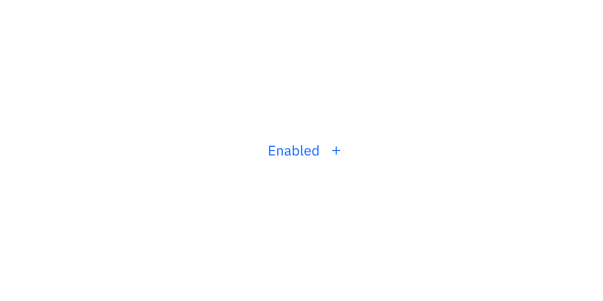
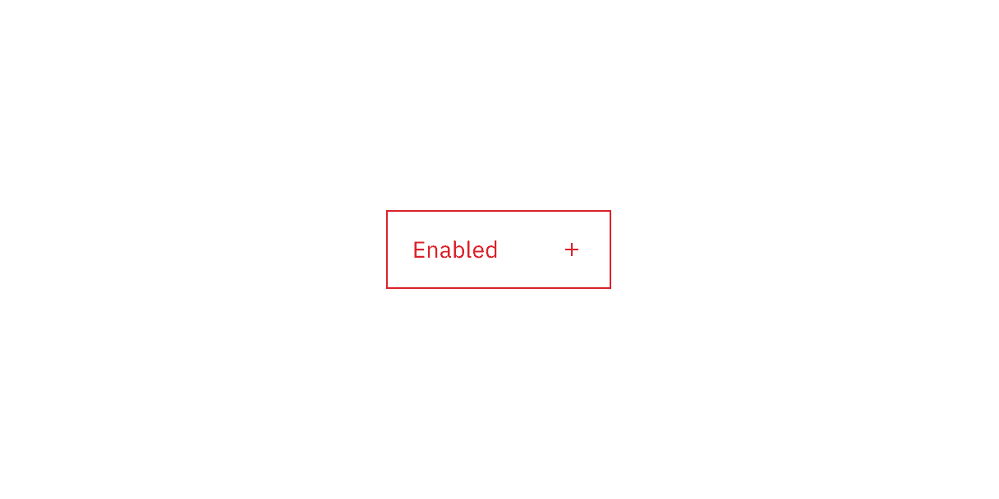
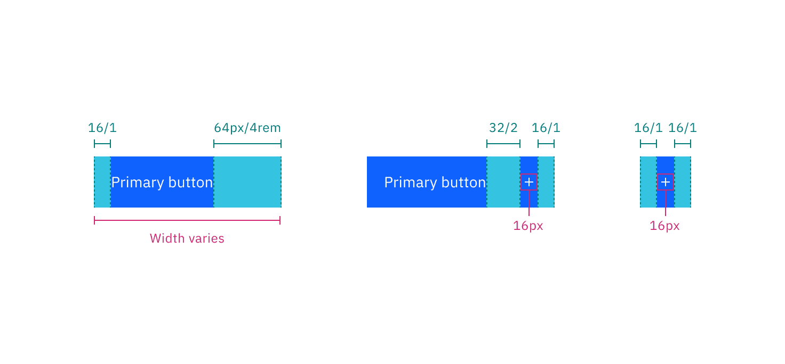

## Color

### Primary button

| Element            | Property         | Color token               |
| ------------------ | ---------------- | ------------------------- |
| Label              | text color       | `$text-on-color`          |
| Icon               | svg              | `$icon-on-color`          |
| Container          | background-color | `$button-primary`         |
| Container:hover    | background-color | `$button-primary-hover`   |
| Container:active   | background-color | `$button-primary-active`  |
| Container:focus    | border           | `$focus`                  |
|                    | inset            | `$focus-inset`            |
| Container:disabled | background-color | `$button-disabled`        |
| Label:disabled     | text color       | `$text-on-color-disabled` |
| Icon:disabled      | svg              | `$icon-on-color-disabled` |

<Row>
<Column colLg={8}>

</Column>
</Row>

### Secondary button

| Element            | Property         | Color token                |
| ------------------ | ---------------- | -------------------------- |
| Label              | text color       | `$text-on-color`           |
| Icon               | svg              | `$icon-on-color`           |
| Container          | background-color | `$button-secondary`        |
| Container:hover    | background-color | `$button-secondary-hover`  |
| Container:active   | background-color | `$button-secondary-active` |
| Container:focus    | border           | `$focus`                   |
|                    | inset            | `$focus-inset`             |
| Container:disabled | background-color | `$button-disabled`         |
| Label:disabled     | text color       | `$text-on-color-disabled`  |
| Icon:disabled      | svg              | `$icon-on-color-disabled`  |

<Row>
<Column colLg={8}>

</Column>
</Row>

### Tertiary button

| Element            | Property         | Color token               |
| ------------------ | ---------------- | ------------------------- |
| Label              | text color       | `$button-tertiary`        |
| Icon               | svg              | `$button-tertiary`        |
| Container          | background-color | `transparent`             |
|                    | border           | `$button-tertiary`        |
| Label:hover        | text color       | `$text-inverse`           |
| Icon:hover         | svg              | `$icon-inverse`           |
| Container:hover    | background-color | `$button-tertiary-hover`  |
| Label:active       | text color       | `$text-inverse`           |
| Icon:active        | svg              | `$icon-inverse`           |
| Container:active   | background-color | `$button-tertiary-active` |
| Container:focus    | background-color | `$button-tertiary-hover`  |
|                    | border           | `$focus`                  |
|                    | inset            | `$focus-inset`            |
| Container:disabled | background       | `transparent`             |
|                    | border           | `$button-disabled`        |
| Label:disabled     | text color       | `$text-disabled`          |
| Icon:disabled      | svg              | `$icon-disabled`          |

<Row>
<Column colLg={8}>

</Column>
</Row>

### Ghost button

| Element          | Property         | Color token           |
| ---------------- | ---------------- | --------------------- |
| Label            | text color       | `$link-primary`       |
| Icon             | svg              | `$link-primary`       |
| Container        | background-color | Transparent           |
| Label:hover      | text color       | `$link-primary-hover` |
| Icon:hover       | svg              | `$link-primary-hover` |
| Container:hover  | background-color | `$background-hover`   |
| Container:active | background-color | `$background-active`  |
| Container:focus  | border           | `$focus`              |
| Label:disabled   | text color       | `$text-disabled`      |
| Label:disabled   | svg              | `$icon-disabled`      |

<Row>
<Column colLg={8}>

</Column>
</Row>

 

#### Ghost button – Icon only

 

| Element            | Property         | Color token            |
| ------------------ | ---------------- | ---------------------- |
| Icon               | svg              | `$icon-primary`        |
| Container          | background-color | Transparent            |
| Container:hover    | background-color | `$background-hover`    |
| Container:active   | background-color | `$background-active`   |
| Container:focus    | border           | `$focus`               |
| Container:selected | background-color | `$background-selected` |
| Icon:disabled      | svg              | `$icon-disabled`       |

<Row>
<Column colLg={8}>

</Column>
</Row>

### Primary danger button

| Element            | Property         | Color token               |
| ------------------ | ---------------- | ------------------------- |
| Label              | text color       | `$text-on-color`          |
| Icon               | svg              | `$icon-on-color`          |
| Container          | background-color | `$button-danger-primary`  |
| Container:hover    | background-color | `$button-danger-hover`    |
| Container:active   | background-color | `$button-danger-active`   |
| Container:focus    | border           | `$focus`                  |
|                    | inset            | `$focus-inset`            |
| Container:disabled | background-color | `$button-disabled`        |
| Label:disabled     | text color       | `$text-on-color-disabled` |
| Icon:disabled      | svg              | `$icon-on-color-disabled` |

<Row>
<Column colLg={8}>

</Column>
</Row>

### Tertiary danger button

| Element            | Property         | Color token                |
| ------------------ | ---------------- | -------------------------- |
| Label              | text color       | `$button-danger-secondary` |
| Icon               | svg              | `$button-danger-secondary` |
| Container          | border           | `$button-danger-secondary` |
| Container:hover    | background-color | `$button-danger-hover`     |
| Label:hover        | text color       | `$text-on-color`           |
| Icon:hover         | svg              | `$icon-on-color`           |
| Container:active   | background-color | `$button-danger-active`    |
| Label:active       | text color       | `$text-on-color`           |
| Icon:active        | svg              | `$icon-on-color`           |
| Container:focus    | border           | `$focus`                   |
|                    | inset            | `$focus-inset`             |
| Container:disabled | background-color | `$button-disabled`         |
| Label:disabled     | text color       | `$text-disabled`           |
| Icon:disabled      | svg              | `$icon-disabled`           |

<Row>
<Column colLg={8}>

</Column>
</Row>

### Ghost danger button

| Element            | Property         | Color token                |
| ------------------ | ---------------- | -------------------------- |
| Label              | text color       | `$button-danger-secondary` |
| Icon               | svg              | `$button-danger-secondary` |
| Container:hover    | background-color | `$button-danger-hover`     |
| Label:hover        | text color       | `$text-on-color`           |
| Icon:hover         | svg              | `$icon-on-color`           |
| Container:active   | background-color | `$button-danger-active`    |
| Label:active       | text color       | `$text-on-color`           |
| Icon:active        | svg              | `$icon-on-color`           |
| Container:focus    | border           | `$focus`                   |
|                    | inset            | `$focus-inset`             |
| Container:disabled | background-color | `$button-disabled`         |
| Label:disabled     | text color       | `$text-disabled`           |
| Icon:disabled      | svg              | `$icon-disabled`           |

<Row>
<Column colLg={8}>

</Column>
</Row>

## Typography

Button text should be set in sentence case, with only the first word in a phrase
and any proper nouns capitalized.

| Element                  | Font-size (px/rem) | Font-weight   | Type token         |
| ------------------------ | ------------------ | ------------- | ------------------ |
| Button text              | 14 / 0.875         | Regular / 400 | `$body-compact-01` |
| Button text (expressive) | 16 / 1             | Regular / 400 | `$body-compact-02` |

## Structure

A button cannot have any element or text within 16 pixels / 1 rem of its
borders. For button groups, the primary button is positioned on the outside of
the set, while the secondary button is positioned inside. For a button with a
glyph, the space between the button label and the glyph must be greater than or
equal to 16 pixels / 1 rem. This is to accommodate for instances where two or
more buttons with glyphs appear together.

| Element                 | Property                    | px / rem | Spacing token |
| ----------------------- | --------------------------- | -------- | ------------- |
| Button                  | padding-left                | 16 / 1   | `$spacing-05` |
|                         | padding-right               | 64 / 4   | –             |
| Button:small            | padding-left                | 16 / 1   | `$spacing-05` |
|                         | padding-right               | 64 / 4   | –             |
| Ghost button            | padding-left, padding-right | 16 / 1   | `$spacing-05` |
| Icon only button        | margin-left, margin-right   | 16 / 1   | `$spacing-05` |
| Icon                    | svg                         | 16 x 16  | –             |
| Icon: expressive button | size                        | 20 x 20  | –             |
| Focus                   | box-shadow: inset           | 1px      | –             |

<Row>
<Column colLg={8}>

</Column>
</Row>

<Caption>Structure measurements for buttons | px / rem</Caption>

### Recommended

The following specs are not built into any of the button components but are
recommended by design as the proper distance between buttons.

| Attribute        | Property                  | px / rem | Spacing token |
| ---------------- | ------------------------- | -------- | ------------- |
| External: button | margin                    | 1px      | -             |
| Button pairings  | margin-left, margin-right | 0        | –             |

### Sizes

There are six button sizes: small, medium, large productive, large expressive,
extra large, and 2XL. The large expressive button is used in editorial and
digital marketing experiences. See
[Button sizes](/components/button/usage#button-sizes) on the Usage tab for more
information about specific use cases for each button size.

| Variant           | Size             | Height (px / rem) |
| ----------------- | ---------------- | ----------------- |
| Button            | Small            | 32 / 2            |
|                   | Medium           | 40 / 2.5          |
|                   | Large productive | 48 / 3            |
|                   | Large expressive | 48 / 3            |
| Full bleed button | Extra large      | 64 / 4            |
|                   | 2xl              | 80 / 5            |

<Row>
<Column colLg={8}>

</Column>
</Row>
