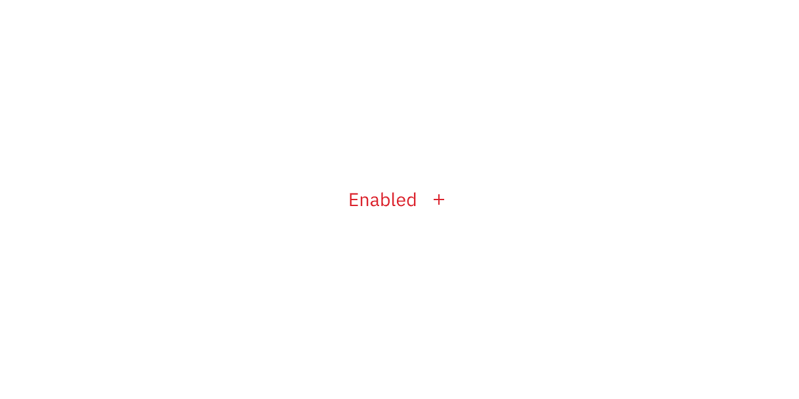

## Color

### Primary button

| Class               | Property         | Color token       |
| ------------------- | ---------------- | ----------------- |
| `.bx--btn--primary` | text color       | `$text-04`        |
| `.bx--btn__icon`    | svg              | `$icon-03`        |
| `.bx--btn--primary` | background-color | `$interactive-01` |
| `:hover`            | background-color | `$hover-primary`  |
| `:active`           | background-color | `$active-primary` |
| `:focus`            | border           | `$focus`          |
| `:focus`            | inset            | `$ui-background`  |
| `:disabled`         | background-color | `$disabled-02`    |
| `:disabled`         | text color       | `$disabled-03`    |
| `:disabled`         | svg              | `$disabled-03`    |

<Row>
<Column colLg={8}>

</Column>
</Row>

### Secondary button

| Class                 | Property         | Color token         |
| --------------------- | ---------------- | ------------------- |
| `.bx--btn--secondary` | text color       | `$text-04`          |
| `.bx--btn__icon`      | svg              | `$icon-03`          |
| `.bx--btn--secondary` | background-color | `$interactive-02`   |
| `.bx--btn--secondary` | border           | `$interactive-02`   |
| `:hover`              | background-color | `$hover-secondary`  |
| `:active`             | background-color | `$active-secondary` |
| `:focus`              | border           | `$focus`            |
| `:focus`              | inset            | `$ui-background`    |
| `:disabled`           | background-color | `$disabled-02`      |
| `:disabled`           | text color       | `$disabled-03`      |
| `:disabled`           | svg              | `$disabled-03`      |

<Row>
<Column colLg={8}>

</Column>
</Row>

### Tertiary button

| Class                | Property         | Color token        |
| -------------------- | ---------------- | ------------------ |
| `.bx--btn--tertiary` | text color       | `$interactive-03`  |
| `.bx--btn__icon`     | svg              | `$interactive-03`  |
| `.bx--btn--tertiary` | background-color | `transparent`      |
| `.bx--btn--tertiary` | border           | `$interactive-03`  |
| `:hover`             | text color       | `$inverse-01`      |
| `:hover`             | svg              | `$icon-03`         |
| `:hover`             | background-color | `$hover-tertiary`  |
| `:active`            | background-color | `$active-tertiary` |
| `:focus`             | background-color | `$interactive-03`  |
| `:focus`             | border           | `$focus`           |
| `:focus`             | inset            | `$ui-background`   |
| `:disabled`          | background       | `transparent`      |
| `:disabled`          | border           | `$disabled-02`     |
| `:disabled`          | text color       | `$disabled-03`     |
| `:disabled`          | svg              | `$disabled-02`     |

<Row>
<Column colLg={8}>

</Column>
</Row>

### Ghost button

| Class             | Property         | Color token           |
| ----------------- | ---------------- | --------------------- |
| `.bx--btn--ghost` | text color       | `$link-01`            |
| `.bx--btn__icon`  | svg              | `$link-01`            |
| `.bx--btn--ghost` | background-color | –                     |
| `:hover`          | text color       | `$hover-primary-text` |
| `:hover`          | svg              | `$hover-primary-text` |
| `:hover`          | background-color | `$hover-ui`           |
| `:active`         | background-color | `$active-ui`          |
| `:focus`          | border           | `$focus`              |
| `:disabled`       | text color       | `$disabled-03`        |
| `:disabled`       | svg              | `$disabled-02`        |

<Row>
<Column colLg={8}>

</Column>
</Row>

### Primary danger button

| Class                       | Property         | Color token      |
| --------------------------- | ---------------- | ---------------- |
| `.bx--btn--danger--primary` | text color       | `$text-04`       |
| `.bx--btn__icon`            | svg              | `$icon-03`       |
| `.bx--btn--danger--primary` | background-color | `$danger-01`     |
| `:hover`                    | background-color | `$hover-danger`  |
| `:active`                   | background-color | `$active-danger` |
| `:focus`                    | border           | `$focus`         |
| `:focus`                    | inset            | `$ui-background` |
| `:disabled`                 | background-color | `$disabled-02`   |
| `:disabled`                 | text color       | `$disabled-03`   |
| `:disabled`                 | svg              | `$disabled-03`   |

<Row>
<Column colLg={8}>

</Column>
</Row>

### Tertiary danger button

| Class                        | Property         | Color token      |
| ---------------------------- | ---------------- | ---------------- |
| `.bx--btn--danger--tertiary` | text color       | `$danger-02`     |
| `.bx--btn__icon`             | svg              | `$danger-02`     |
| `.bx--btn--danger--tertiary` | border           | `$danger-02`     |
| `:hover`                     | background-color | `$hover-danger`  |
| `:hover`                     | text color       | `$text-04`       |
| `:hover`                     | svg              | `$icon-03`       |
| `:active`                    | background-color | `$active-danger` |
| `:active`                    | text color       | `$text-04`       |
| `:active`                    | svg              | `$icon-03`       |
| `:focus`                     | border           | `$focus`         |
| `:focus`                     | inset            | `$ui-background` |
| `:disabled`                  | background-color | `$disabled-02`   |
| `:disabled`                  | text color       | `$disabled-03`   |
| `:disabled`                  | svg              | `$disabled-03`   |

<Row>
<Column colLg={8}>

</Column>
</Row>

### Ghost danger button

| Class                     | Property         | Color token      |
| ------------------------- | ---------------- | ---------------- |
| `.bx--btn--danger--ghost` | text color       | `$danger-02`     |
| `.bx--btn__icon`          | svg              | `$danger-02`     |
| `:hover`                  | background-color | `$hover-danger`  |
| `:hover`                  | text color       | `$text-04`       |
| `:hover`                  | svg              | `$icon-03`       |
| `:active`                 | background-color | `$active-danger` |
| `:active`                 | text color       | `$text-04`       |
| `:active`                 | svg              | `$icon-03`       |
| `:focus`                  | border           | `$focus`         |
| `:focus`                  | inset            | `$ui-background` |
| `:disabled`               | background-color | `$disabled-02`   |
| `:disabled`               | text color       | `$disabled-03`   |
| `:disabled`               | svg              | `$disabled-03`   |

<Row>
<Column colLg={8}>

</Column>
</Row>

## Typography

Button text should be set in sentence case, with only the first word in a phrase
and any proper nouns capitalized.

| Class      | Font-size (px/rem) | Font-weight   | Type style       |
| ---------- | ------------------ | ------------- | ---------------- |
| `.bx--btn` | 14 / 0.875         | Regular / 400 | `$body-short-01` |

## Structure

A button cannot have any element or text within 16 pixels / 1 rem of its
borders. For button groups, the primary button is positioned on the outside of
the set, while the secondary button is positioned inside. For a button with a
glyph, the space between the button label and the glyph must be greater than or
equal to 16 pixels / 1 rem. This is to accommodate for instances where two or
more buttons with glyphs appear together.

| Class             | Property                    | px / rem | Spacing token |
| ----------------- | --------------------------- | -------- | ------------- |
| `.bx--btn`        | padding-left                | 16 / 1   | `$spacing-05` |
| `.bx--btn`        | padding-right               | 64 / 1   | –             |
| `.bx--btn--sm`    | padding-left                | 16 / 1   | `$spacing-05` |
| `.bx--btn--sm`    | padding-right               | 64 / 4   | –             |
| `.bx--btn--ghost` | padding-left, padding-right | 16 / 2   | `$spacing-05` |
| `.bx--btn__icon`  | margin-left, margin-right   | 16 / 2   | `$spacing-05` |
| `svg`             | size                        | 16 x 16  | –             |
| `:focus`          | box-shadow: inset           | 1px      | –             |

<Row>
<Column colLg={8}>

</Column>
</Row>

<Caption>Structure measurements for buttons | px / rem</Caption>

### Recommended

The following specs are not built into any of the button components but are
recommended by design as the proper distance between buttons.

| Attribute        | Property                  | px / rem | Spacing token |
| ---------------- | ------------------------- | -------- | ------------- |
| External: button | margin                    | 1px      | -             |
| Button pairings  | margin-left, margin-right | 0        | –             |

## Sizes

There are three common button sizes: default, field, and small. Each button type
can use any of these three sizes based on need. The fourth button size, full
bleed, has a more reserved application and should rarely be used.

| Button size | Height (px / rem) | Use case                                                                           |
| ----------- | ----------------- | ---------------------------------------------------------------------------------- |
| Full bleed  | 64 / 4            | Use when buttons bleed to the edge of a component, like in side panels and modals. |
| Default     | 48 / 3            | Use as primary page actions and other standalone actions.                          |
| Field       | 40 / 2.5          | Use when buttons are paired with input fields.                                     |
| Small       | 32 / 2            | Use when there is not enough vertical space for the default sized button.          |

<Row>
<Column colLg={8}>

</Column>
</Row>
