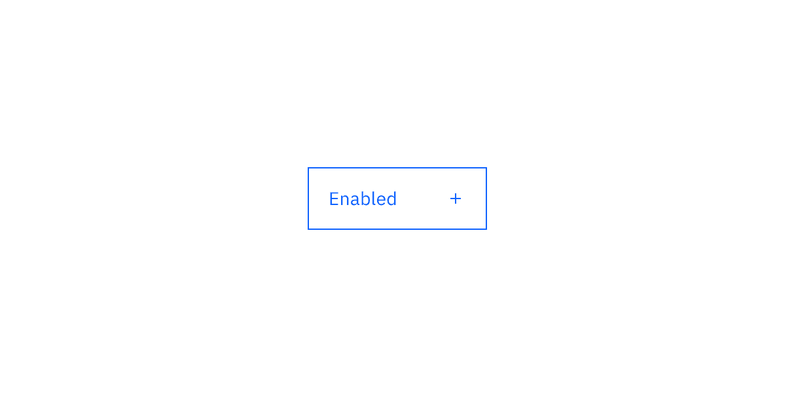
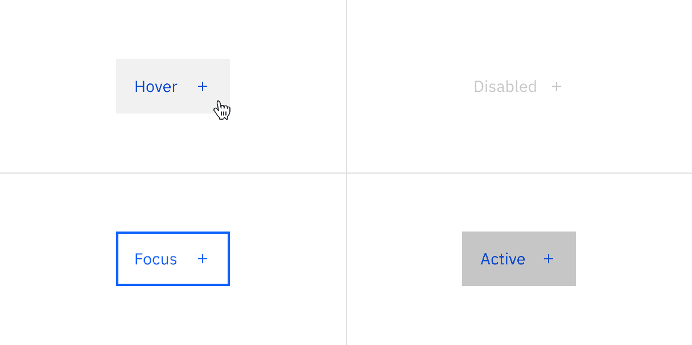
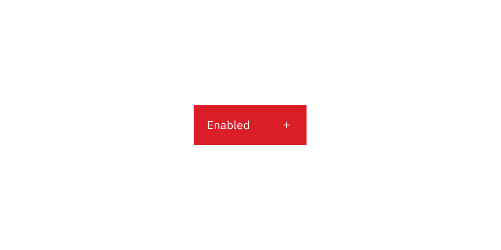
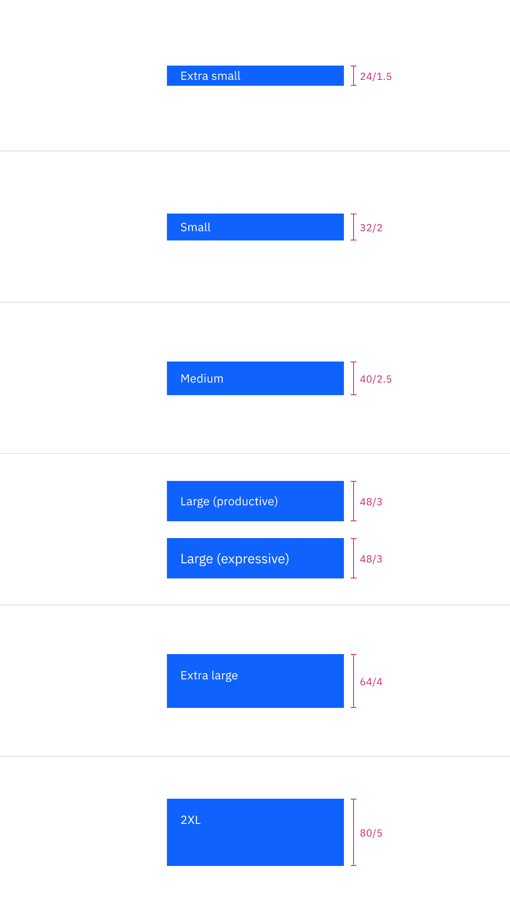

<PageDescription>

The following page documents visual specifications such as color, typography,
structure, and size.

</PageDescription>

<AnchorLinks>

<AnchorLink>Color</AnchorLink>
<AnchorLink>Typography</AnchorLink>
<AnchorLink>Structure</AnchorLink>
<AnchorLink>Size</AnchorLink>
<AnchorLink>Feedback</AnchorLink>

</AnchorLinks>

## Color

### Primary button color

| Element   | Property         | Color token       |
| --------- | ---------------- | ----------------- |
| Label     | text-color       | `$text-on-color`  |
| Icon      | svg              | `$icon-on-color`  |
| Container | background-color | `$button-primary` |

<Row>
<Column colLg={8}>

<Tabs>

<Tab label="Button with icon">

</Tab>

<Tab label="Icon only button">

</Tab>

</Tabs>

</Column>
</Row>

<Title>Primary button interactive state color</Title>

| State    | Element   | Property         | Color token               |
| -------- | --------- | ---------------- | ------------------------- |
| Hover    | Container | background-color | `$button-primary-hover`   |
| Focus    | Container | border           | `$focus`                  |
|          |           | inset            | `$focus-inset`            |
| Active   | Container | background-color | `$button-primary-active`  |
| Disabled | Label     | text-color       | `$text-on-color-disabled` |
|          | Icon      | svg              | `$icon-on-color-disabled` |
|          | Container | background-color | `$button-disabled`        |

<Row>
<Column colLg={8}>

<Tabs>

<Tab label="Button with icon">

</Tab>

<Tab label="Icon only button">

</Tab>

</Tabs>

</Column>
</Row>

### Secondary button color

| Element   | Property         | Color token         |
| --------- | ---------------- | ------------------- |
| Label     | text-color       | `$text-on-color`    |
| Icon      | svg              | `$icon-on-color`    |
| Container | background-color | `$button-secondary` |

<Row>
<Column colLg={8}>

<Tabs>

<Tab label="Button with icon">

</Tab>

<Tab label="Icon only button">

</Tab>

</Tabs>

</Column>
</Row>

<Title>Secondary button interactive state color</Title>

| State    | Element   | Property         | Color token                |
| -------- | --------- | ---------------- | -------------------------- |
| Hover    | Container | background-color | `$button-secondary-hover`  |
| Focus    | Container | border           | `$focus`                   |
|          |           | inset            | `$focus-inset`             |
| Active   | Container | background-color | `$button-secondary-active` |
| Disabled | Label     | text-color       | `$text-on-color-disabled`  |
|          | Icon      | svg              | `$icon-on-color-disabled`  |
|          | Container | background-color | `$button-disabled`         |

<Row>
<Column colLg={8}>

<Tabs>

<Tab label="Button with icon">

</Tab>

<Tab label="Icon only button">

</Tab>

</Tabs>

</Column>
</Row>

### Tertiary button color

| Element   | Property         | Color token        |
| --------- | ---------------- | ------------------ |
| Label     | text-color       | `$button-tertiary` |
| Icon      | svg              | `$button-tertiary` |
| Container | background-color | transparent        |
|           | border           | `$button-tertiary` |

<Row>
<Column colLg={8}>

<Tabs>

<Tab label="Button with icon">

</Tab>

<Tab label="Icon only button">

</Tab>

</Tabs>

</Column>
</Row>

<Title>Tertiary button interactive state color</Title>

| State    | Element   | Property         | Color token               |
| -------- | --------- | ---------------- | ------------------------- |
| Hover    | Label     | text-color       | `$text-inverse`           |
|          | Icon      | svg              | `$icon-inverse`           |
|          | Container | background-color | `$button-tertiary-hover`  |
| Focus    | Container | background-color | `$button-tertiary-hover`  |
|          |           | border           | `$focus`                  |
|          |           | inset            | `$focus-inset`            |
| Active   | Label     | text-color       | `$text-inverse`           |
|          | Icon      | svg              | `$icon-inverse`           |
|          | Container | background-color | `$button-tertiary-active` |
| Disabled | Label     | text-color       | `$text-disabled`          |
|          | Icon      | svg              | `$icon-disabled`          |
|          | Container | background-color | transparent               |
|          |           | border           | `$button-disabled`        |

<Row>
<Column colLg={8}>

<Tabs>

<Tab label="Button with icon">

</Tab>

<Tab label="Icon only button">

</Tab>

</Tabs>

</Column>
</Row>

### Ghost button color

<Title>Ghost button color</Title>

| Element   | Property         | Color token     |
| --------- | ---------------- | --------------- |
| Label     | text-color       | `$link-primary` |
| Icon      | svg              | `$link-primary` |
| Container | background-color | transparent     |

<Title>Ghost icon only button color</Title>

| Element   | Property         | Color token     |
| --------- | ---------------- | --------------- |
| Icon      | svg              | `$icon-primary` |
| Container | background-color | transparent     |

<Row>
<Column colLg={8}>

<Tabs>

<Tab label="Button with icon">

</Tab>

<Tab label="Icon only button">

</Tab>

</Tabs>

</Column>
</Row>

<Title>Ghost button interactive state color</Title>

| State    | Element   | Property         | Color token           |
| -------- | --------- | ---------------- | --------------------- |
| Hover    | Label     | text-color       | `$link-primary-hover` |
|          | Icon      | svg              | `$link-primary-hover` |
|          | Container | background-color | `$background-hover`   |
| Focus    | Container | background-color | `$focus`              |
| Active   | Container | background-color | `$background-hover`   |
| Disabled | Label     | text-color       | `$text-disabled`      |
|          | Icon      | svg              | `$icon-disabled`      |

<Title>Ghost icon only button interactive state color</Title>

| State    | Element   | Property         | Color token          |
| -------- | --------- | ---------------- | -------------------- |
| Hover    | Container | background-color | `$background-hover`  |
| Focus    | Container | border           | `$focus`             |
| Active   | Container | background-color | `$background-active` |
| Disabled | Icon      | svg              | `$icon-disabled`     |

<Row>
<Column colLg={8}>

<Tabs>

<Tab label="Button with icon">

</Tab>

<Tab label="Icon only button">

</Tab>

</Tabs>

</Column>
</Row>

### Danger primary button color

| Element   | Property         | Color token              |
| --------- | ---------------- | ------------------------ |
| Label     | text-color       | `$text-on-color`         |
| Icon      | svg              | `$icon-on-color`         |
| Container | background-color | `$button-danger-primary` |

<Row>
<Column colLg={8}>

</Column>
</Row>

<Caption>Danger primary button color</Caption>

<Title>Danger primary button interactive state color</Title>

| State    | Element   | Property         | Color token               |
| -------- | --------- | ---------------- | ------------------------- |
| Hover    | Container | background-color | `$button-danger-hover`    |
| Focus    | Container | border           | `$focus`                  |
|          |           | inset            | `$focus-inset`            |
| Active   | Container | background-color | `$button-danger-active`   |
| Disabled | Label     | text-color       | `$text-on-color-disabled` |
|          | Icon      | svg              | `$icon-on-color-disabled` |
|          | Container | background-color | `$button-disabled`        |

<Row>
<Column colLg={8}>

</Column>
</Row>

<Caption>Danger primary button interactive state color</Caption>

### Danger tertiary button color

| Element   | Property   | Color token                |
| --------- | ---------- | -------------------------- |
| Label     | text-color | `$button-danger-secondary` |
| Icon      | svg        | `$button-danger-secondary` |
| Container | border     | `$button-danger-secondary` |

<Row>
<Column colLg={8}>

</Column>
</Row>

<Caption>Danger tertiary button color</Caption>

<Title>Danger tertiary button interactive state color</Title>

| State    | Element   | Property         | Color token             |
| -------- | --------- | ---------------- | ----------------------- |
| Hover    | Label     | text-color       | `$text-on-color`        |
|          | Icon      | svg              | `$icon-on-color`        |
|          | Container | background-color | `$button-danger-hover`  |
| Focus    |           | border           | `$focus`                |
|          |           | inset            | `$focus-inset`          |
| Active   | Label     | text-color       | `$text-on-color`        |
|          | Icon      | svg              | `$icon-on-color`        |
|          | Container | background-color | `$button-danger-active` |
| Disabled | Label     | text-color       | `$text-disabled`        |
|          | Icon      | svg              | `$icon-disabled`        |
|          | Container | background-color | `$button-disabled`      |

<Row>
<Column colLg={8}>

</Column>
</Row>

<Caption>Danger tertiary button interactive state color</Caption>

### Danger ghost button color

| Element   | Property         | Color token                |
| --------- | ---------------- | -------------------------- |
| Label     | text-color       | `$button-danger-secondary` |
| Icon      | svg              | `$button-danger-secondary` |
| Container | background-color | transparent                |

<Row>
<Column colLg={8}>

</Column>
</Row>

<Caption>Danger ghost button color</Caption>

<Title>Danger ghost button interactive state color</Title>

| State    | Element   | Property         | Color token             |
| -------- | --------- | ---------------- | ----------------------- |
| Hover    | Label     | text-color       | `$text-on-color`        |
|          | Icon      | svg              | `$icon-on-color`        |
|          | Container | background-color | `$button-danger-hover`  |
| Focus    |           | border           | `$focus`                |
|          |           | inset            | `$focus-inset`          |
| Active   | Label     | text-color       | `$text-on-color`        |
|          | Icon      | svg              | `$icon-on-color`        |
|          | Container | background-color | `$button-danger-active` |
| Disabled | Label     | text-color       | `$text-disabled`        |
|          | Icon      | svg              | `$icon-disabled`        |
|          | Container | background-color | `$button-disabled`      |

<Row>
<Column colLg={8}>

</Column>
</Row>

<Caption>Danger ghost button interactive state color</Caption>

## Typography

Button label should be set in sentence case, with only the first word in a
phrase and any proper nouns capitalized.

| Element                   | Font-size (px/rem) | Font-weight   | Type token         |
| ------------------------- | ------------------ | ------------- | ------------------ |
| Button label              | 14 / 0.875         | Regular / 400 | `$body-compact-01` |
| Button label (expressive) | 16 / 1             | Regular / 400 | `$body-compact-02` |

## Structure

Primary, secondary, tertiary, danger primary and danger tertiary button follows
the same structure measurements. A button cannot have label or any element
within 16 pixels / 1 rem of its borders. For a button with an icon, the space
between the button label and the icon must be greater than or equal to 16 pixels
/ 1 rem. This is to accommodate for instances where two or more buttons with
icons appear together.

### Button structure

| Element             | Property                    | px / rem | Spacing token |
| ------------------- | --------------------------- | -------- | ------------- |
| Button without icon | padding-left                | 16 / 1   | `$spacing-05` |
|                     | padding-right               | 64 / 4   | `$spacing-10` |
| Button with icon    | padding-left, padding-right | 16 / 1   | `$spacing-05` |
|                     | spacing                     | 32 / 2   | `$spacing-07` |
| Icon only button    | padding-left, padding-right | 16 / 1   | `$spacing-05` |
| Icon                | svg                         | 16 x 16  | –             |
| Icon: expressive    | size                        | 20 x 20  | –             |
| Focus               | box-shadow: inset           | 1px      | –             |

<Row>
<Column colLg={8}>

</Column>
</Row>

<Caption>Structure measurements for a button | px / rem</Caption>

### Ghost button structure

Ghost and danger ghost button follow the same structure measurements.

| Element                   | Property                    | px / rem | Spacing token |
| ------------------------- | --------------------------- | -------- | ------------- |
| Ghost button without icon | padding-left, padding-right | 16 / 1   | `$spacing-05` |
| Ghost button with icon    | spacing                     | 8 / 0.5  | `$spacing-03` |
| Ghost icon only button    | padding-left, padding-right | 16 / 1   | `$spacing-05` |

<Row>
<Column colLg={8}>

</Column>
</Row>

<Caption>Structure measurements for ghost button | px / rem</Caption>

### Button groups structure

The following specs are not built into any of the button components but are
recommended by design as the proper distance between buttons.

For button groups, the primary button is positioned on the outside of the set,
while the secondary button is positioned inside.

| Element       | Property                  | px / rem | Spacing token |
| ------------- | ------------------------- | -------- | ------------- |
| Button groups | border (fluid)            | 1px      | –             |
|               | spacing (fixed)           | 16px     | `$spacing-05` |
|               | margin-left, margin-right | 0        | –             |

<Row>
<Column colLg={12}>

</Column>
</Row>

<Caption>Structure measurements for button groups | px / rem</Caption>

## Size

There are six button sizes: small, medium, large productive, large expressive,
extra large, and 2XL. The large expressive button is used in editorial and
digital marketing experiences. See
[Button sizes](/components/button/usage#button-sizes) on the Usage tab for more
information about specific use cases for each button size.

| Variant           | Size             | Height (px / rem) |
| ----------------- | ---------------- | ----------------- |
| Button            | Small            | 32 / 2            |
|                   | Medium           | 40 / 2.5          |
|                   | Large productive | 48 / 3            |
|                   | Large expressive | 48 / 3            |
| Full bleed button | Extra large      | 64 / 4            |
|                   | 2XL              | 80 / 5            |

<Row>
<Column colLg={8}>

</Column>
</Row>

<Caption>Button sizes</Caption>

## Feedback

Help us improve this component by providing feedback, asking questions, and
leaving any other comments on
[GitHub](https://github.com/carbon-design-system/carbon-website/issues/new?assignees=&labels=feedback&template=feedback.md).
