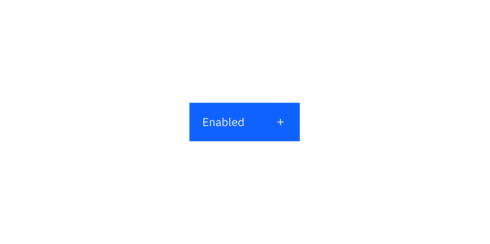
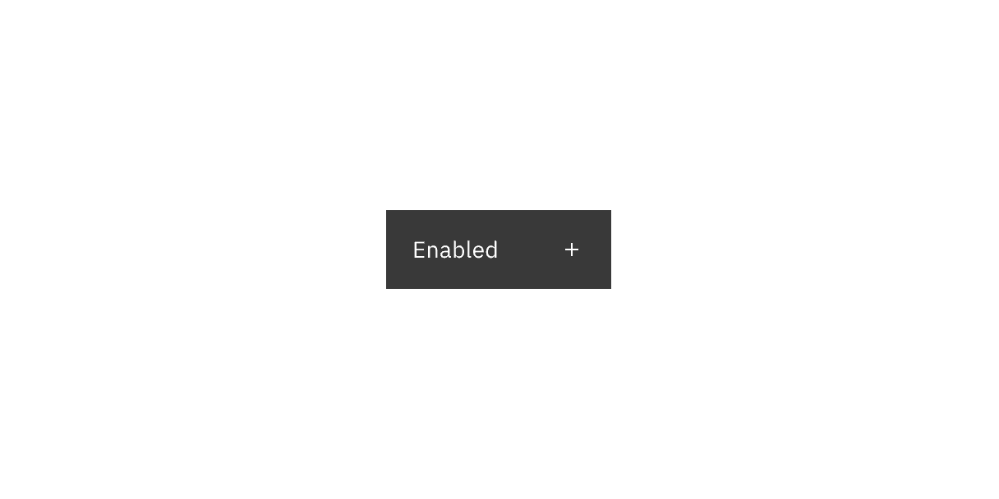

## Color

### Primary button

| Class               | Property         | Color token               |
| ------------------- | ---------------- | ------------------------- |
| `.bx--btn--primary` | text color       | `$text-on-color`          |
| `.bx--btn__icon`    | svg              | `$icon-on-color`          |
| `.bx--btn--primary` | background-color | `$button-primary`         |
| `:hover`            | background-color | `$button-primary-hover`   |
| `:active`           | background-color | `$button-primary-active`  |
| `:focus`            | border           | `$focus`                  |
| `:focus`            | inset            | `$focus-inset`            |
| `:disabled`         | background-color | `$button-disabled`        |
| `:disabled`         | text color       | `$text-on-color-disabled` |
| `:disabled`         | svg              | `$icon-on-color-disabled` |

<Row>
<Column colLg={8}>

</Column>
</Row>

### Secondary button

| Class                 | Property         | Color token                |
| --------------------- | ---------------- | -------------------------- |
| `.bx--btn--secondary` | text color       | `$text-on-color`           |
| `.bx--btn__icon`      | svg              | `$icon-on-color`           |
| `.bx--btn--secondary` | background-color | `$button-secondary`        |
| `.bx--btn--secondary` | border           | `$button-secondary`        |
| `:hover`              | background-color | `$button-secondary-hover`  |
| `:active`             | background-color | `$button-secondary-active` |
| `:focus`              | border           | `$focus`                   |
| `:focus`              | inset            | `$focus-inset`             |
| `:disabled`           | background-color | `$button-disabled`         |
| `:disabled`           | text color       | `$text-on-color-disabled`  |
| `:disabled`           | svg              | `$icon-on-color-disabled`  |

<Row>
<Column colLg={8}>

</Column>
</Row>

### Tertiary button

| Class                | Property         | Color token               |
| -------------------- | ---------------- | ------------------------- |
| `.bx--btn--tertiary` | text color       | `$button-tertiary`        |
| `.bx--btn__icon`     | svg              | `$button-tertiary`        |
| `.bx--btn--tertiary` | background-color | `transparent`             |
| `.bx--btn--tertiary` | border           | `$button-tertiary`        |
| `:hover`             | text color       | `$text-on-color`          |
| `:hover`             | svg              | `$icon-on-color`          |
| `:hover`             | background-color | `$button-tertiary-hover`  |
| `:active`            | background-color | `$button-tertiary-active` |
| `:focus`             | background-color | `$button-tertiary-hover`  |
| `:focus`             | border           | `$focus`                  |
| `:focus`             | inset            | `$focus-inset`            |
| `:disabled`          | background       | `transparent`             |
| `:disabled`          | border           | `$button-disabled`        |
| `:disabled`          | text color       | `$text-on-color-disabled` |
| `:disabled`          | svg              | `$icon-on-color-disabled` |

<Row>
<Column colLg={8}>

</Column>
</Row>

### Ghost button

| Class             | Property         | Color token           |
| ----------------- | ---------------- | --------------------- |
| `.bx--btn--ghost` | text color       | `$link-primary`       |
| `.bx--btn__icon`  | svg              | `$link-primary`       |
| `.bx--btn--ghost` | background-color | –                     |
| `:hover`          | text color       | `$link-primary-hover` |
| `:hover`          | svg              | `$link-primary-hover` |
| `:hover`          | background-color | `$background-hover`   |
| `:active`         | background-color | `$background-active`  |
| `:focus`          | border           | `$focus`              |
| `:disabled`       | text color       | `$text-disabled`      |
| `:disabled`       | svg              | `$icon-disabled`      |

<Row>
<Column colLg={8}>

</Column>
</Row>

### Primary danger button

| Class                       | Property         | Color token               |
| --------------------------- | ---------------- | ------------------------- |
| `.bx--btn--danger--primary` | text color       | `$text-on-color`          |
| `.bx--btn__icon`            | svg              | `$icon-on-color`          |
| `.bx--btn--danger--primary` | background-color | `$button-danger-primary`  |
| `:hover`                    | background-color | `$button-danger-hover`    |
| `:active`                   | background-color | `$button-danger-active`   |
| `:focus`                    | border           | `$focus`                  |
| `:focus`                    | inset            | `$focus-inset`            |
| `:disabled`                 | background-color | `$button-disabled`        |
| `:disabled`                 | text color       | `$text-on-color-disabled` |
| `:disabled`                 | svg              | `$icon-on-color-disabled` |

<Row>
<Column colLg={8}>

</Column>
</Row>

### Tertiary danger button

| Class                        | Property         | Color token                |
| ---------------------------- | ---------------- | -------------------------- |
| `.bx--btn--danger--tertiary` | text color       | `$button-danger-secondary` |
| `.bx--btn__icon`             | svg              | `$button-danger-secondary` |
| `.bx--btn--danger--tertiary` | border           | `$button-danger-secondary` |
| `:hover`                     | background-color | `$button-danger-hover`     |
| `:hover`                     | text color       | `$text-on-color`           |
| `:hover`                     | svg              | `$icon-on-color`           |
| `:active`                    | background-color | `$button-danger-active`    |
| `:active`                    | text color       | `$text-on-color`           |
| `:active`                    | svg              | `$icon-on-color`           |
| `:focus`                     | border           | `$focus`                   |
| `:focus`                     | inset            | `$focus-inset`             |
| `:disabled`                  | background-color | `$button-disabled`         |
| `:disabled`                  | text color       | `$text-on-color-disabled`  |
| `:disabled`                  | svg              | `$icon-on-color-disabled`  |

<Row>
<Column colLg={8}>

</Column>
</Row>

### Ghost danger button

| Class                     | Property         | Color token                |
| ------------------------- | ---------------- | -------------------------- |
| `.bx--btn--danger--ghost` | text color       | `$button-danger-secondary` |
| `.bx--btn__icon`          | svg              | `$button-danger-secondary` |
| `:hover`                  | background-color | `$button-danger-hover`     |
| `:hover`                  | text color       | `$text-on-color`           |
| `:hover`                  | svg              | `$icon-on-color`           |
| `:active`                 | background-color | `$button-danger-active`    |
| `:active`                 | text color       | `$text-on-color`           |
| `:active`                 | svg              | `$icon-on-color`           |
| `:focus`                  | border           | `$focus`                   |
| `:focus`                  | inset            | `$focus-inset`             |
| `:disabled`               | background-color | `$button-disabled`         |
| `:disabled`               | text color       | `$text-on-color-disabled`  |
| `:disabled`               | svg              | `$icon-on-color-disabled`  |

<Row>
<Column colLg={8}>

</Column>
</Row>

## Typography

Button text should be set in sentence case, with only the first word in a phrase
and any proper nouns capitalized.

| Class                  | Font-size (px/rem) | Font-weight   | Type style       |
| ---------------------- | ------------------ | ------------- | ---------------- |
| `.bx--btn`             | 14 / 0.875         | Regular / 400 | `$body-short-01` |
| `.bx--btn--expressive` | 16 / 1             | Regular / 400 | `$body-short-02` |

## Structure

A button cannot have any element or text within 16 pixels / 1 rem of its
borders. For button groups, the primary button is positioned on the outside of
the set, while the secondary button is positioned inside. For a button with a
glyph, the space between the button label and the glyph must be greater than or
equal to 16 pixels / 1 rem. This is to accommodate for instances where two or
more buttons with glyphs appear together.

| Class                      | Property                    | px / rem | Spacing token |
| -------------------------- | --------------------------- | -------- | ------------- |
| `.bx--btn`                 | padding-left                | 16 / 1   | `$spacing-05` |
| `.bx--btn`                 | padding-right               | 64 / 4   | –             |
| `.bx--btn--sm`             | padding-left                | 16 / 1   | `$spacing-05` |
| `.bx--btn--sm`             | padding-right               | 64 / 4   | –             |
| `.bx--btn--ghost`          | padding-left, padding-right | 16 / 1   | `$spacing-05` |
| `.bx--btn__icon`           | margin-left, margin-right   | 16 / 1   | `$spacing-05` |
| `svg`                      | size                        | 16 x 16  | –             |
| `.bx--btn--expressive svg` | size                        | 20 x 20  | –             |
| `:focus`                   | box-shadow: inset           | 1px      | –             |

<Row>
<Column colLg={8}>

</Column>
</Row>

<Caption>Structure measurements for buttons | px / rem</Caption>

### Recommended

The following specs are not built into any of the button components but are
recommended by design as the proper distance between buttons.

| Attribute        | Property                  | px / rem | Spacing token |
| ---------------- | ------------------------- | -------- | ------------- |
| External: button | margin                    | 1px      | -             |
| Button pairings  | margin-left, margin-right | 0        | –             |

### Sizes

There are six button sizes: small, medium, large productive, large expressive, 
extra large, and 2xl. The large expressive button is used in editorial and 
digital marketing experiences. See[Button sizes](/components/button/usage#button-sizes) 
on the Usage tab for more information about specific use cases for each button size.

| Element           | Size              | Height (px / rem)      |
| ----------------- | ----------------- | ---------------------- |
| Button            | Small             | 32 / 2                 |
|                   | Medium            | 40 / 2.5               |
|                   | Large productive  | 48 / 3                 |
|                   | Large expressive  | 48 / 3                 |
| Full bleed button | Extra large       | 64 / 4                 |
|                   | 2xl               | 80 / 5                 |

<Row>
<Column colLg={8}>

</Column>
</Row>
