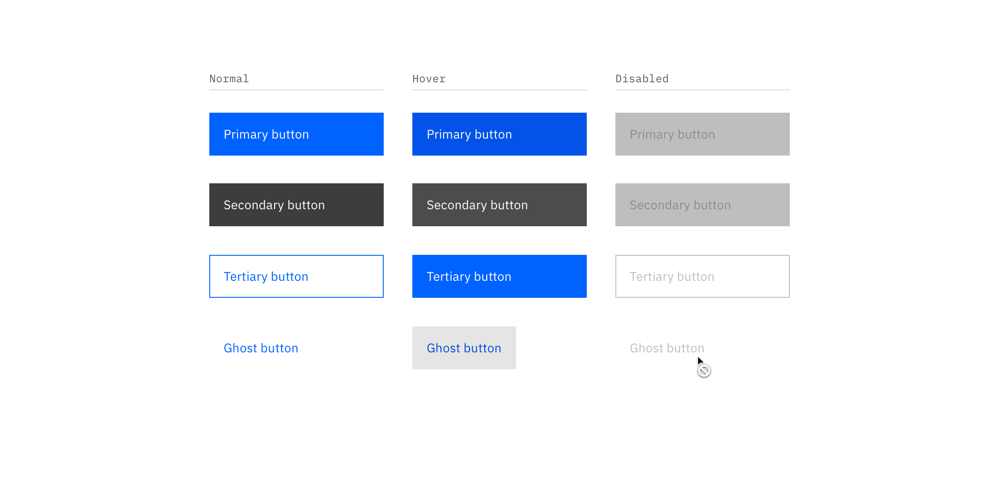
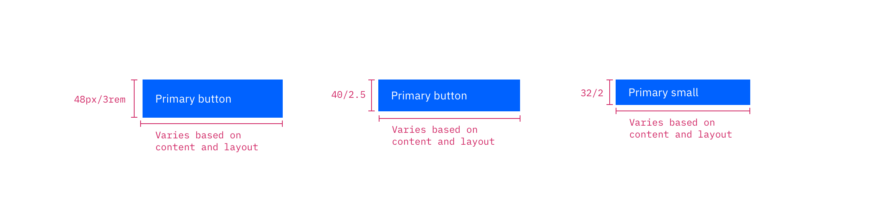
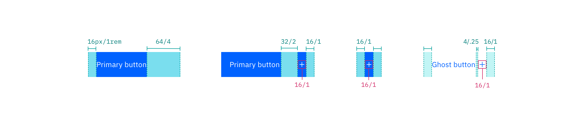

<AnchorLinks>

<AnchorLink>General guidance</AnchorLink>
<AnchorLink>Formatting</AnchorLink>
<AnchorLink>Content</AnchorLink>
<AnchorLink>Behavior</AnchorLink>
<AnchorLink>Accessibility</AnchorLink>
<AnchorLink>Variations</AnchorLink>
<AnchorLink>Style</AnchorLink>
<AnchorLink>Code</AnchorLink>
<AnchorLink>Feedback</AnchorLink>

</AnchorLinks>

## General guidance 

Buttons are used to initialize an action. Button labels express what action will occur when the user interacts with it.

Buttons are used primarily for actions. Examples include Add, Save, Delete, and Sign up. Each page should have one primary button, and a **Return** or **Enter** keyboard event should trigger it. Any remaining calls-to-action should be represented as secondary buttons.Primary buttons always appear to the right. Secondary buttons appear to the left of the primary button.

Do not use buttons as navigational elements. Instead, use [links](/components/link) when the desired action is to take the user to a new page.

<ComponentCode
  name="Primary button"
  component="button"
  variation="button--primary"
  hasReactVersion="buttons--default"
  hasVueVersion="button--primary"
  hasAngularVersion="?path=/story/button--basic"
  codepen="xeZxLe"></ComponentCode>

## Formatting

## Content 

**Button labels should clearly indicate the action of the button.** Use active verbs, such as **Add** or **Delete**. Use sentence-style capitalization (only the first word in a phrase and any proper nouns capitalized) and no more than three words for button labels.

**For sets of buttons, use specific labels, such as **Save** or **Discard**, instead of using **OK** and **Cancel**.** This is particularly helpful when the user is confirming an action.

For consistency, see [labels and idioms](/guidelines/content/glossary) for the approved list of action labels.

## Behavior

## Accessibility

[^3]
[^3]: Content note: the accessibility of the disabled button state has come up multiple times in slack

## Variations 

| Button type        | Purpose                                                                                                                                                                                                                                                                                                                                                                           |
| ------------------ | --------------------------------------------------------------------------------------------------------------------------------------------------------------------------------------------------------------------------------------------------------------------------------------------------------------------------------------------------------------------------------- |
| _Primary_          | For the principal call to action on the page.                                                                                                                                                                                                                                                                                                                                     |
| _Secondary_        | For secondary actions on each page.                                                                                                                                                                                                                                                                                                                                               |
| _Button with icon_ | When words are not enough, icons can be used in buttons to better communicate what the button does. Icons are always paired with text.                                                                                                                                                                                                                                            |
| _Disabled button_  | Use when the user cannot proceed until an input is collected.                                                                                                                                                                                                                                                                                                                     |
| _Set of buttons_   | When an action required by the user has more than one option, always use a a negative action button (secondary) paired with a positive action button (primary) in that order. Negative action buttons will be on the left; positive action buttons on the right. When these two types of buttons are paired in the correct order, they will automatically space themselves apart. |
| _Small button_     | Use when there is not enough vertical space for a regular sized button.                                                                                                                                                                                                                                                                                                           |
| _Ghost button_     | When an action does not require primary dominance on the page.                                                                                                                                                                                                                                                                                                                    |
| _Danger button_    | When an action has potentially destructive effects on the user‘s data (delete, remove, etc).                                                                                                                                                                                                                                                                                      |

### Button with icon

- Use glyphs (16px) within buttons.
- Glyphs are distinguished by their solid shape and knocked-out details.
- Glyphs should always appear to the right of the text.
- Glyphs used in buttons must be directly related to the action that the user is taking.
- Glyphs must be the same color value as the text within a button.
- Ghost buttons require a glyph icon.

<Row>
<Column colLg={8}>

<Caption>Glyph usage in buttons</Caption>

</Column>
</Row>

### Set of buttons

When using multiple buttons, the primary button appears to the right and any secondary buttons appear to the left. Research has shown that performance differences between secondary and primary button placement are negligible, however [maintaining consistency](https://www.nngroup.com/articles/ok-cancel-or-cancel-ok/) throughout a product, offering, or platform is crucial. The Secondary / Primary button order (secondary to the left and primary to the right) is therefore our required guidance and should be followed at all times.[^1]
[^1]: Jakob Nielsen, [_OK-Cancel or Cancel-OK? The Trouble With Buttons_](https://www.nngroup.com/articles/ok-cancel-or-cancel-ok/) (2008)

<Row>
<Column colLg={8}>

<Caption>Secondary / Primary button order in a modal</Caption>

</Column>
</Row>

### Danger button

Danger buttons have a different visual style to inform users of potentially destructive actions they are about to take. If using the danger button as a standalone, we recommend styling it as a **secondary button**. Within a set, the danger button should be styled as a **primary button.**

<Row>
<Column colLg={8}>

<Caption>Danger button set</Caption>

</Column>
</Row>

## Style

### Color

#### Primary button

| Class               | Property         | Color token       |
| ------------------- | ---------------- | ----------------- |
| `.bx--btn--primary` | text color       | `$text-04`        |
| `.bx--btn__icon`    | svg              | `$icon-03`        |
| `.bx--btn--primary` | background-color | `$interactive-01` |
| `:hover`            | background-color | `$hover-primary`  |
| `:active`           | background-color | `$active-primary` |
| `:focus`            | border           | `$focus`          |
| `:disabled`         | background-color | `$disabled-02`    |
| `:disabled`         | text color       | `$disabled-03`    |

#### Secondary button

| Class                 | Property         | Color token         |
| --------------------- | ---------------- | ------------------- |
| `.bx--btn--secondary` | text color       | `$text-04`          |
| `.bx--btn__icon`      | svg              | `$icon-03`          |
| `.bx--btn--secondary` | background-color | `$interactive-02`   |
| `.bx--btn--secondary` | border           | `$interactive-02`   |
| `:hover`              | background-color | `$hover-secondary`  |
| `:active`             | background-color | `$active-secondary` |
| `:focus`              | border           | `$focus`            |
| `:disabled`           | background-color | `$disabled-02`      |
| `:disabled`           | text color       | `$disabled-03`      |

#### Tertiary button

| Class                | Property         | Color token        |
| -------------------- | ---------------- | ------------------ |
| `.bx--btn--tertiary` | text color       | `$interactive-03`  |
| `.bx--btn__icon`     | svg              | `$interactive-03`  |
| `.bx--btn--tertiary` | background-color | `transparent`      |
| `.bx--btn--tertiary` | border           | `$interactive-03`  |
| `:hover`             | text color       | `$text-04`         |
| `:hover`             | svg              | `$icon-03`         |
| `:hover`             | background-color | `$hover-tertiary`  |
| `:active`            | background-color | `$active-tertiary` |
| `:focus`             | border           | `$focus`           |
| `:disabled`          | background-color | `$disabled-02`     |
| `:disabled`          | text color       | `$disabled-03`     |

#### Ghost button

| Class             | Property         | Color token           |
| ----------------- | ---------------- | --------------------- |
| `.bx--btn--ghost` | text color       | `$link-01`            |
| `.bx--btn__icon`  | svg              | `$link-01`            |
| `.bx--btn--ghost` | background-color | –                     |
| `:hover`          | text color       | `$hover-primary-text` |
| `:hover`          | svg              | `$hover-primary-text` |
| `:hover`          | background-color | `$hover-ui`           |
| `:active`         | background-color | `$active-ui`          |
| `:focus`          | border           | `$focus`              |
| `:disabled`       | text color       | `$disabled-03`        |

#### Danger button

| Class                       | Property         | Color token      |
| --------------------------- | ---------------- | ---------------- |
| `.bx--btn--danger--primar`  | text color       | `$text-04`       |
| `.bx--btn__icon`            | svg              | `$icon-03`       |
| `.bx--btn--danger--primary` | background-color | `$support-01`    |
| `:hover`                    | background-color | `$hover-danger`  |
| `:active`                   | background-color | `$active-danger` |
| `:focus`                    | border           | `$focus`         |
| `:disabled`                 | background-color | `$disabled-02`   |
| `:disabled`                 | text color       | `$disabled-03`   |

<Caption>Primary, secondary, and ghost button state examples</Caption>

### Typography

| Class      | Font-size (px/rem) | Font-weight   | Type style       |
| ---------- | ------------------ | ------------- | ---------------- |
| `.bx--btn` | 14 / 0.875         | Regular / 400 | `$body-short-01` |

### Structure

A button cannot have any element or text within 16 pixels / 1 rem of its borders. For button groups, the primary button is positioned on the outside of the set, while the secondary button is positioned inside. For a button with a glyph, the space between the button label and the glyph must be greater than or equal to 16 pixels / 1 rem. This is to accommodate for instances where two or more buttons with glyphs appear together.

| Class               | Property                    | px / rem | Spacing token |
| ------------------- | --------------------------- | -------- | ------------- |
| `.bx--btn--primary` | height                      | 48 / 3   | –             |
| `.bx--btn--sm`      | height                      | 32 / 2   | –             |
| `.bx--btn__icon`    | size                        | 16 x 16  | –             |
| `.bx--btn`          | padding-left                | 16 / 1   | `$spacing-05` |
| `.bx--btn`          | padding-right               | 64 / 1   | –             |
| `.bx--btn--sm`      | padding-left                | 16 / 1   | `$spacing-05` |
| `.bx--btn--sm`      | padding-right               | 64 / 4   | –             |
| `.bx--btn__icon`    | margin-left, margin-right   | 16 / 1   | `$spacing-05` |
| `.bx--btn--ghost`   | padding-left, padding-right | 16 / 2   | `$spacing-05` |

<Caption>
  Structure measurements for small and regular primary button | px / rem
</Caption>

<Caption>Spacing measurements for various button types | px / rem</Caption>

### Recommended

The following specs are not built into any of the button components but are recommended by design as the proper distance between buttons.

| Attribute        | Property                  | px / rem | Spacing token |
| ---------------- | ------------------------- | -------- | ------------- |
| External: button | margin                    | 1px      | -             |
| Button pairings  | margin-left, margin-right | 0        | –             |

## Code

<ComponentDocs component="button"></ComponentDocs>

## Feedback
