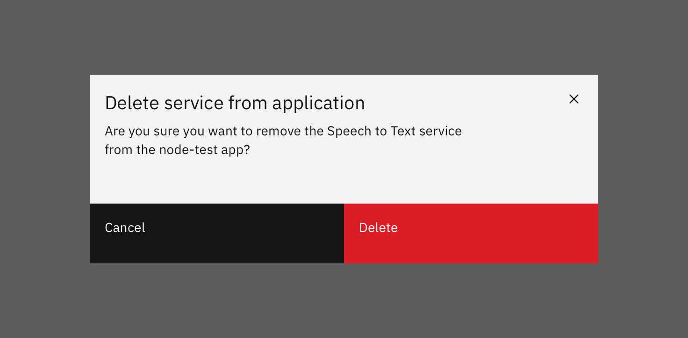
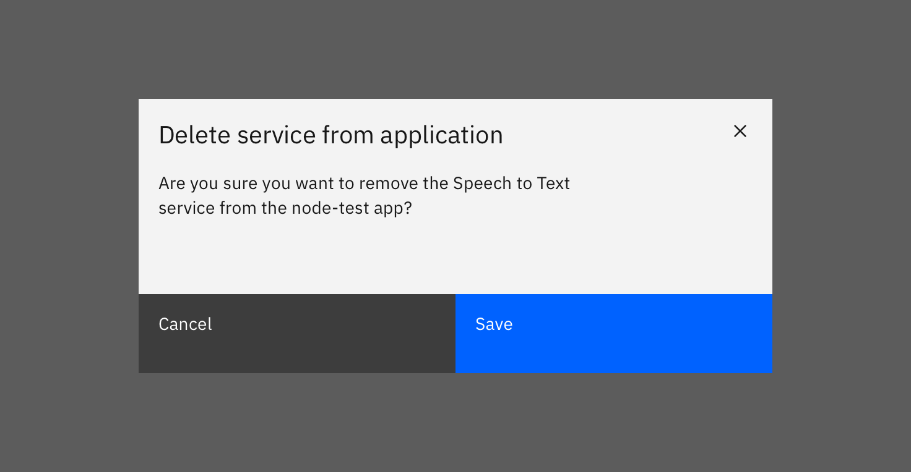
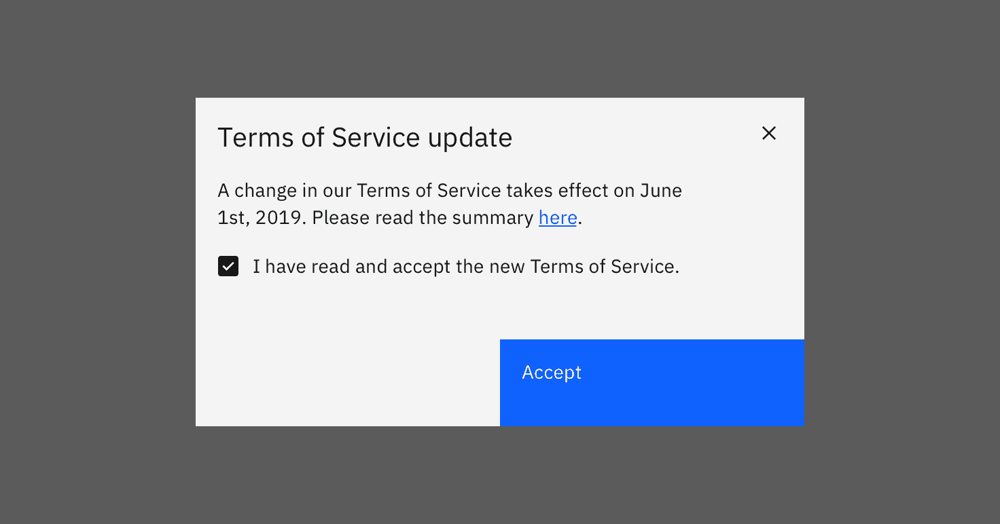
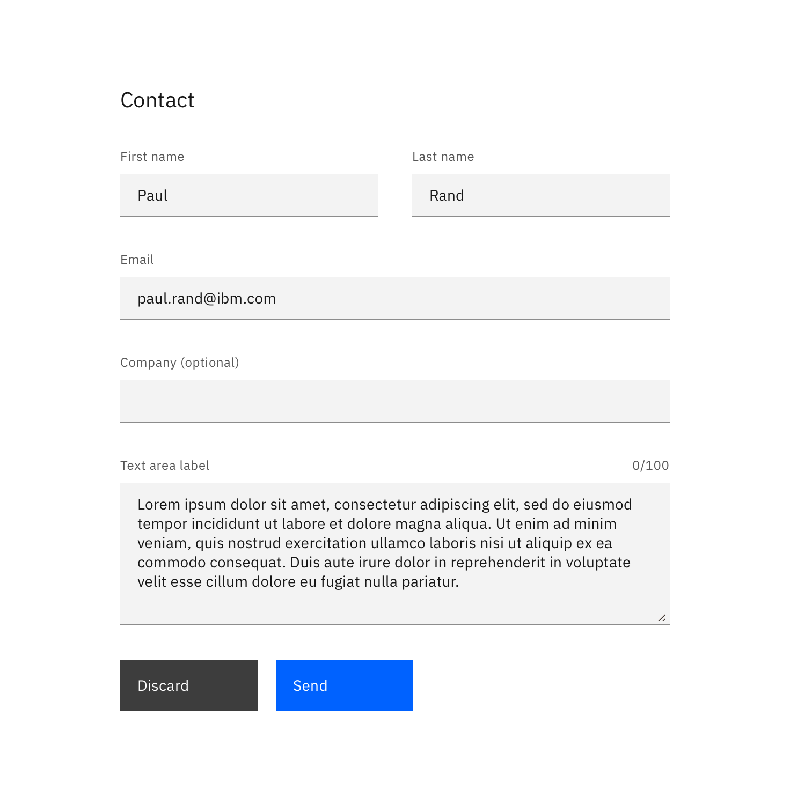
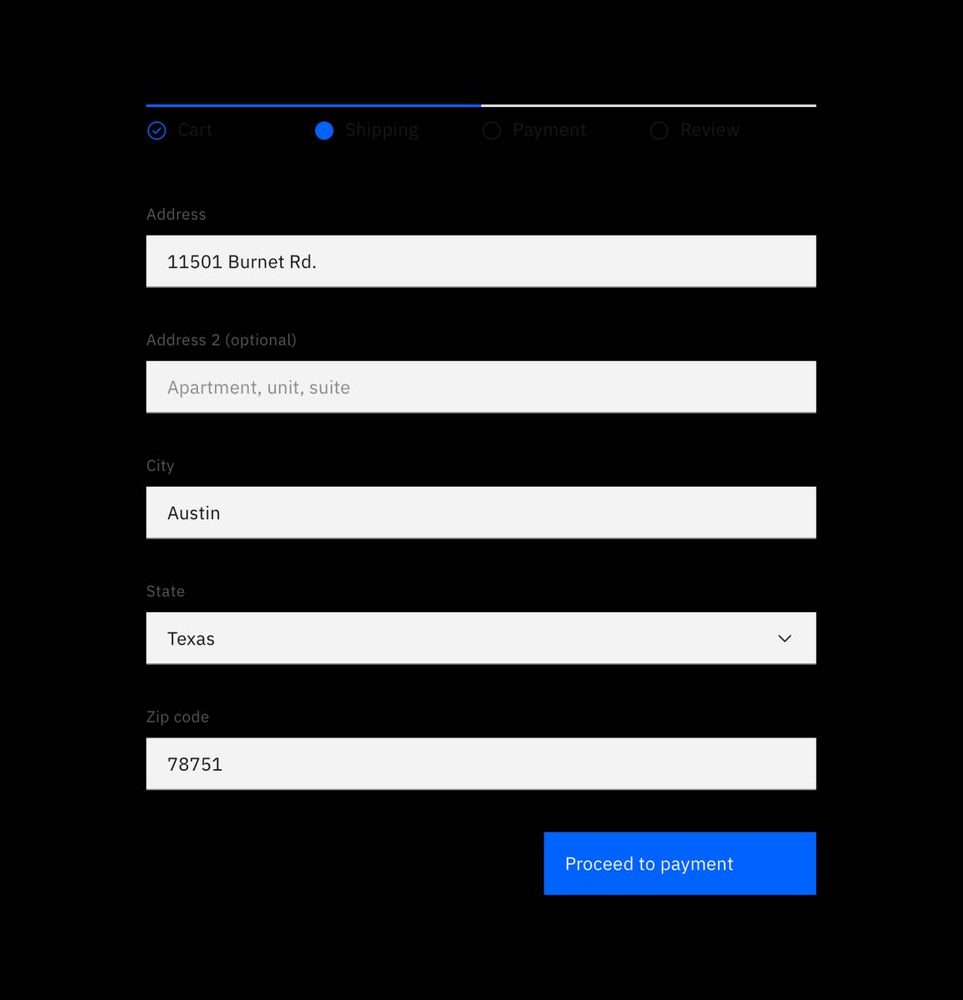
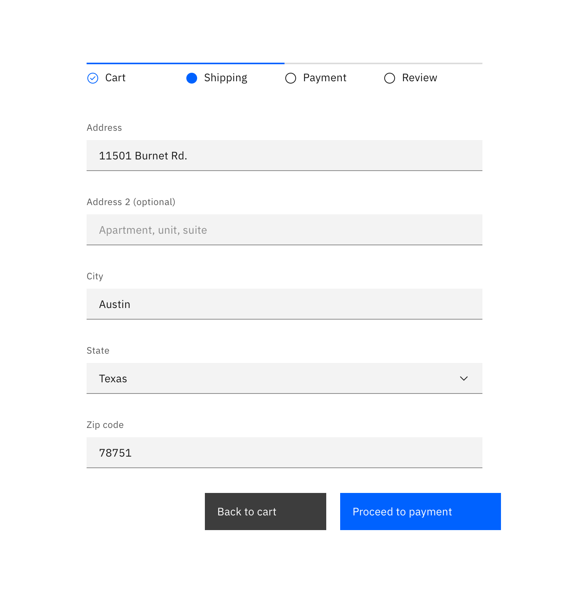

<AnchorLinks>

<AnchorLink>General guidance</AnchorLink>
<AnchorLink>Variations</AnchorLink>
<AnchorLink>Labels</AnchorLink>
<AnchorLink>Icon usage</AnchorLink>
<AnchorLink>Danger button usage</AnchorLink>
<AnchorLink>Button order</AnchorLink>
<AnchorLink>Button alignment</AnchorLink>

</AnchorLinks>

## General guidance

_Buttons_ express what action will occur when the user clicks or touches it. Buttons are used to initialize an action, either in the background or foreground of an experience.

Buttons are used primarily on action items. Some examples include **Add**, **Save**, **Delete**, and **Sign up**. Each page can have one or two primary buttons. Any remaining calls-to-action should be represented as secondary buttons.

Do not use buttons as navigational elements. Instead, use [links](/components/link) when the desired action is to take the user to a new page.

## Variations

| Button type        | Purpose                                                                                                                                                                                                                                                                                                                                                                           |
| ------------------ | --------------------------------------------------------------------------------------------------------------------------------------------------------------------------------------------------------------------------------------------------------------------------------------------------------------------------------------------------------------------------------- |
| _Primary_          | For the principal call to action on the page.                                                                                                                                                                                                                                                                                                                                     |
| _Secondary_        | For secondary actions on each page.                                                                                                                                                                                                                                                                                                                                               |
| _Button with icon_ | When words are not enough, icons can be used in buttons to better communicate what the button does. Icons are always paired with text.                                                                                                                                                                                                                                            |
| _Disabled button_  | Use when the user cannot proceed until an input is collected.                                                                                                                                                                                                                                                                                                                     |
| _Set of buttons_   | When an action required by the user has more than one option, always use a a negative action button (secondary) paired with a positive action button (primary) in that order. Negative action buttons will be on the left; positive action buttons on the right. When these two types of buttons are paired in the correct order, they will automatically space themselves apart. |
| Small button       | Use when there is not enough vertical space for a regular sized button.                                                                                                                                                                                                                                                                                                           |
| _Ghost button_     | When an action does not require primary dominance on the page.                                                                                                                                                                                                                                                                                                                    |
| _Danger button_    | When an action has potentially destructive effects on the user‘s data (delete, remove, etc).                                                                                                                                                                                                                                                                                      |

## Labels

Button labels should clearly indicate the action of the button. Use active verbs, such as **Add** or **Delete**. Use sentence-style capitalization (only the first word in a phrase and any proper nouns capitalized) and no more than three words for button labels.

For sets of buttons, use specific labels, such as **Save** or **Discard**, instead of using **OK** and **Cancel**. This is particularly helpful when the user is confirming an action.

For consistency, see [labels and idioms](/guidelines/content/glossary) for the approved list of action labels.

## Icon usage

- Use glyphs (16px) within buttons.
- Glyphs are distinguished by their solid shape and knocked-out details.
- Glyphs should always appear to the right of the text.
- Glyphs used in buttons must be directly related to the action that the user is taking.
- Glyphs must be the same color value as the text within a button.
- Ghost buttons require a glyph icon.

<Row>
<Column colLg={8}>

<Caption>Glyph usage in Buttons</Caption>

</Column>
</Row>

## Danger button usage

Danger buttons have a different visual style to inform users of potentially destructive actions they are about to take. If using the danger button as a standalone, we recommend styling it as a **secondary button**. Within a set, the danger button should be styled as a **primary button.**

<Row>
<Column colLg={8}>

<Caption>Danger button set</Caption>

</Column>
</Row>

## Button order

Use the Secondary/Primary ordering convention in all cases. While research has shown that the performance differences between Secondary/Primary and Primary/Secondary ordering are negligible, [mantaining consistency](https://www.nngroup.com/articles/ok-cancel-or-cancel-ok/) throughout a product, offering, or platform is crucial; we proscribe the the Secondary/Primary order as our required guidance, and it‘s already reflected in dozens of offerings already in production. 

<Row>
<Column colLg={8}>

<Caption>Secondary/Primary button order in a modal</Caption>

</Column>
</Row>

## Button alignment

There are three types of button alignment in our system; full bleed/full justified for modals/side panels, left justified for forms on their own page (not in a modal or side panel), and right justified for buttons or button  pairs where the Primary response in the Secondary/Primary pairing advances the flow to a subsequent state (such as a multi–step configuration/“wizard”).

### Modal button alignment
Single button or Secondary/Primary button groups in modals use full bleed, full width button(s). If there‘s a single action, it‘s the full width of the modal.

This button style provides significant advantages in time to target evaluations using [Fitts’ Law](https://www.interaction-design.org/literature/book/the-glossary-of-human-computer-interaction/fitts-s-law) and is increasingly common in other contexts our users are likely to encounter.

<Row>
<Column colLg={8}>

<Caption>Single Primary button in a modal</Caption>

</Column>
</Row>

<Row>
<Column colLg={8}>

<Caption>Secondary/Primary button pair in a modal</Caption>

</Column>
</Row>

If there is a third action in the modal, place this within the modal itself rather than in line with the Secondary/Primary buttons.

<Row>
<Column colLg={8}>

<Caption>Secondary/Primary button pair with tertiary action (“Create a support case”) in a modal</Caption>

</Column>
</Row>

Use a similar pattern for Side panel buttons; use Full width single button or Seondary/Primary button pairs, and if there is a third action (such as “Back”) consider placing it within the Side panel itself rather than as part of the Button group.

Place the side panel buttons in the view without scrolling, whether at the top of the side panel, the bottom without scroll, or the bottom of the view (sticky) if the side panel content is longer than the viewport.

###Non-modal forms
When presenting an in-page form, align single Primary or Secondary/Primary button groups left so they are in line with the form controls regardless of the user‘s window width.

<Row>
<Column colLg={8}>

<Caption>Single Button alignment in forms.</Caption>

</Column>
</Row>

<Row>
<Column colLg={8}>

<Caption>Secondary/Primary button alignment in forms</Caption>

</Column>
</Row>

### Multi step forms/wizards
When the Primary action implies a navigation step forward, as in a wizard, align single Primary or Secondary/Primary button groups right to convey the “next step” intention.
 
<Row>
<Column colLg={8}>

<Caption>Single button aligment in a wizard</Caption>

</Column>
</Row>

<Row>
<Column colLg={8}>

<Caption>Secondary/Primary button pair alignment in a wizard</Caption>

</Column>
</Row>

#### References:

- Jakob Nielsen, [_OK-Cancel or Cancel-OK? The Trouble With Buttons_](https://www.nngroup.com/articles/ok-cancel-or-cancel-ok/) (2008)
- The Interaction Design Foundation, [_The Glossary of Human Computer Interaction, Chapter 37_](https://www.interaction-design.org/literature/book/the-glossary-of-human-computer-interaction/fitts-s-law)
