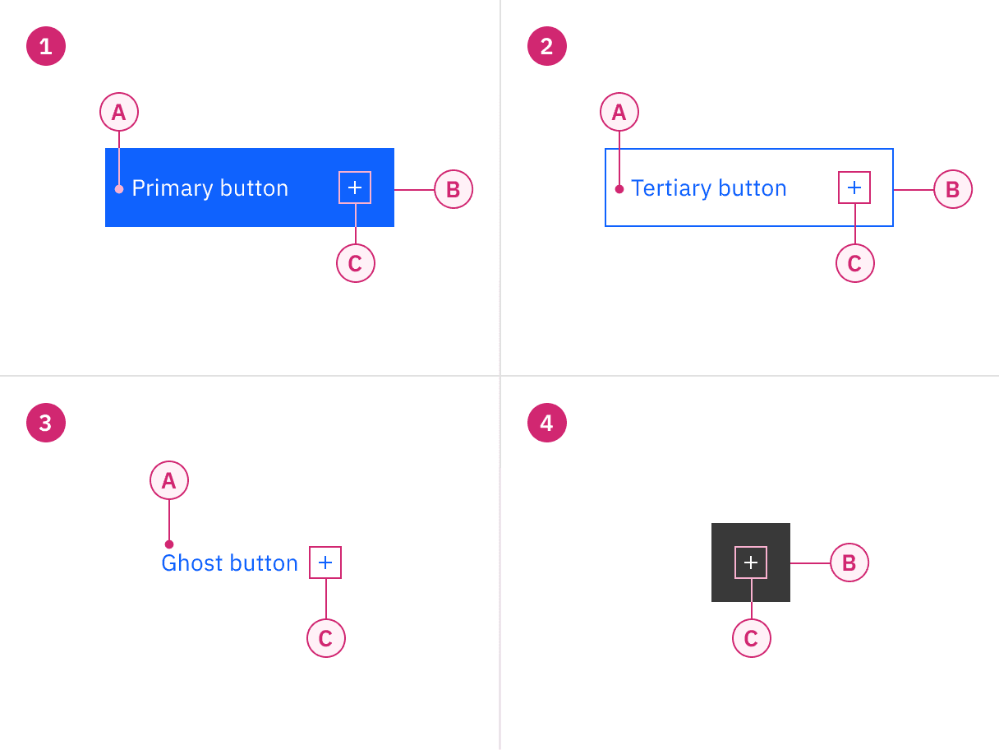
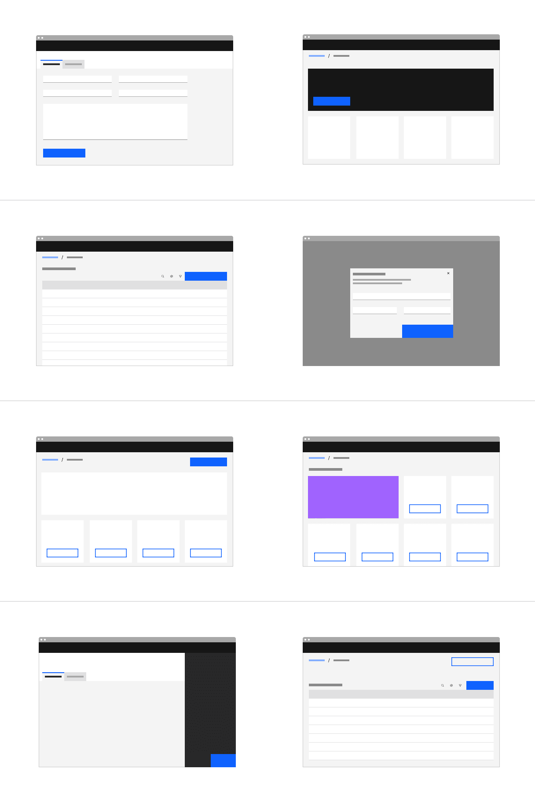
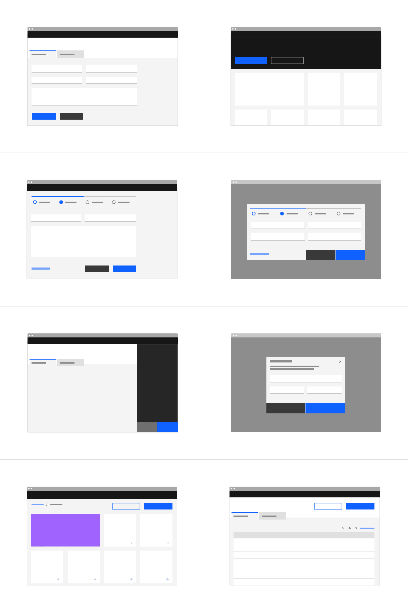
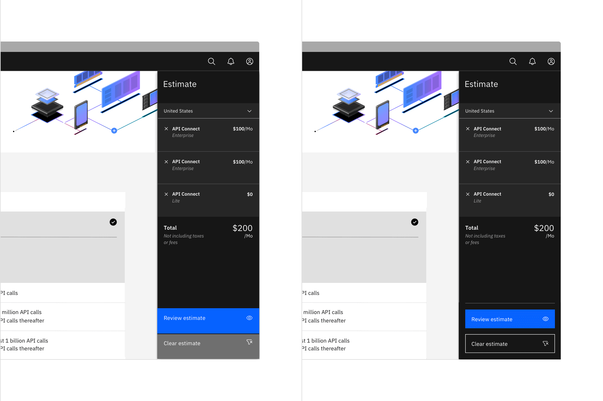
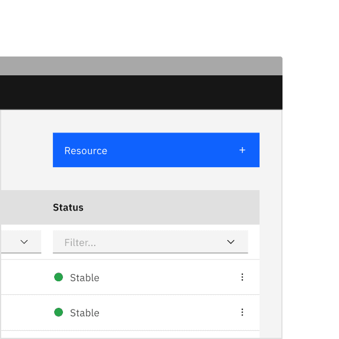

<PageDescription>

Buttons are used to initialize an action. Button labels express what action will
occur when the user interacts with it.

</PageDescription>

<InlineNotification>

**Note:** Some of the examples we discuss here include fluid (full-span) and
hanging buttons which are not available for production use. This guidance
reflects our current understanding of these topics and we are working towards
releasing this work in a future version of Carbon.

</InlineNotification>

<AnchorLinks>

<AnchorLink>Overview</AnchorLink>
<AnchorLink>Live demo</AnchorLink>
<AnchorLink>Formatting</AnchorLink>
<AnchorLink>Content</AnchorLink>
<AnchorLink>Behaviors</AnchorLink>
<AnchorLink>Modifiers</AnchorLink>
<AnchorLink>Related</AnchorLink>
<AnchorLink>References</AnchorLink>
<AnchorLink>Feedback</AnchorLink>

</AnchorLinks>

## Overview

Buttons are clickable elements that are used to trigger actions. They
communicate calls to action to the user and allow users to interact with pages
in a variety of ways. Button labels express what action will occur when the user
interacts with it.

#### When to use

Use buttons to communicate actions users can take and to allow users to interact
with the page. Each page should have one primary button, and any remaining calls
to action should be represented as lower emphasis buttons.

#### When not to use

Do not use buttons as navigational elements. Instead, use
[links](https://www.carbondesignsystem.com/components/link/usage) when the
desired action is to take the user to a new page.

### Button variants

<Row>
<Column colLg={12}>

</Column>
</Row>

| Variant     | Purpose                                                                                                                                                       |
| ----------- | ------------------------------------------------------------------------------------------------------------------------------------------------------------- |
| _Primary_   | For the principal call to action on the page. Primary buttons should only appear once per screen (not including the application header or in a modal dialog). |
| _Secondary_ | For secondary actions on each page; these can only be used 
in conjunction with a primary button.                                                             |
| _Tertiary_  | For less prominent actions; tertiary buttons can be used in isolation 
or paired with a primary button when there are multiple calls to action.               |
| _Danger_    | For actions that could have destructive effects on the user’s data 
(for example, delete or remove). Danger button has three styles: primary, tertiary, and ghost.     |
| _Ghost_     | For the least pronounced actions; often used in conjunction with a primary button.                                                                            |

## Live demo

import { Add16 } from '@carbon/icons-react';

<ComponentDemo
  scope={{ Add16 }}
  components={[
    {
      id: 'button',
      label: 'Button',
    },
    {
      id: 'button-with-icon',
      label: 'Button with icon',
    },
    {
      id: 'icon-only',
      label: 'Icon only',
    },
  ]}>
  <ComponentVariant
    id="button"
    knobs={{
      Button: ['kind', 'disabled', 'size'],
    }}
    links={{
      React:
        'http://react.carbondesignsystem.com/?path=/story/buttons--default',
      Angular:
        'https://angular.carbondesignsystem.com/?path=/story/components-button--basic',
      Vue:
        'http://vue.carbondesignsystem.com/?path=/story/components-cvbutton--default',
      Vanilla: 'https://the-carbon-components.netlify.com/?nav=button',
    }}>{`
      <Button>Button</Button>
    `}</ComponentVariant>
  <ComponentVariant
    id="button-with-icon"
    knobs={{
      Button: ['kind', 'disabled', 'size'],
    }}
    links={{
      React:
        'http://react.carbondesignsystem.com/?path=/story/buttons--default',
      Angular:
        'https://angular.carbondesignsystem.com/?path=/story/components-button--basic',
      Vue:
        'http://vue.carbondesignsystem.com/?path=/story/components-cvbutton--default',
      Vanilla: 'https://the-carbon-components.netlify.com/?nav=button',
    }}>{`
      <Button renderIcon={Add16}>Button</Button>
    `}</ComponentVariant>
  <ComponentVariant
    id="icon-only"
    knobs={{
      Button: ['kind', 'disabled', 'size'],
    }}
    links={{
      React:
        'https://react.carbondesignsystem.com/?path=/story/buttons--icon-only-buttons',
      Angular:
        'https://angular.carbondesignsystem.com/?path=/story/components-button--basic',
      Vue:
        'http://vue.carbondesignsystem.com/?path=/story/components-cvbutton--icon-only',
      Vanilla: 'https://the-carbon-components.netlify.com/?nav=button',
    }}>{`
      <Button
        hasIconOnly
        renderIcon={Add16}
        tooltipAlignment="center"
        tooltipPosition="bottom"
        iconDescription="Button description here"
      />
  `}</ComponentVariant>
</ComponentDemo>

## Formatting

### Anatomy

A button’s text label is the most important element on a button, as it
communicates the action that will be performed when the user interacts with it.
In a contained button the text is always left-aligned, not centered. By default
Carbon uses sentence case for all button labels.

If a text label is not used, an icon should be present to signify what the
button does.

<Row>
<Column colLg={8}>

</Column>
</Row>

<Row>
<Column colSm={2} colMd={4} colLg={4}>

#### 1. Contained button

A. Text label   B. Container   C. Icon (optional)

#### 3. Ghost button

A. Text label   C. Icon (optional)

</Column>
<Column colSm={2} colMd={4} colLg={4}>

#### 2. Outlined button

A. Text label   B. Container   C. Icon (optional)

#### 4. Icon button

B. Container (optional)   C. Icon

</Column>
</Row>

<DoDontRow>
  <DoDont caption="Do left-align text in a button, even if the button is wide.">

  </DoDont>
  <DoDont type="dont" caption="Do not center text in a button, even if the button is wide.">

  </DoDont>
</DoDontRow>

### Button size

Buttons are named according to their size and usage in the Carbon Sketch kit and
in the code. The table below adds more context around the use case for each
size.

<Row>
<Column colLg={8}>

</Column>
</Row>

| Name         | Height (px/rem) | Use Case                                                                                                                                                                                                                                                                           |
| ------------ | --------------- | ---------------------------------------------------------------------------------------------------------------------------------------------------------------------------------------------------------------------------------------------------------------------------------- |
| _Full bleed_ | 64/4            | Use when buttons bleed to the edge of a larger component, like side panels or modals. _Note: This variant is not offered in the kit because it does not have a coded counterpart. Carbon only offers this button in the context of the [modal component](components/modal/usage)._ |
| _Default_    | 48/3            | Use as primary page actions and other standalone actions.                                                                                                                                                                                                                          |
| _Field_      | 40/2.5          | Use when buttons are paired with input fields.                                                                                                                                                                                                                                     |
| _Small_      | 32/2            | Use when there is not enough vertical space for the default or field-sized button.                                                                                                                                                                                                 |

### Emphasis

You don’t necessarily need to use the buttons in the order that their labels
imply. For example, you don’t always need to use the secondary button as the
second button in your layout. The most important thing is to establish a visual
hierarchy between the buttons in your UI. Keep these best practices in mind.

#### A single, high-emphasis button

As a general rule, a layout should contain a single high-emphasis button that
makes it clear that other buttons have less importance in the hierarchy. This
high-emphasis button commands the most attention.

#### Multiple button emphasis

A high-emphasis button can be accompanied by medium- and low-emphasis buttons
that perform less important actions. Keep in mind that you should only group
together calls to action that have a relationship to one another.

Although secondary buttons have less visual prominence because they are less
saturated than their primary counterparts, they are still tonally heavy. If your
layout requires multiple actions—as is the case with some toolbars, data lists
and dashboards—low emphasis buttons (tertiary or ghost) may be a better choice.

<Row>
<Column colLg={8}>

</Column>
</Row>

<DoDontRow>
  <DoDont caption="Do use high-emphasis and medium-emphasis buttons in a button group.">

  </DoDont>
  <DoDont type="dont" caption="Do not use two high-emphasis buttons in a button group.">

  </DoDont>
</DoDontRow>

### Alignment

Alignment refers to whether the buttons are aligned to the right or the left of
a window, container, or layout. Buttons are unique, more so than any other
component, in that their alignment depends on where they appear and whether or
not they’re contained within another component.

As a general rule, on full-page designs, the primary button is on the left side
of the page. When the browser window is large and the user is scrolling to read,
it’s best to have the primary button where the user’s attention has been focused
all along. Whereas in wizards, where a user is progressing through a series of
steps or dialog windows, the primary action traditionally sits at the bottom
right. Buttons within components such as notifications, search fields, and data
tables are also right-aligned.

In some cases a button group—or even a single button in the case of a side panel
or small tile—may span the entire width of a window or container. Typical nested
button locations include:

- Banner calls to action
- Dialog windows
- Wizards
- Forms
- Cards
- Toolbars

<Row>
<Column colLg={8}>

</Column>
</Row>

| Alignment         | Use case                                                                                                                                                        |
| ----------------- | --------------------------------------------------------------------------------------------------------------------------------------------------------------- |
| _Left-justified_  | Banner call to actions, in-page forms, and nested buttons in components like tiles                                                                              |
| _Right-justified_ | Inline notifications, inline field buttons and 
data tables, progressive forms, wizards, and single-button dialogs                                              |
| _Full-span_       | Dialogs, side panels, and small tiles; currently Carbon does not offer a way to implement full-span buttons in code, without an override, they max out at 320px |

#### Fluid versus fixed buttons

Button alignment is also closely related to whether the button is treated as a
fixed or a fluid element within a layout. When we say “fluid”, we mean that the
button becomes a part of a larger, compound component by bleeding to two or more
edges of its container. Rather than defining the a fluid button’s width in
columns or mini units, its width is defined as a percentage (often 50%) of the
container’s width. Also, as a general rule, fluid buttons are never left-aligned
in a layout or a container—they’re always either right-aligned, or span the full
width of the container.

Fluid components like button never exist in isolation. As you can see in the
examples above, they are always part of another component, like modal or form.
Other fluid components include tiles and most recently,
[text inputs](/components/text-input/usage).

<Row>
<Column colLg={8}>

<Caption>
  Example of a login screen using a fluid input field and a fluid button
</Caption>

</Column>
</Row>

<DoDontRow>
  <DoDont caption="Do bleed ghost button hovers when they are paired with other fluid buttons.">

  </DoDont>
  <DoDont type="dont" caption="Do not use a tertiary button in a fluid application.">

  </DoDont>
</DoDontRow>

#### Fluid button border

Many product designers have approached us looking for more guidance around
borders between all fluid buttons. Although we haven’t made
[this update](https://github.com/carbon-design-system/carbon/issues/5638) yet,
we plan to add a 1px border between all fluid buttons that calls the `$ui-03`
token for subtle borders. This feature will add a 3:1 distinction between the
two interactive UI elements. The border is a recommended feature to improve
accessibility in data visualizations and the same logic should apply here.

<Row>
<Column colLg={8}>

<Caption>Example of $ui-03 token border between fluid buttons</Caption>

</Column>
</Row>

#### Using the grid

By default the container’s width is set to the size of the text label with 64px
fixed padding on the right side and 16px fixed padding on the left. However,
when possible set the button container’s relative position to the responsive
layout grid and match buttton width to the other elements on the page. Ideally,
when using groups of related buttons (not including ghost buttons), they should
all be the same width. See [button groups](#Button-groups) below for more
detailed information.

<Row>
<Column colLg={8}>

<Caption>
  Example of a primary button matching the width of a card in a layout
</Caption>

</Column>
</Row>

### Button groups

Button groups are a useful way of aligning buttons that have a relationship.
Group the buttons logically into sets based on usage and importance. Too many
calls to action will overwhelm and confuse users so they should be avoided.

As mentioned in the [Emphasis section](#Emphasis), you don’t necessarily need to
use the buttons in the order that their labels imply. Either a secondary or a
tertiary button can be used in conjunction with a primary button. In fact, due
to the visual weight of the secondary button, it’s recommended to use tertiary
or ghost buttons in layouts with more than three calls to action.

<Row>
<Column colLg={8}>

</Column>
</Row>

<DoDontRow>
  <DoDont caption="Do use a primary and two of the same lower emphasis buttons in a button group.">

  </DoDont>
  <DoDont type="dont" caption="Do not mix primary, secondary, and tertiary buttons in the same button group.">

  </DoDont>
</DoDontRow>

#### Button groups and the grid

Ideally, when using groups of related buttons (not including ghost buttons),
they should all be the same width. This can be achieved in one of two ways, both
of which are acceptable. The first approach involves using the
[narrow grid mode](/guidelines/2x-grid/implementation#grid-modes). In this
situation each button would be set individually on the column grid. _Note:
Carbon developers are working on the narrow grid mode, currently left-hanging
buttons can only be achieved with an override._

<Row>
<Column colLg={8}>

<Caption>Example of hanging buttons</Caption>

</Column>
</Row>

Some products don’t want to hang their buttons into the gutter, but still want a
16px distance between buttons. This can be achieved while maintaining same-width
buttons by treating the button group as a single object (rather than two
separate entities) on the grid. Each button will essentially span 50% of their
container with a programmatic 16px gutter between them.

<Row>
<Column colLg={8}>

<Caption>
  Here the button group is treated as one element on the grid to achieve a 16px
  gutter between the two, without gutter hang.
</Caption>

</Column>
</Row>

<DoDontRow>
  <DoDont caption="Do apply the same width to all buttons in a group, even if they don’t bleed.">

  </DoDont>
  <DoDont type="dont" caption="Do not make buttons in a group different widths.">

  </DoDont>
</DoDontRow>

#### Horizontally arranged groups

When using multiple buttons, the position of the primary button adheres to the
[alignment guidance](#Alignment) above. To sum up, a primary button will be
left-aligned and positioned to the left of the secondary/tertiary button on
full-page designs. The primary button will be right-aligned and appear to the
right of the secondary/tertiary button within wizards and dialog windows.

<InlineNotification>

**Note:** This guidance has changed. Previously we advocated maintaining the
primary button position to the right of the secondary button when the button
group was left-aligned. After talking to teams and doing more research, we’ve
revised our position.

</InlineNotification>

<Row>
<Column colLg={8}>

</Column>
</Row>

#### Stacked button groups

Typical landing pages for product have buttons side by side. However vertical
button groups are also common in products, to save real estate in narrow columns
and occasionally side panels. In these instances, the primary button is always
on top and the secondary or tertiary button is below.

Generally, when designers stack buttons, they tend to use the fixed buttons.
However, stacked fluid buttons are also an option in desktop side panels with
especially long calls to action. _Note: experimenting with stacked fluid buttons
would require an override to the existing code._

<Row>
<Column colLg={12}>

</Column>
</Row>

#### Groups with Danger buttons

Danger buttons have a different visual style to inform users of potentially
destructive actions they are about to take. Within a set, use the primary danger
button style.

<Row>
<Column colLg={8}>

</Column>
</Row>

## Content

### Text labels

A button’s text label is the most important element on a button, as it
communicates the action that will be performed when the user interacts with it.
Buttons need to be clear and predictable.

Button labels should clearly indicate the action of the button. To provide
enough context, use the {verb} + {noun} content formula on buttons except in the
case of common actions like “Done”, “Close”, “Cancel”, “Add”, or “Delete”.

There are exceptions to this rule for situations in which button length could
cause problems in compact UIs or negatively impact translation, but the {verb} +
{noun} formula is still best practice.

For consistency, see Carbon’s
[content guidelines](/guidelines/content/action-labels) for a list of
recommended action labels.

<DoDontRow>
  <DoDont caption="Do use the {verb} + {noun} content formula in buttons whenever possible.">

  </DoDont>
  <DoDont type="dont" caption="Do not use only a noun as a button label.">

  </DoDont>
</DoDontRow>

## Behaviors

### Interactions

#### Mouse

Users can trigger a button by clicking anywhere within the button container.

#### Keyboard

Users can trigger a button by pressing `Enter` or `Space` while the button has
focus. For additional keyboard interactions, see the accessibility tab.

#### Screen readers

VoiceOver: Users can trigger a button by pressing `Enter` or `Space` while the
button has focus.

JAWS: Users can trigger a button by pressing `Enter` or `Space` while the button
has focus.

NVDA: Users can trigger a button by pressing `Enter` or `Space` while the button
has focus.

## Modifiers

### Buttons with icons

Icons can be placed next to labels to both clarify an action and call attention
to a button. There are certain instances where an icon will suffice in place of
a text label, but use icon buttons cautiously.

- Use glyphs (16px) within buttons
- Glyphs are distinguished by their solid shape and knocked-out details
- Glyphs should always appear to the right of the text
- Glyphs used in buttons must be directly related to the action that the user is
  taking
- Glyphs must be the same color value as the text within a button

<DoDontRow>
  <DoDont caption="Do place the icon on the right side of the button after the text.">

  </DoDont>
  <DoDont type="dont" caption="Do not place the icon on the left side of the button before the text.">

  </DoDont>
</DoDontRow>

### Icon-only buttons

Icon buttons allow users to take actions, and make choices, with a single tap.
Icon buttons can take the form of any of the five variants above but most
commonly will be styled as primary or ghost buttons.

<Row>
<Column colLg={8}>

<Caption>Example of an icon-only ghost button in a data table</Caption>

</Column>
</Row>

### Danger button variations

The danger button has three different styles: primary, tertiary, and ghost.
Determining which danger button style to use will depend on the level of
emphasis you want to give to the danger action. Destructive actions that are
considered a required or primary step in a workflow should use the primary
danger button style. However, if a destructive action is just one of several
actions a user could choose from, then a lower emphasis style like the tertiary danger
button or the ghost danger button may be more appropriate.

<Row>
<Column colLg={8}>

<Caption>Examples of the primary, tertiary, and ghost danger buttons</Caption>

</Column>
</Row>

## Related

- [Link component](/components/link/usage)
- [Modal component](/components/modal/usage)
- [Form pattern](/patterns/forms-pattern)

## References

- Mehmet Goktürk,
  [_The Glossary of Human Computer Interaction, Chapter 37_](https://www.interaction-design.org/literature/book/the-glossary-of-human-computer-interaction/fitts-s-law)
  (The Interaction Design Foundation)
- Jakob Nielsen,
  [_OK-Cancel or Cancel-OK? The Trouble With Buttons_](https://www.nngroup.com/articles/ok-cancel-or-cancel-ok/)
  (Nielsen Norman Group, 2008)
- Artem Syzonenko
  [_Buttons on the web: placement and order_](https://uxdesign.cc/buttons-placement-and-order-bb1c4abadfcb)
  (UX Collective, 2019)

## Feedback

Help us improve this component by providing feedback, asking questions, and
leaving any other comments on
[GitHub](https://github.com/carbon-design-system/carbon-website/issues/new?assignees=&labels=feedback&template=feedback.md).
