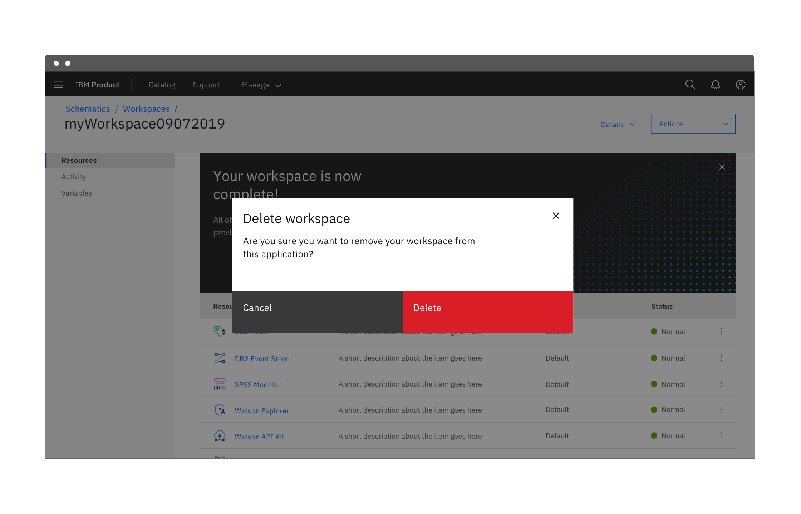

<PageDescription>

Buttons are used to initialize an action.

</PageDescription>

<AnchorLinks>

<AnchorLink>Overview</AnchorLink>
<AnchorLink>Formatting</AnchorLink>
<AnchorLink>Content</AnchorLink>
<AnchorLink>Behavior</AnchorLink>
<AnchorLink>Button types</AnchorLink>
<AnchorLink>Modifiers</AnchorLink>
<AnchorLink>Related</AnchorLink>
<AnchorLink>Feedback</AnchorLink>

</AnchorLinks>

## Overview

Buttons are clickable elements that are used to trigger actions. They communicate calls to action to the user and allow users to with pages in a variety of ways. Button labels express what action will occur when the user interacts with it.

### When to use

Each page should have one primary button, and a Return or Enter keyboard event should trigger it. Any remaining calls-to-action should be represented as secondary buttons.

### When not to use

Do not use buttons as navigational elements. Instead, use links when the desired action is to take the user to a new page.

### Button types

<Row>
<Column colLg={12}>

</Column>
</Row>

| Type      | Purpose                                                                                                                                      |
| --------- | -------------------------------------------------------------------------------------------------------------------------------------------- |
| Primary   | For the principal call to action on the page.                                                                                                |
| Secondary | For secondary actions on each page; these can only be used in conjunction with a primary button.                                             |
| Tertiary  | For less prominent actions; tertiary buttons can be used in isolation or pair with a primary button when there are multiple calls-to-action. |
| Danger    | For actions that could have destructive effects on the user’s data (delete, remove, etc.).                                                   |
| Ghost     | For the least pronounced actions; often used in conjunction with primary buttons.                                                            |

## Formatting

### Anatomy

A button’s text label is the most important element on a button, as it communicates the action that will be performed when the user touches it. In a contained button the text is always left aligned, not centered. By default Carbon uses sentence case for all button labels.

If a text label is not used, an icon should be present to signify what the button does.

<Row>
<Column colLg={8}>

<Caption>Secondary / Primary button order in a modal</Caption>

</Column>
</Row>

1. Text label
2. Container
3. Icon

### Size

There are four common button sizes: default, inline, and small. Each button type can use any of these three sizes based on need. The fourth button size, full bleed, has a more reserved application and should rarely be used.

<Row>
<Column colLg={8}>

</Column>
</Row>

| Button size | Height (px / rem) | Use case                                                                           |
| ----------- | ----------------- | ---------------------------------------------------------------------------------- |
| Full bleed  | 64 / 4            | Use when buttons bleed to the edge of a component, like in side panels and modals. |
| Default     | 48 / 3            | Use as primary page actions and other standalone actions.                          |
| Inline      | 40 / 2.5          | Use when buttons are paired with input fields.                                     |
| Small       | 32 / 2            | Use when there is not enough vertical space for the default sized button.          |

### Emphasis

#### A single, prominent button

A layout should contain a single prominent button that makes it clear that other buttons have less importance in the hierarchy. This high-emphasis button commands the most attention.

#### Multiple button emphasis

A UI can have more than one button in a layout at a time, so a high-emphasis button can be accompanied by medium- and low-emphasis buttons that perform less important actions. Only group together calls to action that have a relationship to one another.

<Row>
<Column colLg={8}>

</Column>
</Row>

<DoDontRow>
<DoDont
type="do"
caption="Do use high emphasis and medium emphasis buttons in a button group.">

</DoDont>
<DoDont
type="dont"
caption="Do use high emphasis and medium emphasis buttons in a button group.">

</DoDont>
</DoDontRow>

### Alignment

Although buttons are usually left aligned (never centered) in our system, they are unique in that, more so than any other component, their alignment depends on where they appear and whether or not they’re contained within another component. Typical nested button locations include.

- Banner CTAs
- Dialogs
- Modal windows
- Forms
- Cards
- Toolbars

<Row>
<Column colLg={8}>

</Column>
</Row>

| Alignment                | Use case                                                            |
| ------------------------ | ------------------------------------------------------------------- |
| Left-justified (Default) | All other component with embedded buttons including in-line forms\* |
| Right-justified          | Inline notifications, inline field buttons and data tables          |
| Full bleed               | All Dialogs and side panels                                         |

<Caption>
  * Icon buttons that comprise toolbars have their own unique usage (see
  content)
</Caption>

#### Width and grid alignment

When possible set the button container’s relative position to the responsive layout grid and match buttton width to the other elements on the page. Say something here also about button groups and matching both buttons widths to the width of the longest button.

By default the container’s width is set to the size of the text label with 64px fixed padding on the right side and 16px fixed padding on the left.

<Row>
<Column colLg={8}>

</Column>
</Row>

<DoDontRow>
<DoDont
type="do"
caption="Do align button to the grid and match width of the above field.">

</DoDont>
<DoDont
type="dont"
caption="Do not choose a button width that doen’t align to the grid structure.">

</DoDont>
</DoDontRow>

### Button groups

Button groups are a useful way of aligning buttons that have a relationship. Group the buttons logically into sets based on usage and importance. Too many calls to action will overwhelm and confuse users so they should be avoided.

#### Horizontally arranged groups

When using multiple buttons, the primary button appears to the right and any secondary buttons appear to the left. Research has shown that performance differences between secondary and primary button placement are negligible, however maintaining consistency throughout a product, offering, or platform is crucial. The Secondary / Primary button order (secondary to the left and primary to the right) is therefore our required guidance and should be followed at all times.

<Row>
<Column colLg={12}>

</Column>
</Row>

#### Vertically arranged button groups

Typical landing pages for product has buttons side by side. However vertical button groups are also common in product in order to save real estate in narrow columns and occassionally side panels. In this instance the primary button is always on top and the secondary or tertiary button is below.

<Row>
<Column colLg={12}>

</Column>
</Row>

<DoDontRow>
<DoDont
type="do"
caption="Do apply the same width to all buttons in a group, even if they don’t bleed.">

</DoDont>
<DoDont
type="dont"
caption="Do not make buttons in a group different widths.">

</DoDont>
</DoDontRow>

## Content

### Text labels

A button’s text label is the most important element on a button, as it communicates the action that will be performed when the user touches it. Buttons need to be clear and predictable.

Button labels should clearly indicate the action of the button. To provide enough context, use the {verb} + {noun} content formula on buttons except in the case of common actions like “Done”, “Close”, “Cancel”, “Add” or “Delete.”

For consistency, see Carbon's [content guidelines](/guidelines/content/action-labels) for a list of recommended action labels.

<DoDontRow>
  <DoDont
    caption="Do use the {verb} + {noun} content formula on buttons."
    text="Explore noun"
    aspectRatio="1:1"
  />
  <DoDont
    type="dont"
    caption="Do not use only a noun as a button label."
    text="Noun"
    aspectRatio="1:1"
  />
</DoDontRow>

## Behavior

### Interaction

**Mouse**

Users can trigger a button by clicking anywhere within the button container.

**Keyboard**

Users can trigger a button by pressing `Enter` or `Space` while the button has focus. For additional keyboard interactions, see the accessibility tab.

**Screen readers**

VoiceOver: Users can trigger a button by pressing `Enter` or `Space` while the button has focus.

JAWS: Users can trigger a button by pressing `Enter` or `Space` while the button has focus.

NVDA: Users can trigger a button by pressing `Enter` or `Space` while the button has focus.

## Button types

### Primary

Primary buttons are high emphasis elements that are used to indicate the principal call to action on the page. They should be limited to one primary button per page. Keep in mind that not every screen needs a primary button.

### Secondary

Secondary buttons are medium emphasis elements that are used for secondary actions on each page. They can only be used in conjunction with a primary button.

### Tertiary

Tertiary buttons are low emphases elements that are used for less prominent actions. They can be used in insolation or in a pair with a primary button when there are multiple calls to action.

### Danger

Danger buttons are high emphasis elements that have a different visual style to inform users of potentially destructive actions they are about to take. Within a set, the danger button should be styled as a primary button.

For more guidance on destructive actions, refer to the [common actions](https://www.carbondesignsystem.com/patterns/common-actions/) pattern.

<Row>
<Column colLg={8}>

</Column>
</Row>

### Ghost

Ghost buttons are low emphasis elements that are used for least pronounced actions. They are often used in conjunction with primary and secondary buttons. Since the enabled state does not have a visual container, ghost buttons do not distract from nearby content.

## Modifiers

### Buttons with icons

Icons can be placed next to labels to both clarify an action and call attention to a button. There are certain instances where and icon will suffice in place of a text label, but use icon buttons cautiously.

- Use glyphs (16px) within buttons.
- Glyphs are distinguished by their solid shape and knocked-out details.
- Glyphs should always appear to the right of the text.
- Glyphs used in buttons must be directly related to the action that the user is taking.
- Glyphs must be the same color value as the text within a button.

<DoDontRow>
<DoDont
type="do"
caption="Do place icon on the right side of the button after the text.">

</DoDont>
<DoDont
type="dont"
caption="Do not place icon before the text.">

</DoDont>
</DoDontRow>

### Icon only buttons

Icon buttons allow users to take actions, and make choices, with a single tap. Icon buttons can take the form of any of the 5 types above but most commonly will be styled as primary or ghost buttons.

<Row>
<Column colLg={8}>

<Caption>An example of an icon only ghost button in a data table.</Caption>

</Column>
</Row>

## Related

- [Link component](https://www.carbondesignsystem.com/components/link/usage/)

## Feedback

Help us improve this pattern by providing feedback, asking questions, and leaving any other comments on [GitHub](https://github.com/carbon-design-system/carbon-website/issues/new?assignees=&labels=feedback&template=feedback.md).
